# Extensión de un Motor de Juegos con Cinemática Inversa

UNIVERSIDAD DE CHILE  
´ ´  
FACULTAD DE CIENCIAS FISICAS Y MATEMATICAS  
´  
DEPARTAMENTO DE CIENCIAS DE LA COMPUTACION  
´ ´  
EXTENSION DE UN MOTOR DE JUEGOS CON CINEMATICA INVERSA  
´  
MEMORIA PARA OPTAR AL TITULO DE  
´  
INGENIERO CIVIL EN COMPUTACION  
´ ´  
AGUSTIN MATTHEY RAMIREZ  
´  
PROFESOR GUIA:  
´  
DANIEL CALDERON SAAVEDRA  
´  
MIEMBROS DE LA COMISION:  
´  
CLAUDIO GUTIERREZ GALLARDO  
´  
ELIAS ZELADA BAEZA  
SANTIAGO DE CHILE  
2022  


---

## Resumen


La industria de los videojuegos y su comunidad, se amplían constantemente a nivel global,
produciendo una alta demanda de experiencias interactivas de las que se espera cada vez más
atractivo y realismo. Tradicionalmente (,y en oposicíon a esa expectativa), cada animación
usada para dar vida a algún personaje de un juego, contiene un único movimiento o accíon,
que se repite inalteradamente en distintas situaciones. Por ejemplo, es usual que un personaje
solo sea capaz de recorrer terrenos planos (sin elevación) de manera creíble, porque la ani-
mación utilizada fue diseñada de esa manera. No es posible crear manualmente animaciones
que se adapten a todos los contextos, por lo que sistemas que modifiquen las animaciones en
tiempo real para volverlas más dinámicas son muy requeridos.
Considerando este problema, se agrega un nuevo sistema al MonaEngine (motor de juegos
simple implementado para asistir la docencia en el ramo CC-5512 Arquitectura de Motores
de Juegos), llamado Sistema de Navegacíon IK, que permite adaptar animaciones estáticas y
de caminar a terrenos irregulares generados mediante funciones de elevación. Las animaciones
son modificadas mediante cálculos de cinemática inversa basados en el método de descenso
de gradiente.
Se logra generar animaciones que se adaptan al terreno de manera básica, modificando las
rotaciones de las articulaciones de las piernas del modelo articulado objetivo. Las modificacio-
nes realizadas se basan en la información de movimiento original de la animación, extraída en
un paso previo del sistema. El uso de descenso de gradiente, y la consideracíon del movimien-
to original de la animación permiten, en conjunto, lograr que las animaciones modificadas
preserven la esencia de las animaciones originales.
El sistema consigue un muy buen rendimiento en cuanto a frames por segundo, pudiendo
cumplir el importante requisito de ser ejecutado en tiempo real.
Las animaciones generadas tienen una calidad que se encuentra dentro de lo esperado, en
cuanto a que representan de manera simple la adaptacíon del movimiento de caminata a un
terreno irregular, pero no llegan tan lejos como para tener una “personalidad” dinámica. Es
decir, no pueden por ejemplo, denotar cansancio cuando la superficie es más empinada, y
presentar un balance apropiado del cuerpo.
El sistema se encarga únicamente de que los tobillos de cada personaje utilizado sean llevados
a una altura adecuada en conjunto con sus caderas, para ajustar el movimiento al terreno,
pero la corrección de la orientación de los pies no es considerada. Esto es repetidamente
notado por los usuarios de prueba del sistema, y queda marcado como trabajo futuro.


---

## Tabla de Contenido

```

1. Introducción 1
1.1. Contexto . . . . . . . . . . . . . . . . . . . . . . . . . . . . . . . . . . . . . . 1
1.2. Problema . . . . . . . . . . . . . . . . . . . . . . . . . . . . . . . . . . . . . 2
1.3. Objetivos . . . . . . . . . . . . . . . . . . . . . . . . . . . . . . . . . . . . . 3
1.4. Descripción general de la solución . . . . . . . . . . . . . . . . . . . . . . . . 4
2. Marco teórico 6
2.1. Transformaciones espaciales . . . . . . . . . . . . . . . . . . . . . . . . . . . 6
2.2. Modelos articulados . . . . . . . . . . . . . . . . . . . . . . . . . . . . . . . . 9
2.3. Mapas de altura . . . . . . . . . . . . . . . . . . . . . . . . . . . . . . . . . . 9
2.4. Cinemática . . . . . . . . . . . . . . . . . . . . . . . . . . . . . . . . . . . . 9
2.4.1. Cadenas articuladas . . . . . . . . . . . . . . . . . . . . . . . . . . . 9
2.4.2. Cinemática directa . . . . . . . . . . . . . . . . . . . . . . . . . . . . 10
2.4.3. Cinemática inversa . . . . . . . . . . . . . . . . . . . . . . . . . . . . 11
2.5. Curvas linealmente interpoladas . . . . . . . . . . . . . . . . . . . . . . . . . 12
2.6. Descenso de gradiente . . . . . . . . . . . . . . . . . . . . . . . . . . . . . . 13
2.7. La caminata humana . . . . . . . . . . . . . . . . . . . . . . . . . . . . . . . 13
2.8. El MonaEngine . . . . . . . . . . . . . . . . . . . . . . . . . . . . . . . . . . 14
2.8.1. Modelo de game objects . . . . . . . . . . . . . . . . . . . . . . . . . 14
2.8.2. Mallas geométricas . . . . . . . . . . . . . . . . . . . . . . . . . . . . 15
2.8.3. Manejo del tiempo . . . . . . . . . . . . . . . . . . . . . . . . . . . . 15

2.8.4. Sistema de animación . . . . . . . . . . . . . . . . . . . . . . . . . . . 15
3. Estado del arte 18
3.1. Métodos para resolver el problema de IK . . . . . . . . . . . . . . . . . . . . 18
3.1.1. Métodos analíticos . . . . . . . . . . . . . . . . . . . . . . . . . . . . 18
3.1.2. Métodos numéricos . . . . . . . . . . . . . . . . . . . . . . . . . . . . 19
3.1.3. Métodos basados en datos . . . . . . . . . . . . . . . . . . . . . . . . 21
3.1.4. Métodos híbridos . . . . . . . . . . . . . . . . . . . . . . . . . . . . . 22
3.2. Uso de IK para generar movimientos de locomoción bípeda . . . . . . . . . . 23
4. Solución 26
4.1. Arquitectura de la solución . . . . . . . . . . . . . . . . . . . . . . . . . . . . 26
4.2. Clases nucleares del sistema . . . . . . . . . . . . . . . . . . . . . . . . . . . 26
4.2.1. IKRig . . . . . . . . . . . . . . . . . . . . . . . . . . . . . . . . . . . 26
4.2.2. IKAnimation . . . . . . . . . . . . . . . . . . . . . . . . . . . . . . . 29
4.2.3. IKChain . . . . . . . . . . . . . . . . . . . . . . . . . . . . . . . . . . 30
4.3. Orientacíon global y sistema de referencia . . . . . . . . . . . . . . . . . . . 30
4.4. Tiempos del sistema . . . . . . . . . . . . . . . . . . . . . . . . . . . . . . . 30
4.4.1. Tiempo de animacíon . . . . . . . . . . . . . . . . . . . . . . . . . . . 31
4.4.2. Tiempo de animacíon extendido . . . . . . . . . . . . . . . . . . . . . 32
4.4.3. Tiempo de reproduccíon . . . . . . . . . . . . . . . . . . . . . . . . . 32
4.4.4. Reproduccíon de frames . . . . . . . . . . . . . . . . . . . . . . . . . 33
4.5. Descenso de gradiente . . . . . . . . . . . . . . . . . . . . . . . . . . . . . . 33
4.6. Cinemática . . . . . . . . . . . . . . . . . . . . . . . . . . . . . . . . . . . . 35
4.6.1. Cinemática directa . . . . . . . . . . . . . . . . . . . . . . . . . . . . 35
4.6.2. Cinemática inversa . . . . . . . . . . . . . . . . . . . . . . . . . . . . 35
4.7. Información del entorno . . . . . . . . . . . . . . . . . . . . . . . . . . . . . 41
4.7.1. Mapas de altura . . . . . . . . . . . . . . . . . . . . . . . . . . . . . . 41

4.7.2. EnvironmentData . . . . . . . . . . . . . . . . . . . . . . . . . . . . . 42
4.7.3. Terrenos . . . . . . . . . . . . . . . . . . . . . . . . . . . . . . . . . . 42
4.8. Generación de trayectorias . . . . . . . . . . . . . . . . . . . . . . . . . . . . 42
4.8.1. Curvas linealmente interpoladas . . . . . . . . . . . . . . . . . . . . . 42
4.8.2. Extraccíon de trayectorias base . . . . . . . . . . . . . . . . . . . . . 44
4.8.3. TrajectoryGenerator . . . . . . . . . . . . . . . . . . . . . . . . . . . 45
4.8.4. Trayectorias para end effectors . . . . . . . . . . . . . . . . . . . . . . 46
4.8.5. Correccíon de trayectorias dinámicas . . . . . . . . . . . . . . . . . . 48
4.8.6. Trayectorias para la cadera . . . . . . . . . . . . . . . . . . . . . . . . 50
4.8.7. Trayectorias fijas y validación de trayectorias dinámicas . . . . . . . . 51
4.9. Control del sistema e interfaz de usuario . . . . . . . . . . . . . . . . . . . . 51
4.9.1. IKNavigationComponent . . . . . . . . . . . . . . . . . . . . . . . . . 51
4.9.2. IKRigController . . . . . . . . . . . . . . . . . . . . . . . . . . . . . . 53
4.9.3. IKNavigationSystem . . . . . . . . . . . . . . . . . . . . . . . . . . . 55
4.10. Preprocesamiento de las animaciones . . . . . . . . . . . . . . . . . . . . . . 56
4.10.1. Validacíon . . . . . . . . . . . . . . . . . . . . . . . . . . . . . . . . . 56
4.10.2. Descompresión de las rotaciones . . . . . . . . . . . . . . . . . . . . . 58
5. Validación 59
5.1. Rendimiento de la solucíon . . . . . . . . . . . . . . . . . . . . . . . . . . . . 61
5.2. Percepción de los usuarios . . . . . . . . . . . . . . . . . . . . . . . . . . . . 63
6. Conclusiones 66
6.1. Valoracíon de los resultados . . . . . . . . . . . . . . . . . . . . . . . . . . . 67
6.2. Reflexiones . . . . . . . . . . . . . . . . . . . . . . . . . . . . . . . . . . . . 69
6.3. Trabajo futuro . . . . . . . . . . . . . . . . . . . . . . . . . . . . . . . . . . 70
Bibliografía 73
Anexo A. 75

A.1. Diagrama UML . . . . . . . . . . . . . . . . . . . . . . . . . . . . . . . . . . 75
A.2. Diagrama de flujo . . . . . . . . . . . . . . . . . . . . . . . . . . . . . . . . . 76
Anexo B. 77
B.1. Matriz de rotación en función de un ángulo y eje arbitrarios . . . . . . . . . 77
B.2. Enlace al repositorio de la solución . . . . . . . . . . . . . . . . . . . . . . . 77

```


---

## Índices

```

´
Indice de Tablas
4.1. Valores de referencia recolectados a lo largo de múltiples ejecuciones completas
del descenso de gradiente para IK. Con rigHeight = 189,83. . . . . . . . . . 40
4.2. Valores de referencia recolectados a lo largo de múltiples ejecuciones completas
del descenso de gradiente para IK. Con rigHeight = 28474,5. . . . . . . . . . 41
5.1. Resumen del rendimiento promedio de la solucíon. Milisegundos por frame para
cada ejemplo de prueba. . . . . . . . . . . . . . . . . . . . . . . . . . . . . . 63
5.2. Percepcíon de los usuarios sobre la preservacíon de la esencia de la animacíon
original. . . . . . . . . . . . . . . . . . . . . . . . . . . . . . . . . . . . . . . 64
5.3. Percepcíon de los usuarios sobre la calidad de la adaptacíon al terreno conseguida. 64

´
Indice de Ilustraciones
1.1. Dos poses de un modelo articulado generadas con distintas configuraciones de
las articulaciones. . . . . . . . . . . . . . . . . . . . . . . . . . . . . . . . . . 2
1.2. Clip de animacíon simplificado de un personaje corriendo. El clip tiene 5 se-
gundos de duracíon y cuenta con 5 poses o muestras. Fuente:
www. mixamo. com
. 3
2.1. Subdivisíon gráfica de una transformacíon espacial tridimensional en subtrans-
formaciones, y su efecto en los distintos ejes cartesianos. Fuente:
www. developer.
unigine. com . . . . . . . . . . . . . . . . . . . . . . . . . . . . . . . . . . . 7
2.2. Rotacíon generada por un cuaterníon, de un punto p⃗ en un ángulo θ en torno a
un eje. Fuente: https: // danceswithcode. net/ engineeringnotes/ quaternions/
quaternions. html
. . . . . . . . . . . . . . . . . . . . . . . . . . . . . . . . 8
2.3. Ejemplo de cadena articulada. Imagen basada en figura extraída de [12]. . . . 10
2.4. Ejemplos de cadenas articuladas y sus soluciones posibles. (a) No es posible
alcanzar el objetivo.(b) Existe una única solucíon. (c) Existen múltiples solu-
ciones (es así en la mayoría de los casos). Fuente: [1] . . . . . . . . . . . . . 11
2.5. Figura humana como un conjunto de cadenas articuladas. Fuente: www. 3dkingdoms.
com . . . . . . . . . . . . . . . . . . . . . . . . . . . . . . . . . . . . . . . . 12
2.6. Movimiento de péndulo invertido en la caminata humana. Fuente [19] . . . . 14
3.1. Caso de cadena articulada en el que únicamente hay dos soluciones posibles
para alcanzar el objetivo (x,y). Puede alcanzare por arriba o por abajo del eje
x. Se usa una solucíon analítica. Fuente [2] . . . . . . . . . . . . . . . . . . 19
3.2. Ejemplo de una iteracíon de CCD sobre una cadena articulada. Fuente: [1] . 21
3.3. Ejemplo de una iteracíon de FABRIK sobre una cadena articulada. Fuente: [1] 22
4.1. Arquitectura externa en la que se inserta la solucíon. Diagrama basado en el
presentado en la memoria original del MonaEngine [6]. . . . . . . . . . . . . 27
4.2. Arquitectura interna del sistema de navegacíon IK. . . . . . . . . . . . . . . 28

```


4.3. Orientacíon en el espacio del modelo del IKRig. Fuente: https: // musculoskeletalkey.
com/ biomechanics-of-the-spinal-motion-segment/
. . . . . . . . . . . 31

### 4.4. Diagrama simplificado de una animación y su animationTime, dividida en
subtrayectorias como se explica en la seccíon 4.8.2. . . . . . . . . . . . . . . 31
4.5. Diagrama simplificado de una animación y su extendedAnimationTime, divi-
dida en subtrayectorias como se explica en la sección 4.8.2. . . . . . . . . . . 32
4.6. Diagrama simplificado de las trayectorias generadas por TrajectoryGenerator
(4.8), distribuidas a lo largo del reproductionTime. Notar el paralelismo tem-
poral con las curvas de las figuras 4.4 y 4.5. . . . . . . . . . . . . . . . . . . 33
4.7. Valores por iteracíon de F y sus subfunciones (considerando coeficientes), para
una ejecucíon completa de descenso de gradiente aplicado a cinemática inversa.
El número de iteraciones es 23, con rigHeight = 189,83. . . . . . . . . . . . 40
4.8. Valores por iteracíon de F y sus subfunciones (considerando coeficientes), para
una ejecucíon completa de descenso de gradiente aplicado a cinemática inversa.
El número de iteraciones es 20, con rigHeight = 28474,5. . . . . . . . . . . 41
4.9. Trayectoria dinámica (paso de la caminata), que atraviesa una porcíon del
terreno. . . . . . . . . . . . . . . . . . . . . . . . . . . . . . . . . . . . . . . 48
4.10. Trayectoria dinámica corregida con descenso de gradiente. . . . . . . . . . . 50

### 4.11. Plano de rotacíon generado al rotar un punto P mediante un cuaterníon.

Fuente: https: // ece. montana. edu/ seniordesign/ archive/ SP14/ UnderwaterNavigation/
Quaternions. html
. . . . . . . . . . . . . . . . . . . . . . . . . . . . . . . . 57
4.12. Caminata en el espacio local del IKRig, con ángulos de rotacíon para las
articulaciones j y j , de la cadena asociada a la pierna derecha. Fuente:
1 2
https: // www. dimensions. com/ collection/ people-walking . . . . . . 57
5.1. Ejemplo con un único personaje y un único terreno. . . . . . . . . . . . . . . 60
5.2. Ejemplo con múltiples terrenos. . . . . . . . . . . . . . . . . . . . . . . . . . 60
5.3. Ejemplo con más de un personaje. . . . . . . . . . . . . . . . . . . . . . . . . 61
6.1. Ejemplo en que no se logra seguir la trayectoria objetivo (curva roja). La curva
amarilla es el movimiento real del end-effector. . . . . . . . . . . . . . . . . . 68
6.2. Ejemplo en que los pies del personaje se entierran en el suelo. . . . . . . . . 68
A.1. Diagrama UML básico de la solucíon. . . . . . . . . . . . . . . . . . . . . . . 75
A.2. Diagrama de flujo básico de la solucíon. . . . . . . . . . . . . . . . . . . . . 76


Capítulo 1

## Introducción

### 1.1. Contexto
El mundo de los videojuegos es uno en constante expansíon y crecimiento, que permite
dar rienda suelta a la creatividad un gran número de artistas y desarrolladores en todo el
planeta, y que se nutre de los avances en computación y tecnologías relacionadas con el en-
tretenimiento. Con el pasar del los años, los videojuegos han podido evolucionar en calidad y
complejidad, apoyándose en la experiencias acumuladas de obras anteriores, y en herramien-
tas que alivianan la carga técnica que supone desarrollarlos. Una herramienta fundamental
en este contexto son los Game Engines o Motores de Juegos, que reúnen elementos precons-
truidos y reutilizables, que pueden ser usados por el desarrollador para construir su producto
sin tener que partir desde cero, ahorrando una cantidad enorme de tiempo y recursos. Uno
de los módulos importantes que puede proveer un Game Engine es el de animación, que da
la posibilidad de imbuir de movimiento a los objetos y personajes del juego. Las animaciones
de un juego pueden ser generadas de muchas maneras, cada una de las cuales tiene ventajas
y desventajas. En general nos enfrentamos a trade-offs que involucran realismo, tiempo de
ejecución y dificultad de implementación y/o puesta en práctica.
Actualmente, el ramo CC-5512 Arquitectura de Motores de Juegos dictado por el profesor
Daniel Calderón, utiliza como apoyo a la docencia el MonaEngine [7], motor de renderizado
3D desarrollado por Byron Cornejo para su trabajo de título, con el profesor Calderón tambíen
como guía. Motores de nivel profesional utilizados ampliamente en la industria, como Unity y
Unreal Engine dejan en claro cuánto puede llegar a crecer un motor, y la cantidad de opciones
que puede llegar a proveer a los usuarios. El MonaEngine, al haber sido desarrollado por una
sola persona a lo largo de un semestre, tiene mucho espacio para ampliarse. En particular,
para este trabajo de título, se plantea extender el módulo de animaciones para permitir
modificarlas en tiempo real con cinemática inversa o IK (abreviatura del inglés).
El uso de cinemática inversa para animar, como será detallado más adelante, permite
dejar de lado el uso de animaciones prehechas y generar animaciones de manera versátil
ajustándose al contexto. El MonaEngine actualmente permite animar usando un sistema de
interpolación de poses, que deben se configuradas previamente, ajustando las partes móviles


de los modelos. El sistema extendido permitiría ahorrarse el trabajo tedioso de configurar
poses a mano y animaría los modelos de manera automática en tiempo real, dando además
una sensacíon de mayor de realismo a los movimientos. Se espera que la ampliación del motor
sea un aporte al desarrollo de CC-5512, permitiendo ilustrar de mejor manera los contenidos
relacionados con animaciones.

### 1.2. Problema
Como se mencionó, el MonaEngine permite generar animaciones mediante la interpola-
ción de poses, utilizando animación basada en esqueletos. Un modelo usado en este sistema,
por ejemplo una figura humanoide, se estructura mediante nodos ordenados jerárquicamente,
conceptualmente interconectados por segmentos. Estos nodos, llamados articulaciones, con-
forman el esqueleto, y a cada uno se le puede asignar transformaciones de rotación, traslacíon
y escalamiento. Cuando fijamos las transformaciones para cada nodo del modelo, podemos
lograr una pose general determinada (Figura 1.1).

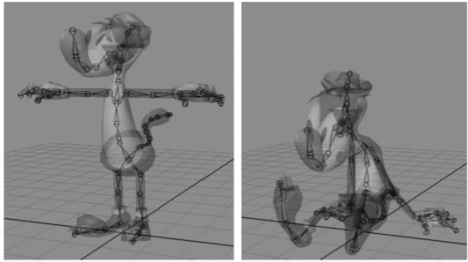
*Figura 1.1: Dos poses de un modelo articulado generadas con distintas configuraciones de las*

articulaciones.
El siguiente paso, es agrupar una serie de poses que sirvan de guía para un movimiento dado.
Podemos tener por ejemplo, 5 poses que marquen los puntos importantes de la acción de
correr (Figura 1.2). Cada pose se asocia a un momento en el tiempo t dentro de la animacíon
“correr“. Esta serie de poses asociadas a valores de tiempo forman un “Clip de Animación“.
Si queremos obtener una pose del clip de animación en un tiempo intermedio (no asignado
a una de las poses creadas), el motor se encarga de interpolar las poses adyacentes para
entregar la pose adecuada.
Cada animación es, según un sistema de animación estático como el del MonaEngine, un
recurso fijo, que contiene movimientos que han de usarse de manera inalterada aunque los
contextos en que se usan puedan ser infinitamente variados.
El mundo de los videojuegos es uno de emociones, y de conexíon con la experiencia que el
creador quiere entregar a los jugadores. Es por esto que es importante contar con animaciones
dinámicas, atractivas y creíbles. Esto último no es fácil de lograr si se depende únicamente
de interpolación de poses prehechas, o de secuencias de imágenes importadas (sprites) para


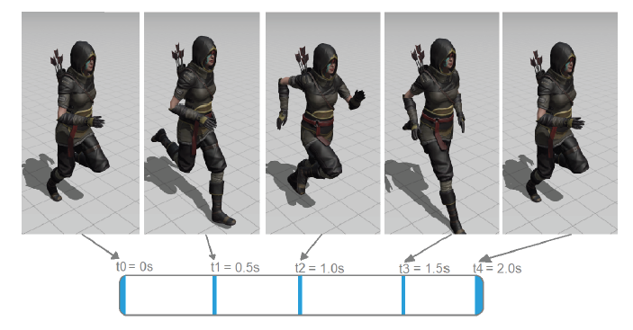
*Figura 1.2: Clip de animacíon simplificado de un personaje corriendo. El clip tiene 5 segundos*

de duracíon y cuenta con 5 poses o muestras. Fuente: www. mixamo. com .
simular el movimiento de los personajes. Los recursos prehechos funcionan, pero su uso di-
recto permite generar una cantidad muy limitada de movimientos, que no pueden ajustarse
dinámicamente a distintos contextos. Los límites de lo que se puede lograr con este tipo de
recursos, están dados por el tiempo que requiere generar una animacíon de esta manera,
teniendo que ajustarse cada pose o sprite manualmente para lograr el resultado deseado.
Si bien el ajuste manual da buen control, es imposible generar animaciones que se ajusten,
por ejemplo, a todas las elevaciones en un terreno complejo cuando el personaje camina. Lo
usual es generar una única animación más amplia, que de a entender lo que está haciendo el
personaje, pero que no se comprometa con los detalles. Es así como se pierde el realismo y
se desaprovecha la oportunidad de crear movimientos más atractivos para el jugador.

### 1.3. Objetivos
Objetivo General
El objetivo general de este trabajo de título es añadir al MonaEngine la posibilidad de
utilizar animaciones dinámicas que se adapten al entorno, modificadas procedimentalmente
mediante cinemática inversa. Es decir, se quiere que las animaciones varíen en tiempo real, y
se adecúen a las variaciones de terreno en el juego creado. Con esto se obtendrían animaciones
más naturales y libres, reduciendo al mismo tiempo la carga de los desarrolladores.
Se plantea trabajar sobre una animacíon base ingresada por el usuario, y modificarla momento
a momento. Esto en oposición a generar la animación desde cero mediante IK. De esta forma,
las animaciones finales generadas por el sistema serán más controladas, ya que estarán basadas
en la animacíon input escogida. La animacíon base deberá ser una animación de caminar
relativamente simple.


Objetivos Específicos
1. Dado un terreno (malla geométrica a la que se da forma con una funcíon de elevación),
una figura articulada humanoide, y una dirección global de movimiento, se debe poder
ajustar una animación de “caminar“ simple, de tal forma que las piernas de la figura
articulada se adapten a las irregularidades del terreno.
2. Escoger un algoritmo de cinemática inversa adecuado, que permita ajustar la animacíon
base en tiempo real.
3. La animación generada debe presentar un nivel de realismo y atractivo suficiente. No se
espera generar un movimiento de caminata perfecto, pero se debe mantener la esencia de
la animación base, y lograr transmitir la sensación de caminar en un terreno irregular. Si
se mantiene la esencia de la animacíon base, el usuario puede tener una buena noción de
como se verá la animacíon final generada, permitíendole controlar mejor los resultados.
Además, la idiosincrasia de la caminata en sí, está contenida en la animación original,
por lo que es importante no alejarse demasiado de ella.
4. El sistema creado debe insertarse adecuadamente dentro del MonaEngine, sintíendose
como un componente más, y proveyendo una interfaz de usuario similar a los sistemas
ya existentes.
Evaluación
Para medir el éxito del trabajo, lo central es evaluar la sensación que generan los re-
sultados. Se plantea recolectar información de la percepción que tengan de las animaciones
generadas, personas cercanas al mundo de los videojuegos, que los jueguen y/o desarrollen.
Tambíen se debe comprobar que las animaciones puedan ser generadas en tiempo real. Si
esto no se logra, no puede cumplirse el propósito de usar las animaciones en videojuegos.

### 1.4. Descripcíon general de la solución
La solucíon obtenida se integra en el MonaEngine en forma de un nuevo sistema, llamado
Sistema de Navegacíon IK. Un game object que represente un personaje animado dentro del
mundo del juego, puede utilizar el IKNavigationComponent para adaptar una o más anima-
ciones a uno o más terrenos creados con funciones de elevación. Las animaciones pueden ser de
tipo idle, o contener movimientos de caminata, lo que permite usar la capacidad de transicíon
entre animaciones del MonaEngine, al mismo tiempo que las animaciones son adaptadas al
terreno. El concepto para las clases base del sistema, IKRig e IKChain, está basado en las
ideas presentadas por Alexander Bereznyak, en su charla sobre animaciones procedimentales
en la GDC 2016 [4].
El sistema preprocesa las animaciones, y extrae de ellas las trayectorias originales seguidas
por los pies/tobillos del modelo animado. En cada iteración, esas trayectorias son ajustadas


según el terreno, y luego se utilizan para indicar posiciones objetivo a las clases encargadas
de hacer los cálculos de cinemática inversa, cuyos valores resultantes son usados para mo-
dificar el clip de animación original. El usar las trayectorias originales para generar nuevas
trayectorias, permite que los movimientos de los tobillos, aunque distintos, se asemejen a
los de la animacíon base. La idea de realizar un preanálisis de la animacíon, y de extraer
valores base, tiene similitud con el trabajo de Rune Skovbo Johansen, titulado Automated
Semi-Procedural Animation for Character Locomotion [20]. En [4], tambíen se describe un
proceso de adaptación de las trayectorias de los tobillos al terreno, lo que da a entender
que de alguna manera se toman en cuenta las trayectorias originales, pero al no haber una
publicación oficial para complementar la charla, no se tiene acceso a los detalles.
Los cálculos de cinemática inversa son realizados en base a descenso de gradiente. El método
de descenso de gradiente es escogido porque permite ajustar las rotaciones de las articula-
ciones del clip de animación, siguiendo varios criterios simultáneamente. Otros métodos se
centran únicamente en llevar a las articulaciones objetivo a ciertas posiciones deseadas, pero
con el descenso de gradiente es posible, por ejemplo, hacer que los valores de rotacíon gene-
rados tengan al mismo tiempo un parecido con los de la animacíon original.


Capítulo 2
Marco téorico
En las siguientes subsecciones se introducen los conceptos que dan forma a la solución
presentada en este informe. Las explicaciones se dan considerando el contexto de la animacíon
por computador y los videojuegos.

### 2.1. Transformaciones espaciales
Una transformacíon espacial [14], es una matriz que cambia la posicíon de un punto
en el espacio. Las transformaciones pueden ser acumuladas a través de multiplicación en
cadena, para finalmente transformar al punto tambíen mediante multiplicacíon. En la ani-
mación computacional y los videojuegos, las transformaciones son clave, ya que se trabaja
con múltiples espacios que interactúan entre si, y es necesario pasar de un espacio a otro
constantemente. Una matriz de transformacíon espacial puede pensarse en términos de sus
subtransformaciones. En este contexto, se considera que una matriz de transformación esta
compuesta por una matriz de escalamiento, una de traslación y una de rotacíon (figura 2.1).
Para entender como una transformacíon afectará a un punto, es importante notar que las
subtransformaciones se aplican conceptualmente en orden: primero el escalamiento, luego la
rotación, y finalmente la traslacíon.
En el presente trabajo, se trabaja principalmente con transformaciones tridimensionales, ya
que el MonaEngine es un motor de juegos de renderizado 3D.
Para definir cómo se aplicará una cadena de transformaciones a un vector, debe conocerse
el sistema usado para ordenar e interpretar las matrices en memoria. Existen dos sistemas
principales [22]: row-major y column-major.
1. Row-major: Este es el sistema más intuitivo, en que los elementos contiguos de una
matriz en la memoria pertenecen a una misma fila. Los vectores en un sistema row-major
son vectores fila, y por lo tanto, son post-multiplicados por matrices. Considérense el vector fila $\vec{v}$ de dimensiones 1×4, y una matriz $M$ de dimensiones 4×4, en un sistema row-major. El vector transformado $\vec{v}'$ de dimensiones 1×4 se obtiene de la ecuación $\vec{v}' = \vec{v}M$. Para mantener el orden de aplicacíon de subtransformaciones planteado, si


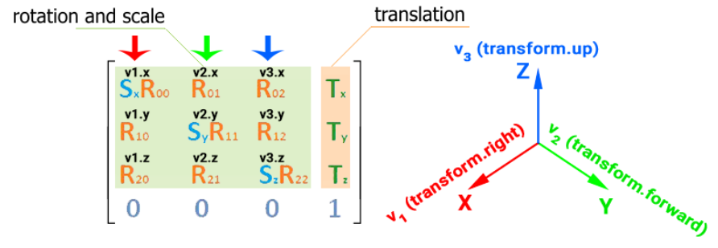
*Figura 2.1: Subdivisíon gráfica de una transformacíon espacial tridimensional en subtransfor-*

maciones, y su efecto en los distintos ejes cartesianos. Fuente:
www. developer. unigine.
com .
dividimos $M$, la ecuación queda:

$$\vec{v}' = \vec{v}\,S\,R\,T \tag{2.1}$$
2. Column-major: Al contrario que en row-major, los elementos contiguos en memoria se
leen como columnas, y los vectores son vectores columna. Considérese ahora un vector columna $\vec{v}_c$ de dimensiones 4×1, y una matriz $M_c$ de dimensiones 4×4. $M_c$ y $\vec{v}_c$ son la matriz $M$ y el vector $\vec{v}$ respectivamente, pero interpretados según un sistema column-major. Notar que esto implica que los valores de las columnas y las filas se intercambian, por lo que se está realizando una operacíon de transposicíon. Entonces se cumple que $M_c = M^T$ y $\vec{v}_c = \vec{v}^T$. Para traspasar la ecuacíon 2.1 al sistema column-major, se debe transponer:
$$\vec{v}^{\prime T} = (\vec{v}\,S\,R\,T)^T$$

Aplicando la propiedad de la multiplicacíon de matrices, que indica que la transpuesta del producto es el producto de las transpuestas con los factores invertidos $(AB)^T = B^T A^T$, se obtiene:

$$\vec{v}^{\prime T} = T^T R^T S^T \vec{v}^T$$

Que equivale a:

$$\vec{v}'_c = T_c\, R_c\, S_c\, \vec{v}_c$$
En este informe se aplican las transformaciones espaciales según un sistema column-major.
Las matrices se indexan como es usual: por filas y luego columnas.
En el caso del espacio tridimensional, las transformaciones de traslación y escalamiento se construyen a partir de vectores de tres dimensiones, $\vec{t} = \{t_1, t_2, t_3\}$ y $\vec{s} = \{s_1, s_2, s_3\}$ respectivamente. Las matrices de rotación son construidas en base a cuaterniones [15], particular-
mente cuaterniones unitarios.
Un cuaternión $q = \{q_x, q_y, q_z, q_w\}$, tiene la apariencia de un vector de 4 dimensiones, pero se comporta de forma bastante distinta. Los cuaterniones son en realidad una extensión de los números complejos. Que sea unitario, significa que $q$ cumple que sus componentes se ajustan a la ecuación $q_x^2 + q_y^2 + q_z^2 + q_w^2 = 1$. Sin entrar en mayor detalle, $q$ puede descomponerse en un eje de rotación $\vec{a}$ y un ángulo de rotación $\theta$, que juntos forman una rotacíon en el espacio
3D. Si se multiplica un punto p⃗ por el cuaterníon q, se le está aplicando una rotación en un
ángulo θ en torno al eje ⃗a, como se muestra en la figura 2.2.

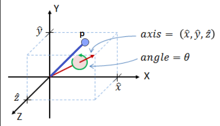
*Figura 2.2: Rotacíon generada por un cuaterníon, de un punto p⃗ en un ángulo θ en torno*

a un eje. Fuente: https: // danceswithcode. net/ engineeringnotes/ quaternions/
quaternions. html
.
Los tres espacios más importantes a considerar son:
1. Espacio local: Dado un punto p posicionado en el espacio, decimos que otro punto está
en su espacio local, si su posición se especifica en relación al sistema de coordenadas
generado por la transformación de p.
2. Espacio del modelo: Si tenemos un objeto o modelo m en el espacio, el espacio del
modelo es el espacio más global asociado a éste, tomando en cuenta que m puede tener
muchos subespacios, por ejemplo en el caso de que fuera un objeto compuesto de otros
objetos, donde cada uno de ellos tiene su espacio local. Si un punto p está posicionado
en relación a m, podemos decir que está en el espacio local de m y a su vez que está
en el espacio del modelo de m.
3. Espacio global: El espacio global es el espacio vinculado al sistema de referencia basal.
No existen otros sistemas de referencia más arriba en la jerarquía.
La aplicacíon de una transformacíon espacial, conceptualmente modifica el sistema de refe-
rencia cartesiano al que un punto está asociado. Lo que hace entonces, es transformar todo el
espacio local. Si se tiene la transformación que relaciona a un sistema de referencia S con otro
sistema P, es posible mover un punto del espacio local de S al espacio local de P aplicando
esta transformacíon.
Las matrices y los vectores utilizados pertenecen a un sistema de coordenadas homogéneas, lo que explica que tengan dimensiones 4×4 y 4×1, en lugar de 3x3 y 3x1 respectivamente. El
sistema de coordenadas homogéneas permite aplicar transformaciones de traslacíon mediante
multiplicación matricial, en conjunto con las transformaciones de escalamiento y rotación.
Más información sobre este tema puede explorarse en [14].


### 2.2. Modelos articulados
Un modelo articulado [16], esqueleto, o rig, es una estructura tipo árbol, en la que cada
nodo, o articulación, contiene la transformacíon espacial que define la relación de su propio
espacio local, con el espacio local de su nodo padre. Al ser un árbol, los nodos del esqueleto
pueden tener múltiples nodos hijos, pero sólo un nodo padre. Al aplicar la transformación
de un nodo a un punto p que está en su espacio local, p es llevado al espacio local de su
padre. Al concatenar las transformaciones en orden jerárquico, desde el nodo actual hasta la
raíz del esqueleto, obtenemos la posición del nodo en el espacio del modelo, que tambíen es
el espacio local del nodo raíz. Entonces, el espacio del modelo es el espacio más cercano al
espacio global. Típicamente, cada articulación es identificada con un nombre.

### 2.3. Mapas de altura
Un mapa de altura [13] puede definirse como una superficie de 2.5 dimensiones. Esta
definición hace referencia que el mapa de altura tiene como base un conjunto de puntos
p⃗ = (x,y) que existen en un plano bidimensional, y a cada punto se le asigna un valor z,
que puede ser visualizado como la altura del punto en el espacio tridimensional. Esto implica
que por cada valor en el plano, existe un único punto en el espacio tridimensional. En otras
palabras un mapa de altura es una función h(x,y) = z, donde las coordenadas x,y conforman
los puntos que pertenecen al dominio bidimensional de h. Los mapas de altura tienen variadas
aplicaciones, pero en este informe se utilizan para la generación de terrenos.

### 2.4. Cinemática
Se define la cinemática como el estudio del movimiento, sin considerar las fuerzas que lo
originan. En los campos de la robótica y de la animación, donde se trabaja constantemente
con modelos articulados y sus movimientos, los cálculos de posicíon, velocidad y aceleracíon
de las articulaciones caen en el ámbito de la cinemática.

#### 2.4.1. Cadenas articuladas
Una cadena articulada [3] se define como un subgrupo de articulaciones pertenecientes a
un modelo articulado, que están conectadas en serie mediante segmentos. Una cadena posee
una base, que es la denominación que se le da en este informe a la articulacíon que se en-
cuentra más arriba en su jerarquía, y un end-effector, abreviado usualmente como ee, que se
encuentra en el extremo opuesto (figura 2.3).
En el contexto de querer controlar los movimientos de una cadena articulada, el end-effector
es la articulación que quiere llevarse a una posicíon objetivo, para posiblemente ejecutar al-
guna acción. Si consideramos un brazo humano como una cadena articulada, la mano sería


el end-effector mas obvio. De todas maneras, una subcadena puede escogerse de forma arbi-
traria dentro de un modelo articulado, por lo que cualquier articulación que esté al final de
la cadena definida, se considera un end-effector.
Las distancias entre las articulaciones se mantienen fijas, por lo que solo se permite que la
posicíon relativa entre ellas sea modificada mediante rotaciones.

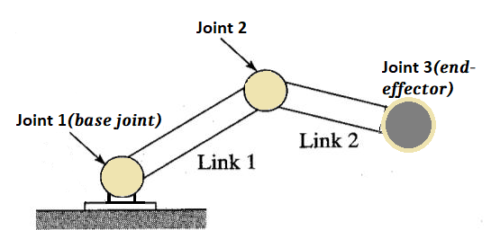
*Figura 2.3: Ejemplo de cadena articulada. Imagen basada en figura extraída de [12].*


#### 2.4.2. Cinemática directa
La cinemática directa [3], o FK por sus siglas en inglés, es el cálculo de la posicíon del
end-effector conocíendose los valores de rotacíon, traslacíon y escalamiento de las demás
articulaciones de la cadena. Como se mencionó en 2.4.1, las posiciones relativas de las arti-
culaciones de una cadena articulada solo pueden ser modificadas alterando sus rotaciones,
por lo que conocíendose las distancias de una articulación a otra, basta con saber los ejes y
ángulos de rotación momento a momento, para poder calcular la posición del end-effector.
Considérese una cadena articulada con articulaciones $j_1, \ldots, j_i, \ldots, j_n$, cada una con una transformación $M_i$ asociada, donde la articulación $j_1$ es la base de la cadena y $j_n$ es el end-effector. Para cada transformación $M_i$, variable en el tiempo, se cumple que $M_i(t) = T_i(t) R_i(t) S_i(t)$, donde $T_i, R_i, S_i$ son las subtransformaciones de traslacíon, rotación y escalamiento respectivamente. $T_i$ y $S_i$ se mantienen fijas para mantener las distancias relativas, y $R_i$ es variable en el tiempo, por lo que $M_i(t) = T_i R_i(t) S_i$. La posicíon del end-effector en el espacio padre de la base de la cadena se calcula como:

$$\text{Pos}_{ee}(t) = \prod_{i=1}^n T_i R_i(t) S_i \, \vec{p} \tag{2.2}$$

El vector $\vec{p} = \{0,0,0,1\}$, es la posición del end-effector en su propio espacio local. Dado que el end-effector se encuentra en el origen de su propio sistema de referencia, aplicarle una rotacíon a su posicíon local no genera en ella ningún cambio. Para cualquier matriz de rotacíon $R$, se cumple que $\vec{p} = R\vec{p}$. Esto implica que modificar la rotación asociada al end-effector, no altera el resultado de la ecuación 2.2.


#### 2.4.3. Cinemática inversa
Considérese una cadena articulada K con n nodos, en la que cada nodo tienen asociada
una rotación modificable (considerando de 1 a 3 grados de libertad (DoF)) que afecta al
segmento conectado a él. La cinemática inversa [3], o IK, es la técnica que permite determi-
nar como debe girar cada nodo o articulación en la cadena para que su end-effector alcance
una posicíon objetivo. Así, al contrario de la cinemática directa, que encuentra una posición
objetivo para el end-effector a partir de la configuracíon de cada una de las rotaciones, la
técnica de IK descifra cuales deben ser las rotaciones para que la posición del end-effector
sea igual a la posición objetivo.
Defínase $\vec{\theta}$, como el vector que contiene un ángulo $\theta_i$ por cada articulación $j_i$ de la cadena K, que indica cuanto ha rotado $j$ desde su estado de reposo en un determinado plano de rotación. El vector $\vec{\theta}$ permite determinar completamente el estado de la cadena, teníendose como base las distancias fijas entre las articulaciones. Con cinemática directa (FK) puede tomarse esta informacíon rotacional, y obtenerse la posición del end-effector en el espacio de la base de la cadena. Se puede expresar entonces la posición del end-effector en función de las rotaciones de las articulaciones como $\vec{s} = f(\vec{\theta})$, usando FK. Resolver el problema de IK consiste en obtener la función inversa, tal que

$$f^{-1}(\vec{s}) = \vec{\theta}$$

$f^{-1}$ es una función altamente
no lineal y difícil de obtener. Dependiendo de la cantidad de nodos y DoF asociados a la
cadena en particular para la que se trate de resolver el problema, puede haber una solución,
múltiples soluciones o incluso ninguna (figura 2.4).

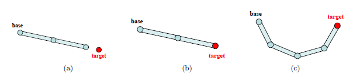
*Figura 2.4: Ejemplos de cadenas articuladas y sus soluciones posibles. (a) No es posible*

alcanzar el objetivo.(b) Existe una única solucíon. (c) Existen múltiples soluciones (es así en
la mayoría de los casos). Fuente: [1]
Los problemas más complejos e interesantes de IK suelen componerse de varias cadenas arti-
culadas interconectadas. La figura humana, que es la estructura sobre la que se aplicará IK en
este trabajo de título, es un ejemplo de un conjunto complejo de cadenas articuladas (figura
2.5). Las piernas del esqueleto de la figura pueden tomarse como dos cadenas articuladas,
teniendo ambas el nodo pélvico (verde) como nodo base y el nodo del respectivo pie como
end-effector.
Otro concepto importante que es extensamente aplicado en los cálculos de IK, es el de restric-
ciones o constraints asociadas a los ángulos de rotación. En el caso de animaciones generadas
con IK, se requiere limitar las magnitudes y ejes de rotación posibles para no generar poses
imposibles y/o poco realistas. Por ejemplo, no es deseable que al animar un modelo hu-
manoide, la pierna se flecte de manera que la rodilla vaya hacia atrás. Usar las constraints


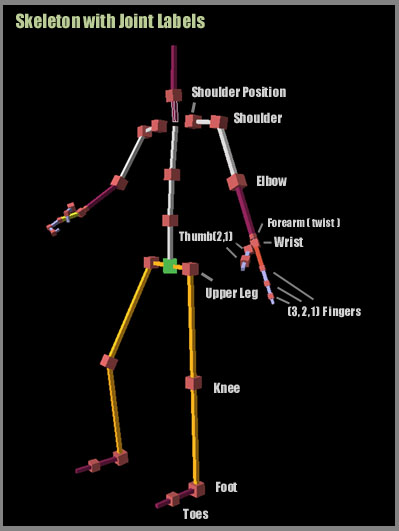
*Figura 2.5: Figura humana como un conjunto de cadenas articuladas. Fuente: www.*

3dkingdoms. com
adecuadas soluciona este problema.

### 2.5. Curvas linealmente interpoladas
Una curva linealmente interpolada, o LIC como se le llama en este informe por sus siglas en
inglés, es un conjunto discreto de puntos que existen en un espacio n-dimensional, donde cada
punto está asociado a un valor específico de un parámetro escalar t. Una curva linealmente interpolada es en realidad una spline lineal [21]. Si una LIC $l$ posee $k$ puntos $p_i$, con sus respectivos valores del parámetro $t$, $t_1, \ldots, t_i, \ldots, t_k$, se genera un intervalo de tiempo $[t_1, t_k]$ para $l$. Es posible obtener un punto de la curva para cualquier instante de tiempo $\hat{t}$ perteneciente a ese intervalo, simulando continuidad. Si se da que $\exists\, i: \hat{t} = t_i$, entonces obtenemos directamente el punto asociado a $t_i$ y $l(\hat{t}) = p_i$. En otro caso, buscamos el subintervalo más pequeño que contenga a $\hat{t}$, tal que $t_i < \hat{t} < t_{i+1}$ e interpolamos linealmente entre los puntos $p_i$ y $p_{i+1}$ utilizando la relacíon entre $t_i$, $\hat{t}$ y $t_{i+1}$ como referencia, obteníendose que:

$$l(\hat{t}) = p_i + (p_{i+1} - p_i)\,\frac{\hat{t} - t_i}{t_{i+1} - t_i}$$


### 2.6. Descenso de gradiente
El descenso de gradiente [5] es una técnica de optimizacíon iterativa, que permite encontrar mínimos locales en una función escalar, multivariable, y diferenciable. Si se tiene una función $F$, que cumple con las características anteriores, se quiere encontrar un vector $\vec{x} = \{x_1, \ldots, x_i, \ldots, x_n\}$ tal que $F(\vec{x})$ sea un mínimo local. En cada iteración debe calcularse el gradiente de $F$ evaluado en $\vec{x}$:

$$\nabla F(\vec{x}) = \begin{pmatrix} \dfrac{\partial F(\vec{x})}{\partial x_1} \\ \vdots \\ \dfrac{\partial F(\vec{x})}{\partial x_i} \\ \vdots \\ \dfrac{\partial F(\vec{x})}{\partial x_n} \end{pmatrix}$$

El gradiente de $F$ evaluado en $\vec{x}$ es un vector, e indica la dirección de máximo crecimiento de $F$. Teniendo calculado el gradiente, se actualiza el valor de $\vec{x}$:

$$\vec{x} := \vec{x} - \lambda\nabla F(\vec{x})$$
Un paso del descenso de gradiente consiste en mover a ⃗x en la dirección opuesta a la direccíon
de máximo crecimiento local de F, aplicando un factor λ al valor del gradiente llamado
tasa de aprendizaje, que controla la velocidad del descenso. A medida que ⃗x se acerca a
un mínimo local, las coordenadas del gradiente presentan valores más y más cercanos a 0,
dado que la funcíon se mueve a una zona más “plana”, donde los valores absolutos de las
pendientes que dan valor a las derivadas parciales, son menores. El proceso se detiene al
llegar a un número especificado de iteraciones, o si las coordenadas del gradiente presentan
valores suficientemente cercanos a 0 según lo requerido en el caso de uso particular.

### 2.7. La caminata humana
La caminata humana (en su versión promedio), es definida como un movimiento de péndu-
lo invertido. Conceptualmente, en cada paso dado, el pie de apoyo es el soporte del péndulo,
la pierna conectada a ese pie es la cuerda, y la cadera es el peso oscilante. Mientras la cadera
se encuentra cayendo (u oscilando), el pie opuesto al de apoyo, que se encuentra en movi-
miento, se aproxima al que será el próximo punto de soporte, lo que permite mantener el
ciclo.
En la figura 2.6, el pie que se encuentra atrás en el movimiento, comienza el proceso
de ser levantado, para seguir una trayectoria parabólica que termina en el punto de apoyo
indicado con el número 2. En cada paso, el pie tiene sus velocidades mínimas de movimiento
al encontrarse en torno al punto de soporte, donde se detiene por un instante.


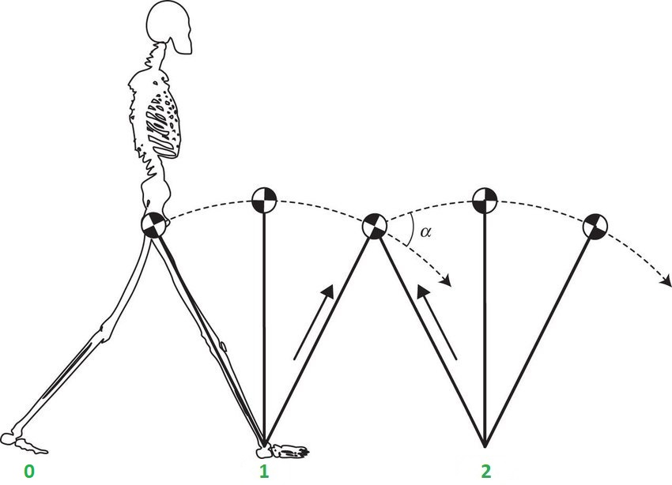
*Figura 2.6: Movimiento de péndulo invertido en la caminata humana. Fuente [19]*


### 2.8. El MonaEngine
El motor dentro del cual se desarrolla el trabajo de esta memoria es el MonaEngine [7],
un motor simple, que tiene lo necesario para transmitir lo que es un motor de juegos y como
puede estructurarse a un nivel más bien minimalista. Está escrito en C++, es multiplataforma
y de código abierto. Cuenta con un sistema de audio, uno de renderizado 3D, uno de eventos,
uno de física y colisiones, y uno de animacíon, además de un modelo de game objects para
representar a las entidades que existen en el mundo del juego. A continuación se explican
superficialmente las partes del motor relevantes para la implementacíon de la solución:

#### 2.8.1. Modelo de game objects
El modelo de game objects [8] es uno basado en componentes, lo que significa que los
objetos del mundo del juego se construyen ensamblando distintas piezas básicas, que le dan
un conjunto de propiedades y capacidades al objeto. Algunos de los componentes que provee
el motor, y que pueden ser usados por cualquier game object son: TransformComponent,
SkeletalMeshComponent, StaticMeshComponent y AudioSourceComponent. Si se quiere por
ejemplo, construir un game object que represente un personaje dentro del juego, tendría sen-
tido incluir un TransformComponent, que guarde información sobre la posición global del
objeto; un SkeletalMeshComponent, que guarde informacíon sobre el modelo articulado a
animar; y un AudioSourceComponent que le permita al personaje reproducir sonidos. Los
componentes existen de forma separada, pero en muchos casos, para añadir un componente a
un game object, es necesario que este tenga tambíen otro, especificado como una dependencia
en el componente que se quiere añadir. Por ejemplo, la mayoría de los componentes del siste-
ma, requieren que el game object contenga un TransformComponent, porque sus propiedades
dependen de la posicíon del game object en el espacio del mundo.
Para poder manipular una instancia de un componente en particular, desde los distintos
sistemas del motor, se utiliza un identificador de tipo InnerComponentHandle, que permite


acceder a un puntero del componente identificado.

#### 2.8.2. Mallas geométricas
Una malla geométrica [9] es un grafo que se utiliza para representar un objeto o modelo
en el espacio. Al ser un grafo, una malla tiene un conjunto de vértices, que se conectan entre
si mediante aristas. En el caso particular de las mallas, un grupo de nodos vecinos, además
de los que pueden “verse” entre si (o sea que no tienen una arista que bloquee una linea
imaginaria dibujada entre ellos), forman una cara. Las mallas se categorizan según el número
de vértices que puede tener una cara. En el caso del MonaEngine, cada cara se compone de 3
vértices, por lo que las mallas utilizadas son mallas de triángulos o triangulaciones. Además,
el MonaEngine es un motor 3D, en consecuencia, las mallas que utiliza se construyen y
dibujan en un espacio tridimensional.
El motor permite la utilizacíon de dos tipos de mallas: StaticMesh y SkinnedMesh. Las
SkinnedMesh son mallas que pueden ser modificadas en tiempo de ejecución, y se utilizan
para el proceso de animación de esqueletos, funcionando como la cubierta o volumen que
constituye al modelo animado. Por otro lado, las StaticMesh, como su nombre lo indica, son
estáticas, y las posiciones locales (en el espacio de la malla) de sus vértices se mantienen
fijas. Estas mallas pueden usarse para construir objetos no animados. Al construir un game
object que contenga una malla estática, debe incluirse un TransformComponent para guardar
su transformación global, y un StaticMeshComponent, para guardar la instancia de la clase
Mesh que contiene el grafo que conforma la malla a dibujar.

#### 2.8.3. Manejo del tiempo
Cuando se ejecuta una aplicación creada con el motor, esta avanza según el tiempo trans-
currido registrado por el programa. El motor funciona manteniendo un loop [8], y en cada
iteración, le indica a cada uno de sus sistemas, cuánto tiempo ha transcurrido desde la ite-
ración pasada. La mayoría de los componentes del motor dependen de este pequeño cambio
de tiempo. Por ejemplo, la simulación física llevada por el motor, para comportarse de forma
realista, debe tener en cuenta el paso del tiempo.

#### 2.8.4. Sistema de animación
El sistema de animación [10] permite reproducir animaciones basadas en esqueletos (mo-
delos articulados). En este sistema, una animación o clip de animacíon, es representada
por la clase AnimationClip. Un AnimationClip está constituido por un conjunto de pistas
de animación, llamadas AnimationTracks, una por cada articulación a animar. El esqueleto
animable es representado por la clase Skeleton, y para poder asignarle una animación, es
necesario que las pistas de animación del AnimationClip estén asociadas a un subconjunto
de sus articulaciones. La clase Skeleton y la clase AnimationClip, guardan los nombres de sus
articulaciones asociadas. Además, la clase Skeleton, por representar un modelo articulado,


guarda las relaciones padre-hijo entre los nodos. Estas relaciones, y en general, la forma en
la que esta estructurado un grafo, se denomina la topología del grafo.
Sea entonces un esqueleto $S$ con un conjunto de articulaciones $J_s$, y un AnimationClip $A$, asociable al esqueleto $S$. $A$ está constituido por $n$ AnimationTracks, cada una de las cuales está asociada a una articulación perteneciente al conjunto $J_a$. Se cumple que $J_a \in J_s$.
Cada AnimationTrack T del AnimationClip A tiene información de transformación local

para su articulacíon asociada, teniendo un arreglo de traslaciones $P_i$, uno de rotaciones $R_i$ (en formato cuaternión), y uno de escalamientos $S_i$. Estos tres arreglos dentro del AnimationTrack tienen un tamaño arbitrario. Cada uno de los arreglos tiene un arreglo paralelo del
mismo tamaño, que contiene sus timeStamps, o marcas de tiempo. Cada timeStamp, indica
el tiempo dentro del intervalo de duración $d_A$ de la animación $A$, para el que el valor de su
arreglo paralelo está destinado. En el contexto de este informe, al índice de una timeStamp
se le denomina frame. Por lo tanto, si una animacíon tiene n timeStamps de rotación para
una articulación j, entonces se tienen n frames asociados, que van de 0 a n − 1. Notar que
el número de frames para distintas articulaciones no necesariamente es el mismo. Tambíen
puede darse que una misma articulación tenga distinto número de frames de rotación, tras-
lación y escalamiento.
Se desea extraer del clip de animación, una pose a asignar al esqueleto, asociada a un instante arbitrario $t$ perteneciente al intervalo $[0, d_A]$. Para ello se recorre cada AnimationTrack, y por cada uno de sus arreglos de timeStamps $t^A$, se busca el intervalo más pequeño tal que $t^A_i \leq t \leq t^A_{i+1}$. Usando las distancias relativas entre $t^A_i$, $t$ y $t^A_{i+1}$, se interpola linealmente entre los valores de transformación asociados a $t^A_i$ y $t^A_{i+1}$, para generar un valor de transformación para $t$. Al final del proceso de recolección, se tiene una transformación espa-
cial local por cada AnimationTrack. El proceso de renderizado del modelo, requiere que las
transformaciones sean pasadas a espacio del modelo (y más tarde a espacio global). Tal como
se indica en la sección 2.2, la concatenacíon de las transformaciones de las articulaciones a
animar, transforma los puntos desde el espacio de las articulaciones, hasta los espacios de sus
padres, y los padres de sus padres, hasta llegar al espacio de la raíz del esqueleto, o espacio
del modelo.
Para construir un game object que represente a un modelo animado, se requiere un Skele-
talMeshComponent, y un TransformComponent para la informacíon de transformacíon glo-
bal. La construcción del SkeletalMeshComponent requiere:
1. Un puntero a un clip de animacíon previamente asociado a un esqueleto.
2. Un puntero a una instancia de la clase SkinnedMesh, tambíen asociada a un esqueleto,
que contiene la superficie visible del modelo a ser renderizado.
3. Un puntero a una instancia de la clase Material, que determina como la superficie del
modelo será afectada por la iluminacíon.
Pueden asignarse varias animaciones a un mismo esqueleto. La reproducción de un clip de
animación en particular, y la transicíon entre distintas animaciones, es manejada por la
clase AnimationController. Esta clase guarda un puntero al clip de animacíon que se está
reproduciendo actualmente, y al clip de animacíon al que se transicionará (en caso de haberlo),
llamado CrossFadeTarget.


El sistema de animacíon reproduce sus clips de animación de acuerdo al tiempo trans-
currido indicado por el programa (2.8.3), pero además incluye un factor llamado playRate o
tasa de reproducción, que determina la velocidad de reproducción de la animación en relación
al avance de tiempo basal. El paso del tiempo para la animación tambíen es regulado por la
clase AnimationController, y es guardado en la variable sampleTime. sampleTime hace refe-
rencia al tiempo interno del clip de animación que se reproduce actualmente, que va desde 0
hasta el valor de su duración. De igual forma, la instancia de CrossFadeTarget, que contiene
al clip de animación al que se va a transicionar, posee su propio sampleTime, que tambíen
va desde 0 hasta su duracíon total.


Capítulo 3

## Estado del arte

### 3.1. Métodos para resolver el problema de IK
El problema de IK puede resolverse de muchas maneras, que varían en complejidad y tiem-
po de ejecución. La siguiente es una recopilación de esos métodos, extraída principalmente
del trabajo de Aristidou y Lasenby [2]:

#### 3.1.1. Métodos analíticos
Las soluciones analíticas al problema de IK consisten en funciones que entregan de manera
inmediata (sin necesidad de un proceso iterativo), todas las configuraciones (conjunto de ro-
taciones para las articulaciones) que llevan al(los) end-effector(s) al (los) punto(s) objetivo(s).
Estas funciones entregan resultados a partir de los largos de los segmentos, la configuración
rotacional base, y las constraints de rotación (Ejemplo: figura 3.1).
La solución generada es global (obtenemos de una sola vez los valores para todas las articu-
laciones) y precisa. Por su precisión, los métodos analíticos son ideales para el campo de la
robótica. La otra ventaja considerable que proveen los métodos analíticos, es que al poder
llegar a la solucíon final de manera inmediata, son tremendamente rápidos comparados con
los demás métodos.
Por muy atractivas que puedan parecer sus cualidades, los casos en que los métodos analíticos
pueden ser usados son limitados. Cuando las cadenas se vuelven complejas, y además se tra-
baja en el espacio tridimensional, tiende a volverse extremadamente difícil, si no imposible,
encontrar una solución analítica. En el caso del modelo humano, por ejemplo, que llega a
tener alrededor de 70 grados de libertad en total, usar este método a nivel global no parece
plausible.
Tambíen debe tenerse en consideración, que cuando los sistemas se vuelven más complejos,
el resultado generado puede consistir en más de una solucíon, por lo que deben establecerse
criterios para elegir una solucíon final única que se ajuste a lo requerido por el caso de uso.


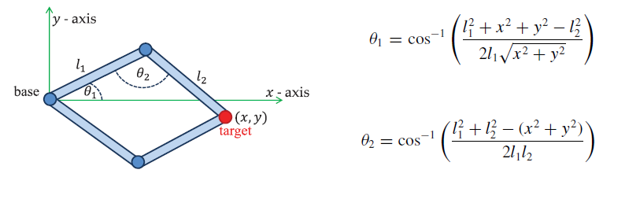
*Figura 3.1: Caso de cadena articulada en el que únicamente hay dos soluciones posibles para*

alcanzar el objetivo (x,y). Puede alcanzare por arriba o por abajo del eje x. Se usa una solucíon
analítica. Fuente [2]

#### 3.1.2. Métodos numéricos
Los métodos numéricos trabajan aproximando soluciones. Deben ser escogidos y configu-
rados con cuidado para evitar resultados erráticos e inconsistentes.
Recordando el planteamiento original de IK (2.4.3), se busca solucionar la ecuación $f^{-1}(\vec{s}) = \vec{\theta}$. Generalizando, $\vec{\theta}$ es el vector de rotaciones, y $\vec{s}$ es un vector con las posiciones de un número arbitrario end-effectors. Si se considera $\vec{s}$ como las posiciones actuales, y $\vec{t}$ como las posiciones objetivo, se puede definir un vector de error $\vec{e}$, tal que $\vec{e} = \vec{t} - \vec{s}$. Se quiere usar los métodos numéricos para modificar $\vec{s}$, acercándolo a $\vec{t}$ lo más posible y minimizando el error $\vec{e}$.

**Métodos basados en la inversíon del Jacobiano**

Se puede escribir el jacobiano del vector $\vec{\theta}$ como $J(\vec{\theta}) = \left(\dfrac{\partial s_i}{\partial \theta_j}\right)_{ij}$. Las entradas de la matriz $J$ pueden calcularse como $\left(\dfrac{\partial \vec{s}_i}{\partial \theta_j}\right)_{ij} = \vec{v}_j \times (\vec{s}_i - \vec{p}_j)$, donde $\vec{v}_j$ es el vector unitario que apunta en la dirección del eje actual de rotación de la $j$-ésima articulación, y $\vec{p}_j$ es su posición actual. Además la derivada de $\vec{s}$ con respecto al tiempo puede escribirse como $\dot{\vec{s}} = J(\vec{\theta})\dot{\vec{\theta}}$. Con esto, una pequeña variación del vector $\vec{s}$ puede aproximarse como $\Delta\vec{s} \approx J\Delta\vec{\theta}$. La idea es elegir un vector $\Delta\vec{\theta}$ que haga que $\Delta\vec{s}$ se aproxime lo más posible a $\vec{e}$, logrando así un acercamiento a la posicíon objetivo con ese pequeño cambio. Por último, se puede obtener la variación de $\vec{\theta}$ requerida si se calcula el inverso del jacobiano $J$, ya que $\Delta\vec{\theta} = J^{-1}\vec{e}$. Para resolver esta ecuacíon en general se buscan alternativas que eviten tener
que calcular la inversa directamente. Problemas comunes al usar métodos que involucren el
uso del jacobiano son la aparición de singularidades, y crecimiento explosivo del valor de
la función en torno a ellas. Las singularidades son zonas en el espacio de la ecuación en las cuales no es posible encontrar una variación $\Delta\vec{s}$ que genere un acercamiento al $\Delta\theta$ buscado. El
crecimiento explosivo mencionado genera variaciones erráticas en los valores de las rotaciones,
lo que lleva a resultados poco creíbles en el proceso de animacíon. A continuacíon se presentan
dos ejemplos (existen varios más) de reemplazantes para la inversa del jacobiano:


i) **Transpuesta del jacobiano:** Se modifica la ecuacíon para reemplazar $J^{-1}$, quedando como $\Delta\vec{\theta} = \alpha J^T\vec{e}$, donde $J^T$ es la transpuesta de $J$ y $\alpha$ es un escalar que puede calcularse como

$$\alpha = \frac{\vec{e} \cdot JJ^T\vec{e}}{JJ^T\vec{e} \cdot JJ^T\vec{e}}$$

siendo $\cdot$ el producto punto. Esta solución suele requerir muchas iteraciones (cálculos consecutivos de valores pequeños $\Delta\vec{\theta}$) para acercarse de forma aceptable al objetivo $\vec{t}$, y es común que genere poses poco creíbles y movimientos faltos de fluidez. Estos problemas se dan principalmente cuando el objetivo esta muy lejos de la posicíon inicial. Para evitar problemas es tambíen ideal que el valor de $\alpha$ sea pequeño.

ii) **Pseudo-inversa del jacobiano:** En este caso la ecuacíon es $\Delta\vec{\theta} = \alpha J_{pi}\vec{e}$, donde $J_{pi}$ es la pseudo-inversa del jacobiano o inversa Moore-Penrose. La pseudo-inversa puede calcularse como $J_{pi} = J^T(JJ^T)^{-1}$. Esta solución, en caso de estar cerca de una singularidad es especialmente propensa a generar cambios drásticos en los ángulos de las articulaciones aunque el cambio en la posicíon del end-effector sea muy pequeño.
Descenso de gradiente
Tambíen es posible aplicar el método del descenso de gradiente descrito en 2.6, para
resolver este problema. Basta para ello definir una función F a minimizar, que represente
la distancia entre las posiciones actuales de los end-effectors y sus posiciones objetivo, en
función de los valores de rotación de las articulaciones del modelo articulado. Puede por
ejemplo, usarse la siguiente función:

$$F(\vec{\theta}) = ||\vec{s}(\vec{\theta}) - \vec{t}||^2 \tag{3.1}$$
Se explicita en la ecuacíon 3.1, la dependencia de las posiciones de los end-effectors hacia las
rotaciones de las articulaciones. La norma usada es la norma euclidiana.
Métodos heurísticos
Estos métodos calculan una solución aproximada acercándose a ella de manera iterativa,
paso a paso. Se basan en cálculos pequeños y simples que resultan en algoritmos de muy bajo
costo. Dos ejemplos emblemáticos son “Cyclic Coordinate Descent“ (o CCD), y “Forward
And Backward Reaching Inverse Kinematics“ (o FABRIK).
i CCD: En el caso de CCD, la idea es aplicar pequeñas transformaciones a cada nodo,
partiendo desde el end-effector, de tal manera de acercarse lo más posible a la posición
objetivo con cada cambio. Se parte por el end-effector, que se encuentra al final de la
cadena. Se llama a este nodo $p_n$ y $t$ a la posición objetivo. Lo siguiente es considerar los vectores $(p_n - p_{n-1})$ (vector del nodo anterior al actual) y $(t - p_{n-1})$ (vector del nodo anterior al objetivo). El paso clave consiste en modificar la rotación asociada al nodo $p_{n-1}$, para alinear los dos vectores recíen mencionados, tal como se ve en la figura 3.2. Esto se repite hasta que $p_{n-1}$ corresponda al nodo raíz, terminando así una iteración de CCD. Pueden llevarse a cabo tantas iteraciones como se quiera, fijando un valor de error
aceptable para marcar el término del proceso.


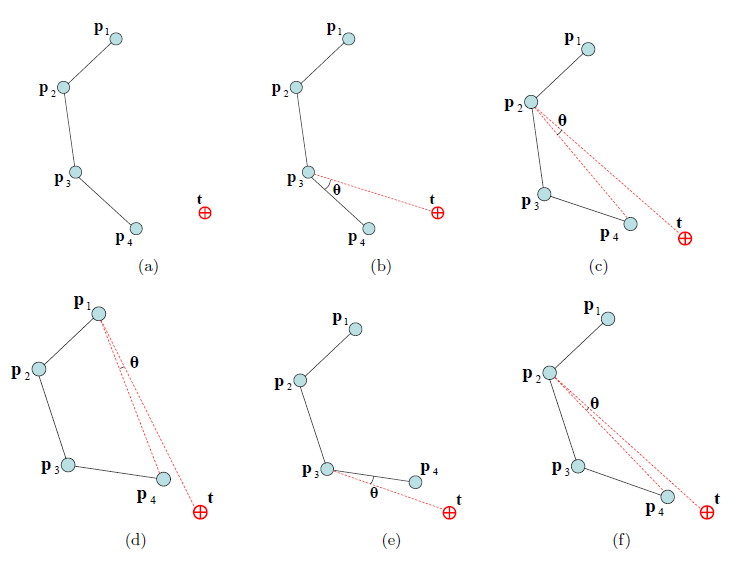
*Figura 3.2: Ejemplo de una iteracíon de CCD sobre una cadena articulada. Fuente: [1]*

ii FABRIK: Supóngase que se tiene una cadena cuyos nodos tienen posiciones $p_1, p_2, p_3$ y $p_4$, donde $p_1$ es la base de la cadena, que se encuentra fija, y $p_4$ es el end-effector que quiere llevarse a la posicíon objetivo $t$. Los largos de los tramos que unen los nodos son $d_1$ ($p_1$–$p_2$), $d_2$ ($p_2$–$p_3$) y $d_3$ ($p_3$–$p_4$). Ahora, poco a poco se irán transformando las posiciones hasta obtener un resultado suficientemente bueno. Como se ve en la figura 3.3, se mueve $p_4$ a la posicíon objetivo. Luego se genera $p_3'$, tomando la direccíon del vector $(p_3 - p_4')$ y amplificándola por $d_3$. $p_3'$ es ahora la nueva posicíon objetivo, y $p_3$ el nodo que se debe desplazar. Se repite esto hasta obtener $p_1'$, posicionado a distancia $d_1$ de $p_2'$ en dirección $(p_1 - p_2')$, y luego desplazar $p_1$. Luego se realiza el proceso en dirección opuesta, hacia el end-effector, tomando la base original de la cadena (que debe mantenerse fija) como primer objetivo. Se itera hasta obtener un resultado satisfactorio, indicando tambíen un
valor de error máximo para señalar cuando debe detenerse el algoritmo.
Ambos algoritmos son bastante rápidos dentro del mundo de los métodos numéricos (espe-
cialmente FABRIK), pero muchas veces sufren de movimientos erráticos.

#### 3.1.3. Métodos basados en datos
Métodos basados en ejemplos
Estos métodos se basan en recolectar y utilizar una gran cantidad de poses que se ajusten
al esqueleto cuyo movimiento se quiere modelar. Para el caso de la figura humana, existen
muchos conjuntos de datos disponibles de manera gratuita en internet, generados mediante
motion-capture. Las poses se parametrizan según valores como posiciones y rotaciones de


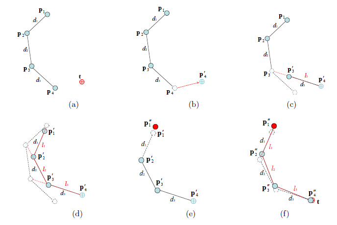
*Figura 3.3: Ejemplo de una iteracíon de FABRIK sobre una cadena articulada. Fuente: [1]*

articulaciones/huesos en particular. Con base en los parámetros asociados al movimiento
que se quiere generar en la cadena o conjunto de cadenas, se recuperan una o varias poses
del conjunto y se obtiene un resultado mediante interpolación. Tambíen se han incluido
distribuciones de probabilidad sobre el espacio de poses, que permiten recuperar la pose
más probable dada una serie de condiciones y constraints. Los métodos basados en datos
presentan la ventaja de entregar poses realistas y plausibles de forma natural, ya que se
basan en ejemplos extraídos del mundo real. Una desventaja característica es la de tender a
entregar poses similares a los ejemplos con alta frecuencia, siendo por lo tanto una solución
algo más restringida.
Métodos basados en redes neuronales
Al igual que en el caso del método basado en ejemplos, las redes neuronales necesitan
una gran cantidad de poses como información base para ser entrenadas. En esencia, las redes
neuronales son funciones, cuyos coeficientes son ajustados para minimizar una función de
error. Esta funcíon de error representa que tan lejos se está de obtener los outputs esperados
para los inputs entregados. En contraste con el método anterior, la red no apunta a asignar
una pose completa directamente obtenida de los ejemplos, sino que descompone las poses en
movimientos simples y los asocia a ciertos parámetros. Así, con informacíon sobre constraints
y posiciones objetivo, la red puede construir una pose completamente distinta a los ejemplos
entregados, basándose en las reglas generales extraídas del proceso de aprendizaje.

#### 3.1.4. Métodos híbridos
Los métodos híbridos consisten en alguna combinación de los métodos anteriores. Por
ejemplo, se ha planteado resolver el problema de IK para la figura humana, dividíendolo


en 3 subproblemas [25]. La primera parte consiste en estimar la posición del nodo raíz del
modelo, usualmente posicionado en la cadera, movíendolo de tal manera que se satisfagan las
constraints lo mejor posible, y los objetivos de los end-effectors sean alcanzables. Una vez se
estima este valor, ya se tiene una primera aproximacíon de la pose general. El segundo paso
es un ajuste de la postura del esqueleto. Puede que al posicionar el nodo raíz algunos de los
objetivos sigan sin poder alcanzarse. Para solucionar esto, se reajusta el nodo raíz, modifican-
do su posición y orientacíon, y además se ajusta la postura del tronco del modelo articulado.
Los ajustes necesarios se realizan mediante métodos numéricos (estimativos). El paso final es
el de fijar las posiciones de las extremidades. Dado que las extremidades son cadenas articu-
ladas simples (con cantidades reducidas de nodos), a veces pueden reposicionarse mediante
métodos analíticos, lo que reduce ampliamente el costo de la solución (comparándose con
una que utilice exclusivamente métodos numéricos).
La ventaja de los métodos híbridos recae en su aptitud para extraer lo mejor de cada método,
al aplicarlo al subproblema más adecuado. Así es posible conseguir soluciones generales más
óptimas y correctas.

### 3.2. Uso de IK para generar movimientos de locomo-
ción bípeda
La investigación de como simular movimientos complejos de locomoción, tales como correr
o caminar, ha avanzado mucho en las últimas dos décadas, con la popularización creciente
de los videojuegos y el desarrollo del campo de la robótica. Dado que el corazón de la ci-
nemática inversa recae en ajustar valores de rotacíon local de articulaciones, para alcanzar
una posicíon objetivo, toda investigacíon que busque adaptar un movimiento a diferentes
condiciones, hace uso de ella de una manera u otra. De todas maneras, es necesario darle
cierto límite a la definición de IK, estableciendo que la intencionalidad a la hora de definir
una posición objetivo es importante. Por ejemplo, un movimiento tipo ragdoll, únicamente
generado mediante simulación física, no se preocupa de posiciones objetivo para las partes
del modelo articulado, y simplemente modifica la configuración del modelo en respuesta a las
fuerzas presentes en la simulación.
Una exploración superficial de las publicaciones ligadas al área de animación de movimientos
de locomocíon, indica que en los últimos años ha sido la inteligencia artificial la que ha tomado
protagonismo. Las técnicas que involucran métodos numéricos, que aparecen repetidamente
en trabajos previos al año 2010, han sido reemplazadas por métodos basados en datos. Una
recopilación de avances basados en deep learning fueron presentados por Gabriel State en la
conferencia anual GTC de NVIDIA, en una charla titulada Applications of Deep Learning for
Locomotion Animation el 2019. En ella se refuerza la noción de que pueden obtenerse muy
buenos resultados aprendiendo de un set de datos conseguidos mediante motion-capture. Se
expone primero, el paper titulado Phase-Functioned Neural Networks for Character Control
[18], en el que se estudia el uso de una red neuronal para adaptar movimientos de locomoción
bípedos a terrenos variados, que en tiempo de ejecución requiere la geometría del terreno,
el tipo de movimiento (caminar, correr, saltar, etc.) y la fase actual del movimiento (qúe
porcíon del ciclo del movimiento está ocurriendo). La red neuronal genera movimientos muy
dinámicos con excelentes transiciones entre unos y otros.


Se explica una forma de resolver el problema para cuadrúpedos (como perros, gatos, lobos,
etc.) en el trabajo titulado Mode-Adaptive Neural Networks for Quadruped Motion Control
[26]. El sistema presentado trabaja con dos redes neuronales que se apoyan mutuamente: una
que predice cual será el siguiente movimiento, dado el estado actual del modelo articulado y
el último estado computado; y otra que asiste a esta primera red, modificándola según cual
sea el tipo de movimiento a ejecutar, basándose en conocimiento adquirido de un amplio
set de datos para cada tipo de movimiento. Durante la charla, se expone tambíen que esta
solución puede aplicarse a bípedos, pero los resultados generados son de una calidad bastante
menor. Como en varios casos, los resultados dejan en evidencia el problema que muchas veces
acompaña a los métodos puramente basados en datos: la falta de precisión a nivel físico en
cuanto a la interaccíon fina con superficies y objetos, y la capacidad de balancearse correc-
tamente de los modelos. En DeepLoco: Dynamic Locomotion Skills Using Hierarchical Deep
Reinforcement Learning [23] se describe una solución que integra la física a la locomoción
generada a partir de los datos. De hecho, el objetivo planteado es el de obtener movimientos
físicamente realistas y similares a los movimientos humanos, requiriendo de una cantidad
relativamente baja de información de motion-capture como base. El entrenamiento de la red
neuronal es realizado mediante reinforcement learning, que consiste en ajustar los parámetros
de la red indicándole cuando genera resultados apropiados y cuando no, insertándola en un
contexto en que puede tratar de resolver el problema mediante ensayo y error. Por ejemplo,
se le indica al sistema que no debe permitir que el modelo articulado caiga al suelo. Dado
que los movimientos se generan dentro de una simulacíon física, no pueden ocurrir que los
pies del modelo atraviesen el piso, por ejemplo, como si es el caso del resto de los sistemas,
cuando no implementan soluciones específicamente diseñadas para el problema de los pies.
Aunque el uso de inteligencia artificial parece liderar el progreso de la animacíon procedi-
mental, existen métodos que se basan en las técnicas de IK del tipo numérico que tambíen
logran conseguir resultados aceptables. En una charla de la GDC del 2016, titulada IK Rig:
Procedural Pose Animation [4], y dictada por Alexander Bereznyak de Ubisoft, se presentan
resultados bastante interesantes, que al contrario que los métodos anteriores, requieren una
única animación como base. Bereznyak presenta el IK Rig, una representación de un modelo
articulado que permite recibir una animación y adaptarla a terrenos irregulares. El IK Rig
está conformado por IK Chains, cadenas articuladas que definen las partes manipulables del
esqueleto. Una de las características del sistema, es que permite que una única animación
sea utilizada con una variedad de modelos articulados, que difieren en tamaño, estructura
y número de articulaciones. No se explicita la técnica de cinemática inversa utilizada, pero
puede deducirse que está fuera del campo de los métodos basados en datos. Para determinar
el avance de un modelo articulado por el terreno, se recupera informacíon sobre la geometría
próxima en el camino, del tal forma de que puedan tomarse decisiones sobre la factibilidad de
ciertos movimientos, y sobre cuál es la manera más realista de hacerlos. Las modificaciones a
la animacíon original se realizan considerando una serie de reglas, que hacen que el personaje
pueda adaptarse al entorno con un estilo particular.
Otro enfoque para adaptar animaciones a distintos contextos mediante métodos numéricos
requiriendo solo unas pocas de ellas, es el de modificar las animaciones momento a momento
en base a ciertos parámetros extraídos previamente. En Automated Semi-Procedural Anima-
tion for Character Locomotion [20], el autor extrae valores clave de las animaciones, como
puntos de apoyo de los pies en el piso, y largo, rapidez y direccíon de las trayectorias, entre
otros. En tiempo de ejecucíon, se escogen combinaciones de las animaciones base (e.g. correr
y caminar) según la velocidad lineal y angular del modelo, y se adaptan al terreno mediante


una técnica de cinemática inversa no explicitada, utilizando al mismo tiempo los parámetros
extraídos en la etapa previa de análisis de las animaciones.


Capítulo 4
Solucíon

### 4.1. Arquitectura de la solución
El sistema de navegación IK se inserta dentro de la arquitectura [6] del ya existente
MonaEngine, por lo que toma lugar como uno de sus componentes, manteniendo la estructura
general del motor. Se añaden además dos librerías que tienen el propósito de asistir el proceso
de depuración: debug-draw y console−color. La figura 4.1 muestra cómo se inserta la solucíon
dentro del motor. La figura 4.2 introduce los componentes de la solucíon y su jerarquía. Cada
una de las clases presentadas en el diagrama de la arquitectura interna, es explorada en
alguna de las secciones siguientes del informe. Se incluye tambíen un diagrama UML simple
en el anexo, para presentar una relación más clara entre las clases (figura A.1).

### 4.2. Clases nucleares del sistema

#### 4.2.1. IKRig
El IKRig (tambíen llamado simplemente rig en este informe), se encarga de representar
al esqueleto articulado dentro del marco del sistema IK. Por esta razón guarda un puntero al
esqueleto original, y extrae de él las relaciones padre-hijo de los nodos. No obstante, el IKRig
no es solo un contenedor para el esqueleto: su objetivo es transformarlo (y por lo tanto tambíen
al personaje humanoide al que pertenece), en una entidad que pueda desplazarse por el
mundo del juego. La clase contiene para esto vectores de referencia, que indican la orientación
global del rig, y su dirección de movimiento; una posición inicial global; variables de rapidez
angular y ángulo actual de giro respecto de la dirección frontal de movimiento para poder
modificar la orientación; e instancias de las clases ForwardKinematics, InverseKinematics y
TrajectoryGenerator, que permiten que el desplazamiento ocurra. Dentro del IKRig, tambíen
se hace explícito cuáles son las articulaciones a modificar mediante IK, estando contenidas
en IKChains, que son la implementacíon del concepto de cadena articulada planteado en
2.4.1. En particular al construir una instancia del IKRig, se guardan dos cadenas, una por


*Figura 4.1: Arquitectura externa en la que se inserta la solucíon. Diagrama basado en el presentado en la memoria original del MonaEngine [6].*


*Figura 4.2: Arquitectura interna del sistema de navegacíon IK.*


cada pierna del esqueleto. Además se incluye el índice de la articulación de la cadera, que es
a partir de donde se controla la trayectoria global del rig; un InnerComponentHandle para
acceder a la transformación global del game object; y la altura del esqueleto (espacio del
modelo) en conjunto con su escala global, para tener una nocíon de distancia relativa. Por
último, el IKRig contiene una lista de IKAnimations, cuya funcíon se explica a continuación.

#### 4.2.2. IKAnimation
Al igual que el IKRig es el símil del esqueleto dentro del sistema IK, una IKAnimation
representa a un clip de animacíon. Esta clase se comporta como una configuración del IKRig,
que se adapta a un clip en particular, y es la clase más voluminosa del sistema. Se incluye
información sobre las trayectorias originales de los end-effectors y de la cadera (que se ex-
traen del clip (4.8.2)), y tambíen de las que estos deben seguir momento a momento para
adaptarse al terreno. Las clases ForwardKinematics e InverseKinematics, que son introduci-
das más adelante, realizan sus cálculos en base a una instancia particular de IKAnimation,
obteniendo del puntero al AnimationClip base (que esta clase contiene), la información de
transformaciones espaciales de las articulaciones del esqueleto que son animadas en el clip. Se
realiza una separación entre informacíon de transformaciones original, que no es modificada,
y la informacíon variable, que es actualizada por el sistema IK. En particular, las traslaciones
y los escalamientos del clip de animación, se mantienen fijos. Los ángulos de las rotaciones
en el clip son alterados constantemente para ajustar las posiciones de los end-effectors, por
lo que se guarda una copia de las rotaciones originales, que es útil en caso de necesitar re-
iniciar la animacíon, además de ser requerido por la clase InverseKinematics. Tambíen existe
un arreglo dedicado a almacenar rotaciones variables arbitrarias, que se usan para realizar
cálculos necesarios para el ajuste con IK. Un historial de ángulos calculados en el pasado
reciente tambíen es mantenido para ser usado por FK e IK.
La otra función de una IKAnimation, es la de llevar registro del tiempo de reproduccíon de
la animación, y del frame que está siendo reproducido. Para que la generación de trayectorias
mantenga una temporalidad coherente, debe establecerse una línea de tiempo desde que
empezó a reproducirse la animación, lo que se logra llevando la cuenta en el reproductionTime.
Por otro lado lado, la animacíon tiene su propio tiempo interno, que va desde 0 hasta la
duración de la animación. Este tiempo se denomina animationTime, y es necesario para
determinar que parte de la animación se está reproduciendo. IKAnimation mantiene una
relación entre estos dos tiempos, pudiendo pasar de uno al otro según sea necesario.
Al generar trayectorias, si se quiere puede realizarse una validación básica de la trayectoria
generada. Si la trayectoria no es válida, se fija la animacíon, establecíendose los mismos valores
de rotación para todos los frames para que el movimiento se detenga. El frame que se replica
en el resto de la animacíon, llamado fixedMovementFrame, tambíen se almacena en esta clase.
Por último, se especifica el tipo de clip de animacíon guardado en la IKAnimation, que
puede ser WALKING o IDLE, lo que determina cómo será manejada la animacíon por el
sistema.


#### 4.2.3. IKChain
IKChain es la implementacíon del concepto de cadena articulada. Una IKChain, tiene un
nombre, que hace referencia a la parte del esqueleto a la que pertenece (e.g.: leftLeg); un
arreglo con los índices de las articulaciones que conforman la cadena, ordenadas jerárquica-
mente; el índice de la articulación padre de la cadena en la jerarquía, que permite conectar
la cadena con el resto de la topología directamente; un puntero a la IKChain opuesta (e.g.
pierna derecha, en el caso de la pierna izquierda), lo que es útil para cálculos que requieran
posiciones relativas entre cadenas; y el objetivo actual, por cada IKAnimation, al que debe
ser llevado el end-effector de la cadena. Las articulaciones de la cadena son las articulaciones
cuyos ángulos de rotacíon pueden ser modificados por IK. Como se explica en 2.4.2, la rota-
ción del end-effector no tiene efecto en su posición, por lo que su ángulo no se modifica. Debe
tenerse en cuenta que la posicíon del end-effector se maneja en el espacio del modelo, y no
en el espacio de la base de la cadena, por lo que las articulaciones superiores en la jerarquía,
de haberlas, tambíen se utilizan en los cálculos.
En esta solución se construyen dos cadenas, una por cada pierna. Para cada cadena, el end-
effector se encuentra aproximadamente a la altura del tobillo. Cada vez que se hace mencíon
a end-effectors a lo largo de la sección de la solución en este informe, se está hablando de
esas articulaciones en particular.

### 4.3. Orientación global y sistema de referencia
El IKRig se orienta en su espacio local (2.1), de forma que mira en la dirección +Y , y
el vector que conecta los pies con la cabeza apunta en la dirección +Z, como aparece en la
figura 4.3.
La posición y orientacíon del IKRig son únicamente modificadas a nivel global, mediante
cambios al TransformComponent del game object al que está asociado el rig. Por lo anterior,
localmente, el IKRig (más precisamente la raíz del esqueleto asociado) no sufre ningún cam-
bio de orientacíon o posición.
Los cambios en la orientacíon global, están limitados a la rotación del vector front $V_f = \{0,1,0\}$, en un ángulo rotationAngle contenido en el IKRig. Esto implica que el vector up $V_z = \{0,0,1\}$ global se mantiene constante, ya que solo es posible la rotación en el plano XY.

### 4.4. Tiempos del sistema
Como se adelantó en 4.2.2, el tiempo del sistema debe avanzar de manera coherente, y
para ello debe llevarse un registro adecuado de en qúe momento del tiempo se está. Para el
ordenamiento temporal se definen tres tipos de tiempo:


*Figura 4.3: Orientacíon en el espacio del modelo del IKRig. Fuente: https: //*

musculoskeletalkey. com/ biomechanics-of-the-spinal-motion-segment/

#### 4.4.1. Tiempo de animacíon
El animationTime, es el tiempo interno de una animación, e indica cual es la porcíon
de ella que se está reproduciendo actualmente. El valor del animationTime $t_a$ pertenece al intervalo $[0, d_A]$, donde $d_A$ es la duracíon del clip de animación. El animationTime es equivalente al sampleTime llevado por la clase AnimationController 2.8.4 y al sampleTime de CrossFadeTarget.

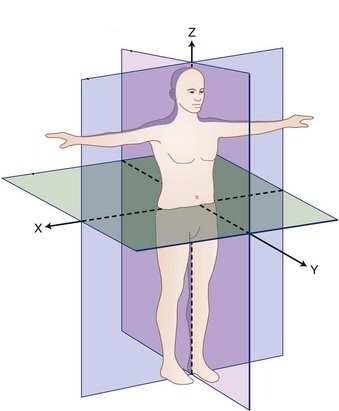
*Figura 4.4: Diagrama simplificado de una animación y su animationTime, dividida en subtrayectorias como se explica en la seccíon 4.8.2.*

El animationTime es equivalente al sampleTime llevado por la clase AnimationController (2.8.4) y al sampleTime de CrossFadeTarget.


#### 4.4.2. Tiempo de animacíon extendido
Como su nombre lo dice, el extendedAnimationTime, es el tiempo de la animacíon en
su versíon extendida. Se considera que el intervalo de tiempo de animationTime se amplía
en ambas direcciones, repitíendose la duracíon de la animación $d_A$ un número arbitrario de veces. A pesar de que se trabaje con un intervalo extendido, la información a la que se hace
referencia dentro del clip es la misma. Se puede imaginar que el clip se está repitiendo sin
cambios una y otra vez.
Para todo extendedAnimationTime $t^\text{Ext}_a$, existe un animationTime $t_a$ que hace referencia a la misma informacíon del clip de animación. Para pasar de extendedAnimationTime a
animationTime se consideran tres casos:
1. $t^\text{Ext}_a < 0$: En este caso se suma $d_A$ a $t^\text{Ext}_a$ tantas veces como sea necesario para dejarlo en el intervalo $[0, d_A]$
2. $d_A < t^\text{Ext}_a$: De forma análoga, se resta $d_A$ a $t^\text{Ext}_a$ tantas veces como sea necesario para dejarlo en el intervalo $[0, d_A]$
3. $0 \leq t^\text{Ext}_a \leq d_A$: No es necesario hacer ningún cambio.
La utilidad de extendedAnimationTime queda más clara en la sección 4.8.2.


*Figura 4.5: Diagrama simplificado de una animación y su extendedAnimationTime, dividida en subtrayectorias como se explica en la sección 4.8.2.*

#### 4.4.3. Tiempo de reproducción
El reproductionTime, es el tiempo que avanza constantemente desde que comienza la eje-
cución. Su avance depende del tiempo del programa (2.8.3), y del playRate (tasa de reproduc-
ción) definido en la clase AnimationController (2.8.4). Es similar a extendedAnimationTime
en el sentido de que se construye en base a una repetición de la duracíon del clip de animación
$d_A$. De hecho, para llevar la cuenta, IKAnimation contiene una variable reproductionCount, que indica cuantas veces se ha reproducido la animación completa. El reproductionTime actual $t_\text{rep}$, puede calcularse como $t_\text{rep} = d_A \cdot \text{reproductionCount} + t_a$, donde $t_a$ es el tiempo interno actual de la animacíon. La diferencia con extendedAnimationTime, es que reproduc-
tionTime hace referencia a información que sí evoluciona en el tiempo. La información que


puede extraerse del tiempo actual $t_\text{rep}$, no necesariamente es la misma que en $t_\text{rep} - d_A$.
La generacíon de trayectorias explicada en la seccíon 4.8, depende de la relación entre anima-
tionTime/extendedAnimationTime y reproductionTime. Toda trayectoria creada se inserta
en la linea temporal del reproductionTime, pero se basa en una curva original extraída de
extendedAnimationTime, y tiene su misma duracíon. De esta manera, existe un paralelismo
temporal permanente entre las trayectorias originales y las trayectorias generadas.


*Figura 4.6: Diagrama simplificado de las trayectorias generadas por TrajectoryGenerator (4.8), distribuidas a lo largo del reproductionTime. Notar el paralelismo temporal con las curvas de las figuras 4.4 y 4.5.*

#### 4.4.4. Reproduccíon de frames
Como se explicó en 2.8.4, un frame es el índice de una timeStamp de una pista de anima-
ción (AnimationTrack). Sea $t$ el valor actual de animationTime, la información de transformación extraída para una articulacíon, se consigue interpolando entre los valores asociados a los timeStamps vecinos de $t$: $t_i$ y $t_{i+1}$. Entonces, $t_i \leq t \leq t_{i+1}$ es el intervalo formado por timeStamps más pequeño que contiene a $t$. $i$ e $i+1$ son los frames asociados a $t_i$ y $t_{i+1}$ respectivamente. En este caso, se dice que el frame actual es i, y el frame siguiente es i + 1.
En caso de que i sea el último frame de la animacíon ( n − 1), entonces el frame siguiente es
el frame 0.

### 4.5. Descenso de gradiente
La clase que implementa el descenso de gradiente, GradientDescent, se construye en en
base a instancias de la clase FunctionTerm que representa sumandos a utilizar para generar la
función final a la que se aplicará la técnica de descenso de gradiente. Considérese que se quiere aplicar la técnica a las funciones $f_1, \ldots, f_i, \ldots, f_n$ en conjunto, ya que cada una de ellas tiene un significado en el contexto del problema a resolver. Estas funciones dependen del mismo vector de variables $\vec{x} = \{x_1, \ldots, x_k, \ldots, x_m\}$. Se construye una función total

$$F(\vec{x}) = \sum_{i=1}^n f_i(\vec{x})$$

a la que finalmente se aplica el descenso de gradiente. Cada subfunción (o término) $f_i$ se encapsula en un FunctionTerm que permite calcular su valor $f_i(\hat{\vec{x}})$, y su derivada parcial $\dfrac{\partial f_i(\hat{\vec{x}})}{\partial \hat{x}_k}$. Cada término tiene tambíen asignado un peso $w_i$, que determina su importancia para el cálculo del valor final.

La clase GradientDescent utiliza la funcíon de derivada parcial en cada término para construir el vector gradiente:

$$\nabla F(\vec{x}) = \sum_{i=1}^n w_i \begin{pmatrix} \dfrac{\partial f_i(\vec{x})}{\partial x_1} \\ \vdots \\ \dfrac{\partial f_i(\vec{x})}{\partial x_k} \\ \vdots \\ \dfrac{\partial f_i(\vec{x})}{\partial x_m} \end{pmatrix}$$

Recordando lo expuesto en 2.6, el vector $\vec{x}$ que minimiza localmente la función $F$ se actualiza como sigue:

$$\vec{x} := \vec{x} - \lambda\nabla F(\vec{x})$$

Esta es la forma regular de actualizar el gradiente, pero existen muchas variantes. La clase GradientDescent, además del método regular, puede utilizar la técnica de descenso de gradiente con momentum, en que los cálculos de iteraciones pasadas tienen un peso en el cálculo del valor actual del gradiente. El valor almacenado del gradiente, $\nabla F(\vec{x})_{saved}$, se actualiza de la siguiente manera utilizando momentum:

$$\nabla F(\vec{x})_{saved} := \alpha\nabla F(\vec{x})_{saved} + (1 - \alpha)\nabla F(\vec{x})$$

$\alpha$ es el factor que indica cúanto pesa el gradiente histórico $\nabla F(\vec{x})_{saved}$, en relación al gradiente calculado en la iteracíon actual $\nabla F(\vec{x})$. En este caso particular, se utiliza $\alpha = 0{,}8$. El vector $\vec{x}$ se actualiza como sigue usando momentum:

$$\vec{x} := \vec{x} - \lambda\nabla F(\vec{x})_{saved}$$
Para poder contener la información necesaria para realizar los distintos cálculos en el
proceso iterativo, la clase GradientDescent guarda un puntero a una clase de tipo arbitrario
dataT.
La funcíon que realiza el proceso de descenso de gradiente se llama computeArgsMin, y en
cada iteración genera mediante el uso del gradiente, un vector argsDelta, que contiene el
cambio a aplicar a cada una de las coordenadas del vector objetivo ⃗x para ir acercándolo
al valor que minimice la funcíon F. Entre sus parámetros se encuentran maxIterations y
targetArgDelta. maxIterations es el número de iteraciones máximo permitido. Si se llega a
este número el proceso se detiene.
A medida que avanza el proceso iterativo, y los argumentos van acercando la funcíon a su
mínimo, las magnitudes de las derivadas parciales, y por lo tanto los valores contenidos en
argsDelta, son menores. Dado que se puede interpretar un valor bajo para el cambio que se
debe aplicar al vector ⃗x, como una mayor cercanía al término del proceso, targetArgDelta
cumple la función de especificar el valor de cambio objetivo para cada una de las coordenadas
de ⃗x. Si en una iteracíon dada, todos los valores del vector argsDelta están por debajo de
targetArgDelta, el proceso iterativo se detiene.
Para construir una instancia de GradientDescent, tambíen se requiere una funcíon postDes-
centStepCustomBehaviour, que es ejecutada al final de cada iteración, y contiene cualquier
comportamiento especial que se quiera. Esta funcíon, recibe una referencia vector ⃗x actuali-
zado, un puntero a la instancia de dataT y una referencia a argsDelta.


### 4.6. Cinemática
Las clases que se introducirán a continuacíon, comparten la característica de ser depen-
dientes de un IKRig y de una IKAnimation en particular para realizar sus cálculos, ya que se
basan en los valores de transformación de las articulaciones y de su jerarquía. Ambas clases
guardan por lo tanto un puntero al IKRig asociado para poder acceder directamente a su
estructura y sus animaciones.

#### 4.6.1. Cinemática directa
Los cálculos en la clase ForwardKinematics se realizan en dos modalidades, simple y
variable. Los cálculos de tipo variable, extraen los valores de rotacíon de las articulaciones
del arreglo de rotaciones variables de la IKAnimation. Esto permite modificar las transforma-
ciones teniendo libertad en el ámbito rotacional. El arreglo de rotaciones variables contiene
solo una rotación por articulación, por lo que no existe variabilidad temporal.
Por otro lado, las transformaciones simples utilizan el historial de rotaciones de la IKAnima-
tion, por lo que los cálculos pueden realizarse para distintos momentos en el tiempo (en base
a reproductionTime 4.2.2), para un rango temporal acotado (del que se tiene registro). Estas
transformaciones permiten generar las posiciones que realmente han tenido las articulaciones
en el periodo registrado.
Ambas modalidades, simple y variable, cuentan con los valores fijos de escalamiento y posicíon
de cada articulacíon.
Las clases que dependen de ForwardKinematics necesitan las transformaciones para un
grupo específico de articulaciones: las articulaciones que van desde la raíz hasta cada uno
de los end-effectors. Para realizar el cálculo, para cada end-effector ee, se calculan las trans-
formaciones locales que están en el camino desde ee hasta la raíz. Estas transformaciones
locales tambíen son útiles, así que se guardan en un vector de salida que es un parámetro
opcional de la función. Cuando se tienen las transformaciones locales de la cadena completa
hasta la raíz, se acumulan las transformaciones para pasarlas desde el espacio local hasta
el espacio del modelo. Tambíen se les aplica una transformacíon base que puede utilizarse
para transformar a un espacio arbitrario ( generalmente el espacio global). Al calcular las
transformaciones para cada end-effector, se cuida de no repetir cálculos que ya se hayan rea-
lizado, en caso de que dos end-effectors compartan articulaciones en su camino hasta la raíz.
El resultado del cálculo (tambíen en el caso del vector de salida de transformaciones locales),
es un vector del tamaño de la topología del esqueleto, que guarda según el índice de cada
articulación su transformación. En los índices de las articulaciones para las que no se calculó
nada, simplemente se guarda la transformación identidad.

#### 4.6.2. Cinemática inversa
La clase InverseKinematics se encarga de calcular ángulos apropiados para las articu-
laciones contenidas en las IKChains del IKRig, utilizando la informacíon extraída de una
IKAnimation en particular. Los cálculos se hacen para un frame específico: el frame siguiente


a reproducir del clip de animación asociado a la IKAnimation. Para calcular los ángulos, In-
verseKinematics guarda una instancia de la clase GradientDescent, y utiliza el struct IKData
como contenedor de la información para el descenso. Los ángulos son calculados por Gra-
dientDescent según tres requisitos, cada uno de los cuales es encapsulado en un FunctionTerm
(4.5). La norma (|| · ||) usada en los términos es la norma euclidiana.
1. Primer término: El primer requisito, y el más importante, es el de acercar el end-effector
de cada IKChain a su posicíon objetivo. Para esto, la funcíon que se quiere minimizar
es:

$$f_1(\vec{\theta}) = ||\overrightarrow{eePos}(\vec{\theta}) - \overrightarrow{eeTarget}\,||^2 \tag{4.1}$$

Donde $\overrightarrow{eePos}(\vec{\theta})$ es la posición actual del end-effector, y $\overrightarrow{eeTarget}$ es la posición a la que
se quiere llevar. La posición del end-effector en el espacio del modelo, depende de los
ángulos de rotación de todas las articulaciones por encima de él en la jerarquía (desde
él hasta la raíz). Dado que solo se modifican los ángulos de las articulaciones de las
IKChains (excluyendo el end-effector), el vector θ = {θ ,...,θ ,...,θ } contiene única-
1 k m
mente esos ángulos. Es decir, cada variable θ del vector θ, es un ángulo de rotación
k
asociado a una articulación j presente en una de las cadenas (no se repiten en caso de
k
haber superposición entre cadenas). El resto de los ángulos del esqueleto se mantienen
fijos. Los ejes de rotación de todas las articulaciones tambíen se mantienen fijos para
reducir la cantidad de argumentos de la función objetivo y simplificar la derivada par-
cial, disminuyendo el costo del algoritmo. Por otro lado, las posiciones y escalamientos
no cambian como ya se ha mencionado. Por esto, las únicas variables a considerar son
los ángulos contenidos en el vector θ.
Para calcular la derivada parcial de $f_1$, $\frac{\partial f_1(\vec{\theta})}{\partial \theta_k}$, se reformula el cálculo de $f_1(\vec{\theta})$, separando las partes dependientes de variable $\theta_k$ del resto de los valores, que en este contexto son constantes. Notar primero que $\overrightarrow{eePos}(\vec{\theta})$ puede descomponerse de la siguiente manera:

$$\overrightarrow{eePos}(\vec{\theta}) = \hat{M}_A T_{\theta_k} R_{\theta_k} S_{\theta_k} \hat{M}_B \hat{\vec{b}} \tag{4.2}$$

Recordar que para calcular la posición de una articulación en el espacio del modelo, deben multiplicarse en cadena las transformaciones desde la articulacíon en cuestión hasta la raíz del esqueleto. La ecuación 4.2 contiene precisamente ese cálculo, donde las matrices de transformación han sido agrupadas de forma conveniente. En primer lugar, el vector $\hat{\vec{b}} = \{0,0,0,1\}$, tiene ese valor porque es la posición del end-effector en su propio espacio local. $M_{\theta_k}$ es la matriz de transformación local de la articulación $j_k$ asociada a la variable $\theta_k$. Esta matriz se descompone en sus tres subtransformaciones, con lo que $M_{\theta_k} = T_{\theta_k} R_{\theta_k} S_{\theta_k}$. Esta descomposición se realiza porque la única de ellas que varía es la matriz de rotación. $\hat{M}_A$ y $\hat{M}_B$ son simplemente las transformaciones acumuladas de las demás articulaciones en torno a la articulación $j_k$. Se agrupan las constantes, quedando $M_A = \hat{M}_A T_{\theta_k}$ y $\vec{b} = S_{\theta_k} \hat{M}_B \hat{\vec{b}} = \{b_0, b_1, b_2, b_3\}$:

$$\overrightarrow{eePos}(\vec{\theta}) = M_A R_{\theta_k} \vec{b} \tag{4.3}$$


Los elementos de los factores de la ecuación 4.3 se agrupan con sumatorias:

$$\overrightarrow{eePos}(\vec{\theta}) = \begin{pmatrix} \sum_{j=0}^{3}\sum_{i=0}^{3} [M_A R_{\theta_k}]_{0i}\, b_{ij} \\ \sum_{j=0}^{3}\sum_{i=0}^{3} [M_A R_{\theta_k}]_{1i}\, b_{ij} \\ \sum_{j=0}^{3}\sum_{i=0}^{3} [M_A R_{\theta_k}]_{2i}\, b_{ij} \\ \sum_{j=0}^{3}\sum_{i=0}^{3} [M_A R_{\theta_k}]_{3i}\, b_{ij} \end{pmatrix} \tag{4.4}$$
Substrayendo la posicíon objetivo:

$$\overrightarrow{eePos}(\vec{\theta}) - \overrightarrow{eeTarget} = \begin{pmatrix} \sum_{j=0}^{3}\sum_{i=0}^{3} [M_A R_{\theta_k}]_{0i}\, b_{ij} - eeTarget_0 \\ \sum_{j=0}^{3}\sum_{i=0}^{3} [M_A R_{\theta_k}]_{1i}\, b_{ij} - eeTarget_1 \\ \sum_{j=0}^{3}\sum_{i=0}^{3} [M_A R_{\theta_k}]_{2i}\, b_{ij} - eeTarget_2 \\ \sum_{j=0}^{3}\sum_{i=0}^{3} [M_A R_{\theta_k}]_{3i}\, b_{ij} - eeTarget_3 \end{pmatrix} \tag{4.5}$$

Finalmente la funcíon $f_1$ reconstruida queda de la siguiente forma:

$$f_1(\vec{\theta}) = \sum_{k=0}^{3} \left[\sum_{j=0}^{3}\sum_{i=0}^{3} [M_A R_{\theta_k}]_{ki}\, b_{ij} - eeTarget_k\right]^2 \tag{4.6}$$
Con esto, la parte variable de $f_1$ queda claramente separada en $[R_{\theta_k}]_{ij}$, y calcular la derivada parcial resulta más fácil:

$$\frac{\partial f_1(\vec{\theta})}{\partial \theta_k} = 2 \sum_{k=0}^{3}\sum_{j=0}^{3}\sum_{i=0}^{3} \left(\sum_{j=0}^{3}\sum_{i=0}^{3} [M_A R_{\theta_k}]_{ki}\, b_{ij} - eeTarget_k\right) [M_A]_{ki}\, \frac{\partial [R_{\theta_k}]_{ij}}{\partial \theta_k} \tag{4.7}$$

Para obtener $\frac{\partial [R_{\theta_k}]_{ij}}{\partial \theta_k}$, se requiere poder calcular los elementos de una matriz de rotación de 4x4, en función de un ángulo y un eje rotacíon. La matriz buscada y su derivada se
presentan en el anexo B.1.
2. Segundo término: En segundo lugar, se quiere que los ángulos calculados sean similares
a los de las rotaciones originales para el frame objetivo. La función escogida es:

$$f_2(\vec{\theta}) = ||\vec{\theta} - \vec{\omega}\,||^2 \tag{4.8}$$

El vector constante $\vec{\omega}$ contiene, por cada $\theta_k$, el ángulo $\omega_k$ original de la animacíon en el frame objetivo para la misma articulación $j_k$. La derivada es simple de calcular:

$$\frac{\partial f_2(\vec{\theta})}{\partial \theta_k} = 2(\theta_k - \omega_k) \tag{4.9}$$
3. Tercer término: El último término tiene el objetivo de mantener estabilidad temporal
en los valores calculados. Se quiere que los valores calculados para el frame actual no
difieran excesivamente de los valores calculados para el frame anterior. Las ecuaciones son análogas a las del segundo término:

$$f_3(\vec{\theta}) = ||\vec{\theta} - \vec{\gamma}\,||^2 \tag{4.10}$$

En este caso, el vector constante $\vec{\gamma}$, en lugar de contener los valores originales, contiene los valores de frame anterior para cada $j_k$.

$$\frac{\partial f_3(\vec{\theta})}{\partial \theta_k} = 2(\theta_k - \gamma_k) \tag{4.11}$$


Al final de cada iteración, dentro de la funcíon postDescentStepCustomBehaviour, se recal-
culan las transformaciones requeridas por 4.7, de forma que luego no tengan que rehacerse
cálculos para generar información que es compartida por distintas articulaciones.
Tambíen es importante notar, que computeArgsMin (4.5), solo se encarga de ajustar el vector
θ, y no de modificar los valores reales de los ángulos de rotacíon, guardados en el vector de
rotaciones variables de la IKAnimation, que se usan para calcular las transformaciones de las
articulaciones en cada paso del descenso. Por esto, postDescentStepCustomBehaviour debe
encargarse de realizar esa actualización.
Para aplicar el descenso de gradiente de manera óptima, es importante escoger de manera
inteligente los valores iniciales de las componentes del vector θ. Si al iniciar el proceso, los
valores ya se encuentran relativamente cerca del resultado deseado, se puede disminuir signi-
ficativamente el tiempo de cálculo. Se escoge entonces inicializar el vector de variables como sigue:

$$\vec{\theta} = \vec{\gamma}$$
Dado que los movimientos en una buena animación deben ser lo más suaves y continuos
posibles, es natural esperar que los valores para el frame actual sean similares a los del frame
anterior. Por esto se usa $\vec{\gamma}$, el vector de valores de frame anterior, que tambíen se usa en 4.10,
para marcar donde comienza el descenso.
La funcíon final $F$ a minimizar es:

$$F(\vec{\theta}) = a\,f_1(\vec{\theta}) + b\,f_2(\vec{\theta}) + c\,f_3(\vec{\theta}) \tag{4.12}$$
Los coeficientes a, b, y c, se determinan mediante ensayo y error, buscando un resultado
óptimo a nivel visual. Al ir probando valores, se tiene siempre en mente cuál es el significado
de cada término f , y qúe es lo que se quiere lograr visualmente. Por ejemplo, si a tiene un

valor muy alto, se siguen las trayectorias objetivo con mayor precisíon, pero los movimientos
se vuelven menos creíbles. Por el contrario, si b tiene un valor muy alto, los movimientos son
tan similares a la animación original que se pierde la capacidad de adaptación al terreno.
Los valores usados son $a = \dfrac{1}{rigHeight \cdot \delta_p}$, $b = 2$, y $c = 4$. El valor $rigHeight$ corresponde a
la altura del rig en el espacio del modelo, mencionado en 4.2.1. El valor δp corresponde a
un valor directamente proporcional al pequeño cambio de posición que sufre, en promedio,
un end-effector en una iteracíon del descenso de gradiente, al ir modificando los ángulos de
rotación de las articulaciones.
Dado que lo importante es mantener estable la relacíon entre las magnitudes de $a f_1(\vec{\theta})$, $b f_2(\vec{\theta})$, y $c f_3(\vec{\theta})$, hay que considerar el efecto que puede tener la variación de la altura del rig, que puede ser distinta dependiendo del modelo articulado usado. La altura del rig sirve
para tener una noción de distancias relativas en el espacio del modelo (y espacio global si se
incluye la escala). En particular, es posible tener una noción de la distancia que recorren los
end-effectors en cada paso dado por el rig al caminar. Lo anterior se explica porque que los
largos de las piernas del rig, y su altura rigHeight, tienen una relacíon de proporcionalidad
directa (si se consideran modelos de proporciones humanoides), y, sumado a lo anterior, los
largos de las piernas determinan la distancia que puede ser abarcada con un paso.
En el caso de $f_2$ y $f_3$, sus derivadas representan tasas de cambio para valores de ángulos (al cuadrado) (4.9 y 4.11) con respecto a cada componente del vector de ángulos variables θ. Es
decir, se calculan variaciones de ángulos en funcíon de otros ángulos. Esto implica que una
variacíon de rigHeight no tiene influencia en sus magnitudes, y por ello b y c tienen valores


constantes.
Por otro lado, al derivar f se obtiene una tasa de cambio de distancias al cuadrado con

respecto a ángulos. Al calcular la variacíon de la posición del end-effector con respecto a la
variacíon del ángulo $\theta_k$ asociado a la k-ésima articulación, se puede imaginar, como aproximación, que se está rotando un segmento de largo fijo en torno a su inicio para reposicionar
su final. Considérese un segmento s de largo fijo l, cuyo extremo quiere cambiarse de posición
desde una posicíon inicial, mediante una rotacíon en un ángulo δθ. Esta rotacíon ocurre en
torno a un eje perpendicular a s situado en su comienzo. La distancia δp (nombrada así
para hacer un símil con lo planteado al definir a) entre la posición inicial y la posicíon final
alcanzada, se calcula como $\delta p = 2l\sin(\delta\theta)$. Al ser $\delta\theta$ pequeño, puede aproximarse la función seno a su argumento, con lo que $\delta p \approx l\delta\theta$. Reordenando y considerando el cuadrado de la distancia:

$$l \approx \frac{\delta p}{\delta\theta} \tag{4.13}$$

$$l\,\delta p \approx \frac{\delta p^2}{\delta\theta} \tag{4.14}$$
La ecuación 4.14 indica que, de manera simplificada y aproximada, la tasa de cambio de
distancia al cuadrado en relación a un ángulo de rotacíon, asociada a la función $f_1$, es directamente proporcional al largo del segmento rotado (y en consecuencia a rigHeight), multi-
plicado por el valor de cambio de la distancia. Además, si se considera δθ como un ángulo
fijo, entonces se desprende de 4.13, que δp y l son directamente proporcionales, lo que implica
que δp y rigHeight tambíen lo son. Con esto, se define heurísticamente que $\delta p = \text{rigHeight}$.

Los cálculos anteriores permiten establecer un valor razonable para el coeficiente a.
Para estudiar el funcionamiento del proceso de descenso de gradiente con las funciones
y los coeficientes planteados, se recopilan datos que ilustran el rango de valores de los $f_i$ multiplicados por sus coeficientes respectivos. Los valores son extraídos a lo largo de múltiples
iteraciones completas del descenso de gradiente. Tambíen se incluyen datos sobre la cantidad
de iteraciones requeridas para completar el proceso de descenso. Se presentan los datos en las
tablas 4.1, y 4.2. La información es recopilada al hacer caminar a un modelo articulado por
un terreno bastante irregular durante alrededor de 60 segundos. El proceso de recopilación
se realiza dos veces, difiriendo únicamente el valor de rigHeight entre ambas ejecuciones del
programa, para demostrar que se logra mantener estable la relación entre los valores $a f_1(\vec{\theta})$, $b f_2(\vec{\theta})$, y $c f_3(\vec{\theta})$.

Se define maxIt = 300 como el máximo número de iteraciones permitido, y lr = 0,01
como tasa de descenso (o aprendizaje). Además, targetDelta = 0,001 es el valor que, al ser
alcanzado por todas las componentes del vector gradiente multiplicadas por lr, determina el
término del proceso.
Los dos valores escogidos de rigHeight para la recopilación difieren en órdenes de magnitud,
para asegurar un mínimo de robustez. Para el primer caso se usa rigHeight = 189,83, que
es la altura original del modelo de prueba. Para el segundo caso se escala el modelo y sus
animaciones en 150, para obtener un valor de rigHeight = 28474,5.
Para cada valor de rigHeight, tambíen se guardan los valores de una única ejecucíon del descenso de gradiente, para ilustrar cómo convergen los valores $a f_1(\vec{\theta})$, $b f_2(\vec{\theta})$, $c f_3(\vec{\theta})$ y $F(\vec{\theta})$, a medida que se ajusta el vector $\vec{\theta}$. Los datos se muestran en las figuras 4.7 y 4.8. Notar que
las subfunciones no necesariamente deben decrecer en todo momento, ya que muchas veces,


| | Promedio | Desviacíon estándar | Mínimo | Máximo |
|---|---|---|---|---|
| $a f_1(\vec{\theta})$ | 0.6984 | 1.5523 | 0.0170 | 16.4533 |
| $b f_2(\vec{\theta})$ | 0.3749 | 0.9152 | 0.0005 | 9.0186 |
| $c f_3(\vec{\theta})$ | 0.0910 | 0.1835 | 0.0006 | 2.8177 |
| $F(\vec{\theta})$ | 1.1642 | 2.3392 | 0.0479 | 23.0851 |
| Número de pasos por ejecución del descenso | 27.0242 | 13.9022 | 3 | 28 |

*Tabla 4.1: Valores de referencia recolectados a lo largo de múltiples ejecuciones completas del descenso de gradiente para IK. Con rigHeight = 189,83.*
aumentar una de ellas permite que otra disminuya, reduciendo la suma total. Por ejemplo,
ya que el vector $\vec{\theta}$ es inicializado con los ángulos de rotación del frame anterior $\vec{\gamma}$, antes de la primera iteración del descenso, se cumple que $f_3(\vec{\theta}) = 0$, que es el valor más bajo que podría tener. Su única opción, al ser siempre positiva, es aumentar, para dejar espacio de ajuste para $f_1$ y $f_2$. Los valores iniciales de las funciones (anteriores a la primera iteración)
no son incluidos en 4.7 y 4.8, porque representan el cambio más brusco en el proceso, y
generan que el resto de la curva respectiva se aplane bastante y se superponga con las demás,
disminuyendo la calidad de la visualizacíon. En cualquier caso, los valores iniciales coinciden,
en general, con la tendencia (creciente o decreciente) de las curvas correspondientes.

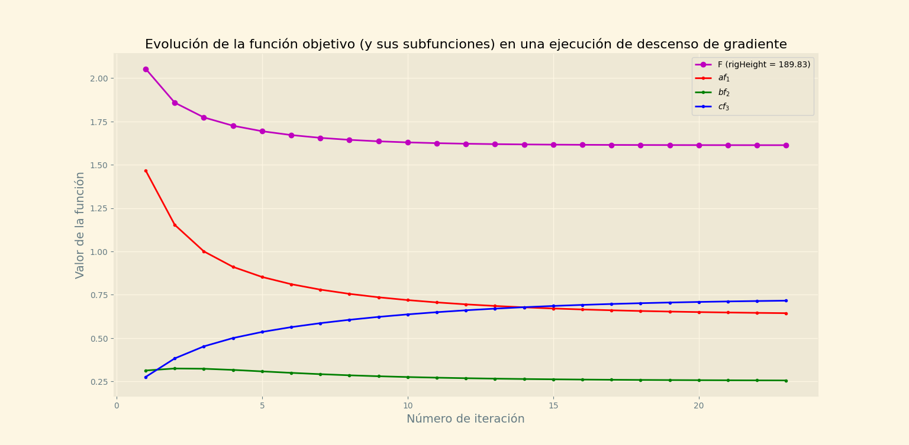
*Figura 4.7: Valores por iteracíon de F y sus subfunciones (considerando coeficientes), para*

una ejecucíon completa de descenso de gradiente aplicado a cinemática inversa. El número
de iteraciones es 23, con rigHeight = 189,83.


| | Promedio | Desviacíon estándar | Mínimo | Máximo |
|---|---|---|---|---|
| $a f_1(\vec{\theta})$ | 0.8005 | 1.7585 | 0.0248 | 24.4570 |
| $b f_2(\vec{\theta})$ | 0.4230 | 0.9268 | 0.0008 | 9.4162 |
| $c f_3(\vec{\theta})$ | 0.0974 | 0.1876 | 0.0003 | 2.2687 |
| $F(\vec{\theta})$ | 1.3208 | 2.4802 | 0.0684 | 25.5004 |
| Número de pasos por ejecución del descenso | 27.4569 | 13.6283 | 3 | 31 |

*Tabla 4.2: Valores de referencia recolectados a lo largo de múltiples ejecuciones completas del descenso de gradiente para IK. Con rigHeight = 28474,5.*

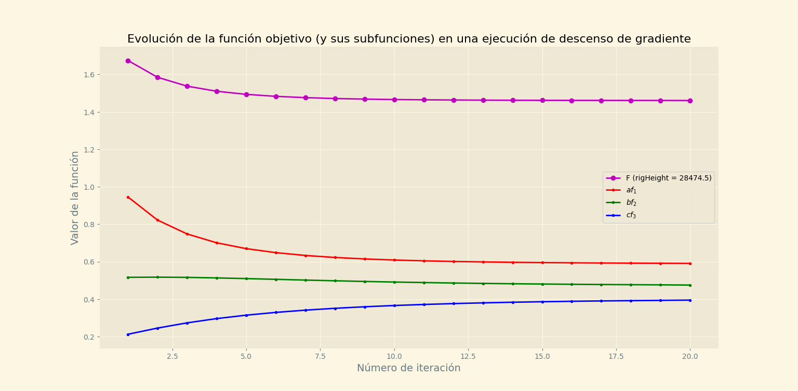
*Figura 4.8: Valores por iteracíon de F y sus subfunciones (considerando coeficientes), para*

una ejecucíon completa de descenso de gradiente aplicado a cinemática inversa. El número
de iteraciones es 20, con rigHeight = 28474,5.

### 4.7. Informacíon del entorno

#### 4.7.1. Mapas de altura
Para poder generar las trayectorias que guían a los end-effectors del rig, es necesario tener
un conocimiento del terreno que está siendo recorrido. Para ello, se extiende la clase Mesh,
cuyas instancias se usan para contener la información de una malla estática. Se incluye un
nuevo constructor de Mesh, especialmente creado para la generacíon de terrenos en base a
mapas de altura. Para construir el terreno se solicita: una funcíon $h(x,y) = z$ sobreyectiva (e idealmente continua), los límites del dominio de $h$, y el número de vértices de ancho y de profundidad que tendrá la malla. Para crear la malla, se distribuye de manera uniforme la cantidad de vértices indicada en el constructor, en el plano $(x,y,0)$. A cada vértice $\vec{v} = \{v_x, v_y, 0\}$, se le asigna una altura, tal que $\vec{v} = \{v_x, v_y, h(v_x, v_y)\}$. La funcíon $h$ es encapsulada en una instancia de la clase HeightMap, que además guarda los valores mínimos y máximos
de x e y para la malla creada. La instancia de HeightMap se almacena como un miembro de
la clase Mesh. Como la malla se construye en base a la función h, pueden hacerse consultas
a la instancia de HeightMap para obtener de forma precisa la altura de cada punto x,y de
la malla.

#### 4.7.2. EnvironmentData
Cuando el IKRig (más precisamente su TrajectoryGenerator asociado) necesita informa-
ción de altura para un punto (x,y), la consulta es hecha a la clase EnvironmentData. Esta
clase puede acceder a todos los mapas de altura que han sido vinculados al rig. De esta
forma, la navegacíon no esta limitada a un único terreno. Si dos o más mallas de terreno se
superponen, EnvironmentData devuelve el valor de altura máximo entre ellas.

#### 4.7.3. Terrenos
Para manejar la información de las mallas, EnvironmentData utiliza instancias de la clase
Terrain, que se construye en base a un game object que contenga un StaticMeshComponent.
Del game object se extraen los InnerComponentHandle que permiten acceder directamente
a su StaticMeshComponent y su TransformComponent. El StaticMeshComponent entrega
acceso al HeightMap contenido en la malla, y el TransformComponent permite acceder a su
información de transformación global. Así, EnvironmentData puede hacer consultas sobre la
altura global de los puntos de las mallas. Para que la relación de un punto (x,y) y su altura
h(x,y) se mantenga consistente, no se permite que el game object asociado al terreno haya
sido rotado.

### 4.8. Generación de trayectorias

#### 4.8.1. Curvas linealmente interpoladas
La clase LIC, que implementa el concepto de curva linealmente interpolada (2.5), es
usada principalmente dentro de esta solucíon para contener los puntos de las trayectorias y
sus instantes de tiempo asociados. Una LIC se construye a partir de dos arreglos paralelos:
uno que contiene m puntos pertenecientes a un espacio n-dimensional, siendo n un entero
positivo arbitrario (mayor que 0); y otro que contiene los valores del parámetro t para cada
punto, ordenados de forma estrictamente creciente. Además, se requiere un valor epsilon,
que indica la tolerancia al error al hacer cálculos con los valores de la curva. Dado que se
trabaja con valores tipo float, es muy importante tener en cuenta que las comparaciones


entre números suelen venir acompañadas de imprecisiones. La clase LIC posee (entre otras)
las siguientes capacidades:
1. evalCurve: Evaluar la curva para un valor arbitrario de t en el intervalo permitido
[t ,t ].
0 m
2. getPointVelocity: Calcular la velocidad de un punto p⃗ por la izquierda y por la derecha,
k
donde las ecuaciones son $\dfrac{\vec{p}_k - \vec{p}_{k-1}}{t_k - t_{k-1}}$ y $\dfrac{\vec{p}_{k+1} - \vec{p}_k}{t_{k+1} - t_k}$ respectivamente.
3. scale, translate y rotate: Escalar, trasladar y rotar la curva. Se aplica una transformación
de escalamiento, traslacíon o rotacíon a todos los puntos simultáneamente.
4. setCurvePoint: Cambiar el valor de un punto particular de la curva.
5. offsetTValues: Desplazar con un offset los valores del parámetro t.
6. sample: Extraer una subcurva de la curva c actual, indicando un subintervalo del in-
tervalo [t ,t ] que contiene todos los tiempos de c.
0 m
7. connect: Conectar dos curvas espacialmente, adaptando los valores de t si es necesario,
e insertando el comienzo de una al final de la otra.
8. join: Unir dos curvas, respetando los valores de t y sus puntos p⃗, incluyendo los valores
de la segunda curva solo si sus valores de t son superiores a los de la primera.
9. insertPoint: Insertar un nuevo par (p⃗ ,t ). La insercíon solo se realiza si el nuevo t es
k k k
suficientemente distinto a los ya presentes (usando epsilon).
10. transition: Transicionar de una curva a otra, especificando el valor del parámetro t
durante el que se quiere transicionar. Ambas curvas deben incluir el valor de transicíon
en su propio rango del parámetro t. En la curva final generada, el valor de punto asociado
al valor de transición
tˆindicado,
es una interpolación entre los puntos asociados a
tˆde
las curvas input.
11. transitionSoft: Equivalente a transition, pero usa un rango de valores al transicionar,
en lugar de uno solo, permitiendo que la curva final generada contenga una mayor
cantidad de puntos interpolados.
12. fitEnds: Adaptar la curva para que su inicio y su final calcen con los puntos arbitrarios
⃗v y ⃗v respectivamente. Para esto, se lleva la curva al origen, y se rota para
start end
alinear su direccíon d = p⃗ − p⃗ con la direccíon objetivo d = ⃗v − ⃗v .
original m 0 target end start
Luego, se traslada la curva completa en ⃗v , con lo que ⃗v se vuelve el nuevo punto
start start
inicial de la curva. El último paso consiste en escalar la curva para que se cumpla que
||d || = ||d ||, donde || · || es la norma euclidiana, para que el final de la curva
original target
coincida con ⃗v .
end


#### 4.8.2. Extraccíon de trayectorias base
Esta es una de las etapas de preprocesamiento del clip de animacíon (se incluye en esta
sección en lugar de en 4.10 para mayor claridad). Este proceso es llevado a cabo principal-
mente por la clase TrajectoryGenerator.
La generacíon de trayectorias nuevas para los ee’s y la cadera se realiza tomando como
base las trayectorias originales globales de esas mismas articulaciones. Al añadir una ani-
mación al sistema, se calculan las posiciones globales de las articulaciones requeridas para
cada frame, y se almacenan en curvas LIC de dimensión 3 (4.8.1), que requieren los valores
de posición y sus tiempos asociados. Las alturas globales se ajustan considerando el plano
(x,y,0) como plano de soporte o “piso” para la animación. Para encontrar el offset entre la
animación y el plano de soporte, se busca la mínima altura global alcanzada en la animacíon,
considerando todos los frames y todas las articulaciones.
Al calcular las posiciones globales, se calculan los frames de soporte para los ee, que repre-
sentan los puntos de apoyo de la caminata (2.7). Si para un ee, su posición en un frame f
está a menos de una distancia d de su posición en el frame anterior, f se considera un
min
frame de soporte. El valor d es proporcional a la altura global del IKRig. Una animación
min
debe tener al menos un frame de soporte para poder ser procesada adecuadamente. Se indica
si un frame es de soporte o no mediante un valor booleano.
Dado que en la caminata humana, mientras un pie se apoya, el otro pie está en movimiento,
los frames de soporte se ajustan para que los end-effectors de cadenas opuestas (e.g. pierna
izquierda y pierna derecha) tengan frames de soporte complementarios. Es decir, si un frame
es de soporte para un end-effector, para el ee de su IKChain opuesta no lo es. Las trayectorias
originales se almacenan de acuerdo a lo que se detalla a continuación.
1. Trayectorias originales de ee’s: En el caso de los end-effectors, las trayectorias originales
se subdividen en tramos, tomando en cuenta los puntos de soporte ya calculados. La
trayectoria total del end-effector se subdivide en subtrayectorias estáticas y dinámicas.
Una subtrayectoria estática, está compuesta por una porcíon de la trayectoria en la
que el movimiento es mínimo, ya que todos sus frames son de soporte. Por el contrario,
una trayectoria dinámica presenta un desplazamiento significativo del ee, ya que está
conformada únicamente por frames que no son de soporte.
Para construir las subtrayectorias, se van chequeando uno a uno los frames. Si el si-
guiente frame no es de soporte, se comienza a generar una trayectoria dinámica, y en
caso contrario una estática. Una subtrayectoria se completa cuando se agotan los frames
que deben ser chequeados, o cuando se da la condición para empezar una trayectoria del
tipo opuesto. Al chequear los frames, se toma en cuenta que las animaciones utilizadas
son circulares, y que por lo tanto, una subtrayectoria puede comenzar en un frame y
terminar en uno anterior, habiendo dado la vuelta a la animación. Dado que el sistema
requiere que pueda recuperarse una trayectoria original completa para cualquier ani-
mationTime (4.4.1), las trayectorias cortadas en los límites de la animación se llevan
a extendedAnimationTime. Una curva LIC debe tener valores de tiempo estrictamente
crecientes, por lo que no se permite representar un loop (o parte de él). Necesariamente
la curva cortada al final del clip de animación (o análogamente al comienzo de este),
debe continuar su tiempo despúes del final de la animación (o antes del comienzo)
(aclaración en figura 4.5).


A medida que se calculan las posiciones globales de los ee’s, se construye un arreglo
con sus alturas de soporte, que es la diferencia de altura entre el ee y el plano de so-
porte momento a momento. Estos valores se utilizan para determinar la mínima altura
esperada del ee para cada momento del tiempo.
Para una subtrayectoria estática, las alturas de soporte son simplemente los valores z
de sus puntos, ya que en esos instantes el end-effector está apoyado, con z como offset,
en el plano de soporte.
En cambio, para una trayectoria dinámica, donde el ee se encuentra en movimiento y
puede tener alturas muy variadas, se establecen las alturas de soporte interpolando en-
tre las alturas de soporte de las curvas estáticas vecinas. Como se indicó, la animacíon
ingresada necesariamente debe tener al menos un frame de soporte, lo que asegura que
si se genera una trayectoria dinámica, esta sea acompañada por al menos una trayecto-
ria estática. Dado que las trayectorias se construyen usando el concepto de circularidad
de una animacíon, una subtrayectoria siempre tendrá un curva previa y una curva si-
guiente.
Por cada subtrayectoria generada, se almacenan su LIC tridimensional, su tipo (estáti-
co o dinámico), y su ID único, en una instancia de la clase EETrajectory.
Para contener la informacíon de trayectorias separada por end-effector, se crea la clase
EEGlobalTrajectoryData. Una instancia de esta clase guarda un arreglo de las EETra-
jectory con las subtrayectorias originales del ee, y tambíen una instancia separada de
EETrajectory para contener la trayectoria objetivo que crea la clase TrajectoryGenera-
tor. Además se guarda un puntero a la instancia de EEGlobalTrajectoryData asociada
a la IKChain opuesta. EEGlobalTrajectoryData tambíen guarda las alturas de soporte
del ee, y un historial de posiciones análogo al historial de rotaciones en IKAnimation.
Un arreglo con cada EEGlobalTrajectoryData generado (uno por IKChain), es alma-
cenado en la instancia de IKAnimation asociada al clip de animacíon de donde fueron
extraídas las trayectorias.
2. Trayectoria original de la cadera: El almacenamiento de la trayectoria de la cadera es
simple, ya que no requiere subdivisiones. Las posiciones globales se almacenan tal como
vienen en una única LIC tridimensional.
De manera análoga al caso de los ee, la informacíon de trayectoria de la cadera se
almacena en una instancia de la clase HipGlobalTrajectoryData. Esta clase, guarda
una LIC con la trayectoria original, y otra en la que se almacena la trayectoria objetivo
generada a partir de ella en cada iteración. De igual manera, HipGlobalTrajectoryData
contiene el historial de posiciones globales de la cadera.

#### 4.8.3. TrajectoryGenerator
La clase TrajectoryGenerator es la encargada de generar las trayectorias a seguir por los
end-effectors y la cadera, tendiendo en cuenta la información entregada por su instancia de
EnvironmentData sobre las elevaciones del terreno. TrajectoryGenerator tambíen contiene un
puntero al IKRig, para poder acceder a las IKAnimations, IKChains y a la informacíon de
orientación global del rig. Las trayectorias objetivo generadas, almacenadas en LICs tridimen-
sionales, existen en reproductionTime, lo que permite mantener una continuidad temporal,
e insertar una trayectoria despúes de otra de manera constante. A pesar de que la anima-


ción original existe en animationTime, y las trayectorias objetivo en reproductionTime, las
trayectorias objetivo avanzan de forma paralela a la animacíon. Cada trayectoria objetivo
generada está basada en una de las trayectorias originales extraídas del clip, y tiene su misma
duración. De esta manera las temporalidades entre la animacíon y los movimientos del IKRig
se mantienen consistentes.
Las trayectorias nuevas se crean tomando como puntos de partida las posiciones históricas
de los end-effectors y de la cadera. Para chequear en que posicíon se insertará una nueva tra-
yectoria, se chequea dónde se estuvo en ese punto del tiempo, para mantener la continuidad
del movimiento. En cada iteración del sistema IK, se guardan las posiciones actuales de los
end-effectors y de la cadera en los historiales de posiciones correspondientes (EEGlobalTra-
jectoryData y HipGlobalTrajectoryData), antes de generar nuevas trayectorias. Antes de la
primera generacíon de nuevas trayectorias, las alturas de las articulaciones objetivo no han
sido ajustadas: las posiciones en el plano (x,y) son correctas, pero los valores de z no se
han ajustado al terreno. Estos valores de posición, aunque incompletos, son necesarios para
generar las primeras trayectorias. Para indicar que es la primera vez que se generarán las
trayectorias, y que no se cuenta aún con información de altura correcta, la clase HipGlobal-
TrajectoryData guarda la variable booleana motionInitialized.
Como la generacíon de nuevas trayectorias es un proceso constante, deben tenerse en cuenta
los casos en que se genera una nueva trayectoria cuando la anterior aún no ha terminado de
ser recorrida. En este caso, se transiciona de una curva a otra para evitar cambios bruscos
usando la función de LIC transitionSoft (o transition). Si la trayectoria anterior está suficien-
temente cerca de su final o si es incompatible con la nueva trayectoria, puede simplemente ser
reemplazada por esta. Cabe destacar que siempre hay alguna superposición temporal entre
las curvas creadas por TrajectoryGenerator, por lo que no quedan espacios de tiempo vacíos.

#### 4.8.4. Trayectorias para end effectors
Para generar una nueva trayectoria para un end-effector particular ee , se chequea el ani-

mationTime del frame actual del clip de animacíon. Ese tiempo se utiliza para seleccionar
la subtrayectoria original del ee , S , sobre la que se construirá la trayectoria objetivo
i original
actual. S , la trayectoria objetivo a construir, se inicializa con S , por lo que al
target original
comienzo son iguales.
Lo primero es llevar S a reproductionTime, para poder insertarla en la linea de tiem-
target
po de ejecución del sistema. Para ello simplemente se utiliza la funcíon de LIC descrita en
4.8.1, offsetTValues, restando el animationTime del frame actual, tAnim ,y sumando el
current
reproductionTime del frame actual, tRep .
current
Luego se ajusta la posicíon, orientacíon, y tamaño de S . En esencia, se debe calcular
target
un punto de inicio y un punto final para S . Estos puntos deben adaptarse a la altura
target
terreno, y considerar el largo de la subtrayectoria S .
original
Considérese una tercera curva, S , que es una subcurva extraída de las posiciones históricas
saved
de ee (guardadas en su EEGlobalTrajectoryData), y existe en reproductionTime al igual que

S . Las tres curvas S , S y S son temporalmente análogas: tienen la misma
target original target saved
duración, y están asociadas al mismo extendedAnimationTime. S y S existen en el
target saved
intervalo de tiempo [tRep ,tRep ]. S existe en el intervalo [tExtAnim ,tExtAnim ],
0 n original 0 n
con valores en extendedAnimationTime.


1. Cálculo de la posicíon inicial: Se intenta obtener de S , el valor de posición histórico
saved
para el tiempo inicial de la trayectoria tRep . En caso de que la primera generación de

trayectorias ya haya ocurrido (indicado en motionInitialized de HipGlobalTrajectory-
Data), la posición guardada existe y puede ser usada directamente.
Si no existe una posicíon guardada para ese tiempo, se extrae de S la posición
saved
guardada para el reproductionTime tRep , de la que solo se extraen los valores de
current
x e y, teniendo con esto una posición actual de referencia en el plano, p⃗os . Luego,
XYref
se toma la direccíon de S en el plano XY, y se rota según la direccíon global de
original
movimiento del IKRig. Con esto se obtiene d , la dirección XY tentativa de la
XYTarget
trayectoria final (puede variar).
Llámese distancia objetivo a la distancia en el plano XY entre S evaluada en
original
tExtAnim , y S evaluada en tAnim . Se quiere que el tramo análogo de
0 original current
S (entre tRep y tRep ) tenga una distancia en XY lo más similar posible.
target 0 current
Dada la direccíon objetivo −d , la distancia objetivo, y el punto de referencia
XYTarget
p⃗os , se puede calcular el punto inicial para S . Se calcula un número arbitra-
XYref
target
rio de puntos candidatos a lo largo de la direccíon objetivo, partiendo desde el punto
de referencia, asignándoles sus alturas correspondientes en el terreno. Se selecciona el
punto candidato que tenga la distancia con el punto de referencia más cercana a la
distancia objetivo.
2. Cálculo de la posicíon final: Una vez que se tiene la posicíon inicial targetStart de
la trayectoria, puede calcularse la posicíon final siguiendo un proceso análogo. Esta
vez, el punto de referencia es el punto inicial que se acaba de obtener, y la distancia
objetivo es la distancia entre el punto inicial y el punto final de S . La dirección
original
objetivo se calcula teniendo como referencia la relación original entre la posición de la
cadera y el end-effector actual ee , en el tiempo de la animación donde la trayectoria

S llega a su fin (tExtAnim ). La idea es que cuando se mueva el end-effector (que
original n
se encuentra a la altura del tobillo), su posicíon con respecto a la cadera en el plano
XY no difiera mucho de la original al terminar su trayectoria, para que no ocurra por
ejemplo, que una pierna pase a través de la otra. Se predice entonces una posicíon para
la cadera para el tiempo tRep , y se aplica el offset original con ee para calcular una
n i
posicíon objetivo ee . La dirección objetivo en el plano XY para el cálculo
candidateXYEnd
de la posición final de la trayectoria, se calcula como ee −targetStartXY ,
candidateXYEnd
donde targetStartXY es la proyección de la posicíon inicial ya calculada en el plano
XY. Como se indicó, el proceso para calcular la posición final targetEnd, es análogo al
proceso de cálculo del inicio. La diferencia principal recae en que en este caso, además de
considerar las alturas del terreno para la recoleccíon de puntos candidatos, se toman en
cuenta las alturas de soporte asociadas a la curva S . Recordar que las alturas de
original
soporte representan el offset original del end-effector con el piso (sin contar la elevacíon
extra generada al dar un paso).
Una vez se tienen las posiciones buscadas, se ajusta la curva objetivo S a ellas mediante
target
la funcíon fitEnds (4.8.1).


Finalmente se asigna S como curva objetivo a la instancia de EEGlobalTrajectoryData
target
asociada ee , reemplazando la anterior directamente o transicionando de una a otra según

sea el caso.

#### 4.8.5. Correccíon de trayectorias dinámicas
A pesar de que la trayectoria generada para un paso de la caminata sea ajustada en su
punto inicial y final de manera correcta al terreno, puede que las alturas intermedias originales
de la trayectoria no sean suficientes para superar la altura del terreno, como se observa en la
figura 4.9.
Para solucionar este problema, la clase TrajectoryGenerator guarda una instancia de la clase
Irregularidad en Trayectoria del
el terreno paso

*Figura 4.9: Trayectoria dinámica (paso de la caminata), que atraviesa una porcíon del terreno.*

StrideCorrector. A su vez, la clase StrideCorrector, guarda una instancia de GradientDescent,
la cual utiliza para adaptar la forma de una trayectoria dinámica al terreno. Lo que hace, es
asignar una altura mínima para cada punto de la trayectoria input, que considera la altura de soporte, y la altura del terreno. Entonces, cada punto $\vec{p}$ de la trayectoria $S_\text{input}$, exceptuando el inicio y el final, que ya fueron calculados correctamente, deben estar por encima de la
altura mínima hMin = hTerrain + hSupport, donde hTerrain es la altura del terreno, y
hSupport la altura de soporte.
El concepto utilizado en este caso por GradientDescent, es el de acercar la forma de una
curva a la de otra lo más posible. Para ello, se busca acercar las velocidades locales de las
curvas, punto a punto, lo que implica orientar de forma similar los segmentos que componen
las curvas. Lo que se modifica son las posiciones de los puntos, coordenada a coordenada.
Se tiene una curva base $S_\text{base}$, la cual se busca imitar, y una curva objetivo $S_\text{target}$, la cual se busca ajustar. La utilidad de este enfoque recae en que pueden establecerse puntos fijos en $S_\text{target}$, de tal manera de que haya una diferencia que se mantiene inalterada con $S_\text{base}$ en esos puntos, mientras que el resto de los puntos son ajustados. De esta forma se genera una curva restringida parcialmente, que es lo más parecida posible a la curva base. La funcíon a minimizar es entonces:

$$f(\vec{P}_T) = \sum_{i=1}^{n} \left[ \|lVel(\vec{p}^T_i) - lVel(\vec{p}^B_i)\|^2 + \|rVel(\vec{p}^T_i) - rVel(\vec{p}^B_i)\|^2 \right] \tag{4.15}$$
La letra T mayúscula, hace referencia a la curva $S_\text{target}$, y la letra B mayúscula a la curva $S_\text{base}$. La norma ($\|\cdot\|$) usada es la norma euclidiana. Son $n$ los puntos de la curva objetivo $S_\text{target}$, cuyas coordenadas se quieren ajustar para acercarse a las velocidades de $n$ puntos paralelos de la curva base $S_\text{base}$. El vector $\vec{P}_T$, del cual depende la función a minimizar, contiene todas las coordenadas de los $n$ puntos de la curva objetivo:

$$\vec{P}_T = \{\ldots,\, p^T_{ix},\, p^T_{iy},\, p^T_{iz},\,\ldots\}$$

$lVel$ y $rVel$ son las velocidades por la izquierda y por la derecha respectivamente (4.8.1). Se utilizan ambas velocidades, porque se quiere corregir la relación de cada punto con sus dos vecinos. La derivada parcial de $f$ se calcula con respecto a cada coordenada $w$ de cada uno de los $n$ puntos $\vec{p}^T_i$:

$$\frac{\partial f(\vec{P}_T)}{\partial p^T_{iw}} = 2\left[\frac{lVel(\vec{p}^T_i)_w - lVel(\vec{p}^B_i)_w}{t_i - t_{i-1}} + \frac{rVel(\vec{p}^T_i)_w - rVel(\vec{p}^B_i)_w}{t_i - t_{i+1}}\right] \tag{4.16}$$
La variable $t_i$ es el instante de tiempo asociado al i-ésimo punto. Notar que la curva base y la curva objetivo deben compartir los mismos instantes de tiempo para todos sus puntos, por lo que $t_i$ aplica para ambos $\vec{p}^T_i$ y $\vec{p}^B_i$. Además, es muy importante que ambas curvas tengan las mismas orientaciones generales en el espacio, para que el ajuste de velocidades realmente genere similitud entre sus formas.
El subíndice w se aplica a las velocidades, indicando que se está usando esa coordenada del
vector velocidad.
La velocidad por la izquierda de un punto $\vec{p}_i$ se superpone con la velocidad por la derecha de $\vec{p}_{i+1}$, y la velocidad por la derecha de $\vec{p}_i$ se superpone con la velocidad por la izquierda de $\vec{p}_{i+1}$, lo que implica que las derivadas parciales de $\vec{p}_i$ dependen tambíen de velocidades calculadas para $\vec{p}_{i+1}$ y $\vec{p}_{i-1}$. Como la dependencia es simétrica, esos valores se omiten al
definir la derivada parcial para simplificarla. Este cambio genera una reducción uniforme de
las componentes del gradiente, lo que no afecta significativamente el proceso de descenso.
En este contexto, $S_\text{base}$ es la curva dinámica generada, que está posicionada correctamente, pero que atraviesa el terreno. Se dice que está posicionada correctamente, porque su inicio y su final ya fueron determinados según la elevacíon de terreno. Esos dos puntos se mantienen fijos en el proceso de ajuste. La curva $S_\text{target}$ se inicializa con $S_\text{base}$. Se quiere que $S_\text{target}$ tenga una forma lo más similar a $S_\text{base}$, pero que respete las alturas mínimas permitidas.
La función postDescentCustomBehaviour cumple el objetivo de asegurar que las alturas de los
puntos se mantengan por sobre sus alturas mínimas asignadas. Se chequea que la coordenada
$z_i$ de cada punto $\vec{p}^T_i$, esté por encima del valor mínimo permitido $hMin_i$. Si $z_i$ está por debajo del mínimo, se le asigna el valor $hMin_i$. Además se altera artificialmente el valor de $argsDelta_i$, para indicarle a computeArgsMin que la variable está cerca de su valor objetivo (aunque no lo esté según el gradiente calculado). Aquí entra en uso la modalidad de descenso de gradiente con momentum explicada en 4.5. Al modificar $argsDelta_i$, se altera el registro histórico del gradiente, lo que influye en el cálculo del gradiente de la siguiente iteracíon. Como cada vez que se fuerza $z_i$ a tener el valor $hMin_i$ se disminuye $argsDelta_i$, el gradiente se va acercando forzadamente a valores más bajos, y computeArgsMin cree que $hMin_i$ es el valor correcto para $z_i$.

De igual forma que en 4.6.2, la función computeArgsMin solo cumple con modificar el vector de variables $\vec{P}_T$, por lo que postDescentCustomBehaviour se encarga de ajustar las posiciones de los puntos en $S_\text{target}$ usando los delta calculados. La combinación de ajustar las alturas de la curva, y de acercar las velocidades de $S_\text{target}$ a $S_\text{base}$, genera una curva con una forma apropiada, que no atraviesa el terreno (figura 4.10).


Irregularidad en
el terreno Trayectoria del
paso corregida

*Figura 4.10: Trayectoria dinámica corregida con descenso de gradiente.*


#### 4.8.6. Trayectorias para la cadera
Luego de que han sido calculadas las trayectorias de los end-effectors, se calcula la trayec-
toria de la cadera. Se escoge la trayectoria calculada eeS , que es la trayectoria a la que le
base
queda más tiempo para terminar de ser recorrida, y pertenece un end-effector ee . Como se ex-

plica en 4.8.4, las trayectorias calculadas para los end-effectors existen en reproductionTime.
[tRep ,tRep ] es el intervalo de tiempo en el que existe eeS , y [tExtAnim ,tExtAnim ]
0 n base 0 n
es el mismo intervalo pero llevado a extendedAnimationTime. Se utiliza este último intervalo
para extraer una curva de la trayectoria original de la cadera guardada en HipGlobalTrajec-
toryData. Se tiene ahora una subtrayectoria original de la cadera hipS , que existe en
original
extendedAnimationTime, y que se usa para inicializar la curva objetivo hipS . Al igual
target
que en el cálculo de trayectorias para end-effectors, lo primero es llevar hipS a reproduc-
target
tionTime. Luego se siguen dos pasos principales: encontrar la posición inicial, y ajustar las
alturas de la trayectoria punto a punto.
1. Cálculo de la posicíon inicial: Se establece una posicíon inicial, chequeando primero
si existe una posición histórica guardada. El cálculo de la posicíon inicial en caso de
no haber una guardada es similar al usado en 4.8.4. Primero debe calcularse la posi-
ción inicial proyectada en el plano XY. Para esto último debe tomarse en cuenta la
dirección global actual del movimiento de la cadera, y tambíen la distancia entre el
punto correspondiente al tiempo de inicio de hipS , y el punto correspondiente al
original
animationTime actual de hipS . Una vez se tiene el punto de inicio targetStart,
original
ya sea extraído del historial de posiciones, o recíen calculado en el plano XY, se rota
hipS para ajustarla a la dirección global de movimiento, y se traslada su comienzo
target
a targetStart.
2. Ajuste de las alturas: Lo que falta es corregir las alturas de los puntos de la curva
hipS . Esta corrección se hace utilizando la curva eeS y la curva eeS ,
target base opposite
que es la curva objetivo del end-effector opuesto a ee . Para cada punto p⃗ a ajustar,
i i
asociado a un reproductionTime tRep perteneciente a [tRep ,tRep ], la función calcHi-
i 0 n
pAdjustedHeight, recupera la diferencia de altura original entre los end-effectors recíen
mencionados, y la cadera. Mediante un proceso iterativo simple, busca la mayor altura
posible z para el punto p⃗ , tal que ni eeS evaluada en tRep , ni eeS evaluada en
i i base i opposite
tRep , tengan una diferencia de altura mayor con la cadera, que la diferencia de altura

original respectiva. De esta manera se mantiene una altura de la cadera coherente con
la animación original, calculada en base a las posiciones objetivo de los end-effectors.


Esto permite subir y bajar por el terreno, siguiendo el movimiento generado para los ee.
La funcíon calcHipAdjustedHeight se utiliza para ajustar todos los puntos de hipS ,
target
a excepción del primero (targetStart), en caso de que haya sido extraído del historial
de posiciones, ya que entonces su altura no requiere ajuste.
Una vez que hipS ha sido calculada completamente, se asigna como nueva curva objetivo
target
a HipGlobalTrajectoryData, mediante reemplazo o transicíon desde la curva objetivo anterior,
según sea el caso.

#### 4.8.7. Trayectorias fijas y validacíon de trayectorias dinámicas
Las trayectorias fijas, son trayectorias que mantienen una misma posicíon para la totalidad
de su duración. Cuando se determina que la trayectoria de un end-effector debe ser fija,
entonces se asignan trayectorias fijas a los demás end-effectors y tambíen a la cadera, ya
que el movimiento siempre debe detenerse por completo (y no parcialmente). Se utilizan las
trayectorias fijas en dos casos:
1. Animaciones tipo IDLE: Si la animacíon para la que se está calculando una trayectoria
es tipo IDLE, significa que no representa una caminata, sino una pose estática, por lo
que siempre se le asignan trayectorias fijas.
2. Trayectorias dinámicas inválidas: Si al calcular el punto final de una trayectoria dinámi-
ca, se determina que el cambio de elevacíon del paso a dar será demasiado grande,
entonces se decide que la trayectoria es inválida debido a un exceso de pendiente en
el terreno. En ese caso (y si la variable enableStrideValidation tiene el valor true), en
lugar de guardar esa trayectoria como trayectoria objetivo, se asigna una trayectoria
fija.
Para que la fijación del movimiento sea efectiva, se replica la información de rotación del
frame en que se fijó el movimiento, denominado fixedMovementFrame, en todo el clip de
animación, forzando así que la pose sea completamente estática.
En el caso de las animaciones tipo WALKING, si se determina en algún instante que las
trayectorias generadas son nuevamente válidas, se restauran las rotaciones originales de la
animación, y se permite retomar el movimiento.

### 4.9. Control del sistema e interfaz de usuario

#### 4.9.1. IKNavigationComponent
IKNavigationComponent, es el componente que se le asigna a un game object con un
SkeletalMeshComponent, para darle la capacidad de adaptar sus animaciones estáticas y de
caminar, a un terreno irregular. Para construir un IKNavigationComponent se necesita una


instancia de la clase RigData, que debe ser rellenada por el usuario, para entregar al sistema
IK la información básica requerida. La clase RigData requiere:
1. El nombre de la articulacíon de la cadera.
2. El nombre de la articulación base y del end-effector para ambas piernas. El sistema, en
su estado actual, trabaja únicamente ajustando las articulaciones de las piernas, por lo
que se requiere indicar el nombre de la articulación donde inicia una pierna (que suele
ser una articulacíon hija de la cadera), y la articulación donde termina (se recomienda
usar una articulacíon en la zona donde comienza el pie, a la altura del tobillo). Las
piernas no pueden comenzar en la cadera, ya que la cadera se utiliza para controlar la
trayectoria global del IKRig. Se requiere además que no haya superposicíon entre las
articulaciones de la pierna izquierda y las de la pierna derecha.
3. La informacíon de transformación global para el IKRig, que incluye el ángulo de rotacíon
inicial, la posición inicial, y la escala.
Una vez que el IKNavigationComponent ha sido asignado al game object, el componente le
da las siguientes posibilidades al usuario:
1. Agregar una animación: El usuario puede agregar un nuevo clip de animacíon al IKRig.
Para que esto tenga sentido, el clip tambíen debe haber sido cargado por el sistema
de animación, y debe ser compatible con el esqueleto asociado al IKRig. Junto con el
clip de animación, deben ingresarse los vectores de referencia originales del clip, que
indican su dirección up, y su dirección front, lo que permite al sistema chequear de ma-
nera básica si el clip posee las condiciones adecuadas para que las piernas del esqueleto
puedan ser manipuladas adecuadamente.
Tambíen se requiere el tipo de la animacíon a agregar, que puede ser WALKING o
IDLE. Las animaciones tipo WALKING son animaciones que contienen un movimiento
de caminata relativamente simple, y las animaciones IDLE son aquellas que contienen
una pose estática.
El último valor para construir el componente se llama supportFrameDistanceFactor, e
influye en el cálculo de la máxima diferencia de posición que puede haber entre dos
frames consecutivos para un end-effector (final de una pierna), para que el segundo
frame siga siendo considerado de soporte. Esto determina cuan largas son las trayecto-
rias estáticas en relación a las dinámicas (4.8.2). En general es suficiente con dejar este
parámetro en su valor por defecto 1,0.
Como se indica en 4.3, el problema de la caminata se soluciona considerando el eje Z+
como up, y el eje Y + como front, por lo que es necesario que las animaciones utiliza-
das sean ajustadas a esta condicíon. Al incorporar la animación al sistema, deben ser
previamente ajustadas por el usuario mediante el método Reorient de la clase Anima-
tionClip (en caso de ser necesario).
Esta responsabilidad se asigna al usuario, ya que un mismo clip de animacíon puede
ser utilizado por múltiples IKRigs. De esta manera, se evita que el reajuste se vuelva
realizar si el clip es recibido más de una vez por el sistema IK.
2. Eliminar una animacíon: Se puede desvincular una animación del componente ingre-
sando el puntero al clip de animación.


3. Agregar un terreno: Un terreno, a nivel de la interfaz de usuario, es un game object que
contiene un StaticMeshComponent, cuyo objeto Mesh fue construido mediante una fun-
ción de elevación (4.7.1). Solo luego de asignado el terreno al IKNavigationComponent,
el IKRig tendrá acceso a la informacíon de elevación.
4. Eliminar un terreno: Se puede desvincular un terreno del componente ingresando la
misma referencia usada para agregarlo.
5. Activar y desactivar la cinemática inversa: Se puede activar o desactivar la parte del
sistema que ajusta las animaciones mediante cinemática inversa. Con esto, se generarán
nuevas trayectorias, pero no se llevará a los end-effectors a las posiciones objetivo. Como
el seguir la trayectoria objetivo de la cadera no depende de los cálculos de cinemática
inversa (que sólo van dirigidos a los end-effectors), el movimiento general por el terreno
se mantiene. Tambíen se mantiene la actualización de la orientación del IKRig según
la rapidez angular.
6. Activar y desactivar la corrección de trayectorias: Puede activarse y desactivarse la
corrección de trayectorias dinámicas descrita en 4.8.5.
7. Activar y desactivar la validacíon de trayectorias: Puede activarse y desactivarse la
validacíon de trayectorias descrita en 4.8.7. Si la validación de trayectorias está activada,
el movimiento del IKRig se detendrá al acercarse a zonas con pendientes demasiado
elevadas. Aunque el rig esté detenido, puede girarse, y retomará el movimiento si la
pendiente no es tan grande en la nueva dirección.
Si la validación no está activada, se podrá recorrer cualquier zona del terreno, pero es
probable que haya más errores en el ajuste de las piernas a la superficie.
8. Modificar la rapidez angular del IKRig: Puede modificarse el valor de la rapidez angular
del rig, que influye en la rapidez del cambio de la orientación global en cada iteracíon
del motor.
El IKNavigationComponent contiene una instancia de la clase IKRigController, que a su vez
contiene y maneja la instancia del IKRig.

#### 4.9.2. IKRigController
La clase IKRigController cumple el rol de coordinar las piezas clave de la solución. Contie-
ne la instancia del IKRig, y la actualiza en cada iteracíon del motor, utilizando la informacíon
generada por las clases InverseKinematics y TrajectoryGenerator. En cada iteración del loop
principal del motor, IKRigController recibe el valor de cambio de tiempo ∆T indicado (2.8.3),
y lo modifica considerando la tasa de reproduccíon p de AnimationController, obteníendose
el cambio de tiempo de animación ∆T = p∆T. Teniendo este valor, IKRigController realiza
a
los siguientes pasos en orden (visualizacíon en el anexo (figura A.2)):
1. Actualizacíon del tiempo de las IKAnimations:
Recordar que el IKRig contiene un arreglo de IKAnimations, donde cada una representa


una animacíon vinculada al esqueleto del IKRig, a la que se le puede aplicar cinemática
inversa. Cada IKAnimation tiene valores que indican el actual reproductionTime, y el
frame que toca reproducir del clip de animacíon. El IKRigController actualiza estos
valores, utilizando el valor ∆T . El valor ∆T se ajusta para cada IKAnimation a ,
a a i
considerando posibles desfases entre el animationTime de a y el sampleTime (2.8.4)

respectivo. Se chequea si a contiene el clip reproducido actualmente, o el clip asociado

a la instancia de CrossFadeTarget guardada en el AnimationController, y según eso se
recupera el desfase correcto. Puede que a no contenga ni al clip actual, ni al clip de

transición, y en ese caso no se realiza ningún ajuste. Los desfases ocurren precisamente
cuando se transiciona de una animacíon a otra.
En esta etapa, tambíen se setea la variable de IKAnimation onNewFrame, que determina
si el frame actual a reproducir es distinto al frame que se estaba reproduciendo en la
iteración pasada.
2. Actualizacíon de la direccíon global de movimiento:
Una instancia de IKRig posee un ángulo de rotacíon rotationAngle, y una rapidez
angular rotationSpeed. El ángulo de rotación, define la dirección global de movimiento,
al usarse para rotar la dirección de movimiento basal (frontV ector = {0,1,0}). En
cada iteracíon, IKRigController utiliza el avance de tiempo de la animacíon ∆T para
a
actualizar el ángulo de rotacíon:
rotationAngle := rotationAngle + ∆T rotationSpeed
a
3. Actualizacíon del estado de activacíon de las IKAnimations:
Para definir si es necesario calcular trayectorias y ángulos ajustados para una IKAni-
mation a , debe verificarse si esa animacíon realmente está siendo usada por el sistema

de animacíon del motor. Para ello, de la misma forma que se realizó al actualizar el
tiempo de las IKAnimations, se revisa si el animationClip de a es el clip que está siendo

actualmente reproducido por el AnimationController, o si es el clip de transicíon. Si se
da uno de estos dos casos, se setea el valor active de a a true, en caso contrario, se

setea a false y se limpia la informacíon guardada en a , para que cuando a sea activada,
i i
no contenga informacíon obsoleta de rotaciones y trayectorias.
4. Actualizacíon de las trayectorias:
Por cada IKAnimation a activa que se encuentre en un nuevo frame (indicado por la

variable onNewFrame), deben generarse nuevas trayectorias para los end-effectors y la
cadera. Una vez construidas las trayectorias por TrajectoryGenerator, IKRigController
extrae la posición objetivo para cada end-effector para el siguiente frame, y la asigna
a la IKChain correspondiente. Notar que hay una posicíon objetivo distinta para cada
animación activa.
Tambíen actualiza el historial de posiciones globales por end-effector y para la cadera.
Se mantiene limitado el tamaño de los historiales, recortándolos para que no crezcan
indefinidamente.
Antes de calcular las posiciones globales, se revisa que el historial de ángulos de cada
articulación tenga información disponible hasta el frame actual. Recordar que el histo-
rial de ángulos es usado por ForwardKinematics para el cálculo de las transformaciones
del rig (4.6.1). Si no hay informacíon para el frame actual, se debe a que hubo un salto
de frames por mal rendimiento del programa. Para calcular la información faltante, en


caso de que se hayan saltado pocos frames, se interpola entre la informacíon calculada
para el último frame que logró ser reproducido y la información original de rotacíon del
frame actual. Mientras más pequeño haya sido el salto, se le da más peso a los ángulos
calculados. Si el salto fue demasiado grande, se utiliza directamente la informacíon de
rotaciones original.
5. Actualizacíon de la transformacíon global del IKRig:
El TransformComponent del game object asociado al IKNavigationComponent tiene la
información de posición global del rig. En este paso, se actualiza la transformación de
rotación global, usando el ángulo de rotacíon del rig, para que el modelo este orientado
correctamente. Además se ajusta la traslación global, utilizando las trayectorias gene-
radas para la cadera.
En general se utiliza sólo la trayectoria generada para la IKAnimation que contiene
el clip que está siendo reproducido por el sistema de animacíon en ese momento, y se
extrae la posicíon correspondiente al reproductionTime actual para asignarla al Trans-
formComponent.
En caso de que este ocurriendo una transicíon entre animaciones, se debe considerar
tambíen la trayectoria generada para el IKAnimation que contiene el clip al que se va
a transicionar. Simplemente se promedian las dos posiciones extraídas para calcular la
traslación final.
6. Actualizacíon de las animaciones:
Al igual que en la actualizacíon de trayectorias, la actualización de animaciones sólo
ocurre para cada IKAnimation a que esté activa, y que acabe de pasar a un nuevo

frame.
Se recorta primero los historiales de ángulos, para que no crezcan ilimitadamente, de
la misma forma que se hace con los historiales de posiciones.
Luego se utiliza InverseKinematics para generar los ángulos de rotacíon por cada IK-
Chain. Teniendo los ángulos calculados, que se generan específicamente para el frame
siguiente, se modifica el animationClip, asignando los ángulos al frame correspondiente,
para todas las articulaciones objetivo (que son todas las articulaciones de las IKChains
excluyendo sus end-effectors).
Ya que el sistema de animacíon genera informacíon de transformacíon para las articula-
ciones, interpolando entre el frame actual y el frame siguiente, no es necesario actualizar
las rotaciones al estar entre un frame y otro. Lo importante es que al llegar a un nuevo
frame, se calculen los ángulos para el frame siguiente.
Como es posible que haya saltos de frames por mal rendimiento del programa, siem-
pre debe actualizarse tambíen la informacíon de rotaciones para el frame actual en el
animationClip. Esa información se obtiene del historial de ángulos que siempre tiene
información disponible para el frame actual.

#### 4.9.3. IKNavigationSystem
El sistema de navegacíon IK o IKNavigationSystem, es la clase encargada de actualizar
todas las instancias existentes de IKNavigationComponent, en cada iteración del loop prin-
cipal del motor. IKNavigationSystem itera sobre los componentes, y extrae de cada uno de


ellos su IKRigController, para llamar a su método updateIKRig, que recibe el paso de tiempo
desde la última iteracíon del motor, y realiza todos los pasos descritos en 4.9.2.

### 4.10. Preprocesamiento de las animaciones

#### 4.10.1. Validacíon
IKRigController contiene una instancia de la clase AnimationValidator, que se asegura de
que cada clip de animacíon input, cumpla con los requisitos necesarios para ser usado por el
sistema IK adecuadamente. Los requisitos a cumplir son los siguientes:
1. Tener posiciones y escalamientos fijos en el tiempo para todas las articulaciones, ex-
ceptuando la cadera. La cadera se excluye porque su movimiento es el que genera la
trayectoria principal de la caminata. Como se indica en la sección 2.4, las articulaciones
deben tener distancias fijas entre si para los cálculos de cinemática, y para esto, sus
escalamientos y posiciones no pueden cambiar.
2. No poseer rotaciones ni traslaciones por encima de la cadera en la jerarquía. Esto se
debe a que el movimiento principal de la animacíon debe venir de la cadera para poder
ser procesado correctamente. Se permiten articulaciones sobre la cadera que no cumplan
la funcíon de generar movimiento.
3. Ser circular. La animacíon debe venir en formato loop, ya que el sistema mantiene la
continuidad de movimiento utilizando la misma animación una y otra vez, asumiendo
que el final de la animación y su inicio pueden conectarse.
4. Si una animación fue diseñada considerando un vector up V , y un vector front V ,
up front
se espera que los ejes de rotación locales de las articulaciones a ajustar mediante IK,
presenten un nivel mínimo de oblicuidad con el plano principal de movimiento de la
animación, tendiendo idealmente a la perpendicularidad. Se define el plano principal
de movimiento de una animacíon de caminata, orientada de forma arbitraria, como el
plano formado por sus vectores up V y front V en el espacio del modelo. Esto es
up front
ejemplificado por la figura 4.12, que posee un plano principal de movimiento YZ. Este
plano contiene de forma aproximada los movimientos de las piernas que generan la ca-
minata. La definición de este plano es una simplificación, ya que las piernas se mueven
mas bien en planos paralelos a él, de los que a su vez pueden salirse ligeramente.
Dado que el uso de cinemática inversa en la presente solucíon está limitado al ajuste
de ángulos de rotación, las posiciones que pueden ser generadas en cada frame para un
end-effector, están limitadas por los ejes de rotación locales de la cadena. Al modificar
el ángulo de rotación de una articulacíon, se genera movimiento en su articulación hija,
pero únicamente en una elipse en torno al eje de rotación, y perpendicular a él (figura
4.11), dando lugar a un plano de movimiento posible. Si frame a frame, el eje de rota-
ción para un end-effector da lugar a un plano de movimiento posible que difiere mucho
del plano principal de movimiento (y por lo tanto la posicíon objetivo), entonces las
trayectorias generadas no podrán ser seguidas correctamente.


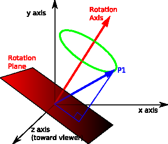
*Figura 4.11: Plano de rotacíon generado al rotar un punto P mediante un cuaterníon. Fuente:*


https: // ece. montana. edu/ seniordesign/ archive/ SP14/ UnderwaterNavigation/
Quaternions. html .

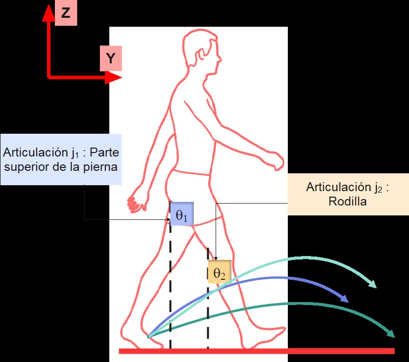
*Figura 4.12: Caminata en el espacio local del IKRig, con ángulos de rotacíon para las ar-*

ticulaciones j y j , de la cadena asociada a la pierna derecha. Fuente: https: // www.
1 2
dimensions. com/ collection/ people-walking
Considérese el caso de una animacíon con vector up Z y vector front Y como se ve en
la figura 4.12. Su plano principal de movimiento es YZ. Para poder sacar el máximo
provecho al alcance de las articulaciones j y j de la figura, es ideal que el plano de
1 2
movimiento posible de ambas articulaciones sea similar a YZ, ya que ahí es donde se


encuentran aproximadamente las posiciones objetivo en el espacio del modelo. Si ambas
articulaciones cumplen con la condición, entonces únicamente modificando los ángulos
θ y θ es posible alcanzar una gran variedad de posiciones en el plano objetivo.
1 2
Como ya se mencionó, el plano principal de movimiento es una mera simplificación,
que contiene los movimientos de la caminata de manera aproximada, por lo que es de-
seable que los ejes de rotacíon no sean perfectamente perpendiculares al plano general
de movimiento, permitiendo así algo de movimiento lateral de las piernas, lo que a su
vez brinda mayor realismo al movimiento.
En la figura 4.12 se muestran tambíen ejemplos de trayectorias posibles, en este caso
para la pierna izquierda, que son alcanzables si sus articulaciones cumplen con la con-
dición propuesta.
Es posible que haya otras formas de determinar si las articulaciones pueden ser ma-
nejadas correctamente por el sistema IK, y tambíen que este método no sea efectivo
en la totalidad de los casos, ya que la relación entre el movimiento local y global es
compleja, y depende de la interrelacíon entre las rotaciones y posiciones locales, de unas
articulaciones con otras en la jerarquía.

#### 4.10.2. Descompresión de las rotaciones
En un clip de animación, el número de timeStamps por articulacíon no es uniforme: algu-
nas articulaciones tienen más que otras. Para poder indexar las rotaciones de las articulaciones
por frame (4.4.4) de manera consistente, se requiere que todas las articulaciones tengan el
mismo número de timeStamps de rotación. Esto se hace recorriendo todos los arreglos de
timeStamps de forma paralela, e insertando cada vez el timeStamp con el valor más bajo de
entre todos los arreglos, junto con el valor interpolado de la rotación, en las articulaciones
que no posean ese timeStamp.
No es necesario descomprimir escalamientos y traslaciones, ya que al tener valores fijos se
usa solamente el primer valor del track.


Capítulo 5
Validacíon
Para validar la solucíon, se crean 3 aplicaciones simples que utilizan el sistema de nave-
gación IK. Todas pueden usarse con 2 modelos/personajes distintos, cada uno de los cuales
dispone de 4 animaciones de caminar, y una estática. En cada uno de los ejemplos, los per-
sonajes comienzan en pose estática, haciendo uso de la animación tipo IDLE, pero mediante
la tecla UP se activa la transición a la animacíon de caminar seleccionada. La tecla DOWN
puede usarse para volver a la pose idle. Los controles en los ejemplos están diseñados para
poder recorrer la escena y observarla desde distintos ángulos, y a la vez poder controlar la
orientación del personaje. Mientras el personaje se mueve, las teclas RIGHT y LEFT con-
trolan la dirección de movimiento. La posición de la cámara es manejada con las teclas W,
A, S, D, E y Q. La orientación de la cámara se controla con el movimiento del mouse, y la
velocidad con su rueda.
Para los ejemplos compilados en modo debug, se incluyen opciones para modificar el compor-
tamiento del sistema, que son las permitidas por el IKNavigationComponent, detalladas en
4.9.1. Tambíen se pueden dibujar las trayectorias objetivo de la cadera y de los end-effectors,
y las trayectorias realmente seguidas por los ee, para visualizar la tasa de éxito del ajuste
mediante IK.
Los tres ejemplos están construidos de manera similar, y demuestran la integración del sis-
tema IK en el MonaEngine a nivel de interfaz de usuario. Para utilizar el sistema, el usuario
debe simplemente agregar una instancia de IKNavigationComponent al game object que
representa su personaje, y luego agregarle las animaciones y terrenos que desee utilizar.
1. Ejemplo básico:
El primer ejemplo (figura 5.1) demuestra el uso básico, que incluye un único terreno y
un único personaje.
2. Ejemplo con múltiples terrenos:
El segundo ejemplo (figura 5.2) demuestra el uso de varios terrenos (3), cada uno
construido a partir de una funcíon de elevacíon distinta. Los terrenos son escalados y
desplazados usando los TransformComponents correspondientes.
3. Ejemplo con múltiples personajes:
El tercer ejemplo (figura 5.3) demuestra el uso de más de un personaje. Cada personaje


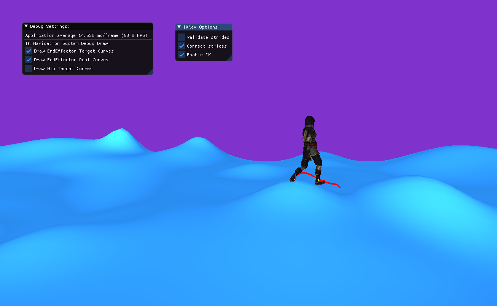
*Figura 5.1: Ejemplo con un único personaje y un único terreno.*


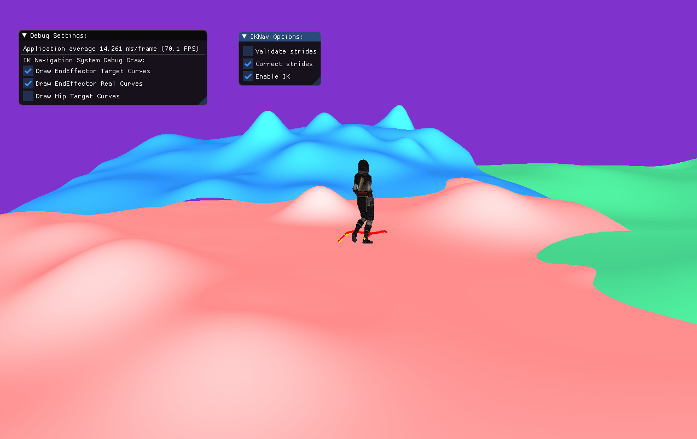
*Figura 5.2: Ejemplo con múltiples terrenos.*


está ligado a un game object distinto, y posee su propio IKNavigationComponent. Para
simplificar, ambos personajes son controlados con las mismas teclas simultáneamente.

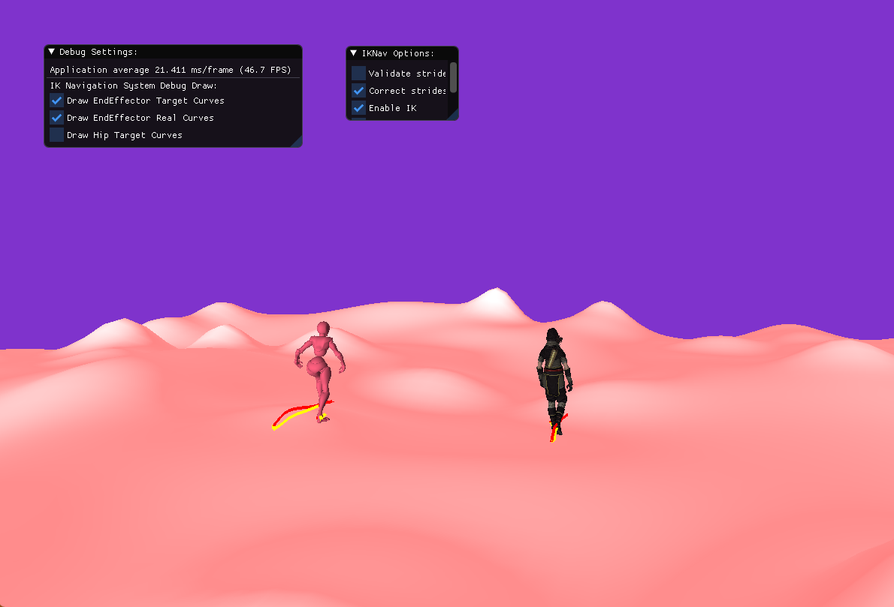
*Figura 5.3: Ejemplo con más de un personaje.*


### 5.1. Rendimiento de la solución
Uno de los objetivos más importantes planteados al comienzo del desarrollo de este tra-
bajo, fue el de lograr que las animaciones fueran adaptadas al terreno en tiempo real (1.3).
Este requisito se desprende del hecho de que se está trabajando con videojuegos, que son
aplicaciones intrínsecamente interactivas.
Para comprobar el cumplimiento de este requisito, se midieron los frames por segundo ob-
tenidos al correr el sistema con el software FRAPS, obtenido gratuitamente de https:
//fraps.com/. Las aplicaciones de ejemplo fueron ejecutadas en modo release, por alrededor
de 1 minuto cada una, en un notebook con las siguientes especificaciones de hardware:
•
Procesador: Intel(R) Core(TM) i7-9750H CPU @ 2.60GHz
•
Memoria Ram: 16gb
•
Tipo de disco duro: SSD


•
GPU: NVIDIA GeForce GTX 1660 Ti
La parte más demandante del sistema es la de llevar a los end-effectors a sus posiciones ob-
jetivo. Si las posiciones objetivo difieren mucho de las posiciones de la animacíon original, el
descenso de gradiente tarda más en converger. Por esto, se utiliza un terreno muy irregular
como el de la figura 5.3, para probar el rendimiento bajo una situación de mayor exigencia.
El terreno utilizado para todas las pruebas realizadas es el mismo.
Las animaciones se reproducen a una tasa de 30 frames por segundo. Esto es importante de
mencionar, porque el sistema IK realiza sus cálculos cada vez que se llega un nuevo frame de
la animación. Una mayor densidad de frames implica una mayor cantidad de iteraciones por
segundo en las que el sistema IK debe realizar trabajo.
Para cada prueba, se realiza una prueba preliminar bajo las mismas condiciones, pero en la
que no se realizan ajustes a las animaciones mediante cinemática inversa, ni se corrigen las
trayectorias dinámicas.
1. Prueba número 1:
Baseline: Promedio de 140fps, mínimo de 126fps, y máximo de 145fps.
La primera prueba se realiza con un único personaje, con cadenas compuestas de 3
articulaciones para las piernas. Si las cadenas ingresadas al sistema IK son más largas,
entonces el descenso de gradiente debe ajustar una mayor cantidad de articulaciones,
lo que demanda una mayor cantidad de cálculos, y dependiendo del caso, una mayor
cantidad de iteraciones para converger.
Los resultados obtenido son excelentes, con un promedio de 120fps, un mínimo de
103fps, y un máximo de 126fps.
2. Prueba número 2:
Baseline: Promedio de 140fps, mínimo de 126fps, y máximo de 145fps.
Para la segunda prueba se utiliza tambíen un único personaje, pero esta vez se incluye
una articulación adicional en cada pierna. En lugar de usar cadenas que lleguen hasta
la altura del tobillo, se llega hasta la punta del pie. Curiosamente, los resultados ob-
tenidos son aún mejores que en la prueba número 1. Esto puede deberse a que quizás
las posiciones objetivo de las trayectorias generadas para las puntas de los pies, son
inalcanzables con mayor frecuencia que en el caso de los tobillos, lo que genera que el
descenso de gradiente para el ajuste con IK se detenga más rápido. Esto es solo es-
peculación, y lamentablemente no se cuenta con otros modelos que tengan estructuras
articuladas distintas en las piernas para realizar pruebas más rigurosas.
Se obtiene un promedio de 140fps, un mínimo de 122fps, y un máximo de 145fps.
3. Prueba número 3:
Baseline: Promedio de 114fps, mínimo de 107fps, y máximo de 119fps.
La tercera prueba se realiza con dos personajes (y con el largo usual de las cadenas,
llegando hasta el tobillo). Considerando el caso base, nuevamente se obtienen resultados
muy favorables, con un promedio de 112 fps, un mínimo de 104fps, y un máximo de
115fps.


Descripcíon de la prueba Milisegundos por Milisegundos por
frame (baseline) frame (con IK)
´
Unico personaje y único terreno 7.14 8.3
´
Unico personaje considerando 7.14 8.19
una articulación adicional por
pierna
Múltiples personajes (2) 8.77 8.92
Tabla 5.1: Resumen del rendimiento promedio de la solucíon. Milisegundos por frame para
cada ejemplo de prueba.
La tabla 5.1 presenta un resumen de los resultados anteriores en milisegundos por frame (sólo
valores promedio).

### 5.2. Percepcíon de los usuarios
Se construye un pequeño cuestionario para medir la percepcíon subjetiva de los usuarios
sobre las animaciones generadas por el sistema de navegación IK. Se reúne opiniones de
personas ligadas al mundo de los videojuegos, ya sea en capacidad de jugadores frecuentes, o
de desarrolladores. Se escoge a este tipo de personas por su familiaridad con las animaciones
comúnmente presentes en los juegos. Si se ha sido un jugador de videojuegos 3d frecuente,
es muy probable que se tenga un ojo más crítico con lo que respecta a la calidad de los
recursos usados para crear el mundo del juego, y se tenga por lo tanto, una capacidad más
desarrollada para comparar y juzgar distintas animaciones. El número total de encuestados
es 7, que, aunque no es un número muy alto, se considera suficiente para dar una impresión
válida de la calidad de los resultados. La justificación para lo anterior es que se pide evaluar
algo que requiere de una percepción muy básica y directa. Al preguntar por el realismo de
un movimiento tan común como lo es el caminar, no se espera una gran variabilidad en las
opiniones. Fuera de lo que puede darse por haber distintos niveles de exigencia en el juicio,
no debería necesitarse encuestar a un número muy alto de personas para lograr una noción
básica del cumplimiento de los objetivos.
Se solicita a los usuarios comparar dos ejemplos, uno que presenta una animacíon de caminar
ajustada al terreno con cinemática inversa, y otro que presenta la misma animacíon pero
sin ajustar. Ambos ejemplos se crean a partir del ejemplo básico de la figura 5.1, pero se
remueve la animacíon tipo IDLE, para que el personaje camine automáticamente al iniciar
la aplicación. Además, las aplicaciones de prueba se entregan compiladas en modo release,
ya que esto genera una notoria mejora de rendimiento general.
Como evaluación principal, se mide la percepción de los usuarios en torno a dos criterios, que
buscan, en conjunto, probar el debido cumplimiento del objetivo 3, planteado en la sección
de objetivos específicos para esta memoria (1.3). El primer criterio, es el de la preservación
de la esencia de la animación original en la animacíon modificada. El segundo, es el de el
realismo de las animaciones resultantes, en cuánto a su adaptabilidad a un terreno irregular.
En las tablas 5.2 y 5.3, se presenta la rúbrica con los resultados, donde en cada casilla se


Criterio 1: La animacíon en el ejemplo con cinemática inversa preserva la
esencia de la animación original.
Estoy totalmente en desacuerdo, la animación modifica- 0
da no tiene ninguna relación con la original
Estoy ligeramente de acuerdo, puedo ver muy pocas ca- 0
racterísticas de la animacíon original en la modificada
Estoy de acuerdo, puedo darme cuenta de que ambas 2
animaciones son de un tipo similar
Estoy muy de acuerdo, puedo ver claramente que la ani- 5
mación modificada está basada en la original
Tabla 5.2: Percepcíon de los usuarios sobre la preservacíon de la esencia de la animacíon
original.
Criterio 2: Los movimientos de la animacíon ajustada con cinemática inversa
dan una sensacíon suficientemente realista de una caminata en un terreno
irregular.
Estoy totalmente en desacuerdo, puedo ver que es una 0
caminata, pero se ajusta pésimamente al terreno
Estoy ligeramente de acuerdo, puedo ver que sólo en 1
algunos momentos la caminata se ajusta bien al terreno
Estoy de acuerdo, aunque no es totalmente realista, me 6
parece que es una animacíon creíble
Estoy muy de acuerdo, la animación ajustada simula 0
perfectamente una caminata en un terreno irregular
Tabla 5.3: Percepcíon de los usuarios sobre la calidad de la adaptacíon al terreno conseguida.
indica el número de personas que escogieron esa opcíon como respuesta.
Adicionalmente, se pregunta sobre la utilidad percibida de la aplicación de IK a los video-
juegos, y sobre qúe mejoras son las que requiere principalmente esta solucíon. A continuación
se presenta un resumen general de las respuestas entregadas:
1. ¿Pudiste notar claramente la diferencia entre ambos ejemplos?
La diferencia resulta notoria, especialmente cuando el personaje se acerca a zonas muy
irregulares del terreno. En esos momentos las piernas del personaje atraviesan el terreno
cuando el sistema IK no está activado.
2. ¿Consideras que el uso de esta técnica puede añadir más realismo y disfrutabilidad a
los videojuegos?
La respuesta es sí. Se enfatiza la importancia de mantener la verosimilitud en los juegos
para que las emociones generadas sean más fuertes. El uso de cinemática inversa permite
lograr mejores interacciones entre los personajes y su entorno, y evitar situaciones que


rompan la credibilidad del mundo del juego, y por lo tanto, la conexión jugador-juego.
3. De los problemas que pudiste percibir en el ejemplo con IK (si es que consideras que
los hay), ¿qúe consideras prioritario mejorar?
El problema más mencionado es el de la falta de ajuste de los pies al terreno. La solución
presentada en este informe sólo se encarga de llevar las piernas a una altura adecuada,
pero el ajuste preciso de los pies no está incluido.
Por otro lado, se menciona el hecho de que el comportamiento del personaje es poco
dinámico al recorrer superficies con inclinaciones diferentes. Por ejemplo, podría es-
perarse que el personaje balanceara su cuerpo de una manera distinta para denotar
cansancio al subir una pendiente con mayor inclinacíon.
Tambíen se hace notar que para ciertas pendientes, las piernas, aunque se ajustan al
terreno, no lo hacen de una forma realmente adecuada.


Capítulo 6

## Conclusiones
Se créo un nuevo componente para el MonaEngine, llamado IKNavigationComponent,
que puede ser agregado a un game object que represente a un personaje animado, para mo-
dificar sus animaciones estáticas y de caminar, y adaptarlas a un terreno irregular mediante
cinemática inversa.
Para realizar los cálculos de cinemática inversa se escogió el método de descenso de gra-
diente, seleccionado de entre los métodos numéricos presentados en la sección 3.1.2. Usando
únicamente este método, se logró simultáneamente ajustar los valores de rotación de las
articulaciones objetivo según tres criterios distintos:
1. El primer criterio, y el más importante, es el de lograr cercanía entre los end-effectors
y sus posiciones objetivo (definidas por las trayectorias objetivo creadas por la clase
TrajectoryGenerator).
2. En segundo lugar, los valores de rotación deben mantener cierta similitud con los de la
animación original.
3. Por último, para mantener la cohesión temporal, se requiere que los valores generados
para dos frames consecutivos no difieran demasiado.
El uso de este método permitió simplificar la solucíon, evitando tener que mezclar algún
sistema de los presentados en 3.1.2 (que en general solo están enfocados en llevar a los ee
a posiciones objetivo), con elementos adicionales que facilitaran crear animaciones estables,
y parecidas a las originales. El método del descenso de gradiente permitío estructurar los
cálculos de cinemática inversa de forma más ordenada y compacta.
Para que las posiciones generadas para los end-effectors estuvieran contenidas en trayectorias
similares a las originales, se desarrolló un sistema que creara nuevas trayectorias, adaptadas a
la elevacíon del terreno, pero haciendo uso de las trayectorias originales para ello. Este méto-
do, además de asegurar la creación de trayectorias consistentes con la animación original, dio
lugar a la identificacíon y separación de las partes clave de la caminata. La trayectoria com-
pleta de cada tobillo, fue dividida en subtrayectorias estáticas y dinámicas, que representan
momentos de apoyo de los pies, y momentos de desplazamiento significativo respectivamente.
La divisíon en subtrayectorias facilitó el adaptar los movimientos al terreno, aplicándose la


idea de que el comienzo y final de ambos tipos de trayectoria representan momentos en los
que el pie está apoyado, por lo que tiene sentido adaptar la curva al terreno simplemente
cambiando las alturas de los extremos para que calcen con el piso. Esta subdivisión tambíen
facilitó la validación preventiva de las trayectorias generadas, al estar un paso completo de
la caminata encapsulado en una trayectoria dinámica. Para comprobar si un paso que se va
a dar a continuación es válido o no, simplemente se revisa si la trayectoria dinámica genera-
da presenta un cambio de elevacíon demasiado grande. En otras palabras, si el pie va a ser
levantado de manera excesiva, puede determinarse que la trayectoria es inválida.

### 6.1. Valoracíon de los resultados
El rendimiento logrado por el sistema en cuánto a frames por segundo superó las expecta-
tivas, corriendo fácilmente en tiempo real para uno y dos personajes (5.1). Faltó comprobar
el verdadero efecto en el rendimiento de agregar una o más articulaciones adicionales a las
piernas, pero no se espera que el cambio sea demasiado grande.
En cuanto a la calidad de las animaciones generadas, se logró un nivel en torno a lo esperado.
El sistema genera animaciones para nada perfectas, pero que sí demuestran un claro uso de
las articulaciones de las piernas del personaje para mejorar la interacción de la animación
original y el terreno. Además, se logra mantener la esencia de la animación original. Estas
aseveraciones son respaldadas por las respuestas entregadas por los usuarios de prueba en la
sección 5.2.
El sistema puede catalogarse como un mínimo viable, en cuanto a que entrega una base sólida,
estructural y cualitativamente. Si se exploran con detenimiento las aplicaciones de ejemplo,
podrán notarse ciertas discontinuidades en el movimiento, y momentos en las trayectorias
objetivo no son seguidas con precisíon (figura 6.1). Por ejemplo la transicíon entre anima-
ciones IDLE y WALKING, donde la posición de la cadera durante la transicíon es generada
con un promedio simple, no siempre logra realizarse con la suavidad deseada.
El hecho de que a veces no se sigan las trayectorias objetivo con precisíon tiene dos causas
principales: en primer lugar, debe considerarse que son tres los requisitos a ser cumplidos
simultáneamente por los ángulos de rotación al ser generados por el descenso de gradiente.
Estos requisitos, muchas veces se oponen entre si, lográndose valores que cumplen los distin-
tos requisitos a medias. Por ejemplo, hay casos en que la nueva posicíon para el end-effector
requiere un cambio demasiado brusco desde la posicíon actual, lo que va en contra del tercer
requisito planteado para el descenso, que busca mantener la estabilidad de la animacíon. Eso
puede generar que la posicíon final generada, esté a medio camino entre la posición objetivo
y la posicíon actual, por ejemplo. La segunda causa principal de que las trayectorias no sean
seguidas correctamente, está relacionada con los ejes de rotacíon de la animacíon, que como
se explica en el cuarto punto de la sección de validacíon de animaciones (4.10.1), determinan
qúe posiciones son alcanzables por los end-effectors al modificar los ángulos. Puede que en un
frame dado, los ejes de rotacíon de las articulaciones de una cadena no sean lo suficientemente
adecuados para que el objetivo se alcance con precisión. Este seguimiento incorrecto de la
trayectoria, es tambíen parte de la razón de por qúe los pies se entierran en el piso (pregunta
3 en sección 5.2), cómo se ve en la figura 6.2.


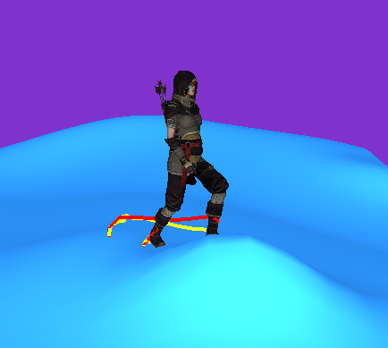
*Figura 6.1: Ejemplo en que no se logra seguir la trayectoria objetivo (curva roja). La curva*

amarilla es el movimiento real del end-effector.

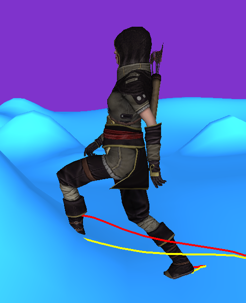
*Figura 6.2: Ejemplo en que los pies del personaje se entierran en el suelo.*

La solución fue implementada siguiendo una estructura similar a la de los sistemas ya exis-
tentes del MonaEngine. En particular, se siguío una estructura tipo Sistema → Componente
→ Controlador → Clase principal, que es la misma estructura con la que fue implementado el
sistema de animación [10]. El haber usado el concepto de componente en la implementacíon
de la solucíon, generó de forma natural una interfaz de usuario similar al resto de los siste-
mas del motor, ya que a pesar de que las funcionalidades provistas son diferentes, la forma
de acceder a ellas se mantiene. Esto da una sensación de insercíon apropiada por parte del
sistema de navegacíon IK en el motor, y demuestra un buen cumplimiento del objetivo 4.


### 6.2. Reflexiones
Generar buenas soluciones en el campo de la animacíon no es una tarea fácil, y demanda
una gran cantidad de trabajo a nivel de los detalles, pues el ojo es siempre exigente. Lograr
movimientos consistentes, verosímiles y que transmitan la personalidad de una criatura, sea
humana o no, requiere considerar un gran número de factores. Más allá de que un algoritmo
de cinemática inversa lleve a los end-effectors a sus objetivos, la tarea más difícil e impor-
tante, es seleccionar cúales son esos objetivos, y cómo se ve el proceso de llegar a ellos. La
personalidad de una animacíon está en sus detalles, y en cada pequeño movimiento realizado
por cada articulación. Si se quiere crear un movimiento realmente verosímil, el algoritmo de
cinemática inversa debe ser regulado profundamente, o “saber” muy bien cuál es el movi-
miento que se está realizando, y qúe o quíen está realizando ese movimiento.
La solucíon presentada en este informe, al basarse en una única animación a la vez para re-
presentar un movimiento, tiene dificultades para adaptarse bien a todas las condiciones, pues
la información de base que utiliza es limitada. Para generar movimientos con un dinamismo
real, una opcíon es tener acceso a varios tipos de movimientos/caminatas, y combinarlos
según sea necesario. En otro caso, deben modelarse con cuidado reglas para que los cambios
aplicados a la animación se ajusten aún mejor a cada situacíon. El sistema de navegación IK
puede llamarse un primer paso hacia la generacíon de una animacíon de caminata dinámica.
Se logra el ajuste grueso, en que el personaje utiliza sus piernas para adaptarse al terreno a
un nivel básico, y lo hace respetando las cualidades del movimiento original, pero una adap-
tabilidad verdadera requiere un trabajo mayor.
En el proceso de desarrollar esta memoria, se cometieron varios errores, y al mismo tiempo
hubo mucho aprendizaje. Una lección destacable, fue la de que es mucho más razonable no
tratar desde el principio de que cada subsistema tenga un alcance demasiado amplio en sus
capacidades. En otras palabras, no caer en el empuje de querer solucionarlo todo antes de
tener algo que funcione. Se hace presente la importancia de avanzar de a poco, con un diseño
limpio, que permita el crecimiento posterior. Muchas partes de este trabajo comenzaron con
objetivos mucho más ambiciosos de los que se presentan en la solución final, pero no fue
posible llevarlos a un estado de completitud suficiente en todos esos aspectos, y tuvieron que
eliminarse varias secciones de código que originalmente demandaron muchas horas de traba-
jo. Avanzar de manera pausada y paciente, puede evitar invertir horas en trozos de código
que terminarán sin ser usados.
Un error algo más concreto, fue el de hacer una suposición con respecto a los clips de anima-
ción. En un comienzo, se pensó que el requisito 4, planteado en la sección de validación de
animaciones (4.10.1) sería cumplido siempre, porque se asumió que dado que el movimiento
de las piernas ocurre en el plano principal de movimiento (4.10.1), entonces necesariamen-
te las rotaciones locales deberían tener ejes de rotacíon con cierta perpendicularidad a ese
plano, para que el movimiento fuera posible. Lamentablemente, las interacciones entre ro-
taciones y traslaciones locales en la jerarquía dan lugar a mucha variabilidad en cuanto a
los ejes de rotacíon, y esa suposición no generaliza bien. Este descubrimiento fue hecho más
bien tarde en el desarrollo, y no hubo tiempo de generar una solución adecuada, que per-
mitiera corregir animaciones que no cumplieran con el requisito, por lo que en la situacíon
actual, sólo ciertas animaciones pueden ser usadas directamente con resultados óptimos en
el sistema IK. De esto se desprende la importancia de hacer un estudio más riguroso de
las características de los recursos que usará un sistema, antes de adentrarse demasiado en


la implementación, para prevenir problemas como éste, que pueden llegar a ser mucho peores.

### 6.3. Trabajo futuro
Este sistema, aunque tiene varias cualidades positivas, tiene mucho espacio para mejorar.
En primer lugar, sería un gran aporte al sistema, incluir una herramienta para procesar las
instancias de SkinnedMesh, Skeleton y AnimationClip para permitir el cumplimiento del re-
quisito 4, y así poder utilizar libremente cualquier animacíon de caminata. Puede que sea
posible resolver este problema modificando únicamente el clip de animación, pero todo apun-
ta a que es necesario reajustar los valores de traslacíon local en conjunto con los de rotación,
lo que significa que la modificación tambíen debe ser hecha en SkinnedMesh y Skeleton para
evitar deformaciones en la animación final. Al igual que la correccíon de orientacíon, que debe
ser hecha por el usuario antes de agregar la animacíon al IKNavigationComponent (4.9.1),
esta sería una responsabilidad asignada al usuario. Esto, porque considerando que los mis-
mos recursos pueden ser usados por múltiples IKNavigationComponents, podría generarse
desorden y/o confusión por la posibilidad de que la corrección sea realizada más de una vez
innecesariamente. Además, el sistema en su estado actual sólo interactúa con el esqueleto y
los clips de animacíon, por lo que tendría que incluirse una interaccíon extra con la clase
SkinnedMesh.
La segunda mejora clave, según lo opinado por los usuarios de prueba (5.2), sería la de co-
rregir la interacción de los pies con el piso (figura 6.2), reorientándolos correctamente para
que no lo atraviesen. Además de solucionar el problema de la orientación, queda tambíen
el mejorar la precisíon de seguimiento de las trayectorias objetivo. Solucionando esos dos
problemas, debería obtenerse un posicionamiento más adecuado de los pies.
Lo siguiente, que ya es algo más abierto, sería lograr un mayor dinamismo de los movimientos
con alguna de las alternativas planteadas en 6.2. La opción de establecer reglas, que guíen
el comportamiento de la animacíon a un nivel más fino parece óptima, ya que permitiría
mantener el uso de una única animación base. Nuevamente, esta idea se extrae de la charla
de Alexander Bereznyak en la GDC 2016 [4].
Un punto que recae dentro de los elementos que se trabajaron pero que finalmente fueron
descartados, es el de utilizar restricciones para los ángulos de las rotaciones generados. Usar
restricciones puede evitar que se generen movimientos imposibles (como flectar las rodillas de
forma invertida), y podría ser una adición valiosa al sistema. En este caso, decidío no incluir-
se, porque el hecho de mantener constantemente un parecido entre la animacíon generada y
la animación original parece evitar que se generen poses extremas de ese tipo. En el estado
en que estaba, pareció más sensato no incluir la aplicación de restricciones de movimiento,
porque no parecía aportar lo suficiente. De todas maneras, si este sistema llega ampliarse,
sería sensato tener esta característica en consideración, para que la calidad de las animaciones
generadas sea más robusta.
Para guiar el proceso de crecimiento del sistema, sería tambíen importante estudiar al-
gunos ámbitos de este con mayor profundidad, para lograr comprender mejor sus defectos y
sus límites. Primero, debería estudiarse en detalle en qúe momentos se producen las fallas


más grandes al seguir las curvas objetivo, y establecer con precisión las causas, para separar
los problemas corregibles de los que se deben a la naturaleza del sistema. En relación a lo
anterior, podrían generarse visualizaciones en dos dimensiones de las trayectorias objetivo y
las trayectorias realmente seguidas por los end-effectors, superponíendolas para ver directa-
mente los errores existentes.
Tambíen sería útil medir el tiempo promedio de ejecucíon de cada uno de los subsistemas
de la solución, para incluir posibles optimizaciones de manera dirigida, especialmente si se
quiere llevar al sistema a un punto de exigencia mayor (e.g. al usar decenas de personajes de
manera simultánea).
Asimismo, queda pendiente comparar de manera explícita, el enfoque de generación de tra-
yectorias utilizado en este sistema, con otros enfoques que tambíen solucionen el problema
de locomoción bípeda en terrenos irregulares, para así lograr una noción más clara de las
virtudes y defectos de la solución presentada en esta memoria en un contexto más amplio.
Se recalca que en un sistema que genera resultados a nivel visual como este, siempre queda
trabajo por hacer.


## Bibliografía
[1] Andreas Aristidou and Joan Lasenby. Inverse kinematics: a review of existing techniques
and introduction of a new fast iterative solver. Technical report, Cambridge University,
Engineering Department, 2009.
[2] Andreas Aristidou and Joan Lasenby. Inverse kinematics techniques in computer
graphics: A survey. Technical report, Cambridge University, Engineering Department,
2017.
[3] Andreas Aristidou and Joan Lasenby. Inverse kinematics techniques in computer
graphics: A survey. Technical report, Cambridge University, Engineering Department,
2017. págs. 1-4.
[4] Alexander Bereznyak. Ik rig: Procedural pose animation. Ubisoft, GDC, 2016.
[5] Edwin K.P. Chong. An Introduction to Optimization. John Wiley Sons, Inc., 2013.
págs. 131-153.
[6] Byron Cornejo. Motor de videojuegos 3d básico para fines pedagógicos. Universidad de
Chile, 2021. págs. 61-62.
[7] Byron Cornejo. Motor de videojuegos 3d básico para fines pedagógicos. Universidad de
Chile, 2021.
[8] Byron Cornejo. Motor de videojuegos 3d básico para fines pedagógicos. Universidad de
Chile, 2021. págs. 64-73.
[9] Byron Cornejo. Motor de videojuegos 3d básico para fines pedagógicos. Universidad de
Chile, 2021. págs. 83-96.
[10] Byron Cornejo. Motor de videojuegos 3d básico para fines pedagógicos. Universidad de
Chile, 2021. págs. 96-106.
[11] Adrian-Vasile Duka. Neural network based inverse kinematics solution for trajectory
tracking of a robotic arm. In Procedia Technology, volume 12, 2014. págs. 20-27.
[12] Amar Dum. Design of control system for articulated robot using leap motion sensor.
Technical report, Shivaji University, Kolhapur, 2016.
[13] Michael Garland and Paul S. Heckbert. Fast polygonal approximation of terrains and
height fields. Technical report, School of Computer Science, Carnegie Mellon University,
1995.


[14] Jason Gregory. Game Engine Architecture. A K Peters/CRC Press, 2015. págs. 181-200.
[15] Jason Gregory. Game Engine Architecture. A K Peters/CRC Press, 2015. págs. 200-209.
[16] Jason Gregory. Game Engine Architecture. A K Peters/CRC Press, 2015. págs. 548-551.
[17] Kris Hauser and Intelligent Motion Laboratory. Section ii. modeling, chapter 6. inverse
kinematics, 2018.
[18] Daniel Holden and Taku Komura. Phase-functioned neural networks for character con-
trol. In ACM Transactions on Graphics, volume 36, 2017.
[19] Michael Richard Isaacs. Partitioning The Mechanical Cost Of Human Walking: Unvei-
ling Cost Asymmetries For Bionic Technologies. PhD thesis, University of Nevada, Las
Vegas, 2020.
[20] Rune Skovbo Johansen. Automated semi-procedural animation for character locomotion.
Master’s thesis, Department of Information and Media Studies, Aarhus University, 2009.
[21] Jim Lambers. Linear interpolating splines. The University of Southern Mississippi,
School of Mathematics and Natural Sciences, 2010. págs. 1-3.
[22] MathWorks. Row-major and column-major array layouts.
[23] Xue Bin Peng and Glen Berseth. Deeploco: Dynamic locomotion skills using hierarchical
deep reinforcement learning. In ACM Transactions on Graphics, volume 36, 2017.
[24] Department Of Physics. Three-dimensional rotation matrices. University of California,
Santa Cruz, 2012. págs. 4-5.
[25] Hyun Joon Shin and Jehee Lee. Computer puppetry: An importance-based approach.
Technical report, Korea Advanced Institute of Science Technology, 2001. págs. 67-94.
[26] He Zhang and Sebastian Starke. Mode-adaptive neural networks for quadruped motion
control. In ACM Transactions on Graphics, volume 37, 2018.


Anexos


Anexo A

### A.1. Diagrama UML
IKNavigationSystem

EETrajectory
*
*
IKNavigationComponent


EEGlobalTrajectoryData HipGlobalTrajectoryData

1 1
2 1 IKRigController AnimationValidator

1 1 1
Skeleton
* * 1 *
IKAnimation IKRig
* 1

AnimationClip
2 1 1


StaticMesh game
IKChain ForwardKinematics InverseKinematics TrajectoryGenerator
object

1 1 1 *
1 1 1


*
GradientDescent StrideCorrector E nvironmentData
Figura A.1: Diagrama UML básico de la solucíon.


### A.2. Diagrama de flujo
Se presenta en la figura A.2 el diagrama de flujo básico del sistema, que muestra los pasos
seguidos en cada iteración del motor. Notar que el sistema de navegación IK es actualizado
antes que el sistema de animación. De esta forma, para cada animationTime, el sistema de
animación extrae de los clips de animacíon las transformaciones de las articulaciones luego
de que ya han sido modificadas por el sistema de navegación IK.
Inicialización de los
Actualización de inputs y del
sistemas e inicio del loop
sistema de física y colisiones
principal del motor
Actualización del sistema de navegación IK
Actualización de IKRigControllers
Actualización del IKRig
Actualización de la Actualización del
Actualización del tiempo
dirección global de estado de activación
de las IKAnimations
movimiento de las IKAnimations
Actualización de los clips
Actualización de la
Actualización de las de animación según las
transformación global
trayectorias objetivo trayectorias objetivo
del IKRig
Actualización del
sistema de animación
Actualización de otros
sistemas
Figura A.2: Diagrama de flujo básico de la solucíon.


Anexo B

### B.1. Matriz de rotacíon en funcíon de un ángulo y eje
arbitrarios
De [24] se extrae la ecuación para una matriz de 3x3, donde $\vec{a} = (a_0, a_1, a_2)$ es el eje de rotación y $\theta$ el ángulo:

$$R(\theta,\vec{a}) = \begin{pmatrix} \cos\theta + a_0^2(1-\cos\theta) & a_0 a_1(1-\cos\theta) - a_2\sin\theta & a_0 a_2(1-\cos\theta) + a_1\sin\theta \\ a_1 a_0(1-\cos\theta) + a_2\sin\theta & \cos\theta + a_1^2(1-\cos\theta) & a_1 a_2(1-\cos\theta) - a_0\sin\theta \\ a_2 a_0(1-\cos\theta) - a_1\sin\theta & a_2 a_1(1-\cos\theta) + a_0\sin\theta & \cos\theta + a_2^2(1-\cos\theta) \end{pmatrix}$$

Expandiendo a 4x4 y derivando con respecto a $\theta$:

$$\frac{\partial R(\theta,\vec{a})}{\partial\theta} = \begin{pmatrix} -\sin\theta + a_0^2\sin\theta & a_0 a_1\sin\theta - a_2\cos\theta & a_0 a_2\sin\theta + a_1\cos\theta & 0 \\ a_1 a_0\sin\theta + a_2\cos\theta & -\sin\theta + a_1^2\sin\theta & a_1 a_2\sin\theta - a_0\cos\theta & 0 \\ a_2 a_0\sin\theta - a_1\cos\theta & a_2 a_1\sin\theta + a_0\cos\theta & -\sin\theta + a_2^2\sin\theta & 0 \\ 0 & 0 & 0 & 0 \end{pmatrix}$$

### B.2. Enlace al repositorio de la solucíon
El trabajo presentado en este informe se encuentra en el siguiente enlace: https://
github.com/agumatt/MonaEngine_IK.
