# Motor de Videojuegos 3D Básico para Fines Pedagógicos

UNIVERSIDAD DE CHILE  
FACULTAD DE CIENCIAS FÍSICAS Y MATEMÁTICAS  
DEPARTAMENTO DE CIENCIAS DE LA COMPUTACIÓN  
MOTOR DE VIDEOJUEGOS 3D BÁSICO PARA FINES PEDAGÓGICOS  
MEMORIA PARA OPTAR AL TÍTULO DE  
INGENIERO CIVIL EN COMPUTACIÓN  
BYRON AARON CORNEJO BERLAND  
PROFESOR GUÍA:  
DANIEL CALDERÓN SAAVEDRA  
MIEMBROS DE LA COMISIÓN:  
IVÁN SIPIRAN MENDOZA  
JOSÉ URZÚA REINOSO  
SANTIAGO DE CHILE  
2021  


---

## Resumen


Hoy en día el interés en los videojuegos es innegable, ejemplo de esto a nivel local son
la comunidad de desarrollo de videojuegos en u-cursos con alrededor de 300 integrantes y
el reciente ramo Taller de Diseño y Desarrollo de Videojuegos con alrededor de 65 personas
tomándolo. Es bajo este contexto que desarrollar un motor de videojuegos, el cual apoyará
el aprendizaje de un curso de arquitectura de motores de videojuegos, que el Profesor Daniel
Calderón planea dictar, se vuelve un tema relevante.
Dentro del curso a dictar tener este motor serviría, por ejemplo, para tener fragmentos de
códigodeunsistemasimplesinbarrerasdeentradatangrandescomomotoresyaestablecidos.
Enseñaryfacilitarelaprendizajesobremotoresgráficosesrelevante,yaqueenprimerlugarsi
biensiempreexistelaopcióndeusarmotoresyadisponibles,conocersobresufuncionamiento
interno, o entender el razonamiento bajo el diseño de ellos facilita el aprendizaje sobre cómo
usarlos. En otras palabras, conocer sobre motores de videojuegos, es similar al conocimiento
de sistemas operativos para desarrollar aplicaciones de sistemas.
El motor desarrollado es uno básico, de código abierto, multiplataforma y escrito en el
lenguaje C++, el cual cuenta con los siguientes sistemas: un sistema de renderizado, un
sistema de audio, un sistema de física y colisiones, un sistema de animación, un sistema de
eventos y un modelo de las entidades que existen dentro del mundo simulado típicamente
llamados game objects. Cada uno de estos sistemas no es de alta complejidad, pero de todos
modos permite ilustrar la arquitectura típica de un motor compuestos por estos.
El sistema de renderizado permite renderizar mallas estáticas y animadas, además imple-
menta múltiples modelos de iluminación de distinta complejidad. El sistema de animación
soporta una basada en esqueletos y transiciones suaves entre diferentes animaciones. El sis-
tema de física simula múltiples cuerpos rígidos y permite hacer consultas de tipo raycast. El
sistema de audio permite reproducir múltiples sonidos, los cuales pueden ser espacializados.
Finalmente, el motor posee un modelo de game objects basado en componentes.
Para demostrar el correcto funcionamiento de la solución desarrollada, se implementaron
exitosamente dos ejemplos que hacen uso de las distintas características soportadas por los
sistemas del motor. Estos ejemplos consistieron en un clon del juego clásico Breakout y una
aplicación donde el movimiento de un personaje animado es controlado con el mouse.
Como trabajo futuro destacan el añadir las siguientes características al motor: sombras
al sistema de renderizado, simulación del entorno acústico al sistema de audio, métodos de
interpolación más complejos al sistema de animación, compresión de datos a este mismo
sistema y simulación de ragdolls al sistema de física.
i


---


*Para mi madre y padre,
sin quienes esto no hubiera sido posible.*


---

## Agradecimientos


Primero, quiero agradecer a mi profesor guía Daniel Calderon, por el apoyo durante el
desarrollo de este trabajo de título y las gratas reuniones que tuvimos durante este periodo.
En segundo lugar, quiero agradecer a mis amigos formados durante el periodo universitario
por los momentos compartidos durante mi estadía en esta universidad. Y más importante,
quiero agradecer a mi familia, y en especial a mi madre y padre, por criarme y brindarme
apoyo incondicional por todos estos años.


---

## Tabla de Contenido

```

1. Introducción 1
1.1. Contexto, Problema y Relevancia . . . . . . . . . . . . . . . . . . . . . . . . 1
1.2. Objetivos . . . . . . . . . . . . . . . . . . . . . . . . . . . . . . . . . . . . . 2
1.2.1. Objetivos Específicos . . . . . . . . . . . . . . . . . . . . . . . . . . . 2
1.2.1.1. Objetivos relacionados a requerimientos de software . . . . . 2
1.2.1.2. Objetivo pedagógico . . . . . . . . . . . . . . . . . . . . . . 3
1.3. Metodología . . . . . . . . . . . . . . . . . . . . . . . . . . . . . . . . . . . . 3
1.4. Descripción general de la solución . . . . . . . . . . . . . . . . . . . . . . . . 3
1.5. Contenidos . . . . . . . . . . . . . . . . . . . . . . . . . . . . . . . . . . . . . 4
2. Estado del Arte 5
2.1. Modelo de Game Objects . . . . . . . . . . . . . . . . . . . . . . . . . . . . . 5
2.1.1. Tipos de modelo de Game Objects . . . . . . . . . . . . . . . . . . . . 6
2.1.2. Modelos centrados en objetos . . . . . . . . . . . . . . . . . . . . . . 6
2.1.3. El caso de Unity y Unreal . . . . . . . . . . . . . . . . . . . . . . . . 8
2.2. Audio . . . . . . . . . . . . . . . . . . . . . . . . . . . . . . . . . . . . . . . 9
2.2.1. Modelado del entorno acústico . . . . . . . . . . . . . . . . . . . . . . 10
2.2.2. Tareas del sistema de audio . . . . . . . . . . . . . . . . . . . . . . . 12
2.2.3. Arquitectura del sistema de audio . . . . . . . . . . . . . . . . . . . . 14
2.2.4. Bibliotecas de audio . . . . . . . . . . . . . . . . . . . . . . . . . . . 15
2.3. Renderizado 3D . . . . . . . . . . . . . . . . . . . . . . . . . . . . . . . . . . 16
2.3.1. Mallas geométricas o Meshes . . . . . . . . . . . . . . . . . . . . . . . 16
2.3.2. Transformaciones . . . . . . . . . . . . . . . . . . . . . . . . . . . . . 19
2.3.3. Sistemas de coordenadas . . . . . . . . . . . . . . . . . . . . . . . . . 22
2.3.4. Cámara virtual . . . . . . . . . . . . . . . . . . . . . . . . . . . . . . 24
2.3.5. Texturas . . . . . . . . . . . . . . . . . . . . . . . . . . . . . . . . . . 26
2.3.6. Fuentes de luz . . . . . . . . . . . . . . . . . . . . . . . . . . . . . . . 30
2.3.6.1. Luces direccionales . . . . . . . . . . . . . . . . . . . . . . . 30
2.3.6.2. Luces puntuales y de tipo spotlight . . . . . . . . . . . . . . 30
2.3.7. Modelos de Iluminación . . . . . . . . . . . . . . . . . . . . . . . . . 34
2.3.7.1. Reflexión Difusa . . . . . . . . . . . . . . . . . . . . . . . . 36
2.3.7.2. Reflexión Especular . . . . . . . . . . . . . . . . . . . . . . 37
2.3.7.3. Cook-Torrance . . . . . . . . . . . . . . . . . . . . . . . . . 38
2.3.7.4. Materiales . . . . . . . . . . . . . . . . . . . . . . . . . . . . 40
2.3.8. Pipeline de renderizado . . . . . . . . . . . . . . . . . . . . . . . . . . 40
2.3.9. OpenGL . . . . . . . . . . . . . . . . . . . . . . . . . . . . . . . . . . 44
2.4. Animación . . . . . . . . . . . . . . . . . . . . . . . . . . . . . . . . . . . . . 45

2.4.1. Esqueletos . . . . . . . . . . . . . . . . . . . . . . . . . . . . . . . . . 47
2.4.2. Mallas para animación basada en esqueletos . . . . . . . . . . . . . . 48
2.4.3. Poses . . . . . . . . . . . . . . . . . . . . . . . . . . . . . . . . . . . . 49
2.4.4. Clips de Animación . . . . . . . . . . . . . . . . . . . . . . . . . . . . 51
2.4.5. Skinning . . . . . . . . . . . . . . . . . . . . . . . . . . . . . . . . . . 52
2.4.6. Relación entre Esqueletos, Mallas, Poses y Clips . . . . . . . . . . . . 53
2.4.7. Blending . . . . . . . . . . . . . . . . . . . . . . . . . . . . . . . . . . 54
2.4.7.1. Interpolación lineal . . . . . . . . . . . . . . . . . . . . . . . 54
2.4.8. Pipeline . . . . . . . . . . . . . . . . . . . . . . . . . . . . . . . . . . 55
2.5. Sistema de Colisiones . . . . . . . . . . . . . . . . . . . . . . . . . . . . . . . 56
2.5.1. Detección de Colisiones . . . . . . . . . . . . . . . . . . . . . . . . . . 57
2.5.2. Resolución de colisiones . . . . . . . . . . . . . . . . . . . . . . . . . 59
2.5.3. Eventos de colisiones . . . . . . . . . . . . . . . . . . . . . . . . . . . 59
2.5.4. Colisiones en Unreal y Unity . . . . . . . . . . . . . . . . . . . . . . . 59
2.5.5. Bibliotecas de física/colisiones . . . . . . . . . . . . . . . . . . . . . . 60
3. Solución 61
3.1. Arquitectura de la Solución . . . . . . . . . . . . . . . . . . . . . . . . . . . 61
3.2. Sistemas Core del motor . . . . . . . . . . . . . . . . . . . . . . . . . . . . . 63
3.3. Modelo de Game Objects . . . . . . . . . . . . . . . . . . . . . . . . . . . . . 64
3.3.1. Descripción general . . . . . . . . . . . . . . . . . . . . . . . . . . . . 64
3.3.2. Componentes . . . . . . . . . . . . . . . . . . . . . . . . . . . . . . . 64
3.3.3. ComponentManager . . . . . . . . . . . . . . . . . . . . . . . . . . . 65
3.3.4. GameObjects . . . . . . . . . . . . . . . . . . . . . . . . . . . . . . . 67
3.3.5. World . . . . . . . . . . . . . . . . . . . . . . . . . . . . . . . . . . . 69
3.3.5.1. World y el modelo de game objects . . . . . . . . . . . . . . 69
3.3.5.2. Inicialización y Main Loop . . . . . . . . . . . . . . . . . . 71
3.3.5.3. World como interfaz intermedia . . . . . . . . . . . . . . . . 73
3.4. TransformComponent . . . . . . . . . . . . . . . . . . . . . . . . . . . . . . . 73
3.5. Sistema de Eventos . . . . . . . . . . . . . . . . . . . . . . . . . . . . . . . . 74
3.6. Audio . . . . . . . . . . . . . . . . . . . . . . . . . . . . . . . . . . . . . . . 78
3.6.1. Descripción General . . . . . . . . . . . . . . . . . . . . . . . . . . . 78
3.6.2. AudioClip y AudioClipManager . . . . . . . . . . . . . . . . . . . . . 79
3.6.3. AudioSourceComponent y FreeAudioSource . . . . . . . . . . . . . . 80
3.6.4. AudioSystem . . . . . . . . . . . . . . . . . . . . . . . . . . . . . . . 81
3.7. Renderizado . . . . . . . . . . . . . . . . . . . . . . . . . . . . . . . . . . . . 83
3.7.1. Descripción General . . . . . . . . . . . . . . . . . . . . . . . . . . . 83
3.7.2. CameraComponent . . . . . . . . . . . . . . . . . . . . . . . . . . . . 84
3.7.3. Fuentes de luz . . . . . . . . . . . . . . . . . . . . . . . . . . . . . . . 85
3.7.4. Mesh . . . . . . . . . . . . . . . . . . . . . . . . . . . . . . . . . . . . 86
3.7.5. Texture . . . . . . . . . . . . . . . . . . . . . . . . . . . . . . . . . . 88
3.7.6. ShaderProgram . . . . . . . . . . . . . . . . . . . . . . . . . . . . . . 88
3.7.7. Material . . . . . . . . . . . . . . . . . . . . . . . . . . . . . . . . . . 91
3.7.8. StaticMeshComponent . . . . . . . . . . . . . . . . . . . . . . . . . . 93
3.7.9. Renderer . . . . . . . . . . . . . . . . . . . . . . . . . . . . . . . . . . 93
3.8. Animación . . . . . . . . . . . . . . . . . . . . . . . . . . . . . . . . . . . . . 96
3.8.1. Descripción General . . . . . . . . . . . . . . . . . . . . . . . . . . . 96

3.8.2. Skeleton . . . . . . . . . . . . . . . . . . . . . . . . . . . . . . . . . . 97
3.8.3. SkinnedMesh . . . . . . . . . . . . . . . . . . . . . . . . . . . . . . . 98
3.8.4. JointPose . . . . . . . . . . . . . . . . . . . . . . . . . . . . . . . . . 99
3.8.5. AnimationClip . . . . . . . . . . . . . . . . . . . . . . . . . . . . . . 100
3.8.6. SkeletalMeshComponent y AnimationSystem . . . . . . . . . . . . . . 102
3.8.7. AnimationController . . . . . . . . . . . . . . . . . . . . . . . . . . . 102
3.8.7.1. Parámetros del método FadeTo . . . . . . . . . . . . . . . . 103
3.8.7.2. Ejecutando el pipeline de animación . . . . . . . . . . . . . 104
3.8.7.3. Generación de la paleta de matrices . . . . . . . . . . . . . . 106
3.9. Colisiones y Física . . . . . . . . . . . . . . . . . . . . . . . . . . . . . . . . 106
3.9.1. Descripción General . . . . . . . . . . . . . . . . . . . . . . . . . . . 106
3.9.2. RigidBodyComponent . . . . . . . . . . . . . . . . . . . . . . . . . . 107
3.9.3. PhysicsCollisionSystem . . . . . . . . . . . . . . . . . . . . . . . . . . 108
3.10.Repositorio . . . . . . . . . . . . . . . . . . . . . . . . . . . . . . . . . . . . 110
3.10.1. Proceso de compilación . . . . . . . . . . . . . . . . . . . . . . . . . . 110
3.10.2. Como crear aplicaciones usando el motor . . . . . . . . . . . . . . . . 111
4. Validación 112
4.1. Clon de Breakout . . . . . . . . . . . . . . . . . . . . . . . . . . . . . . . . . 112
4.2. Personaje animado controlado por el mouse . . . . . . . . . . . . . . . . . . 115
4.2.1. El método UserUpdate de la clase Character . . . . . . . . . . . . . . 117
5. Conclusiones 119
5.1. Resultados y Reflexiones . . . . . . . . . . . . . . . . . . . . . . . . . . . . . 119
5.2. Trabajo Futuro . . . . . . . . . . . . . . . . . . . . . . . . . . . . . . . . . . 121
Bibliografía 123
Anexo A. Código fuente PBR Shader 124
A.1. Vertex Shader . . . . . . . . . . . . . . . . . . . . . . . . . . . . . . . . . . . 124
A.2. Fragment Shader . . . . . . . . . . . . . . . . . . . . . . . . . . . . . . . . . 125
A.2.1. Declaraciones . . . . . . . . . . . . . . . . . . . . . . . . . . . . . . . 125
A.2.2. Cuerpo principal . . . . . . . . . . . . . . . . . . . . . . . . . . . . . 128

```


Índice de Ilustraciones
2.1. Ejemplo de una jerarquía monolítica para el caso de un juego como PacMan [5]
(Gregory 2019). . . . . . . . . . . . . . . . . . . . . . . . . . . . . . . . . . . 6
2.2. Diagrama de clases de un modelo de game objects basado en componentes [5]
(Gregory 2019). . . . . . . . . . . . . . . . . . . . . . . . . . . . . . . . . . . 7
2.3. Ejemplo de un conjunto de componentes para el caso extremo donde el objeto
que las una deja de ser necesario [5] (Gregory 2019). . . . . . . . . . . . . . . 7
2.4. Parte de la jerarquía de clases de Unreal [5] (Gregory 2019). . . . . . . . . . 8
2.5. Ejemplo de un script escrito en C# usado en Unity. . . . . . . . . . . . . . . 9
2.6. Ejemplo de implementación de un Blueprint en Unreal Engine. . . . . . . . . 9
2.7. Versión simplificada del trabajo que debe realizar un sistema de audio. . . . . 10
2.8. EjemplodeReverb Zone ozonadereverberanciadentrodeUnity,conunafuente
sonido dentro de esta zona (Círculo celeste) y otra fuera (Círculo amarillo).
Los sonidos emitidos por la fuente dentro de la zona de reverberancia serán
procesados para hacerlos parecer como si se originaran dentro de una caverna. 11
2.9. Ejemplos de como se producen los efectos de reverberación y obstrucción. . . 13
2.10. Ejemplo de como se ve el pipeline de un sistema de audio [5] (Gregory 2019). 14
2.11. Arquitectura de un sistema de audio según[5] (Gregory 2019). . . . . . . . . . 14
2.12. Diagrama de clases de OpenAL simplificado. . . . . . . . . . . . . . . . . . . 15
2.13. La imagen de la izquierda corresponde a la descripción de una escena mediante
una cámara virtual representada por un punto y un conjunto de superficies 3D,
mientras que la imagen de la derecha es el resultado del proceso de renderización
de dicha escena (Haines [9]). . . . . . . . . . . . . . . . . . . . . . . . . . . . 16
2.14. Índices y vértices que describen una malla de triángulos. . . . . . . . . . . . . 17
2.15. (a)Unmodelodeunpersonajequerequiereinformacióndenormalesytangentes
(b)elmismomodeloconsusnormalesdibujadasconvectoresverdes(c)elvector
tangente de cada vértice del modelo es dibujado como un vector verde (Lengyel
2019 [10]). . . . . . . . . . . . . . . . . . . . . . . . . . . . . . . . . . . . . . 18
2.16. Diagrama de como los atributos de los vértices de una malla son guardados en
memoria. . . . . . . . . . . . . . . . . . . . . . . . . . . . . . . . . . . . . . . 18
2.17. La imagen muestra un cubo transformado por una traslación de vector v =
(−3,2,0). . . . . . . . . . . . . . . . . . . . . . . . . . . . . . . . . . . . . . . 20
2.18. La imagen muestra un cubo rotado en 90 grados en torno al eje x. . . . . . . 21
2.19. La imagen muestra un cubo al que se le aplicó una transformación de escalado
de factores s = (2,2,2). . . . . . . . . . . . . . . . . . . . . . . . . . . . . . . 22
2.20. Sistemasdecoordenadasporlosquelosvérticessiendorenderizadosdebenpasar.1 23
2.21. Volumen de visión o viewing volume de una cámara con proyección de perspec-
tiva. . . . . . . . . . . . . . . . . . . . . . . . . . . . . . . . . . . . . . . . . . 25
2.22. Volumen de visión o viewing volume de una cámara con proyección ortográfica. 26

2.23. (a) Una textura de una dimensión es accedida con una única coordenada u. (b)
Una textura 2D es accedida con un par de coordenadas de textura (u,v). (c)
Una textura 3D es accedida con una tripleta de coordenadas de textura (u,v,w).
(Lengyel 2019 [10]). . . . . . . . . . . . . . . . . . . . . . . . . . . . . . . . . 26
2.24. (a) Un modelo de una gallina renderizada usando una textura de color. (b) el
mismo modelo con los triángulos que lo componen. (c) Como estos triángulos
son mapeados a una textura (Lengyel 2019 [10]). . . . . . . . . . . . . . . . . 27
2.25. Ejemplos de los resultados de las distintas configuraciones de wrap mode. En la
parte superior, las imagen izquierda corresponde a Repeat y la derecha a Mirroed
Repeat. En la parte inferior, la imagen izquierda corresponde a Clamp to boder
y la derecha a Clamp to edge. . . . . . . . . . . . . . . . . . . . . . . . . . . . 28
2.26. Ejemplo de minification donde múltiples texels de una textura están contenidos
en cada uno pixeles de la columna (Haines 2018 [9]). . . . . . . . . . . . . . . 29
2.27. Un mipmap se construye tomando la imagen original y guardando en cada texel
de la imagen nueva el promedio de grupos de 2x2 texels de la imagen de mayor
resolución. El conjunto de imágenes generadas forma una nueva dimensión d
usada durante el proceso de muestreo. (Haines 2018 [9]). . . . . . . . . . . . 29
2.28. Fuente puntual emitiendo luz uniformemente en todas las direcciones. A medida
que el radio de distancia crece los rayos son distribuidos en la superficie de una
esfera cada vez más grande. . . . . . . . . . . . . . . . . . . . . . . . . . . . . 31
2.29. El gráfico muestra una función inversamente proporcional al cuadrado de la
distancia con un epsilon para prevenir singularidades, la función de windowing
descrita por la ecuación 2.4 con r ax igual a 3 y el producto de estas dos
m
funciones. (Haines 2018 [9]). . . . . . . . . . . . . . . . . . . . . . . . . . . . . 32
2.30. Diagrama de una fuente de luz de tipo spotlight. d es la dirección de la fuente,
spot
−d es la dirección que apunta desde la fuente al objeto sombreado, por
Light
último, θ y θ son los ángulos de penumbra y umbra. . . . . . . . . . . . . . 33
p u
2.31. Un plano siendo iluminado por distintas fuentes de luz. De izquierda a derecha:
Una luz direccional, una luz puntual y una luz tipo spotlight. . . . . . . . . . 34
2.32. Una superficie siendo iluminada y las direcciones de las que un modelo de som-
breado depende. . . . . . . . . . . . . . . . . . . . . . . . . . . . . . . . . . . 35
2.33. Imágenes de la técnica CubeMapping. (a) Entorno proyectado a los lados de un
cubo, el cual es muestreado en (b) para iluminar otro cubo. . . . . . . . . . . 35
2.34. Los rayos emitidos por una fuente de luz que ocupan un área A, serán distribui-
dos en un área en la superficie iluminada inversamente proporcional al coseno
del ángulo entre la dirección de la normal de esta y un vector en la dirección de
la luz. En el caso límite donde el ángulo es igual a π el tamaño de la superficie
es infinito y por lo tanto la intensidad lumínica será nula. (Lengyel 2019 [10]) 36
2.35. La imagen muestra las distintas direcciones importantes en el proceso de som-
breado (Lengyel 2019 [10]) . . . . . . . . . . . . . . . . . . . . . . . . . . . . . 37
2.36. La imagen de la izquierda muestra un modelo sombreado únicamente con refle-
xión difusa, mientras que el resto agregara reflexión especular con un valor de α
cada vez más alto. (Lengyel 2019 [10]) . . . . . . . . . . . . . . . . . . . . . . 38
2.37. La rugosidad de una superficie caracteriza la variación de la orientación de las
microfacets . . . . . . . . . . . . . . . . . . . . . . . . . . . . . . . . . . . . . 38

2.38. (a) La luz reflejada por la microfacet izquierda es parcialmente bloqueada por
la microfacet derecha. (b) Luz es bloqueada por la microfacet derecha antes de
alcanzar la izquierda. . . . . . . . . . . . . . . . . . . . . . . . . . . . . . . . 39
2.39. Pipeline simplificado de renderizado, donde se ve que cada una de las etapas
principales puede ser aun más dividida. . . . . . . . . . . . . . . . . . . . . . 40
2.40. Pipeline de como la GPU implementa las etapas de geometría y rasterización.
Los colores de cada etapa señalan si estas son programables, configurables o fijas. 41
2.41. Ejemplo de geometry shader que al recibir un punto como primitiva lo transfor-
ma en tres triángulos. . . . . . . . . . . . . . . . . . . . . . . . . . . . . . . . 42
2.42. La imagen ilustra los tres tipos de resultados que la etapa de clipping puede
tener:primitivasrechazadas,aceptadassincambiosyaceptadasperoconvértices
extras. . . . . . . . . . . . . . . . . . . . . . . . . . . . . . . . . . . . . . . . . 43
2.43. La imagen muestra el resultado de la etapa Triangle Traversal del pipeline de
renderizado, donde un triángulo es discretizado en un conjunto de fragments,
además para cada uno de estos el atributo de color es interpolado a partir del
valor en los vértices. . . . . . . . . . . . . . . . . . . . . . . . . . . . . . . . . 43
2.44. Ejemplo de animación basada en sprites (imagen 1) ) y morph targets (imagen
2)), en particular este consta con 4 poses extremas (imágenes 1.c, 1.d, 1.e, 1.f).2 46
2.45. Un modelo animado usando animación basada en esqueletos del sitio mixamo
(https://www.mixamo.com/). A la izquierda esta la malla geométrica renderi-
zada y a la derecha el esqueleto que se usó para animarlo. . . . . . . . . . . . 47
2.46. Jerarquía de articulaciones de un esqueleto usado en animación [10]. . . . . . 48
2.47. Mallageométricadondecadavérticetienelainformacióndecualesarticulaciones
lo afectan en el proceso de animación. 3 . . . . . . . . . . . . . . . . . . . . . . 49
2.48. Dos poses de un personaje animado obtenido desde https://www.mixamo.com/.
La pose de la izquierda es llamada bind pose ya que se usa para asociar la malla
con el esqueleto que se usará para animar. . . . . . . . . . . . . . . . . . . . . 50
2.49. Un esqueleto simple que muestra la relación entre poses locales y globales. . . 51
2.50. Clip de animación de un personaje corriendo de 5 segundos de duración con 5
poses o muestras obtenidas desde el sitio https://www.mixamo.com/. La linea
de tiempo es hipotética y no representa un clip de animación real. . . . . . . . 52
2.51. UML de las distintas entidades que participan en el proceso de animación [5]
(Gregory 2019). . . . . . . . . . . . . . . . . . . . . . . . . . . . . . . . . . . 53
2.52. Pipeline de un sistema de física y colisiones [17] (Millington 2010). . . . . . . 56
2.53. Ejemplos de primitivas de colisiones con los parámetros que suelen definirlas.
De izquierda a derecha: Una cápsula, una esfera y un AABB. . . . . . . . . . 57
2.54. Un ejemplo de BVH. . . . . . . . . . . . . . . . . . . . . . . . . . . . . . . . . 58
2.55. La imagen ilustra el problema de detectar objetos que se mueven rápidamente,
inicialmente la bala se encuentra a la izquierda y al avanzar la simulación ahora
esta se encuentra a la derecha sin que se haya detectado una colisión. CCD
permite detectar esta colisión que ocurre entre los dos pasos de la simulación. 58
2.56. A la izquierda un diagrama de una colisión con los datos que debería tener un
contacto. A la derecha una posible resolución de esta colisión. . . . . . . . . . 59
2.57. Principales estructuras de datos (parte superior) y etapas de computación (par-
te inferior) de la biblioteca de física Bullet [18]. El orden de ejecución es de
izquierda a derecha. Las flechas azules corresponden a entradas, mientras que
las rojas a salidas. . . . . . . . . . . . . . . . . . . . . . . . . . . . . . . . . . 60

3.1. Diagrama de la arquitectura del motor. . . . . . . . . . . . . . . . . . . . . . 62
3.2. Diagrama de las clases Input, Window y Log. . . . . . . . . . . . . . . . . . . 63
3.3. Diagrama simplificado de las clases que participan del modelo de game object. 64
3.4. Una posible configuración de los principales miembros de la clase Component-
Manager. Un entero sin signo de cada HandleEntry, llamado generation, es
aumentado cada vez que la componente que indexa es eliminada. . . . . . . . 66
3.5. Diagrama de la clase ComponentManager. . . . . . . . . . . . . . . . . . . . . 67
3.6. Diagrama de las clases GameObjectManager y GameObject. . . . . . . . . . . 68
3.7. DiagramasdelasclasesrelacionadasconlapartedelainterfazdeWorldasociada
con el modelo de game objects. . . . . . . . . . . . . . . . . . . . . . . . . . . 71
3.8. Clases de las que World está compuesta para ejecutar la lógica de todos los
elementos que componen el motor. . . . . . . . . . . . . . . . . . . . . . . . . 72
3.9. Parte de la interfaz de World que actúa como intermediaria entre el usuario y
los sistemas que realmente implementan estos métodos. . . . . . . . . . . . . . 73
3.10. Diagrama de la clase TransformComponent. . . . . . . . . . . . . . . . . . 73
3.11. Diagrama de la clase EventManager. . . . . . . . . . . . . . . . . . . . . . . 75
3.12. Diagrama de clase de los tipos de eventos donde todos heredan de la clase Event. 77
3.13. Diagrama general de las clases que participan en el sistema de audio. . . . . . 79
3.14. Diagrama de las clases AudioClip y AudioClipManager. . . . . . . . . . . . . 80
3.15. Diagrama de las clases AudioSource, AudioSourceComponent y FreeAudioSour-
ce. . . . . . . . . . . . . . . . . . . . . . . . . . . . . . . . . . . . . . . . . . . 81
3.16. Diagrama de la clase AudioSystem y parte de la interfaz de World relacionada
a este sistema. . . . . . . . . . . . . . . . . . . . . . . . . . . . . . . . . . . . 82
3.17. Diagrama de la principales clases participando del sistema de renderizado. . . 84
3.18. Diagrama de la clase CameraComponent y parte de la interfaz de la clase World
asociada a esta. . . . . . . . . . . . . . . . . . . . . . . . . . . . . . . . . . . . 85
3.19. Diagramas de las componentes que representan fuentes de luz y parte de la
interfaz de World relacionada a estas. . . . . . . . . . . . . . . . . . . . . . . 86
3.20. Diagrama de la clase Mesh y parte de la interfaz de la clase MeshManager
asociada a esta. . . . . . . . . . . . . . . . . . . . . . . . . . . . . . . . . . . . 87
3.21. Diagrama de las clases Texture y TextureManager. . . . . . . . . . . . . . . . 88
3.22. Diagrama de la clase ShaderProgram, la clase Renderer mantiene 2 instancias de
esta clase por modelo de iluminación implementado, uno para mallas estáticas
y otro para mallas animadas. . . . . . . . . . . . . . . . . . . . . . . . . . . . 89
3.23. Resultados de los diferentes modelos de iluminación. (a) Corresponde a Unlit-
Textures, (b) a DiffuseTextured y (c) a PBRTextured. . . . . . . . . . . . . . 90
3.24. Diagramadelasclasesquerepresentanlosmaterialesdelsistemaderenderizado,
donde todos heredan de la clase Material. . . . . . . . . . . . . . . . . . . . 93
3.25. Diagrama de parte de la interfaz de la clase Renderer. . . . . . . . . . . . . . 94
3.26. Diagrama de la clase Lights que representa toda la información lumínica de la
escena a renderizar. . . . . . . . . . . . . . . . . . . . . . . . . . . . . . . . . 95
3.27. Diagrama general de las clases que participan en el sistema de animación. . . 97
3.28. Diagrama de las clases Skeleton y SkeletonManager. . . . . . . . . . . . . 98
3.29. Diagrama de la clase SkinnedMesh y la parte relacionada a esta de la interfaz
de la clase MeshManager. . . . . . . . . . . . . . . . . . . . . . . . . . . . . 99

3.30. (a) Proceso de muestreo del clip de animación cuando el tiempo pedido de
muestraesmenorqueeltiempomínimodelaanimación.(b)Procesodemuestreo
para el caso donde el tiempo pedido de muestra es mayor al tiempo máximo de
la animación. . . . . . . . . . . . . . . . . . . . . . . . . . . . . . . . . . . . . 100
3.31. Diagrama de las clases AnimationClip y AnimationClipManager. . . . . 101
3.32. Imagen con dos animaciones obtenidas desde https://www.mixamo.com/, la
imagen de la izquierda corresponde a una animación con root motion mientras
que la segunda no lo posee. . . . . . . . . . . . . . . . . . . . . . . . . . . . . 102
3.33. Diagrama de la clase AnimationController. . . . . . . . . . . . . . . . . . . 103
3.34. Relación entre las muestras para los distintos tipos de blending. El clip A repre-
senta la animación principal mientras que el clip B a la que se está haciendo la
transición. . . . . . . . . . . . . . . . . . . . . . . . . . . . . . . . . . . . . . 104
3.35. Ejemplo de transformación de una pose local a una global siguiendo la imple-
mentación de este trabajo. . . . . . . . . . . . . . . . . . . . . . . . . . . . . . 106
3.36. Diagrama de las principales clases del sistema de física y colisiones. . . . . . . 107
3.37. Diagrama de la clase RigidBodyComponent. . . . . . . . . . . . . . . . . . . . 108
3.38. Diagrama de la clase PhysicsCollisionSystem. . . . . . . . . . . . . . . . . . . 109
4.1. (a) Configuración inicial del clon de Breakout desarrollado. (b) Cada vez que la
pelota colisiona con un bloque se emite un sonido y destruye dicho bloque. (c)
Primitivas de colisiones de los elementos en la escena. . . . . . . . . . . . . . 114
4.2. Imagen del personaje y escena de la segunda aplicación desarrollada. . . . . . 115
4.3. (a) Personaje en animación Idle esperando input del usuario. (b) Personaje co-
rriendo a la posición recién cliqueada por el usuario, la velocidad depende de
la distancia a dicha posición. (c) Primitivas de colisiones de los elementos en la
escena. . . . . . . . . . . . . . . . . . . . . . . . . . . . . . . . . . . . . . . . 117
4.4. La imagen ilustra como a partir de la posición del mouse, representado por un
punto rojo, se calcula un rayo, representado por el vector verde, para hacer
consultas de colisión. . . . . . . . . . . . . . . . . . . . . . . . . . . . . . . . . 118
xi

Capítulo 1

## Introducción

### 1.1. Contexto, Problema y Relevancia
Hoy en día la industria de videojuegos es una de gran envergadura y en constante creci-
miento [1], este fenómeno también se puede ver a nivel nacional [2]. Por otro lado, dentro de
nuestra facultad también existe un fuerte interés en esta área, ejemplo de esto son la comu-
nidad de desarrollo de videojuegos en u-cursos1 con alrededor de 300 integrantes y el reciente
ramo Taller de Diseño y Desarrollo de Videojuegos con alrededor de 65 personas tomándolo
a pesar de ser un ramo no obligatorio. Es bajo este contexto que desarrollar un motor de
videojuegos para fines pedagógicos se vuelve un tema interesante.
Un videojuego, visto como software de aplicación, se diseña para ser ejecutado sobre deter-
minada capa de hardware, con determinadas especificaciones de procesamiento y memoria.
Este tipo de aplicaciones obtiene además acceso a periféricos tales como pantalla, dispositivos
de sonido y joystick, entre otros. Del mismo modo, un videojuego se presenta generalmente
como una aplicación gráfica interactiva en 2D o 3D, teniendo requerimientos básicos simila-
res, independiente del tipo de juego. Es así como nacen los motores de videojuegos, cubriendo
este grupo de requerimientos similares, para que no sea necesario re-inventar la rueda cada
vez.
Constantemente hay nuevas tecnologías, desde el uso de sprites, scrolling de escenario
(SuperMarioBros),pasandoporlamasificacióndetecnologías3D(Nintendo64,Playstation,
etcétera..), hasta tecnologías de realidad virtual (Oculus) y estrategias de iluminación global
en tiempo real (Ray Tracing en GPUs RTX de NVIDIA). Por esta razón el conocimiento
interno de motores de juegos se vuelve esencial para comprender conceptualmente como
incorporar distintas tecnologías en un único producto o videojuego. En otras palabras, este
conocimiento es análogo al conocimiento de sistemas operativos para desarrollar aplicaciones
de sistemas.
El principal uso en términos pedagógicos que se le dará al motor, será en un ramo de
arquitectura de motores de videojuegos que el profesor Daniel Calderón planea dictar en el
futuro, dentro de este curso tener este motor serviría, por ejemplo, para tener fragmentos de
código de un sistema simple sin barreras de entrada tan grandes como motores ya estableci-
1 https://www.u-cursos.cl/uchile/2015/0/VGDEV/1/historial/

dos como Unity [3] o Unreal [4], o para tener un código base sencillo al cual se lo podrían
hacer modificaciones como parte de tareas del mismo ramo. Enseñar y facilitar el aprendizaje
sobre motores gráficos es relevante, ya que en primer lugar si bien siempre existe la opción
de usar motores ya disponibles, conocer sobre su funcionamiento interno, o entender el razo-
namiento bajo el diseño de ellos facilita el aprendizaje sobre como usarlos y/o extender sus
funcionalidades.

### 1.2. Objetivos
Como ya se mencionó, el objetivo general de este trabajo de título, es el de desarrollar
un motor de videojuegos básico, el cual sirva para apoyar el aprendizaje sobre este tipo de
software. Para esto el motor debe ser de código abierto, multiplataforma y desarrollado en el
lenguaje C++, el cual debe contar con los siguientes subsistemas: renderizado 3d, animación,
detección de colisiones, sonido y sistema de manejo de eventos.

#### 1.2.1. Objetivos Específicos
Los objetivos específicos se pueden separar en dos grupos, en los relacionados con el
software mismo, es decir, la implementación de cada uno de los sistemas, y en el objetivo
relacionado con el apoyo pedagógico que el motor debe dar.

##### 1.2.1.1. Objetivos relacionados a requerimientos de software
Cada uno de estos objetivos fue validado implementando pequeñas aplicaciones usando el
motor, que demostraron el correcto funcionamiento de algún o algunos sistemas.
Implementar un sistema de renderizado 3d con las siguientes características:
• Renderizar primitivas básicas como esferas, cubos, planos.
• Importar y renderizar mallas geométricas, tanto estáticas como animadas.
• Implementar distintos modelos de iluminación directa.
Implementar un sistema de animación con las siguientes características:
• Soportar animación basada en esqueletos.
• Ocupar técnicas de blending básicas para transicionar suavemente entre dos anima-
ciones.
Implementar un sistema de física y detección de colisiones que contenga las siguientes
características:
• Soportar primitivas básicas de colisión como cápsulas, esferas y planos.
• Poder hacer consultas básicas de tipo ray casting.
Implementar un sistema de audio con las siguientes características:
• Carga de archivos de audio.
• Reproducción de múltiples pistas de sonido.

• Espacialización básica de los sonidos emitidos.
• Poder controlar el volumen de cada clip de audio siendo reproducido.
Implementar un sistema de eventos. Este debe servir como comunicación entre los demás
sistemas y permitir a los usuarios escuchar distintos tipos de eventos, ejemplo común
del tipo de eventos que los usuarios pueden escuchar son los relacionados a colisiones.

##### 1.2.1.2. Objetivo pedagógico
Elobjetivopedagógicodelmotordesarrolladoesdeapoyar,sirviendocomoejemplosimple,
el aprendizaje del funcionamiento y diseño de motores de videojuegos. Para esto, se evitarán
metodologías de implementación que pudieran sacrificar claridad del código en virtud de
extraer un mejor desempeño o sobre-generalización. A su vez, previo y durante el desarrollo
delmotorseconsultólabibliografíaparaasegurarquelosconceptosdentrodelestadodelarte
mapeanaldiseñodelmotorydeestamaneraservircomoilustraciónsimpledelaarquitectura
y funcionamiento de motores más complejos.
Adicionalmente, la escritura de este documento se hizo pensando que será leída por los
alumnos que cursarán el ramo de arquitectura de motores de videojuegos. Por último, para
validar el objetivo pedagógico se tuvieron reuniones regulares con el profesor Daniel Calderón
para ir viendo si el motor cumple con servir como apoyo al curso que planea dictar.

### 1.3. Metodología
El trabajo realizado en esta memoria partió con un estudio bibliográfico del estado del arte
de la arquitectura de motores de videojuego y de los sistemas a implementar en específico,
este estudio consistió principalmente en leer Gregory 2019 [5].
Alterminarelestudiodelestadodelartesediseñó,agrandesrasgos,unaarquitecturapara
el motor, la cual guió el desarrollo del motor. Una vez diseñada esta arquitectura, se procedió
a implementar la capa más externa, expuesta a los usuarios del motor, para así poder probar
el funcionamiento de los sistemas internos con código parecido al que se realizaría en casos de
usoreales.Luegodeesto,sedesarrollóelsistemaderenderizado,talqueestepudieraalmenos
renderizarprimitivasbásicasparafacilitareldepuradodelosotrossistemasadesarrollar.Una
vezterminadaslascaracterísticasbásicasdelsistemaderenderizado,sesiguióimplementando
uno a uno las características de cada sistema. Por último, es importante mencionar que
durante todo este proceso se tuvieron reuniones regulares con el profesor Daniel Calderon
para comentar sobre el diseño e implementación del motor, dado que es uno de los usuarios
finales de este.

### 1.4. Descripción general de la solución
El motor que soluciona el problema es uno básico, de código abierto, multiplataforma y
desarrollado en C++. El motivo para la simpleza del motor es uno pedagógico, ya que uno
de esta naturaleza es más apropiado como primer acercamiento al funcionamiento de este
tipo de software, que en principio sería uno de los contextos principales donde se usaría. El

uso de C++ es principalmente porque es el lenguaje de preferencia para aplicaciones donde
el rendimiento es crítico y los videojuegos son un ejemplo de esto.
El acercamiento general del diseño del motor, es uno que favorece abarcar múltiples siste-
mas con baja profundidad, sobre abarcar pocos sistemas con alta profundidad, para de esta
manera ilustrar la arquitectura de un motor con múltiples sistemas. El motor final incluye
los siguientes sistemas: un sistema de renderizado 3D, un sistema de física y detección de
colisiones, un sistema de animación, un sistema de sonido, y sistema de manejo de eventos.
Cada uno de estos intenta reflejar conceptos y características presentes en el estado del arte
de sus respectivas áreas.

### 1.5. Contenidos
El presente documento parte con una introducción al problema abordado en este trabajo
de título, el contexto donde este existe y la motivación detrás de solucionarlo. Luego se
describen los objetivos que el software desarrollado debe cumplir, seguido de la metodología
usada durante la implementación de este y una descripción general de la solución realizada.
El segundo capítulo es del estado del arte, en donde se estudia cada uno de los sistemas
que se implementaron dentro de este motor, este capítulo consta con una sección por cada
sistema desarrollado, en donde se da una descripción general de lo que trata de solucionar
cada uno, las características típicas que cada uno tiene, y de ser necesario, un análisis de
como estos sistemas son realizados dentro de Unity y Unreal.
El tercer capítulo describe en detalle el motor desarrollado en este trabajo de título, mos-
trando como el diseño e implementación de este mapea al estado del arte de cada uno de los
sistemas. Luego, el siguiente capítulo describe las dos aplicaciones que se desarrollaron usan-
do el motor para validar el correcto funcionamiento de este. Finalmente, el último capítulo
describe las principales reflexiones hechas durante el desarrollo de esta memoria y posible
trabajo futuro para mejorar la solución.

Capítulo 2

## Estado del Arte
Los motores más populares existentes son Unreal [4] y Unity [3]. Unreal está desarrollado
en C++, y se usa este mismo lenguaje o un sistema de scripting visual (Blueprints) para
desarrollar videojuegos en él. Por otro lado, Unity está desarrollado usando C++ y C#,
para implementar aplicaciones se usa este último. Otros ejemplos importantes de motores
exitosos son Godot (C++ para el código del motor, GDScript y VisualScript para scripting),
GameMaker, CryEngine y una larga lista de motores personalizados (Mirar [6]).
En las siguientes secciones se describirá el estado del arte de cada uno de los subsistemas
implementados dentro del motor desarrollado en este Trabajo de Título. Cada sección con-
tiene una descripción general de lo que trata de solucionar cada sistema, las características
típicasquecadaunotiene,ydesernecesariounanálisisdecomoestossistemassonrealizados
dentro de Unity y Unreal. Por último, es importante mencionar que el motor desarrollado no
implementó todas las características descritas en esta sección, si bien son las típicas que cada
uno de estos sistemas tienen, lograr implementarlas todas está fuera del alcance del tema de
este Trabajo de Título.

### 2.1. Modelo de Game Objects
Cuando hablamos de un game object hablamos de las entidades básicas que viven dentro
del mundo simulado, estas entidades pueden estar conformadas por un grupo muy hetero-
géneo como: personajes jugables, vehículos, luces, entre de otros. El modelo de game objects
pertenecen a la capa, dentro de la arquitectura de un motor de videojuegos, que Jason Gre-
gory en [5] llama Gameplay Foundations. Dentro de esta capa también pueden vivir sistemas
como el de Scripting, y/o el sistema de carga y guardado de niveles. Sobre esta capa solo está
el código específico de cada aplicación, haciendo así de puente entre este código específico y
los otros sistemas de más bajo nivel. Por último, es importante mencionar que el modelo de
game objects no es estrictamente necesario, para aplicaciones donde no existe ni variedad ni
cantidad de entidades dentro del mundo, acceder directamente a las funcionalidades de los
sistemas de más bajo nivel puede ser suficiente, pero al momento de que la heterogeneidad y
cantidad de entidades es mayor, tanto porque se quiere usar el motor en varias aplicaciones
como para una aplicación de alta complejidad, los beneficios de tener una capa que provee
una estructura común que maneje estas entidades se vuelven claros.
Un factor importante a considerar es como se llevará a cabo la comunicación, tanto entre

instancias de game objects, como entre el motor y estas instancias. La manera más sencilla de
hacer esto es llamando alguna función de cada game object pero esta escala de mala manera,
ya que obliga a quien comienza la comunicación tener algún tipo de referencia a todos los
objetos interesados. Una mejor manera de hacer esto es permitiendo tanto al motor como a
instancias de game objects publicar eventos sin importar quienes serán los que responderán
a este. El sistema responsable de permitir este proceso suele llamarse Sistema de Eventos.
Este sistema de eventos suele implementarse usando el patrón Observer1 u otro parecido
llamado Publish-Subscribe2.

#### 2.1.1. Tipos de modelo de Game Objects
Existen dos acercamientos de como implementar el modelo de game objects: Centrado en
objetos y Centrado en Propiedades. En un modelo Centrado en objetos cada game
object es representado por una instancia de una clase, donde esta clase encapsula un conjunto
de atributos y comportamientos. Por otro lado un modelo Centrado en atributos se asemeja
másaunabasededatos,dondeunaentidadessimplementerepresentadaporunidentificador
único, un entero por ejemplo, y las propiedades de las entidades están almacenadas en tablas
cuyallaveprimeraesesteidentificadorúnico,finalmente,elcomportamientodelobjetoqueda
determinado por el conjunto de atributos que posee. A continuación se entrará más en detalle
sobre el primer acercamiento.

#### 2.1.2. Modelos centrados en objetos
Dentro de los modelos centrados en objetos existen principalmente dos formas de imple-
mentarlos, uno es con el uso de una jerarquía monolítica de clases, es decir, existe una clase
única de la cual todos los game objects deben heredar, mientras que el otro acercamiento es el
de basado en componentes, este favorece composición sobre herencia. La imagen 2.1 muestra
un ejemplo para jerarquías monolíticas, mientras que la imagen 2.2 muestra un diagrama de
clases para un modelo basado en componentes.

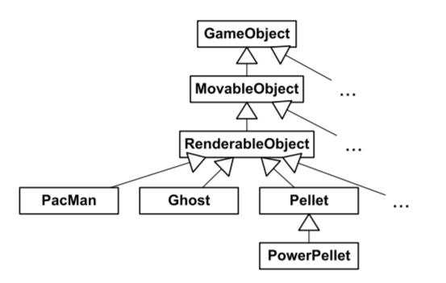
*Figura 2.1: Ejemplo de una jerarquía monolítica para el caso de un juego*

como PacMan [5] (Gregory 2019).
1 https://en.wikipedia.org/wiki/Observer_pattern
2 https://en.wikipedia.org/wiki/Publish-subscribe_pattern


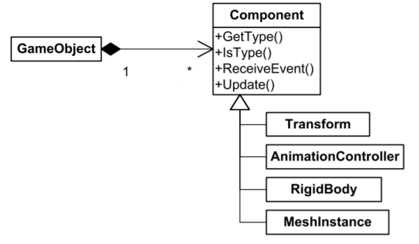
*Figura 2.2: Diagrama de clases de un modelo de game objects basado en*

componentes [5] (Gregory 2019).
En el caso extremo de un modelo basado en componentes, el objeto que las contiene puede
no tener ninguna funcionalidad más allá de unir a las componentes, volviéndose más cercano
al acercamiento centrado en propiedades, ya que la clase contenedora ya no es estrictamente
necesaria y puede ser reemplazada por un identificador único en cada componente (la imagen
2.3muestracomoseveríaestemodelo).Unproblemaimportantedeestetipodeacercamiento
es que al perder el objeto contenedor, se vuelve más difícil realizar operaciones que dependan
de más de una componente, por ejemplo al renderizar generalmente se necesita tanto de una
componente asociada a una malla de triángulos y otra con la información de la posición del
objeto.

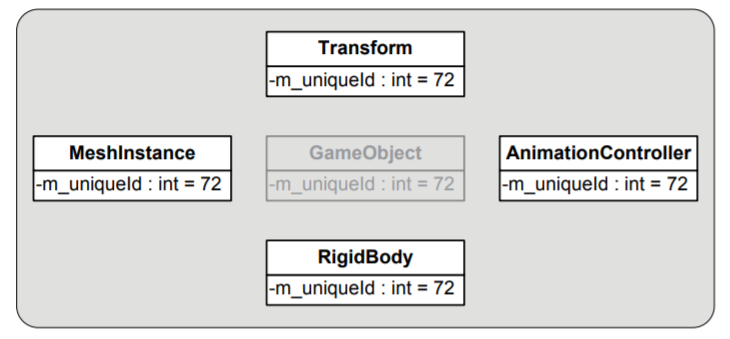
*Figura 2.3: Ejemplo de un conjunto de componentes para el caso extremo*

donde el objeto que las una deja de ser necesario [5] (Gregory 2019).
El modelo basado en componentes es uno que generalmente escala mejor, y forma parte de
los principios de programación orientada a objetos3 en donde se prefiere composición sobre
herencia. En este modelo agregar funcionalidades nuevas en principio significa solo agregar
una nueva componente, mientras que hacerlo dentro de una jerarquía de clases puede ser un
trabajo no menor, probablemente por razones como estas es que tanto Unreal como Unity
poseen un modelo basado en componentes.
3 https://en.wikipedia.org/wiki/Composition_over_inheritance


#### 2.1.3. El caso de Unity y Unreal
ComoyasemencionótantoUnitycomoUnrealtienenunmodelodegame object basadoen
componentes con un objeto que las une, en el caso de Unity estos son llamados GameObjects
mientras que en Unreal se llaman Actors. Por otro lado, Unreal al mismo tiempo posee una
jerarquía bastante compleja con Actor como clase padre, la imagen 2.4 muestra una parte de
esta, pero la mayoría de las funcionalidades de estas clases están finalmente implementadas
usando componentes. En Unity la clase que contiene a las instancias de game objects se
llama Scene mientras que en Unreal se llama World, en este caso World contiene la lista de
instancias de Actor.

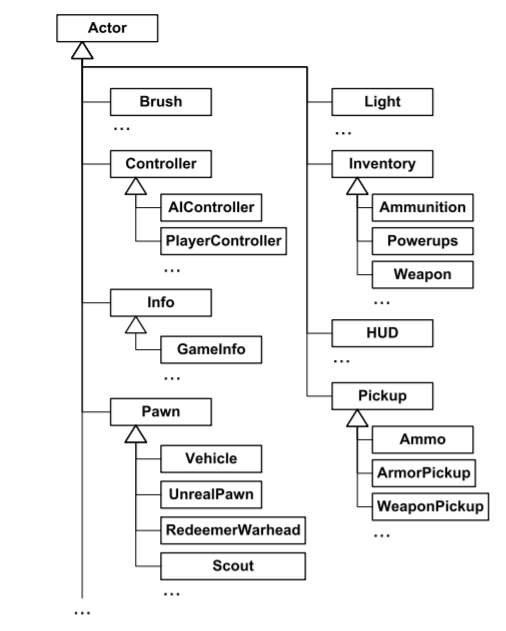
*Figura 2.4: Parte de la jerarquía de clases de Unreal [5] (Gregory 2019).*

ParapersonalizarelcomportamientodelosobjetosinstanciadosUnityutilizascripts escri-
tos en el lenguaje C#, que tienen el comportamiento de componentes, es decir, que pueden
ser unidas a GameObjects y que definiendo ciertos métodos predefinidos permite al script
suscribirse a distintos eventos y definir una respuesta a ellos, ejemplos de estos eventos son
Update y OnCollisionEnter, la imagen 2.5 muestra un ejemplo del código que se podría
escribir en un script. Por otro lado, para la comunicación entre objetos en Unity, cada uno
de estos posee el método sendMessage que como primer parámetro recibe el nombre de algún
método que se desea ejecutar en el objeto recibiendo el mensaje.


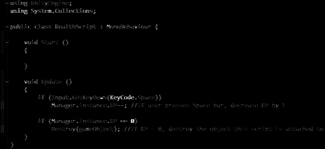
*Figura 2.5: Ejemplo de un script escrito en C# usado en Unity.*

En el caso de Unreal la principal manera de personalizar el comportamiento de los obje-
tos es heredando de alguna subclase de Actor y sobrescribir métodos virtuales4, como Tick
(evento llamado cada iteración del motor). Unreal también provee otra forma de personalizar
este comportamiento mediante el uso de un lenguaje de scripting visual llamado Blueprints,
dentro de este se pueden definir respuestas a eventos análogos a las funciones virtuales al
escribir código en C++, la imagen 2.6 muestra la implementación de uno de estos.

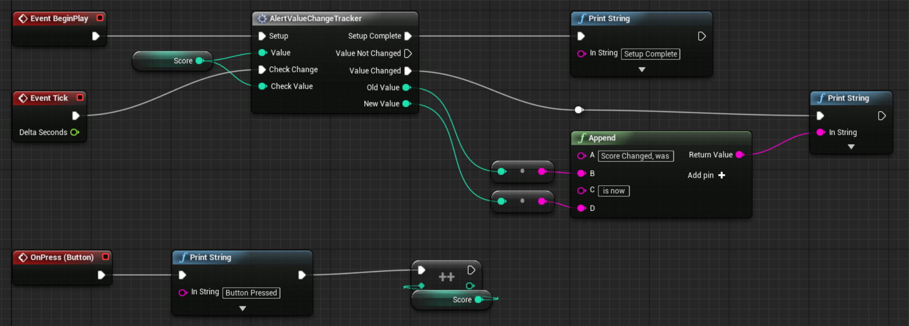
*Figura 2.6: Ejemplo de implementación de un Blueprint en Unreal Engine.*


### 2.2. Audio
Es innegable el valor que otorga el sonido a las aplicaciones interactivas, tanto a través
de la música como por medio de la reproducción de efectos de sonidos emitidos por los
objetos que existen dentro del mundo simulado. La responsabilidad del sistema de audio se
4 https://en.wikipedia.org/wiki/Virtual_function

puede resumir en transformar un conjunto de sonidos emanados dentro del entorno virtual
en un conjunto de canales de audio que finalmente serán reproducidos por alguna especie de
parlante, la imagen 2.7 ilustra este proceso para el caso de audífonos o parlantes básicos.
Dentro de los sonidos que se reproducen en una aplicación existen, dos tipos con los cuales
el sistema de audio debe trabajar, 3D y 2D. Los sonidos 3D son aquellos que se originan
desde algún lugar dentro del mundo, es decir, que lo reproducido depende de las posiciones,
velocidades y orientaciones relativas entre la fuente de sonido y el receptor. Por otro lado, los
sonidos 2D son aquellos que no necesitan información espacial, que se reproducen de igual
manera independiente de la posición del receptor, ejemplo de esto podría ser la música de
fondo de un videojuego o los sonidos del menú.

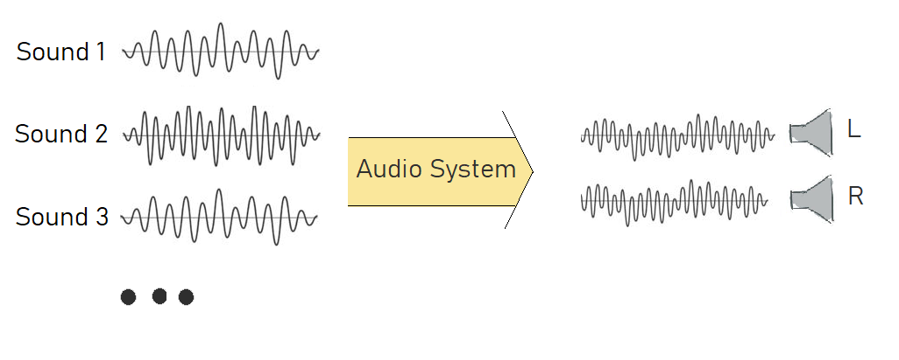
*Figura 2.7: Versión simplificada del trabajo que debe realizar un sistema de*

audio.

#### 2.2.1. Modelado del entorno acústico
Para modelar el entorno acústico de una escena primero es necesario describirla, para esto
generalmente se usan los siguientes elementos:
Un conjunto de fuentes de sonido ubicadas en el espacio. Estas fuentes mantienen
información de posición, orientación y alcance (para saber hasta donde se deberían
escuchar los sonidos emitidos por esta fuente). Unity representa estos elementos usando
un tipo de componente llamada AudioSource, mientras que Unreal con una llamada
UAudioComponent.
Un receptor también ubicado en el espacio, el cual cumple funciones similares a una cá-
maraparaunsistemaderenderizado.Dadasunaturaleza,sueleexistirsolounainstancia
de este elemento dentro del mundo. Unity utiliza una componente llamada AudioLis-
tener y solo permite una instancia de esta componente activa en la escena, dado que
la componente misma no tiene información espacial, se utiliza la información del Ga-
meObject al cual la componente está unida. Por otro lado, Unreal a nivel de blueprint
tiene la función SetAudioListenerOverride que recibe un Actor como parámetro del
cual se usará su información espacial.

Un modelo del ambiente, para esto existen dos acercamientos, uno parecido a lo que
se hace en los sistemas de rendering, es decir, se describe la geometría y los propieda-
des de los materiales de esa geometría y a partir de estos se calculan las propiedades
acústicas del entorno, el segundo acercamiento consiste en describir directamente es-
tas propiedades para ciertos espacios, es decir, las características acústicas de un lugar
son determinados previamente y no durante la ejecución del motor. Tanto Unity co-
mo Unreal siguen este segundo acercamiento probablemente por temas de rendimiento,
Unity provee ReverbZones, cuyo nombre se origina por el fenómeno de reverberación
que consiste en la reflexión de ondas sonoras, mientras que Unreal usa Audio Volu-
mes ambos funcionan de tal manera que cuando el receptor y la fuente de audio se
encuentran dentro de ellos entonces al audio se le aplican las propiedades acústicas de
la respectiva instancia de ReverbZone/AudioVolume. La imagen 2.8 muestra un ejemplo
en Unity de una instancia de ReverbZone configurada para simular la acústica de una
caverna, de esta manera los sonidos emitidos por la fuente que está dentro de rango
serán modificados para reflejar dicho ambiente acústico.

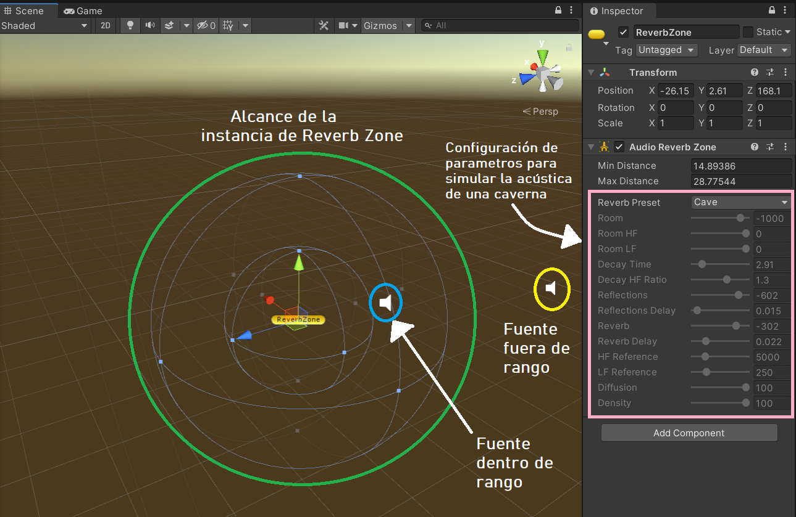
*Figura 2.8: Ejemplo de Reverb Zone o zona de reverberancia dentro de*

Unity, con una fuente sonido dentro de esta zona (Círculo celeste) y otra
fuera (Círculo amarillo). Los sonidos emitidos por la fuente dentro de la
zona de reverberancia serán procesados para hacerlos parecer como si se
originaran dentro de una caverna.


#### 2.2.2. Tareas del sistema de audio
Con estos elementos, las principales tareas que el motor de audio debe realizar son las
siguientes:
Sintetización de la señal: es el primer paso que debe realizar el sistema de audio
y consiste en producir las señales de cada fuente sonora, generalmente esto se hace
en base a archivos grabados previamente en algún formato estándar como .wav y .ogg
dentro de otros. En el caso de Unity estos se llaman AudioClips y en el caso de Unreal
SoundWave.
Espacialización sonora: esta toma en consideración las posiciones relativas entre el
receptorylafuentedesonido,ycalculadosefectos:Atenuación del sonidodebidoala
distancia, es decir, que a mayor distancia entre el receptor y la fuente sonora el volumen
delsonidoseamenor,yPanoramizaciónquecorrespondeacalcularelvolumenrelativo
en los parlantes de salida, por ejemplo, si el sonido está espacialmente a la izquierda del
receptor y el dispositivo de salida son unos audífonos, entonces el volumen escuchado
en el audífono izquierdo debería ser más alto que el audífono derecho. Tanto Unity
como Unreal permiten configurar por cada fuente sonora como se comporta frente a
esta tarea, por ejemplo, ambos tienen la opción de escoger de que forma el volumen del
sonido disminuye con la distancia.
Modelamiento del ambiente acústico: trata de reproducir las características acústi-
cas del lugar donde están siendo escuchadas las fuentes sonoras. Los principales efectos
que caracterizan un entorno acústico son la reverberación y obstrucción del sonido,
la imagen 2.9 intenta describir visualmente como se producen estos efectos. Como ya
se mencionó, Unity y Unreal usan respectivamente ReverbZones y AudioVolumes para
realizar esta tarea.


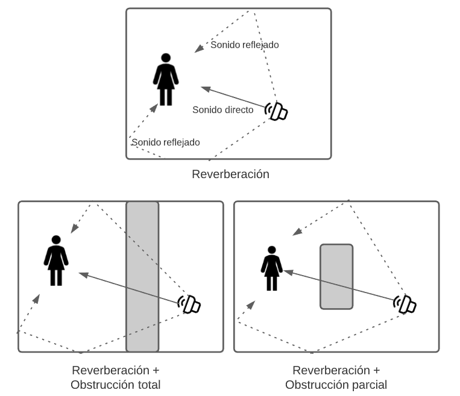
*Figura 2.9: Ejemplos de como se producen los efectos de reverberación y*

obstrucción.
Efecto Doppler: que corresponde al efecto que ocurre cuando la velocidad relativa
entre fuente y receptor no es cero.
Mixing o Mezcla de sonidos: este proceso consiste en poder controlar los volúmenes
relativos de todos las fuentes sonoras que están siendo reproducidas, ejemplos podrían
ser la música de aplicación en conjunto con efectos de sonido como disparos, animales,
etc. Finalmente esta tarea termina con una señal, por cada canal de salida, que repre-
senta todas las fuentes de sonido siendo reproducidas. Otro ejemplo de caso de uso en un
videojuego sería bajar el volumen a los sonidos de ambiente cuando algún personaje co-
mienza a decir alguna línea de diálogo, independiente si esto tiene sentido físico o no. En
el caso de Unreal esto lo hace mediante instancias de SoundClass y/o SoundSubmix,
mientras que Unity utiliza AudioMixer.
Finalmente la imagen 2.10 muestra como se podría ver el pipeline del sistema de audio.


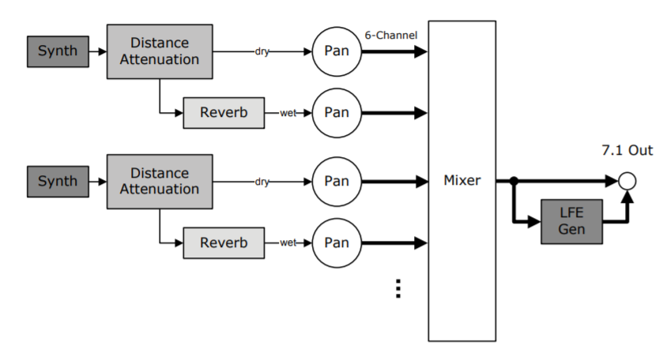
*Figura 2.10: Ejemplo de como se ve el pipeline de un sistema de audio [5]*

(Gregory 2019).

#### 2.2.3. Arquitectura del sistema de audio
Conrespectoalaarquitectura,estasueleconsistirenmúltiplescapassiendolademásbajo
nivel la de hardware donde viven las tarjetas de sonido, sobre esta está una de drivers que le
permiten a los sistemas operativos poder trabajar con variados tipos de tarjetas. Usualmente
sobre estas capas, antes de empezar a implementar un motor de audio, se crea otra que
evita que los programadores tengan que estar constantemente lidiando con el bajo nivel de
los drivers y/o hardware directamente. Finalmente, es por encima de estas capas sobre las
cuales se implementa las características del sistema de audio mencionadas anteriormente. La
imagen 2.11 muestra la arquitectura recién descrita.

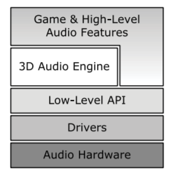
*Figura 2.11: Arquitectura de un sistema de audio según[5] (Gregory 2019).*


#### 2.2.4. Bibliotecas de audio
En la actualidad existe un variado conjunto de bibliotecas que implementan las caracte-
rísticas necesarias en un sistema de audio. Las más populares y poderosas son FMOD5 y
WWise6, ambas multi-plataforma, pero no son de código abierto y poseen licencias muy
restrictivas por lo que no se usaron en este trabajo de título, estas implementan toda la
arquitectura de la imagen 2.11 y de esta manera provee al usuario de estas bibliotecas carac-
terísticas a distintos niveles de abstracción. Por otro lado, existen APIs como XAudio27para
Windows y Xbox360, y ALSA8 para Linux, pero estas son de bajo nivel y específicas a cada
plataforma.
La biblioteca que se usó en este trabajo de título fue OpenAL Soft una implementación
de código abierto de OpenAL, una API multi-plataforma que provee audio 3D, esta no
implementa características de muy alto nivel por lo que la última capa de la imagen 2.11
no existe. La imagen 2.12 muestra la relación entre los principales objetos de OpenAL, que
claramente refleja lo ya mencionado en este capítulo, es decir, existen Buffers que mantienen
los datos a reproducir, Sources que reproducen estos Buffers y un Listener que actúa como
receptor de las fuentes de sonido. Las otras dos clases Device y Context, se preocupan de
abstraerelhardwareotarjetadesonidoydemantenerlasestructuradedatosnecesariaspara
modelar el entorno acústico respectivamente. Por aplicación, usualmente existe una única
instancia de cada una de estas clases recién mencionadas, estas suelen crearse al comienzo de
la aplicación y son destruidas al final antes del cierre de esta.

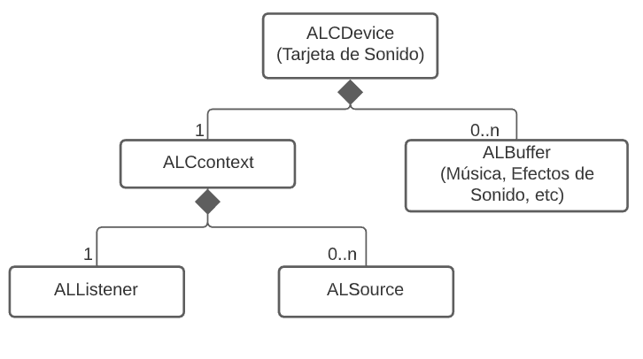
*Figura 2.12: Diagrama de clases de OpenAL simplificado.*

Finalmente, la descripción de la biblioteca recién dada es una superficial, una descripción
detallada esta fuera del alcance de este trabajo de título. Para obtener una descripción más
profunda de la biblioteca existe Hiebert 2007 [7] que corresponde al documento guía oficial de
la biblioteca, mientras que [8] ofrece una descripción de alto nivel de OpenAL y un ejemplo
de implementación de un sistema de audio con esta biblioteca.
5 https://www.fmod.com/
6 https://www.audiokinetic.com/
7 https://docs.microsoft.com/en-us/windows/win32/xaudio2/xaudio2-introduction
8 https://www.alsa-project.org/wiki/Main_Page


### 2.3. Renderizado 3D
La principal función del sistema de renderizado es la de generar una imagen de dos di-
mensiones a partir de la descripción de una escena, la imagen 2.13 ilustra este proceso. Esta
descripción suele consistir en los siguientes elementos.
Una cámara virtual que representa el punto de vista desde el que se producirá la
imagen.
Un conjunto de fuentes de luz que iluminan la escena.
Volúmenes y/o superficies 3D junto con una caracterización de como estas interactúan
con la luz.

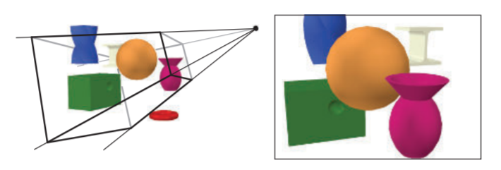
*Figura 2.13: La imagen de la izquierda corresponde a la descripción de una*

escena mediante una cámara virtual representada por un punto y un con-
junto de superficies 3D, mientras que la imagen de la derecha es el resultado
del proceso de renderización de dicha escena (Haines [9]).
A continuación se describirá en detalle cada uno de estos elementos y otros conceptos claves
para el proceso de renderizado.

#### 2.3.1. Mallas geométricas o Meshes
La forma más común de representar las superficies que serán renderizadas en una esce-
na es con mallas geométricas compuestas de triángulos también llamadas triangle meshes.
La representación de estas mallas que la GPU consume suele consistir en una lista con la
información de cada vértice que la compone y, en la mayoría de los casos, otra lista que
contiene una tripleta de índices por cada triángulo en la malla especificando que tres vértices
lo definen. La imagen 2.14 muestra un ejemplo de malla con vértices sólo con información de
la posición de estos y la lista de índices que describe cada triángulo.


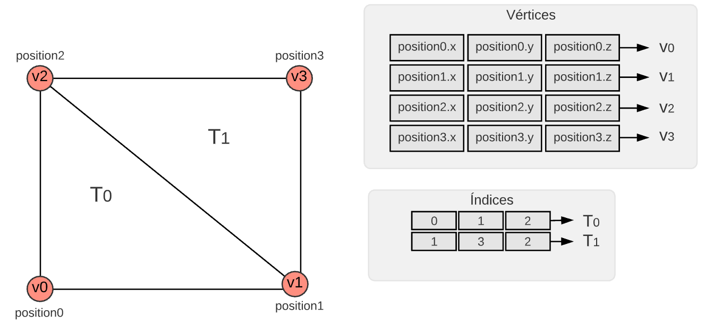
*Figura 2.14: Índices y vértices que describen una malla de triángulos.*

La información de cada vértice se compone de atributos y como mínimo cada uno de
estos debe tener un atributo con la información de la posición que ocupa dicho vértice. Otros
atributos que cada vértice suele tener son los siguientes:
Un vector normal, este es un vector que es perpendicular a una superficie, la direc-
ción en la que este vector apunta se llama dirección normal. Este vector es de suma
importancia para el cálculo de sombreado.
Coordenadas de texturas, este tipo de coordenadas consiste generalmente en un
vectorde2dimensionesquedescribeunmapeodelasuperficie3dquelamalladescribeal
intervalo[0,1)x[0,1).Estemapeoluegoesusadoparatomarmuestrasdeobjetosllamados
texturas, las que se describen en más detalle en la sección 2.3.5. Estas coordenadas
permiten describir con mayor resolución algún parámetro que depende de la posición en
la malla sin necesidad deaumentar la cantidad de vértices de esta, uno de los parámetros
más común corresponde al color de la superficie.
Unvectortangenteyunvectorbinormal.estosdosvectoresjuntoconelvectornormal
definen un sistema de coordenadas llamado espacio tangente9, la principal técnica que
hace uso de este espacio es una llamada normal mapping, la cual usando una textura
permite dar un detalle mucho más fino de la normal de la superficie de una malla sin
tener que complejizar la geometría de esta. Tanto Lengyel 2019 [10] y Haines 2018 [9]
contienen un capítulo que explica la teoría de esta técnica.
9 https://en.wikipedia.org/wiki/Tangent_space


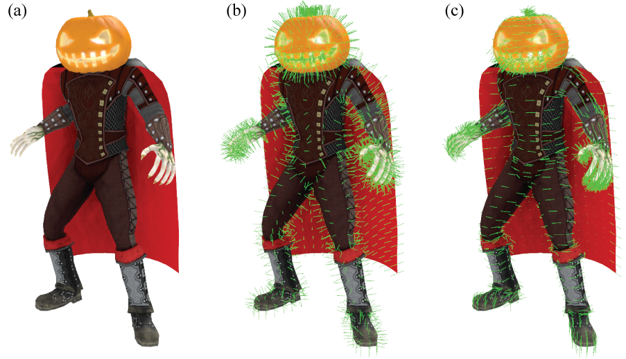
*Figura 2.15: (a) Un modelo de un personaje que requiere información de*

normales y tangentes (b) el mismo modelo con sus normales dibujadas con
vectoresverdes(c)elvectortangentedecadavérticedelmodeloesdibujado
como un vector verde (Lengyel 2019 [10]).
Finalmente, la imagen 2.16 muestra como una malla con atributos de posición, normal y
coordenadas de texturas suele ser representada en memoria.

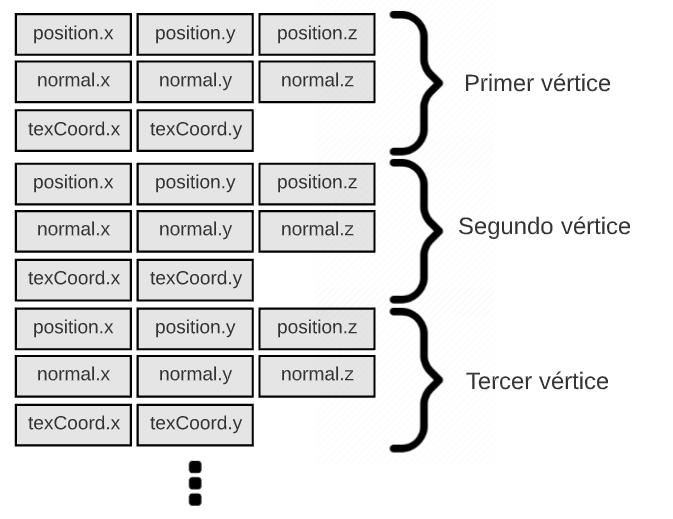
*Figura 2.16: Diagrama de como los atributos de los vértices de una malla*

son guardados en memoria.


#### 2.3.2. Transformaciones
Una transformación es una operación que toma entidades como puntos o vectores y los
modifica de alguna manera. Con estas es posible posicionar, orientar, remodelar, animar
objetos, luces y cámaras. Las principales transformaciones usadas en motores gráficos son las
de traslación, rotación y escalado.
Las traslaciones cambian un objeto de un lugar a otro, estas quedan completamente
determinadas por un vector de 3 dimensiones v ∈ R3. Las principales representaciones de
esta transformación es con el mismo vector recién descrito o de forma matricial. La forma
matricial sigue la siguiente ecuación:
1 0 0 t 
  0 1 0 t  
M =  y
traslacion   0 0 1 t  
 z
0 0 0 1
donde t ,t ,t son las componentes de la representación como vector. Es importante notar
x y z
que es imposible representar matricialmente traslaciones con una matriz de 3x3, esta debe
necesariamente ser una matriz de 4x4. Para trabajar con estas matrices se usan coordenadas
homogéneas10, estas consisten en un vector de 4 dimensiones cuyas primeras 3 componentes
son equivalentes a los vectores de 3 dimensiones, mientras que la última componente es 1
para vectores que describen posiciones y 0 para vectores que describen direcciones. La imagen
muestra un ejemplo de traslación 2.17.
10https://en.wikipedia.org/wiki/Homogeneous_coordinates


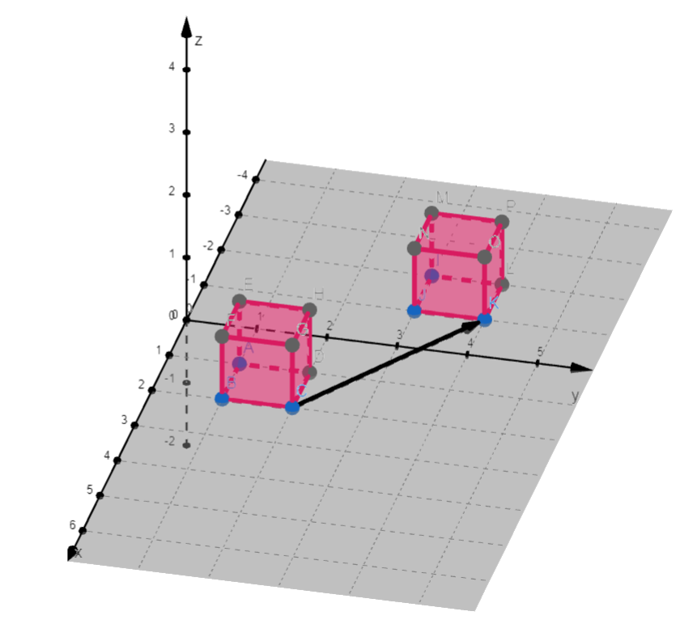
*Figura 2.17: La imagen muestra un cubo transformado por una traslación*

de vector v = (−3,2,0).
Las rotaciones permiten orientar un objeto en el espacio, la imagen 2.18 muestra un ejem-
plo de rotación en torno al eje x en 90 grados. Dentro de las representaciones posibles existen
los ángulos de Euler11, matrices de 3x3, un eje de rotación y un ángulo, y quaternions. Estos
últimos son una extensión a los números complejos y consisten en un vector de 4 dimen-
siones, esta representación es la que generalmente se usa ya que no sufren de un problema
llamado Gimbal lock12, no tienen problemas bajo interpolación entre dos rotaciones y el
cálculo de rotaciones consecutivas es más eficiente en comparación con las otras, tanto Eric
Lengyel 2016 [11] y Haines 2018 [9] describen en profundidad las propiedas y operatoria de
los quaternions. Por otro lado, es común que los motores usen una representación diferente
para interfaces gráficas, como las presentes en un editor de niveles, dado que trabajar con
quaternions es poco intuitivo.
11https://es.wikipedia.org/wiki/%C3%81ngulos_de_Euler
12https://en.wikipedia.org/wiki/Gimbal_lock


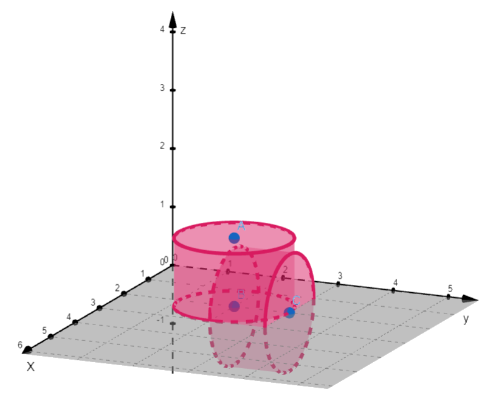
*Figura 2.18: La imagen muestra un cubo rotado en 90 grados en torno al*

eje x.
Las transformaciones de escalado escalan una entidad en factores s s s a lo largo de
x y z
cada uno de sus ejes respectivos, es decir, esta transformación agranda o disminuye el tamaño
de una entidad. Una transformación de escalamiento puede ser representada por un vector
de 3 dimensiones o matricialmente con la siguiente matriz:
 s 0 0 0
  0 s 0 0 
M =  y 
escalado   0 0 s 0 
 z 
0 0 0 1
La imagen muestra el resultado de escalar un objeto con factores s s s igual a 2.
x y z


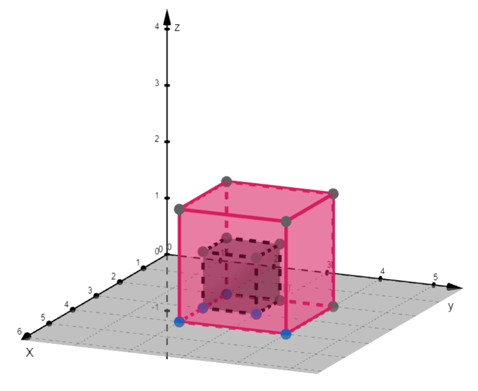
*Figura 2.19: La imagen muestra un cubo al que se le aplicó una transfor-*

mación de escalado de factores s = (2,2,2).
Si bien las transformaciones recién descritas pueden ser representadas de diferentes ma-
neras las API gráficas utilizan la representación matricial, por lo que es necesario en algún
momento representar estas transformaciones en esa forma.
Los tres tipos de transformaciones recién descritos son usados simultáneamente para des-
cribir la posición, orientación y escala de los distintos objetos que pueden existir dentro de
un motor, la concatenación de estas matrices suele recibir el nombre de model matrix o ma-
triz de modelo, la siguiente sección entrará en las razones de este nombre. El orden de esta
concatenación o multiplicación es arbitrario pero se sigue la convención de que primero se
debe aplicar el escalado, luego la rotación y finalmente la traslación, siguiendo este orden la
siguiente ecuación describe la matriz de modelo:
M = M M M (2.1)
modelo traslacion rotacion escalado
Por último, es importante mencionar que la necesidad de posicionar, orientar y escalar
un objeto es una que tienen gran parte de los sistemas de un motor por lo que es común
que la información de estas transformaciones sea ocupada no solo por el sistema de renderi-
zado. Por ejemplo en Unity, todas las instancias de gameObject poseen una transformación
independiente de las componentes que esta tenga.

#### 2.3.3. Sistemas de coordenadas
Cuando un objeto es renderizado la posición de cada vértice debe pasar por una serie
de transformaciones que los transforman desde un sistema de coordenadas a otro hasta que

alcanzan uno llamado viewport space o screen space, que representa el área rectangular en
dondelaimagenestásiendorenderizada.Lossistemasdecoordenadasporlosquecadavértice
debe pasar son los siguiente: espacio de objeto o local, espacio de mundo o global, espacio
de vista, espacio de clip y espacio de pantalla, en inglés estos son llamados object space o
local space, world space o global space, view space, clip space y screen space o viewport space
respectivamente. La imagen 2.20 ilustra este proceso de cambio de sistemas de coordenadas.

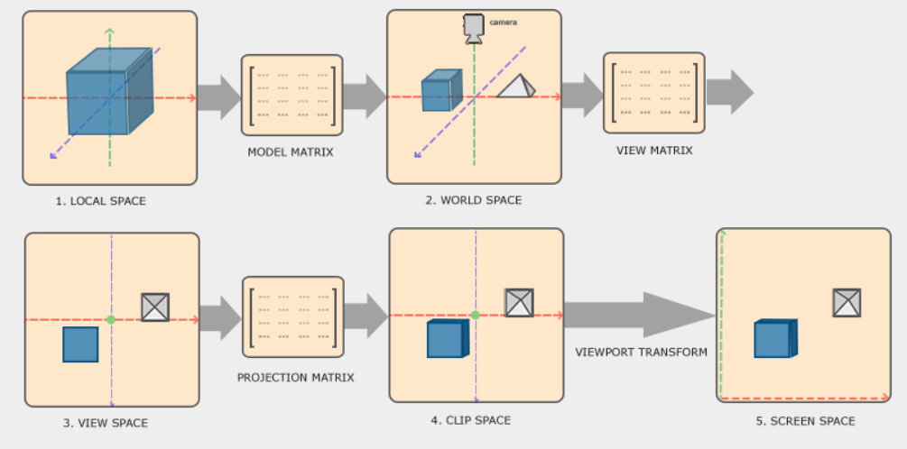
*Figura 2.20: Sistemas de coordenadas por los que los vértices siendo rende-*

rizados deben pasar. 13
El espacio local o de objeto es el sistema de coordenadas que es local al objeto siendo
renderizado. Por ejemplo, en una malla de triángulos al momento de ser creada o importada
a un motor las posiciones de sus vértices están en este espacio.
El espacio de mundo o global, es un sistema de coordenadas arbitrariamente escogido que
se mantiene fijo y es con respecto al cual el resto de traslaciones, rotaciones y escalamientos
son descritos. La matriz que transforma vértices en espacio local a espacio global se llama
matriz de modelo o model matrix, esta sigue la misma forma de la matriz de la ecuación
2.1 componiéndose generalmente de una traslación, rotación y escalamiento con respecto al
espacio global. Uno de los beneficios que la distinción entre los espacios de mundo y objeto
es la posibilidad de renderizar una misma malla en distintas posiciones y escalas sin tener
que modificarla directamente.
El espacio de vista corresponde al espacio local de la cámara que está capturando la
escena que está siendo renderizada. Como ya se mencionó, la matriz de modelo de la cámara
transforma desde el espacio local de esta al global, si se invierte esta matriz se obtiene una
13Lasimagenfueobtenidadesdehttps://learn.unity.com/tutorial/introduction-to-sprite-animationsyhttps:
//en.wikipedia.org/wiki/Morph_target_animation

que transforma desde el espacio global al de la cámara, que corresponde a la transformación
requerida, esta matriz se llama matriz de vista o view matrix.
El espacio de clip o clip space se llama así porque es en este que la GPU tiene suficiente
información para determinar si un triángulo está dentro del volumen de espacio visible por
la cámara y realizar el proceso de clipping descrito en 2.3.8. En este espacio, la última
coordenada homogénea de los vectores representa la profundidad a lo largo de la dirección
en la que la cámara está observando la escena. La matriz que aplica esta transformación se
llama matriz de proyección y se construye de tal manera que un vector transformado por
esta v = (x ,y ,z ,w ) que satisface las desigualdades
clip clip clip clip clip
−w ≤ x ≤ w
clip clip clip
−w ≤ y ≤ w (2.2)
clip clip clip
−w ≤ z ≤ w
clip clip clip
se considera dentro del volumen de visión de la cámara, para algunas APIs gráficas la últi-
ma desigualdad tiene una cota inferior igual a 0 en vez de −w . Finalmente, existen dos
clip
principales tipos de proyecciones que describen distintos volúmenes de visión, proyección
ortográfica y de perspectiva. La siguiente sección entra en más detalle sobre estas.
El espacio de pantalla o screen space es el último sistema de coordenadas. Antes de es-
te espacio existe uno llamado device space, si un vector en espacio de clip está dado por
v = (x ,y ,z ,w ) , entonces uno en device space sigue la siguiente ecuación:
clip clip clip clip clip
x y z
v = ( clip , clip , clip )
device
w w w
clip clip clip
finalmente, para transformar a viewport space las coordenadas x e y del vector en device space
se mapean a los rangos [0,w] y [0,h] respectivamente, donde w y h son el alto y ancho en
píxeles de la imagen siendo renderizada.

#### 2.3.4. Cámara virtual
Para poder describir una cámara se necesita en primer lugar describir la posición, orien-
tación y escala de esta, y en segundo lugar su volumen de visión. La posición, orientación y
escala permiten calcular la matriz de vista descrita en la sección anterior, mientras que una
descripción del volumen permiten calcular la matriz de proyección.
La posición, orientación y escala quedan descritas con las transformaciones caracterizadas
en la sección 2.3.2. Para el caso de la definición del volumen de visión se necesitan parámetros
diferentes dependiendo si la cámara usa una proyección de tipo perspectiva u ortográfica.
Para calcular la matriz de proyección de tipo perspectiva los parámetros que se necesitan
son los siguientes :
Un plano llamado plano cercano o near plane que queda especificado por una distancia
en la dirección en que la cámara está observando la escena.

Otro plano llamado plano lejano o far plane especificado por una distancia mayor a la
del plano cercano.
El ángulo de visión o field of view de la cámara en el eje y local de la cámara.
La relación de aspecto de la cámara.
La imagen 2.21 ilustra cada uno de estos parámetros y el volumen de visión que describen.

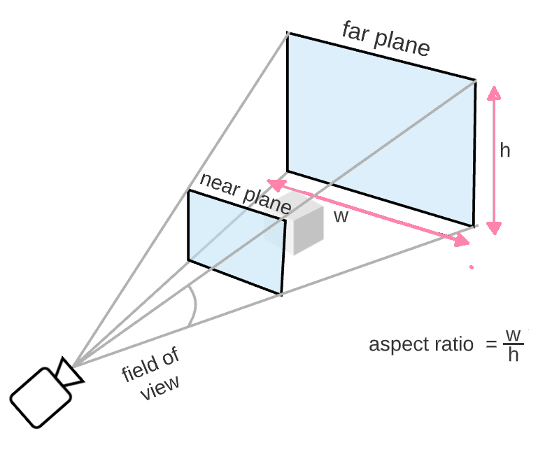
*Figura 2.21: Volumen de visión o viewing volume de una cámara con pro-*

yección de perspectiva.
Por otro lado, para el caso de una proyección ortográfica la matriz se obtiene a partir de
los mismos planos, pero ahora se define un ancho y un alto. La imagen 2.22 ilustra el volumen
para esta proyección.


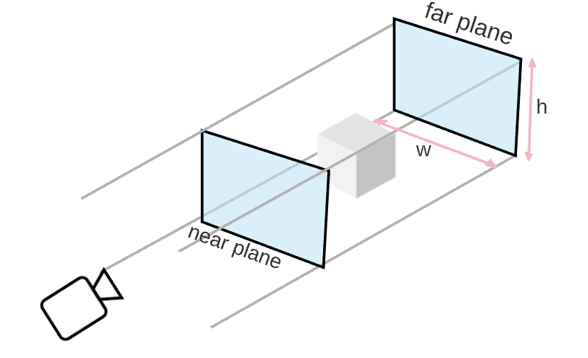
*Figura 2.22: Volumen de visión o viewing volume de una cámara con pro-*

yección ortográfica.

#### 2.3.5. Texturas
Una textura o texture map, tiene como principal función agregar detalle a algún parámetro
de una superficie esto lo hace permitiendo que dicho parámetro varíe como una función
de la posición en esta. El ejemplo más común de dicho parámetro es el del color de la
superficie, otros ejemplos incluyen que tan rugosa es esta o que tan similar a un metal es
el comportamiento de la superficie. En general se puede usar texture maps para agregar
cualquier información de alta resolución a una superficie.

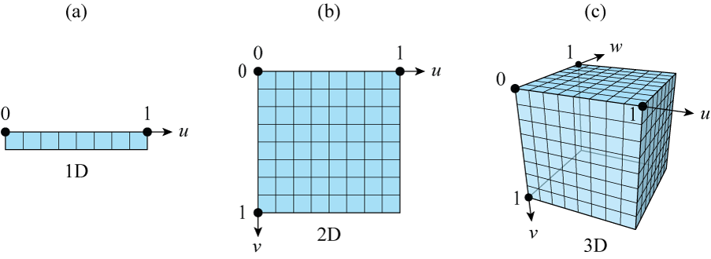
*Figura 2.23: (a) Una textura de una dimensión es accedida con una única*

coordenada u. (b) Una textura 2D es accedida con un par de coordena-
das de textura (u,v). (c) Una textura 3D es accedida con una tripleta de
coordenadas de textura (u,v,w). (Lengyel 2019 [10]).
Equivalentemente como un elemento de una imagen se llama pixel, el de una textura se
llama texel. A su vez, esta textura es por lo general un arreglo de 1, 2 o 3 dimensiones de
texels, la imagen 2.23 muestra ejemplos de esto. Para acceder estas texturas se necesitan unas
coordenadas llamadas coordenadas de texturas de la misma dimensión que la textura que

están accediendo, los ejes de estas coordenadas reciben el nombre de u,v,w o s,t,r. Como ya se
mencionó en la sección 2.3.1, cada vértice de una malla de triángulos suele tener información
de este tipo de coordenadas, estas permiten mapear la superficie de la malla a la de la
textura, la imagen 2.24(a) muestra el resultado final de una malla usando estas coordenadas
para agregar detalle al color del objeto, mientras que la imagen 2.24(b) muestra la malla
con los triángulos que la componen y finalmente 2.24(c) muestra como estos triángulos son
mapeados a una textura con información de color usando las coordenadas recién descritas.

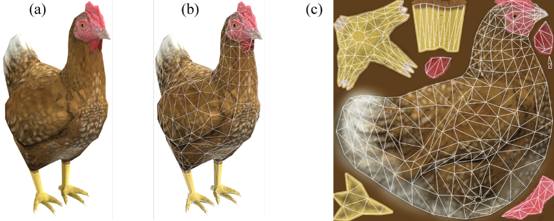
*Figura 2.24: (a) Un modelo de una gallina renderizada usando una textura*

decolor.(b)elmismomodeloconlostriángulosquelocomponen.(c)Como
estos triángulos son mapeados a una textura (Lengyel 2019 [10]).
Las coordenadas de texturas están usualmente normalizadas de tal manera que el rango
[0,1] en cualquier eje corresponda al tamaño total de la textura, como la imagen 2.24 ilustra.
En caso de que se intente tomar muestras de una textura con coordenadas fuera de este
rango, el comportamiento dependerá de una configuración llamada wrap mode, la cual posee
4 posibles opciones.
Repeat :Elprocesodemuestreosecomportacomosilatexturaserepitieseinfinitamente.
Mirroed Repeat: Este comportamiento repite la imagen, pero en cada repetición refleja
la imagen en el eje en el cual se repitió.
Clamp to edge: las coordenadas son acotadas al rango [0,1], esto produce que el patrón
del borde de la imagen se expanda para tomas de muestra fuera del rango normalizado.
Clamp to border: coordenadas fuera de rango retornan un color fijo.
Estas opciones quedan ilustradas en la imagen 2.25.


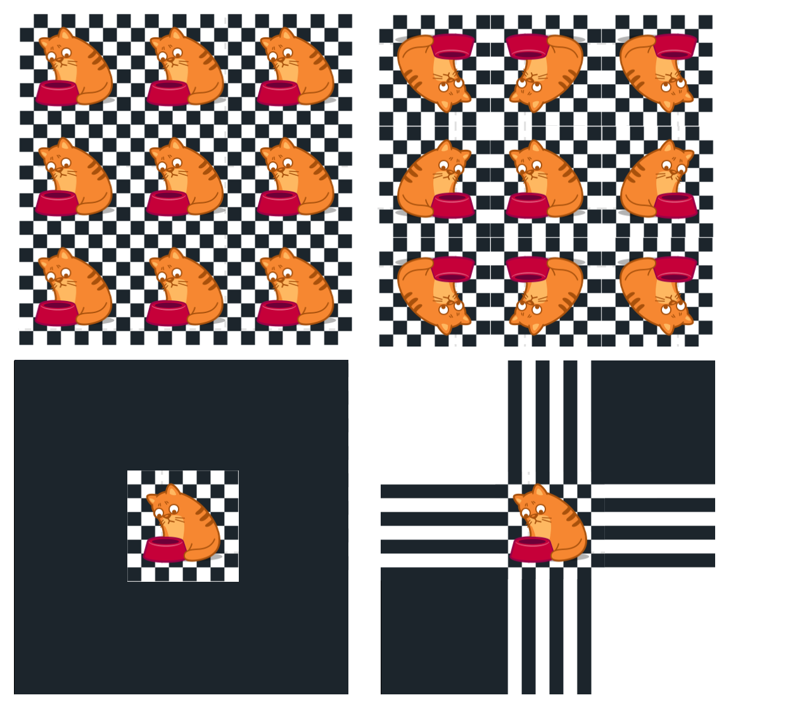
*Figura 2.25: Ejemplos de los resultados de las distintas configuraciones de*

wrap mode. En la parte superior, las imagen izquierda corresponde a Repeat
y la derecha a Mirroed Repeat. En la parte inferior, la imagen izquierda
corresponde a Clamp to boder y la derecha a Clamp to edge.
Al momento de usar texturas pueden ocurrir dos problemas que dificultan el elegir un
valor representativo al momento de muestrearlas, estos se llaman en inglés magnification y
minification. El primero ocurre cuando un texel ocupa más de un pixel de la imagen final
siendo renderizada, mientras que minification ocurre cuando muchos texels ocupan un mismo
pixel, este último caso queda ilustrado por la imagen 2.26. En ambos casos se usan técnicas
de filtrado para obtener una muestra representativa.


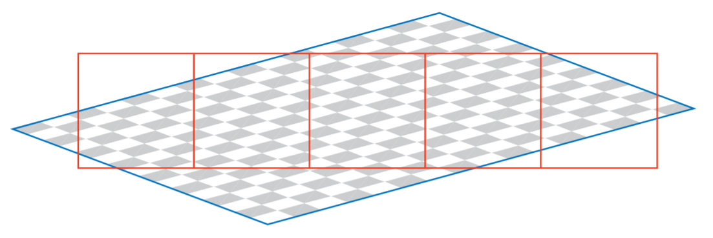
*Figura 2.26: Ejemplo de minification donde múltiples texels de una textura*

están contenidos en cada uno pixeles de la columna (Haines 2018 [9]).
Para el caso de magnificación, las dos técnicas de filtrado más comunes son nearest neigh-
bor y bilinear interpolation. Nearest neighbor escoge el texel más cercano a la coordenada de
textura usada para tomar la muestra, mientras que en bilinear interpolation se escogen los 4
texelsmáscercanosyseinterpolanentreellos.Paraelcasodeminificacióntambiénseaplican
las técnicas de filtrado recién mencionadas, pero además existe una llamada mipmaps14 en
donde a partir de una textura se crean otras cada vez de menor resolución desde las cuales se
pueden obtener muestras más representativas cuando un pixel de la imagen final es ocupado
por múltiples texels de la textura original. La imagen 2.27 muestra un ejemplo de mipmaps
creados a partir de una textura, donde ahora la textura 2D puede ser pensada como una 3D
con un eje representando el nivel de simplificación de la imagen inicial. El cálculo de mipmaps
se puede hacer automáticamente usando API gráficas como OpenGL.

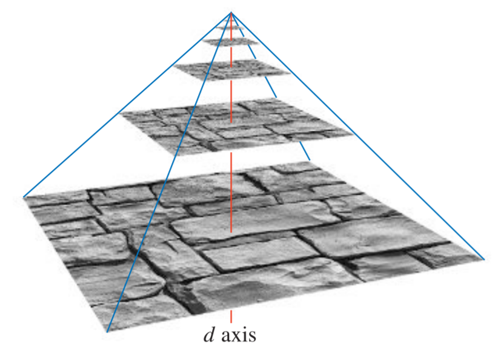
*Figura 2.27: Un mipmap se construye tomando la imagen original y guar-*

dando en cada texel de la imagen nueva el promedio de grupos de 2x2 texels
delaimagendemayorresolución.Elconjuntodeimágenesgeneradasforma
una nueva dimensión d usada durante el proceso de muestreo. (Haines 2018
[9]).


#### 2.3.6. Fuentes de luz
Como se mencionó al comienzo de la sección de renderizado, las fuentes de luz son parte
de la descripción de una escena que se desea renderizar, para caracterizar estas fuentes se
necesitan dos propiedades, el color de los rayos que la fuente produce c que usualmente
light
es especificado con un color RGB y la distribución espacial de esos rayos.
Los tres tipos más comunes son luces puntuales que irradia igualmente en todas las di-
recciones desde un única posición como una ampolleta, fuentes de tipo spotlight que emiten
luz predominantemente en una dirección como una linterna y luces direccionales que mode-
lan fuentes extremadamente distantes como el sol. Estos tres tipos de fuentes tienen algo
en común y es que vistas desde la superficie del objeto siendo iluminado la fuente de luz
es infinitesimal, lo que se traduce en que la luz solo llega desde una dirección d . En
light
esta sección se describirán en detalle este tipo de fuentes, otras más complejas que poseen
superficie o volumen quedaron fuera de este trabajo de título pero el capítulo de iluminación
local de Haines 2018 [9] posee una sección al respecto.

##### 2.3.6.1. Luces direccionales
Las luces direccionales son el tipo de fuente de luz más simple, c y d son constan-
light light
tes y por lo tanto suficientes para caracterizarlas, esto se debe a que estas modelan fuentes
puntuales lo suficientemente alejadas para que las variaciones de distancias y dirección in-
ternas a la escena iluminada, variaciones que normalmente se traducirían en un cambio de
c y d , sean despreciables. El ejemplo más representativo es el sol, iluminando una
light light
escena en algún planeta.

##### 2.3.6.2. Luces puntuales y de tipo spotlight
La fuentes puntuales y de tipo spotlight poseen una posición dentro de la escena renderi-
zada. La dirección d varía dependiendo de la posición de la superficie siendo iluminada
light
p relativa a la posición de la luz p :
0 light
v = p − p
light light 0
√
r = vv
d = light
light
r
En donde r es la distancia entre ambas posiciones. Para el caso de luces puntuales c
light
varíadependiendodeestadistanciar,superficiesamayordistanciarecibiránunvalordec
light
atenuado. La intensidad de este tipo de fuentes puede ser pensado como un enorme número
de rayos emanados desde la posición de la fuente y uniformemente distribuidos sobre todas
las direcciones como la imagen 2.28 lo muestra. Los rayos después de viajar una distancia R
serán distribuidos sobre una esfera de volumen 4πR2, y por lo tanto , la densidad de los rayos
y como consecuencia la intensidad de la luz será inversamente proporcional a esta superficie.
Con esto se puede describir c en función de la distancia a la fuente r, usando c el
light light

valor de esta función a una distancia r con la siguiente ecuación:
r
c (r) = c ( 0)2 (2.3)
light light
0 r

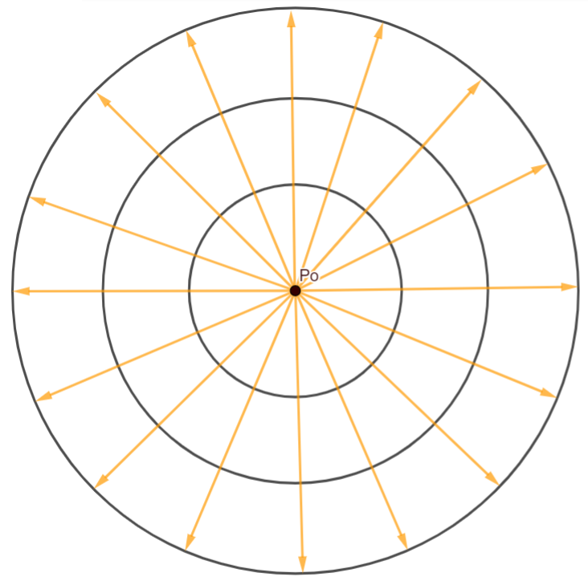
*Figura 2.28: Fuente puntual emitiendo luz uniformemente en todas las di-*

recciones.Amedidaqueelradiodedistanciacrecelosrayossondistribuidos
en la superficie de una esfera cada vez más grande.
El primer problema que tiene la ecuación 2.3 es la potencial división por cero la que
provocaqueparavalorespequeñosder,c alcanzarávaloresdemasiadograndesyafectará
light
la calidad visual del resultado del sombreado, para arreglar este problema es común sumar
un valor pequeño al denominador de la ecuación 2.3:
r
c (r) = c ( 0 )2
light light 0 r + (cid:15)
Haines 2018 [9] señala que Unreal usa un valor para (cid:15) igual a 1 centímetro. El segundo
problema de la ecuación es que esta nunca llega a cero, limitar el rango de efecto de las
fuentes de luz permite optimizar el proceso de sombreado, el capítulo de sombreado eficiente
de Haines 2018 [9] entra en detalle de cómo esto se puede hacer. La solución a este problema
es multiplicar la función problemática por otra, usualmente llamada windowing function, que
tiene la propiedad de valer 0 para valores mayores a un cierto r . Un ejemplo de esta
max
función usado por Unreal según Haines 2018 [9] es:
r
f (r) = (1 − ( )4)+2 (2.4)
win
r
max

Donde el exponente +2 significa que el valor siendo elevado debe acortarse a valores posi-
tivos. La imagen 2.29 muestra estas distintas funciones, la con decaimiento cuadrático con
prevención de singularidad, la función de windowing y el producto de ambas.

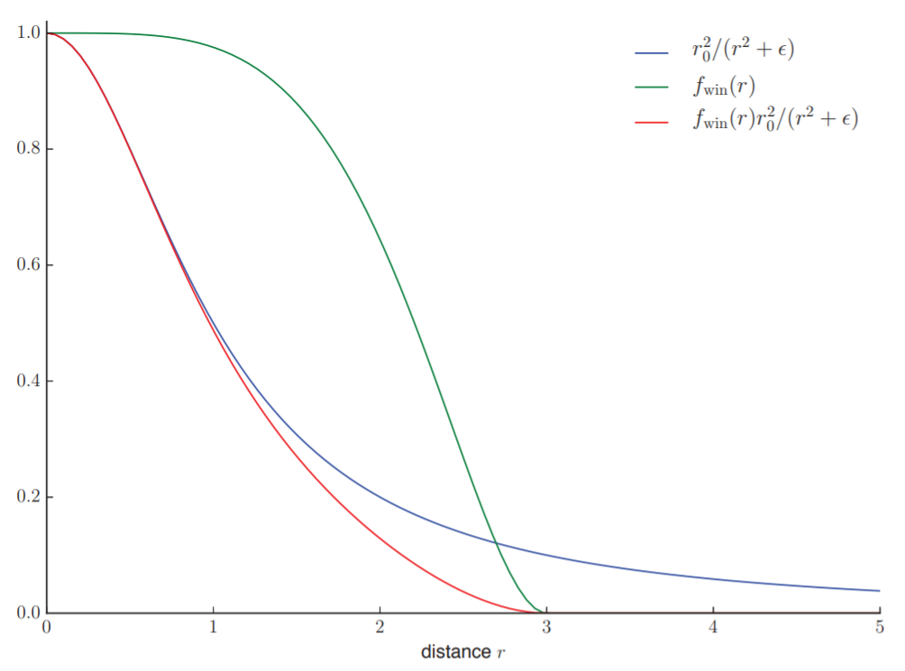
*Figura 2.29: El gráfico muestra una función inversamente proporcional al*

cuadrado de la distancia con un epsilon para prevenir singularidades, la
función de windowing descrita por la ecuación 2.4 con r ax igual a 3 y el
m
producto de estas dos funciones. (Haines 2018 [9]).
Una vez considerados ambos problemas la función f(r) que describe la dependencia de
c con la distancia r entre la fuente y el objeto sombreado es la siguiente:
light
r r
f(r) = (1 − ( )4)+2( 0 )2 (2.5)
r r + (cid:15)
max
Esta función multiplicada por un valor de c de referencia c representa el color
light light
de la fuente. Por otro lado, es importante mencionar que no siempre es necesario que f(r)
tenga que seguir una proporcionalidad inversa al cuadrado de la distancia, consideraciones
creativas, como un proceso de renderizado más estilizado, o requerimientos de rendimiento
pueden requerir que f(r) siga otras ecuaciones.
Por otro lado, las fuentes de tipo spotlight c además de ser afectadas por la atenuación
light
por distancia también son afectadas por una atenuación angular f (d ) determinada
dir light
porelánguloentreladirecciónpredilectasdelafuentedeluzylasuperficiesiendoiluminada.
Así c para este tipo de fuentes estará dado por la siguiente ecuación:
light

c = c f(r)f (d )
light light dir light
Además de la posición de la fuente, las luces de tipo spotlight se caracterizan con dos
parámetros extras, un ángulo llamado umbra angle θ y otro ángulo llamado penumbra angle.
u
El ángulo de umbra limita a la luz de tal manera que f (d ) = 0 para ángulos mayores
dir light
aθ ,mientrasqueángulosmenoresalángulodepenumbraθ cumplenquef (d ) = 1.
u p dir light
La imagen 2.30 ilustra cada uno de estos ángulos.

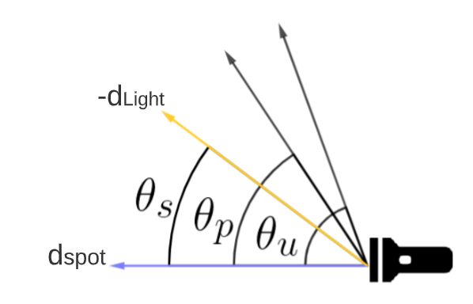
*Figura 2.30: Diagrama de una fuente de luz de tipo spotlight. d es la*

spot
dirección de la fuente, −d es la dirección que apunta desde la fuente
Light
al objeto sombreado, por último, θ y θ son los ángulos de penumbra y
p u
umbra.
Haines 2019 [9] señala que la forma de f (d ) tienden a ser similares, y además,
dir light
señala que el motor Frostbite14 desarrollado por Electronics Arts usa la siguiente ecuación:
(cosθ − cosθ )+−
t = s u
(cosθ − cosθ ) (2.6)
p u
f (d ) = t2
dir light
Donde θ es el ángulo entre la dirección preferencial de la fuente tipo spotlight y −d ,
s light
y +- significa que el valor es restringido al rango [0,1]. Finalmente, la imagen 2.31 muestra
como un plano es iluminado por las distintas fuentes de luz recién descritas.
14https://www.ea.com/frostbite/engine


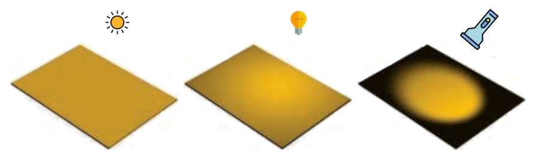
*Figura 2.31: Un plano siendo iluminado por distintas fuentes de luz. De*

izquierda a derecha: Una luz direccional, una luz puntual y una luz tipo
spotlight.

#### 2.3.7. Modelos de Iluminación
El primer paso para determinar la apariencia de un objeto renderizado, es el de escoger
un modelo de sombreado que describa como el color del objeto debería variar basado en un
conjunto de factores como la orientación de la superficie, la dirección de la cámara y de las
fuentes de luz, y cualquier característica que describa la interacción de la luz con la superficie.
El segundo paso es el de especificar todos estos factores y características, estos pueden ser
constantes en toda la superficie o variar sobre ella usando información a nivel de vértice o a
través de texturas.
Eric Lengyel en [10], señala que típicamente los modelos de sombreado se dividen en dos
componentes, una que toma en cuenta la iluminación directa desde un conjunto discreto de
fuentes de luz en la escena, es decir, luz que solo sigue un camino directo desde su fuente al
objeto siendo sombreado sin considerar interacciones con otras superficies. La otra compo-
nente corresponde a iluminación ambiental, esta componente es la más compleja ya que toma
en cuenta luz que puede provenir desde cualquier lugar en la escena y después de interactuar
con cualquier número de objetos. El color final C de una superficie en una posición p
shaded
puede ser expresado de la siguiente manera:
n
C = f (C ,v,p) + X f (Ck ,p,n,v,l ) (2.7)
shaded ambient ambient direct illum k
k=1
Donde v corresponde al vector que apunta desde la superficie en la posición p a la cámara
renderizando la escena, l es la dirección desde la superficie a la fuente de iluminación k y
k
Ck su color o luminancia dependiendo si el modelo trata de emular el mundo físico o no,
illum
y n la normal de la superficie en esta posición. La imagen ilustra cada uno de estos elementos.


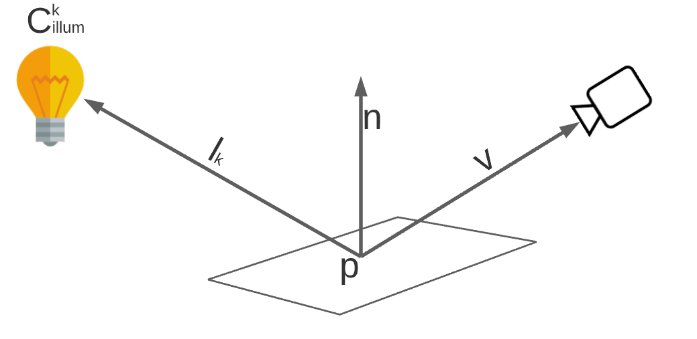
*Figura 2.32: Una superficie siendo iluminada y las direcciones de las que un*

modelo de sombreado depende.
La función f en la ecuación 2.7 representa la contribución por la iluminación am-
ambient
biental, la implementación más básica de esta función es una constante C para toda
ambient
la escena. Formas más complejas de esta función caen dentro de una categoría de técnicas
llamadas Environment Mapping, Haines 2018 [9] posee un capítulo al respecto de estas, un
ejemplo popular es la técnica llamada Cube mapping, la cual consiste en proyectar la infor-
mación lumínica del entorno a un cubo cuyo centro coincide con la posición de la cámara,
posteriormente este cubo es muestreado para obtener el valor de f . La imagen 2.33
ambient
muestra un ejemplo de esta técnica.
Figura2.33:ImágenesdelatécnicaCubeMapping.(a)Entornoproyectadoa
los lados de un cubo, el cual es muestreado en (b) para iluminar otro cubo.
Por otro lado, la función f representa la componente de iluminación directa, usual-
direct

mente esta función tiene la siguiente forma:
f (Ck ,p,n,v,l ) = Ck f (p,n,v,l )max(0,n · l ) (2.8)
direct illum k illum BRDF k k
Dondef esunafunciónllamadabidirectional reflectance distribution function (BRDF),
BRDF
la cual es una propiedad de la superficie del material iluminado y describe como luz llegando
a la superficie es distribuida en todas las posibles direcciones de salida. La complejidad y
propiedades de esta función depende del modelo de iluminación. Por otro lado, el factor
max(0,n · l ) proviene del hecho de que los rayos emitidos por la fuente de luz serán
k
distribuidos en una superficie cada vez más amplia a medida que el ángulo entre la normal de
la superficie y l se aproxima a π, la imagen 2.34 ilustra esta situación. Finalmente, Ck
k 2 illum
también puede depender de la posición de la superficie siguiendo las ecuaciones descritas en
la sección 2.3.6.

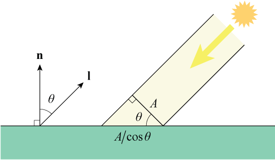
*Figura 2.34: Los rayos emitidos por una fuente de luz que ocupan un área*

A, serán distribuidos en un área en la superficie iluminada inversamente
proporcional al coseno del ángulo entre la dirección de la normal de esta
y un vector en la dirección de la luz. En el caso límite donde el ángulo es
π
igual a el tamaño de la superficie es infinito y por lo tanto la intensidad
lumínica será nula. (Lengyel 2019 [10])

##### 2.3.7.1. Reflexión Difusa
La reflexión de tipo difusa, también llamada Lambertian reflection, es una producida por
superficies que a nivel microscópico poseen una superficie rugosa, esto produce que parte
de la luz incidente en un punto de esta superficie sea reflejada en direcciones aleatorias. El
efecto macroscópico de esta configuración da la apariencia que cierto color, llamado color
difuso o albedo C , sea reflejado uniformemente sobre el hemisferio de direcciones. En
diffuse
otras palabras, la apariencia de la superficie no depende de la posición del observador. La
manera más simple de modelar este tipo de reflexión usa un valor para la función f
BRDF
de la ecuación 2.8 constante para todas las direcciones, la siguiente ecuación describe esta
función:
C
f = diffuse (2.9)
BRDF
π

Donde el valor de π en el denominador representa un factor de normalización, el cual puede
ser omitido en modelos no interesados en describir la realidad física. El color C aún
diffuse
puede mantener dependencias en la posición sobre la superficie.

##### 2.3.7.2. Reflexión Especular
Además de la uniforme reflexión difusa, las superficies tienden reflejar luz fuertemente en
la dirección dada por la reflexión de la dirección incidente de la luz por el eje definido por
la normal de la superficie, esta dirección está ilustrada por el vector v en la imagen 2.35. A
diferencia de la reflexión difusa, la especular sí depende de la posición del observador.
Un modelo que produce resultados creíbles, pero sin tener casi ninguna base física, usa la
siguiente expresión.
S = C C max(r·v,0)α (2.10)
illum specular
Donde el factor max(r ·v,0)α representa que tan alineado están las direcciones de reflexión
y una que apunta hacia el observador, los vectores r y v respectivamente de la imagen 2.35.
El exponente especular α controla que tan compactos son los brillos especulares. Las figuras
de la derecha de la imagen 2.36 muestra el sombreado para una superficie sombreada con
valores de α aumentando de izquierda a derecha.

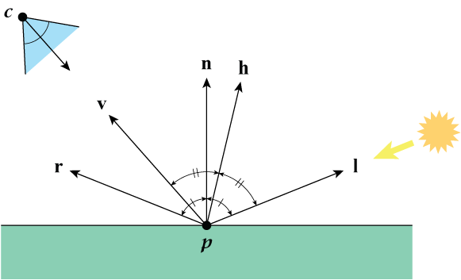
*Figura 2.35: La imagen muestra las distintas direcciones importantes en el*

proceso de sombreado (Lengyel 2019 [10])
Una formulación alternativa usa una dependencia en un vector llamado halfway vector, el
vector h en la imagen 2.35, el cual se calcula sumando, y posteriormente renormalizando, las
direcciones que apunta desde la superficie al observador y desde la superficie a la fuente de
luz. De esta manera la ecuación que describa la reflexión especular es la siguiente:
S = C C max(n·h,0)α (2.11)
illum specular
Un modelo de iluminación popular llamado Blinn-Phong describe las superficies sumando
una reflexión difusa con una especular dependiente del halfway vector. Las figuras de la

derecha de la imagen 2.36 muestran una superficie iluminada con este modelo de iluminación.
La ecuación que define el modelo Blinn-Phong es la siguiente:
(cid:26) (cid:27)
f (Ck ,n,v,l ) = Ck C max(n·l ,0)+C max(n·h ,0)α (2.12)
direct illum k illum diffuse k specular k
Figura2.36:Laimagendelaizquierdamuestraunmodelosombreadoúnica-
menteconreflexióndifusa,mientrasqueelrestoagregarareflexiónespecular
con un valor de α cada vez más alto. (Lengyel 2019 [10])

##### 2.3.7.3. Cook-Torrance
Como ya se mencionó, los modelos de reflexión especular de la sección anterior no intentan
ser físicamente plausibles, sin embargo, existe un conjunto de técnicas, usualmente llamadas
PBR (Physically Based Rendering) que siguen una teoría más parecida a la del mundo físico.
El principal elemento de todas estas técnicas es uno llamado microfacets. Cada microfacet
es equivalente a un pequeño espejo perfecto que obedece las leyes de la electrodinámica, y
dependiendo de la rugosidad de la superficie, la alineación de estas microfacets puede variar
bastante. La imagen 2.37 ilustra la diferencia de esta variación donde una superficie rugosa
(figura derecha), posee cambios más erráticos de orientación.

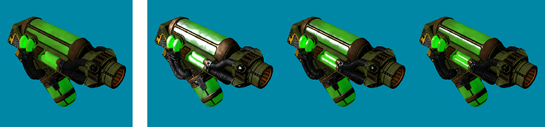
*Figura 2.37: La rugosidad de una superficie caracteriza la variación de la*

orientación de las microfacets
UnmodelodeiluminaciónllamadoCook-Torrance[12],sigueestateoríaypermitecalcular
una reflexión especular más físicamente plausible. Para este modelo la función f de la
BRDF
ecuación 2.8, a la que en este caso llamaremos f , tiene la siguiente forma:
Cook−Torrance
F(h,v)NDF(n,h)G(n,v,k,l)
f (n,v,h,l) = (2.13)
Cook−Torrance 4(n·l)(n·v)
Donde la función F, se llama función de Fresnel, y esta describe la cantidad y color de la luz
reflejada como función del ángulo de incidencia. La función G se llama función de atenuación
geométrica y describe la posibilidad de que las microfacets eviten que luz entre o salga de
la superficie, la imagen 2.38 ilustra esta situación. Finalmente, la función NDF se llama en

ingles Normal distribution function y aproxima la cantidad de microfacets cuya normal está
alineada al halfway vector.

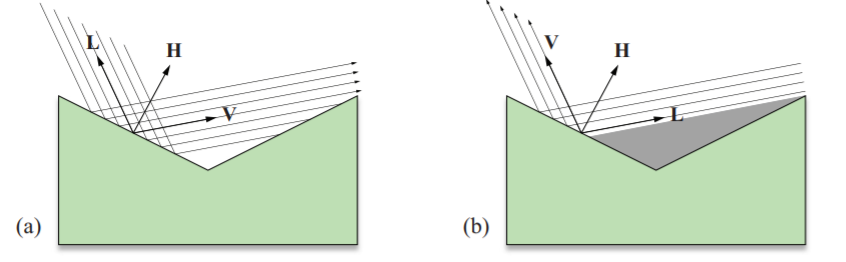
*Figura 2.38: (a) La luz reflejada por la microfacet izquierda es parcialmente*

bloqueadaporlamicrofacet derecha.(b)Luzesbloqueadaporlamicrofacet
derecha antes de alcanzar la izquierda.
ParaevaluarlafuncióndeFresnelusualmenteseusaaproximaciónllamadaFresnel-Schlick.
La ecuación que describe esta aproximación es la siguiente.
F (h,v) = F +(1−F )(1−(h·v))5 (2.14)
Schlick 0 0
Donde F corresponde a la reflectividad 15 cuando la dirección desde la superficie a la fuente
lumínica forma un ángulo de 0 grados.
En Karis 2013 [13], el autor señala que Unreal Engine 4 usa para la función NDF, una
conocida como Trowbridge-Reitz/GGX descrita por la siguiente ecuación.
α2
NDF(n,h,α) = (2.15)
π((n·h)2(α2 −1)+1)2
Donde α es un parámetro que describe la rugosidad de una superficie. Artistas generalmente
trabajan con un parámetro llamado roughness para describir la rugosidad de una superficie,
una muestra de esta textura con el parámetro α sigue la relación α = roughness2.
Por otro lado, el mismo artículo indica que para la función de geometría G, Unreal usa
una que sigue la siguiente ecuación.
n·v
G (n,v,k) =
1 (n·v)(1−k)+k (2.16)
G(n,v,l,k) = G 1(n,v,k)G (n,l,k)
1 1
En este caso k con el parámetro roughness siguen la relación k = roughness+1.
Finalmente, considerando también la componente reflexión difusa normalizada y reempla-
zando en la ecuación 2.8, se obtiene un modelo físicamente plausible que considera reflexión
difusa y especular, el cual sigue la siguiente ecuación:
(cid:26) C (cid:27)
f (Ck ,n,v,l ) = Ck k diffuse +k f max(0,n·l ) (2.17)
direct illum k illum d π s Cook−Torrance k
15https://es.wikipedia.org/wiki/Reflectividad

Donde se omitieron algunas dependencias por claridad. Además, dado que esta ecuación
intenta describir un modelo físicamente plausible, por conservación de la energía las constan-
tes k y k deben sumar 1. Finalmente, una forma sencilla para estimar k es usar la función
d s S
de Fresnel descrita por la ecuación 2.14.

##### 2.3.7.4. Materiales
La caracterización de la superficie de un objeto renderizado suele llamarse material. Los
materiales definen los parámetros de los que dependen los modelos recién descritos. Y como
ya se mencionó, esta descripción puede ser constante sobre toda la superficie, o variar a nivel
de vértice o usando texturas.

#### 2.3.8. Pipeline de renderizado
El conjunto de etapas por el cual debe pasar una escena para producir una imagen final
suele llamarse pipeline de renderizado, este consta de tres etapas principales, la primera se
llama Etapa de Aplicación, y es la única etapa que sigue implementándose en CPU, las
siguientes dos llamadas Etapa de Geometría y Etapa de Rasterización son implemen-
tadas en GPU. La imagen 2.39 muestra dichas etapas y como estas también pueden consistir
en pipelines mas atómicas.

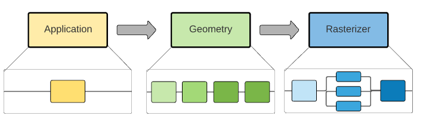
*Figura 2.39: Pipeline simplificado de renderizado, donde se ve que cada una*

de las etapas principales puede ser aun más dividida.
La etapa de aplicación trabaja a nivel de mallas geométricas, mientras que la de geometría
lo hace a nivel de vértices o primitivas básicas como triángulos, puntos u otras. La etapa de
rasterización primero transforma cada primitiva básica en un conjunto de elementos llamados
fragments, el proceso crea uno de estos elementos por cada píxel que la primitiva ocupa de
la imagen final para luego trabajar sobre estos.
A su vez, la etapa de Aplicación, dentro del pipeline de renderizado, tiene otras 3 etapas
principales: determinar el conjunto de objetos visibles por la cámara de la escena siendo
renderizada, enviar a la GPU la geometría que se debe renderizar y enviar a esta misma
los parámetros, como los descritos en 2.3.7.4, para llevar a cabo los cálculos de sombreado.
Para la primera etapa de determinación de visibilidad se usan estructuras de datos espaciales
comoOctrees16 paradeterminarrápidamenteelconjuntodeobjetosvisiblesydeestamanera
16https://en.wikipedia.org/wiki/Octree

evitar que geometría innecesaria pase a las etapas siguientes. Por otro lado, en las siguientes
dos etapas el orden en que la geometría y parámetros son enviados a GPU es tal que optimiza
el rendimiento, por ejemplo se envía primero la geometría que se encuentra más cercana a
la cámara para evitar que sean pintados píxeles que finalmente serán sobreescritos por otra
geometría.
Como ya se mencionó, las etapas de geometría y rasterización son implementadas en GPU,
laimagen2.40muestralasetapasdedichaimplementación.Dentrodelasetapasdeestepipe-
line existen tres tipos: fijas, configurables y programables. Las etapas fijas son completamente
programadasporlosdesarrolladoresdedriversdeGPUynopuedensermodificadasporusua-
rios de APIs gráficas, mientras que las etapas configurables permiten a los usuarios de estas
APIs configurar un conjunto de parámetros para cambiar su comportamiento. Finalmente,
las etapas programables permite a los usuarios escribir código que será ejecutado en la GPU,
estas etapas al igual que el código escrito son llamadas Shaders; Vertex Shader para la
etapa que trabaja sobre vértices, Fragment Shader para la que trabaja sobre fragments y
Geometry Shader para la que trabaja sobre primitivas geométricas.

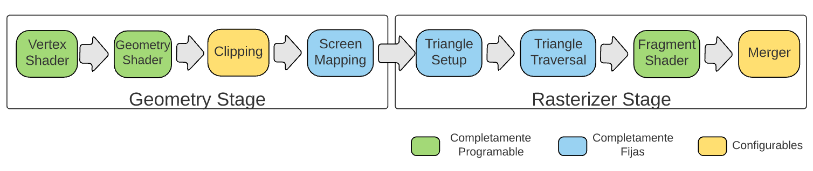
*Figura 2.40: Pipeline de como la GPU implementa las etapas de geometría*

yrasterización.Loscoloresdecadaetapaseñalansiestassonprogramables,
configurables o fijas.
Es importante mencionar que el pipeline que la imagen 2.40 ilustra no es necesariamente
representativo de todos los sistemas de renderizado, ya que existen otras etapas opcionales
como Tessellation Shader17. Esta imagen es aún menos representativa si se considera la
reciente capacidad de escribir código que puede ser ejecutado en GPU que no corresponde a
ninguna de las etapas de la imagen 2.40, este tipo de código es llamado Compute Shader18.
Un estudio de las implementaciones que hacen uso de las otras etapas opcionales y/o de
Compute Shaders quedó fuera del alcance de este trabajo.
A continuación se describen cada una de las etapas de la imagen 2.40:
Vertex Shader: Esta es la primera etapa del pipeline y es completamente programable.
La información de entrada son las posiciones y cualquier otro atributo pertinente de
cada vértice de alguna primitiva, por ejemplo, la entrada podrían ser los atributos de
los vértices de una malla geométrica como la descrita en la sección 2.3.1. El principal
trabajoquedeberealizarestaetapaconsisteentransformarcadaunadelasposicionesde
estos vértices desde object space a clip space usando las operaciones matriciales descritas
en 2.3.3. La salida de esta etapa es similar a su entrada, es decir, si como entrada
17Tessellation Shader en la librería OpenGL https://www.khronos.org/opengl/wiki/Tessellation
18Compute Shader en la librería OpenGL https://www.khronos.org/opengl/wiki/Compute_Shader

cada vértice tiene por atributos posiciones y normales, la salida por lo general será una
posición y una normal.
Geometry Shader:Esteshaderesopcionalycompletamenteprogramable,estetrabaja
a nivel de primitivas básicas como puntos, líneas o triángulos, puede tanto modificarlas
como crear nuevas. La imagen 2.41 muestra un ejemplo muy sencillo de como se podría
ocupar, donde inicialmente son mandados a dibujar un conjunto de puntos y es en el
geometry shader que se crean estos tres triángulos por cada uno de estos puntos.

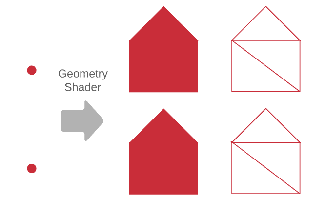
*Figura 2.41: Ejemplo de geometry shader que al recibir un punto como*

primitiva lo transforma en tres triángulos.
Clipping: Esta etapa fija tiene como entrada las primitivas con vértices en clip space,
y dentro de esta se chequean las desigualdades que definen un volumen llamado viewing
volumen descrito por las desigualdades de la ecuación 2.2. Cada primitiva puede estar
en una de tres posibles situaciones, la primitiva puede estar completamente contenida en
el viewing volumen, parcialmente contenida o completamente fuera. En el primer caso la
primitiva pasa a la siguiente etapa sin cambios, en el tercero la primitiva es descartada
completamente y en el segundo se deben generar vértices extras para pasar a la siguiente
etapa, la imagen 2.42 ilustra este proceso.


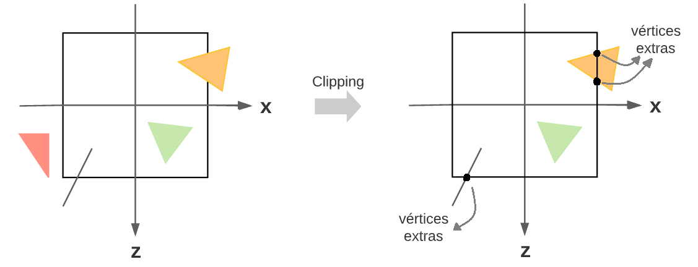
*Figura 2.42: La imagen ilustra los tres tipos de resultados que la etapa*

de clipping puede tener: primitivas rechazadas, aceptadas sin cambios y
aceptadas pero con vértices extras.
Screen Mapping: Esta etapa es fija y cumple la básica función de cambiar los vér-
tices de clip space a screen space, espacios descritos en 2.3.3, este cambio de espacio
corresponde al último paso en la imagen 2.20.
Triangle Setup: Esta etapa es fija y su función es la de inicializar el hardware de
rasterización para convertir el conjunto de triángulos en fragments.
Triangle Traversal: En esta etapa cada triángulo se discretiza en un conjunto de
fragments y al igual que las otras dos etapas anteriores esta no se puede modificar.
Además, en esta etapa son interpolados los atributos de los vértices a cada fragment. La
imagen muestra el resultado de este proceso para un triángulo con información de color
en cada vértice.

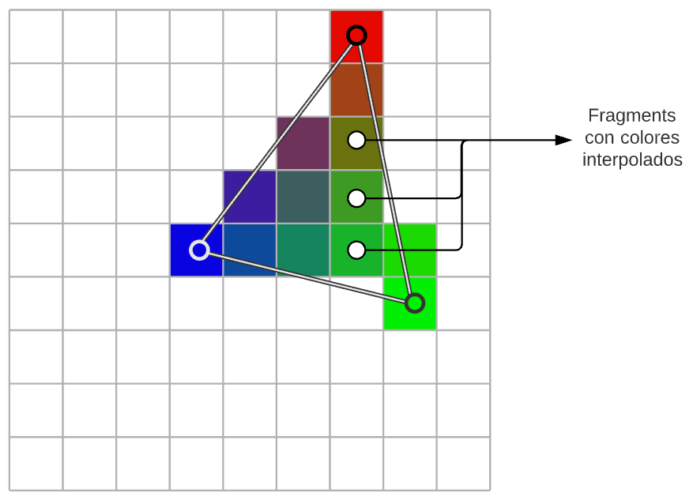
*Figura 2.43: La imagen muestra el resultado de la etapa Triangle Traversal*

del pipeline de renderizado, donde un triángulo es discretizado en un con-
junto de fragments, además para cada uno de estos el atributo de color es
interpolado a partir del valor en los vértices.

Fragment Shader: Esta etapa es completamente programable, y usualmente es la en-
cargada de sombrear los objetos usando algún modelo de iluminación como los descritos
en 2.3.7. La entrada de cada fragment consiste en los valores interpolados desde los
atributos de cada vértice, generados por la etapa de Triangle Traversal. Dada la relación
entre fragments y píxeles es común que esta etapa a veces se llame pixel shader.
Merger: Esta etapa es configurable y su principal responsabilidad es combinar el color
actual de la imagen resultante con el color de salida de la etapa de Fragment Shader.

#### 2.3.9. OpenGL
La biblioteca gráfica que se ocupó en este trabajo de título fue OpenGL, principalmente
por la familiaridad con esta y por ser multi-plataforma. Una descripción detallada de esta
biblioteca queda fuera del alcance de este trabajo de título, tanto Sellers 2015 [14] como el
sitio learnopengl [15] ofrecen una introducción más detallada y con múltiples ejemplos de uso,
mientras que la wiki [16] contiene información oficial de la biblioteca pero carece de ejemplos.
A continuación se describen superficialmente los elementos mas importantes de esta bi-
blioteca para este trabajo de título:
Vertex buffers, index buffers y vertex arrays, juntos estos tres permiten describir
en GPU las mallas de triángulos caracterizadas en la sección 2.3.1. Los datos de la lista
de vértices es mantenida por un vertex buffer mientras que la lista de índices con la
información de los vértices que componen cada triángulo es mantenida por un index
buffer. Los vertex buffer solo constituyen los datos de los vértices, estos desconocen los
atributos que estos datos representan, es a través de un vertex array que se describe la
distribución en memoria de cada atributo.
Shaders y programs, los primeros representan las implementaciones desarrolladas por
el usuario de las etapas con este mismo nombre, mientras que un program enlaza al
menos un vertex shader y un fragment shader para crear un pipeline como el de la
imagen 2.40. Todos los shaders de OpenGL son desarrollados usando un lenguaje de
programación llamado OpenGL Shading Language (GLSL)19.
Para enviar datos como las matrices de transformación descritas en 2.3.3 y/o los pará-
metros de los modelos de iluminación caracterizados en 2.3.7, la API de OpenGL provee
de Uniforms que son variables declaradas en el código de shaders y se le asignan valores
desde CPU a GPU a través de llamados a funciones con prefijo glUniform con el valor
de la uniforme más un entero que indica la ubicación de esta dentro del shader.
OpenGL permite cargar texturas en GPU las cuales después pueden ser configura-
das como uniformes, para finalmente ser muestreadas durante el proceso de sombreado
dentro de algún shader.
Todos estos elementos recién mencionados no se trabajan como tipos al usar la API de
OpenGL, en cambio, al momento de crear cada uno de estos elementos, OpenGL entrega un
enteroidentificador.Porejemplo,lacreacióndeunvertexbuffersehacemedianteelllamado
a la función glCreateBuffer la cual retorna un entero que identifica este buffer, operaciones
19https://en.wikipedia.org/wiki/OpenGL_Shading_Language

subsecuentes sobre el buffer se hacen usando este entero identificador. Finalmente, con todos
estos elementos es posible usar llamados como glDrawElments para comenzar el proceso
de renderizado.

### 2.4. Animación
Siunjuegooaplicacióndentrodelosobjetosquesimulatieneunpersonajecuyomovimien-
to es relativamente orgánico como el de personas, animales o incluso robots, este necesitará
algún tipo de sistema de animación. Dentro de los principales métodos de animación están:
1. Animación basada en sprites.
2. Animación basada en vértices.
3. Morph Targets.
4. Animación basada en esqueletos.
El primer tipo tiene como principal usuario aplicaciones en 2D, o elementos 2D dentro de
una escena 3D, y consiste en tener una serie de imágenes usualmente llamadas sprites que se
intercambian para dar la ilusión de movimiento. La animación basada en vértices sí podría
tener uso en aplicaciones 3D, pero dado que esta consiste en entregar información por cada
vértice, esta suele escalar de mala manera ya que hoy en día las mallas que se animarían
consistirían en millones de vértices. Morph Target consiste en una variación de animación
basada en vértices en donde se generan un conjunto de poses extremas, luego la posición de
cada vértices se calcula como la interpolación lineal de un conjunto de estas poses extremas,
este tipo de animación es generalmente usado en expresiones faciales dada la complejidad
de la musculatura del rostro, en este caso las poses extremas consistirían en un rostro son-
riendo, otro enojado y otras emociones. La imagen 2.44 muestra ejemplos de estos tipos de
animaciones.


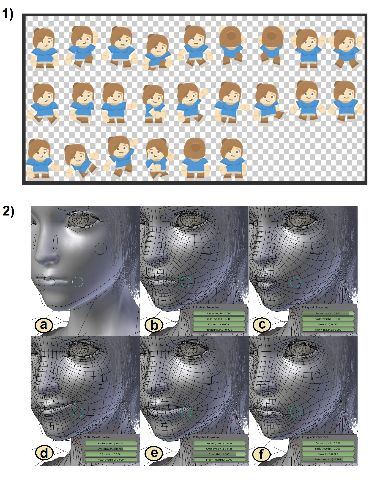
*Figura 2.44: Ejemplo de animación basada en sprites (imagen 1) ) y morph*

targets (imagen 2)), en particular este consta con 4 poses extremas (imáge-
nes 1.c, 1.d, 1.e, 1.f).20
Porúltimo,laanimaciónbasadaenesqueletoseseltipodeanimaciónquehoyendíapredo-
mina para aplicaciones 3D. Esta se realiza usando un conjunto de articulaciones, usualmente
llamado esqueleto, el cual está asociado a una malla geométrica, la imagen 2.45 muestra un
ejemplo de esto. Los artistas en este caso no animan a nivel de vértice de la malla sino que lo
hacen por medio de las articulaciones, las cuales son mucho menor en número en comparación
con los vértices. A continuación se entrará en detalle sobre este tipo de animación.
20Las imágenes fueron obtenidas de https://learn.unity.com/tutorial/introduction-to-sprite-animations y
https://en.wikipedia.org/wiki/Morph_target_animation.


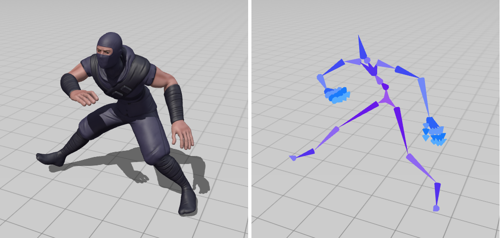
*Figura 2.45: Un modelo animado usando animación basada en esqueletos*

del sitio mixamo (https://www.mixamo.com/). A la izquierda esta la malla
geométricarenderizadayaladerechaelesqueletoqueseusóparaanimarlo.

#### 2.4.1. Esqueletos
Como su nombre lo dice una parte importante de la animación basada en esqueletos, es
el esqueleto. Este se constituye de un número de articulaciones, también llamadas huesos,
las cuales forman una jerarquía o árbol, esta jerarquía suele seguir la anatomía del objeto
animado. Dado que cada articulación tienen un único padre, salvo la raíz que posee ninguno,
la jerarquía queda descrita guardando en cada articulación el índice de su padre. Con esto,
para describir completamente cada articulación del esqueleto, estas suelen tener la siguiente
información :
Un string que representa el nombre de la articulación, por lo general se usan nombres
intuitivos como “Hombro Izquierdo” u otros nombres de articulaciones reales.
Un índice o puntero que indique el padre de la articulación.
Una matriz que representa la traslación, rotación y escala inversa de la articulación
cuando es asociada a una malla geométrica, está generalmente se llama inverse binding
matrix. Se profundizará en el uso y significado de esta matriz en la sección 2.4.5.
La imagen 2.46 muestra un ejemplo de la jerarquía de articulaciones de un esqueleto.

Figura2.46:Jerarquíadearticulacionesdeunesqueletousadoenanimación
[10].

#### 2.4.2. Mallas para animación basada en esqueletos
Además del esqueleto es necesario tener una malla o mesh, equivalente a las mallas des-
critas en 2.3.1, que es finalmente lo que termina siendo renderizado en la pantalla. Para
asociar un esqueleto con esta malla, está además de tener en cada vértice información típica
de posiciones y normales debe tener información extra de como cada vértice es influenciado
por las articulaciones o huesos del esqueleto, es por esto que este tipo de animación también
suele llamarse skinned animation y las mallas que participan de este proceso skinned meshes,
ya que los vértices actúan como piel visible que es influenciada por las posiciones de las ar-
ticulaciones del esqueleto sin representación visual en la aplicación final. De esta forma un
vértice de una malla de este tipo debe tener como mínimo la siguiente información:
Un vector de 3 dimensiones con la información de posición del vector.
Índices que indican que articulaciones afectan a este vector, usualmente el número de
índices no es muy grande por temas de rendimiento.
El peso que tiene cada articulación, afectando este vértice, en el resultado de la posición
final. Tiene que haber la misma cantidad de pesos que de índices.

La imagen muestra una simple malla de un brazo, en donde los vértices ubicados en el codo
son afectados de igual manera por las articulaciones de nombre joint1 y joint2, mientras
que los vértices del antebrazo son afectados por la articulación joint2 y los del brazo por la
articulación joint1.

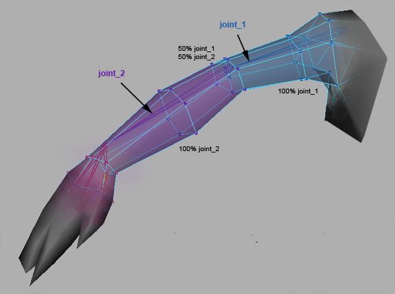
*Figura 2.47: Malla geométrica donde cada vértice tiene la información de*

cuales articulaciones lo afectan en el proceso de animación. 21

#### 2.4.3. Poses
Para cualquier tipo de animación es necesario algún tipo de información a través del
tiempo,paraelcasodeanimaciónbasadaenesqueletosestacorrespondeaposesdelesqueleto,
estas poses se componen de una pose para cada una de las articulaciones, así una pose para
un esqueleto de N articulaciones queda definida por N poses una para cada articulación. La
imagen 2.48 muestra un esqueleto en dos poses distintas, la de la izquierda es de especial
importancia llamada bind pose, ya que es esta pose la que se usa al momento de asociar
mallas geométricas con esqueletos, es decir, es la pose que la malla geométrica tendría si esta
no pasara por ningún proceso de animación.
21La imagen fue obtenida de https://www.gamasutra.com/view/feature/1566/skinned_mesh_export_
optimization.php.


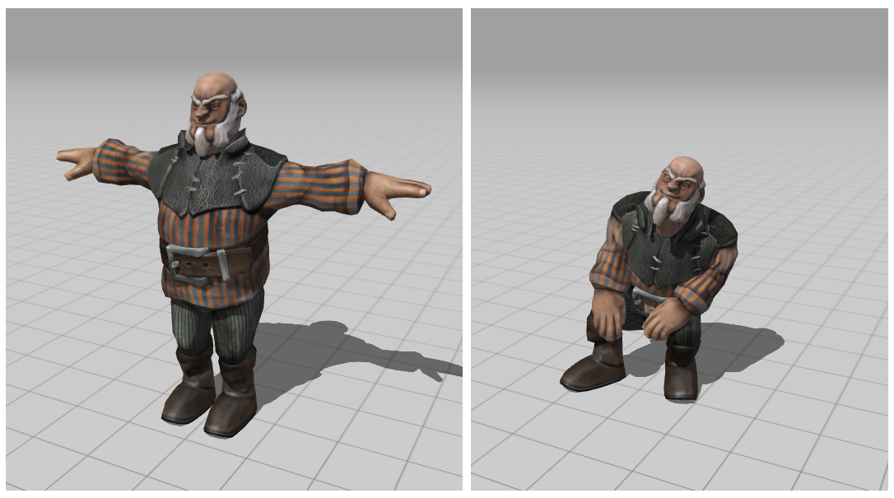
*Figura 2.48: Dos poses de un personaje animado obtenido desde https://*

www.mixamo.com/. La pose de la izquierda es llamada bind pose ya que se
usa para asociar la malla con el esqueleto que se usará para animar.
La pose de una articulación se compone de una translación, rotación y escalamiento, y
para representarlas existen dos principales acercamientos uno es usando matrices de 4x4
dimensiones similar a las descritas en 2.3.2 o usando una estructura de datos llamada SQT22
que contiene un vector de 3 dimensiones para translación, un quaternion para representar la
rotación y otro vector de 3 dimensiones para representar el escalamiento, la representación
matricial tiene problemas con procesos de interpolación por lo que se suele optar por la
representación SQT.
A su vez, cada pose de una articulación puede ser vista como un sistema de coordenadas
y la jerarquía del esqueleto como una cadena de cambios de estos sistemas de coordenadas.
Dichoesto,existendosformasdedescribirlaposedeunaarticulación,conrespectoalsistema
de coordenadas de su padre o con respecto a la raíz del esqueleto. En el primer caso se dice
que la pose es una pose local o local pose y en términos de transformaciones de sistema de
coordenadas o espacio esta transforma desde el espacio de la articulación actual al de la
articulación padre. En el segundo caso se dice que la pose es una pose global o global pose
y esta transforma desde el sistema de coordenadas de la articulación actual al espacio de la
articulación raíz, este espacio suele llamarse Model space o Object Space, que es equivalente
al descrito en 2.3.3.
Por lo general las poses son trabajadas como poses locales, pero ya que como mínimo el
sistema de renderizado necesita poses globales siempre será necesario transformarlas. Como
ya se mencionó, cada pose local de cada articulación transforma desde el espacio de esta
articulación al espacio de la articulación padre, entonces para poder obtener la pose global
quetransformadesdeelespaciodeestaarticulaciónaldelaraízdelesqueletobastaencadenar
lastransformacionesdecadaarticulaciónhastallegaralaraíz.Laimagenmuestraunejemplo
de este proceso, donde P corresponde a la pose local de la articulación i y P a la
locali globali
pose global de esta misma articulación.
22Elnombrevienedelhechoquelaestructuraestácompuestaporunaescala,unquaternionyunatraslación


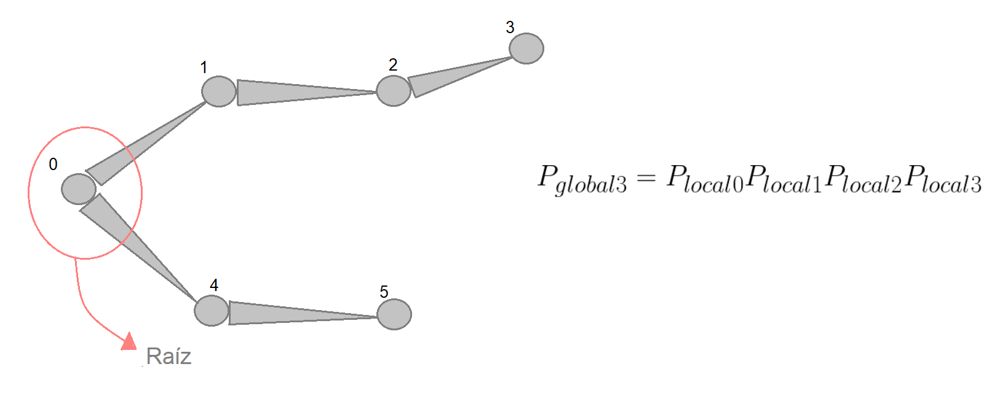
*Figura 2.49: Un esqueleto simple que muestra la relación entre poses locales*

y globales.
Finalmente, si definimos el conjunto C como la cadena de índices de articulaciones que
lleva desde la articulación i a la articulación raíz la relación general entre poses locales y
globales puede ser descrita como:
= Q
P P (2.18)
globali j∈C localj

#### 2.4.4. Clips de Animación
Tener una única pose en el tiempo no es suficiente para poder animar un personaje, para
estoesnecesariotenerunconjuntodeestas,esteconjuntodeposessueleguardarseenarchivos
llamados clips de animación. Para un videojuego estos clips suelen representar acciones que
un personaje puede hacer dentro de este, como correr, caminar o atacar, así un clip podría
tener todas las poses para hacer que el personaje parezca caminar.
Cada clip de animación consiste de un número discreto de poses las cuales suelen llamarse
también muestras o samples, estas muestras están distribuidas a lo largo de la duración del
clip de animación. Dado que es generalmente imposible hacer calzar el paso del tiempo de la
aplicación con el de las muestras del clip de animación, es responsabilidad del motor poder
obtener una muestra representativa para cualquier valor de tiempo, esto se logra usualmente
usando interpolación lineal entre las muestras más cercanas, este proceso se explicará más en
detalle en la sección 2.4.7. La imagen 2.50 muestra un posible ejemplo de clip de animación
de 2 segundos de duración con 5 muestras, que en el caso de necesitar tomar una muestra
para t = 1.25s se necesitará interpolar entre las poses en t2 y t3.


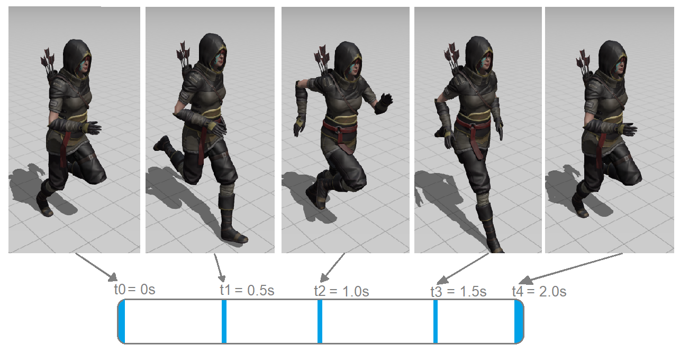
*Figura 2.50: Clip de animación de un personaje corriendo de 5 segundos*

de duración con 5 poses o muestras obtenidas desde el sitio https://www.
mixamo.com/. La linea de tiempo es hipotética y no representa un clip de
animación real.

#### 2.4.5. Skinning
Los vértices de una skinned mesh deben seguir los movimientos del esqueleto para que la
animación se lleve a cabo, para esto los vértices de esta malla deben ser transformados desde
sus posiciones originales cuando el esqueleto se encontraba en bind pose, a nuevas posiciones
ahora siguiendo al esqueleto en una nueva pose, la matriz que aplica esta transformación se
llama skinning matrix y existe una matriz por cada una de las articulaciones del esqueleto,
este conjunto es llamado matrix palette o paleta de matrices. Es esta paleta de matrices la
que usualmente se envía a la GPU para poder realizar las transformaciones necesarias para
animar los vértices de la malla.
Por otro lado, los vértices de la malla, al momento de ser asociados con el esqueleto, están
en el espacio de modelo o Model space, por lo que la matriz que se busca deberá transformar
los vértices desde este espacio, devuelta al mismo pero con distinta pose. Como ya se men-
cionó, las poses globales de cada articulación permiten transformar desde el espacio de esta
articulación al espacio del modelo, entonces hace falta una matriz que haga la transformación
inversa, esta matriz es llamada inverse bind matrix y es la inversa de la pose global de esta
articulación al momento en que la malla se asoció al esqueleto. La fórmula 2.19 muestra como
calcular la matriz de skinning para una articulación de índice i.
M = P M−1 (2.19)
skinningi globali bindMatrixi
Es importante notar que por lo general las poses están en formato SQT el cual debe
transformarse a una matriz para poder llevar a cabo la multiplicación. Finalmente, para el
caso en donde cada vértice v es afectado por las articulaciones en el conjunto de índices I
j j

la ecuación de transformación que se debe aplicar a cada vértice es la siguiente.
vnew = (P w M ) vbind (2.20)
modelj i∈I i skinningi modelj
j
Donde vnew corresponde a un vector posición de la malla geométrica de índice j en Mo-
modelj
del space en la pose nueva y vbind al mismo vértice en el mismo espacio pero en la pose con
modelj
la que se asoció al esqueleto, y w corresponde a los pesos que tiene cada articulación afec-
tando a este vértice. Finalmente, es posterior a esta transformación que las transformaciones
de modelo, vista y perspectiva mencionadas en 2.3.3 se aplican.

#### 2.4.6. Relación entre Esqueletos, Mallas, Poses y Clips
ElsiguientediagramaUML2.51muestralasrelacionesentrelasentidadesreciéndescritas.
En esta imagen se ve que un esqueleto se compone de un conjunto de articulaciones, una
malla para renderizado tiene una referencia a un esqueleto, pero el mismo esqueleto puede
ser referenciado por distintas mallas, esto ocurre cuando por ejemplo distintos personajes
poseen movimientos y/o anatomías parecidas, lo mismo ocurre con clips de animación donde
cada uno referencia a un único esqueleto, pero distintos clips de animación pueden referenciar
a un mismo esqueleto. Finalmente, existen un proceso llamado Animation Retargeting 23, el
cual permite aplicar animaciones hechas para un esqueleto a uno distinto, rompiendo un poco
con la cardinalidad de la imagen, este proceso se dejó fuera del alcance de este trabajo.

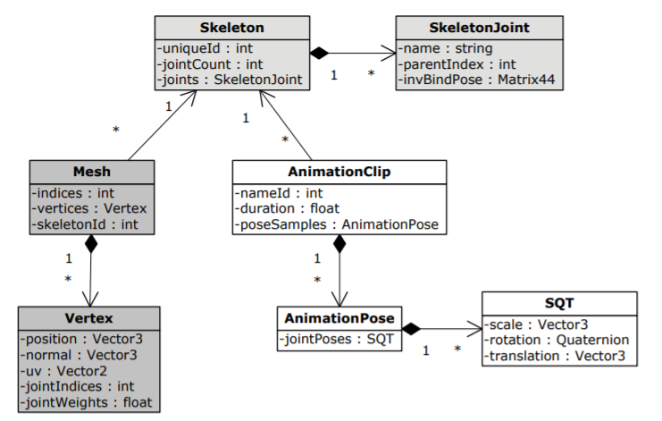
*Figura 2.51: UML de las distintas entidades que participan en el proceso de*

animación [5] (Gregory 2019).
23https://docs.unrealengine.com/en-US/AnimatingObjects/SkeletalMeshAnimation/
AnimationRetargeting/index.html


#### 2.4.7. Blending
Animation blending se refiere a la técnica que permite a más de una pose aportar a la
pose final de una animación, estas poses pueden o no pertenecer a un mismo clip. Uno de
los usos principales corresponde a poder obtener una muestra de un clip de animación en un
tiempo que es diferente a todos los tiempos de las muestras de este clip, otro uso importante
correspondeafacilitartransicionessuavesentredistintosclips.Usosmáscomplejosinvolucran
poder determinar qué tanto cada clip de animación debe aportar a la pose final basado en
un conjunto de parámetros, ejemplo de estos podría ser un parámetro que represente que tan
rápido se está moviendo un personaje, el cual decidiría el aporte a la animación final de dos
clips de animaciones uno del personaje corriendo y otro de este caminando. Dentro de este
trabajo de título no se abordarán estos usos mas complejos pero Gregory 2019 [5] posee una
sección al respecto, y los Blend Trees de Unity24 y Blend Spaces de Unreal 25 corresponden
a ejemplos de implementación.

##### 2.4.7.1. Interpolación lineal
Un método central del proceso de blending es el de interpolación, y la interpolación lineal
(LERP)correspondealcasomáscomúnysencillodeestemétodo.Lainterpolaciónlinealper-
mitedadodosposesencontrarunaintermediaapartirdeunparámetrocontrolador,asísicon-
sideramos un esqueleto con N articulaciones con dos poses diferentes Pskel = {(P ) }|N−1
a a j i=0
y Pskel = {(P ) }|N−1 el valor de la pose final de cada articulación estará dado por:
b b j i=0
(P ) = (1−β)(P ) +β(P ) (2.21)
LERP j a j b j
Donde β suele llamarse blend factor con valores entre 0 y 1, la pose interpolada del esqueleto
completoseobtienealinterpolarlaposedecadaunadelasarticulaciones.Porotrolado,dado
que las poses generalmente están en formato SQT la ecuación 2.21 no es realmente correcta
sino que debe aplicarse a la translación, rotación y escalamiento por separado siguiendo las
siguientes ecuaciones.
(T ) = (1−β)(T ) +β(T ) (2.22)
LERP j a j b j
(S ) = (1−β)(S ) +β(S ) (2.23)
LERP j a j b j
sin((1−β)θ) sin(βθ)
(Q ) = (Q ) + (Q ) (2.24)
LERP j sin(θ) a j sin(θ) b j
Es importante notar que la ecuación para la interpolación de rotaciones es notoriamente
diferente y se llama interpolación lineal esférica (SLERP).
Para el caso en donde se debe obtener una pose de un clip de animación donde el tiempo
de la muestra requerida no corresponde a ninguna de las muestras del clip, si consideramos
t como el tiempo de la muestra de la pose que se quiere obtener y t1, t2 dos tiempos de
muestras contiguas del clip de animación que cumplen t1 < t < t2, entonces basta usar las
ecuaciones anteriores con las poses de las muestras en t1 y t2, y un factor β que sigue la
siguiente fórmula:
24https://docs.unity3d.com/Manual/class-BlendTree.html
25https://docs.unrealengine.com/en-US/AnimatingObjects/SkeletalMeshAnimation/Blendspaces/index.
html

t−t1
β = (2.25)
t2−t1
Comoyasemencionó,otrousocomúndelprocesodeblending eseldefacilitartransiciones
entre distintas animaciones, para esto el usuario otorga un tiempo corto de transición t ,
trans
con esto se interpola entre dos poses una obtenida desde el clip de animación inicial y otro
desde el clip al cual se desea transicionar usando un parámetro de interpolación que sigue la
siguiente relación:
t−t
β = start (2.26)
t
trans
Donde t corresponde al tiempo en donde comenzó la transición y t nuevamente es el
start
tiempo de la muestra que se quiera obtener.

#### 2.4.8. Pipeline
En el libro Game Engine Architecture [5] Jason Gregory señala que el pipeline o proceso
de animación consta de 6 etapas:
1. Descompresión de los clip de animación y extracción de las poses: Dado la
inmensa cantidad de datos que cualquier aplicación que haga uso de animación basada
en esqueleto la compresión de estos es de suma importancia, un estudio de este proceso
está fuera del alcance de este trabajo de título pero el libro recién mencionado [5] y una
entrada del blog de Nicholas Frechette26 ofrecen información al respecto. Dado esto, el
primer paso del pipeline consiste en descompresión de los datos de animación y entregar
como salida una pose por cada clip de animación activo.
2. Blending de poses: Esta etapa solo ocurre en caso de existir más de un clip de
animación participando del proceso. De ser así, el conjunto de poses locales de cada clip
es interpolado para obtener una única pose local.
3. Generación de poses globales: Dado que la pose del esqueleto en esta parte del
proceso se encuentra en espacio local es necesario recorrer la jerarquía del esqueleto,
siguiendo los pasos mencionados en la sección 2.4.3 para transformar dicha pose local
en una global.
4. Post proceso: Esta etapa también quedó fuera del alcance de este trabajo de título,
pero es aquí donde procesos como cinemática inversa (Inverse Kinematics 27), que busca
por ejemplo hacer calzar los pies de un personaje con el terreno en donde este se mueve.
Otro ejemplo de método que ocurre en esta etapa es el de simulación de Ragdolls28,
que tiene como uso típico el de simular el movimiento de personajes que perdieron la
conciencia.
5. Volver a calcular poses globales: De la etapa anterior es posible que la pose vuelva
a ser una pose local, lo que obliga a nuevamente a recorrer la jerarquía del esqueleto
para pasar a una global.
26http://nfrechette.github.io/2016/10/21/anim_compression_toc/
27https://en.wikipedia.org/wiki/Inverse_kinematics#Inverse_kinematics_and_3D_animation
28https://en.wikipedia.org/wiki/Ragdoll_physics

6. Generación de paleta de matrices: Estecorrespondealprocesodescritoen2.4.5.En
este momento la pose global final ya está generada y solo falta que sea pre-multiplicada
por la matriz llamada inverse binding matrix, y con esta se obtiene una matriz por cada
articulación lista para ser usada por el sistema de renderizado.

### 2.5. Sistema de Colisiones
El sistema de colisiones es muy importante para todo videojuego, usualmente es a través
de este que el jugador logra interactuar con el resto de las entidades que viven en el mundo
simulado. Si bien este sistema suele ir muy de la mano con un motor de física, esto no
es estrictamente necesario ya que dependerá de los tipos de aplicaciones que el motor busca
soportar.Ademásdepoderdetectarcolisionesentreunconjuntodeobjetos,estesistemadebe
usualmente soportar hacer consultas, por ejemplo, si genero un rayo desde cierta posición y
con cierta dirección, ¿Es este intersecado por algún(os) objeto(s) en la escena?.
El trabajo que realiza el sistema de colisiones se suele dividir en dos etapas: detección de
colisionesyresolución de colisiones.Enlaimagen2.52(Millington2010)estasdosetapas
son representadas por los pasos 3 y 4, las pasos 1 y 2 corresponden a etapas de un sistema
de física. La etapa de detección de colisiones, como su nombre lo indica es la encargada de
detectar el conjunto de objetos colisionando, tiene como entrada el estado actual de los todos
los candidatos a colisiones y su salida son un conjunto de contactos. La segunda etapa es
la responsable de decidir como se actualizarán las posiciones y velocidades de los objetos
teniendo como entrada este conjunto de contactos.

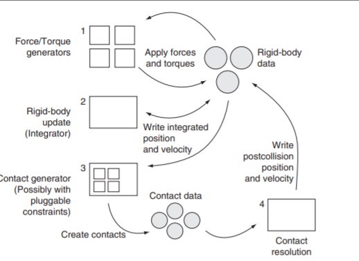
*Figura 2.52: Pipeline de un sistema de física y colisiones [17] (Millington*

2010).


#### 2.5.1. Detección de Colisiones
Detección de colisiones puede ser un proceso que consume mucho tiempo dado que cual-
quier objeto puede colisionar con cualquier otro, y peor aún si consideramos que cada candi-
dato a colisionar puede estar constituido por miles de polígonos. Por estas razones y porque
a nivel de usuario tener tanta fidelidad en los objetos simulados suele tener bajos beneficios
es que la geometría usada para la detección de colisiones y simulaciones físicas suele ser de
una complejidad mucho más baja que las geometrías usadas para los sistema de renderizado,
se prefiere optar por primitivas básicas como esferas, planos, cápsulas y axis align bounding
boxes o AABB dentro de otras (la imagen 2.53 muestra ejemplos de estas primitivas básicas).

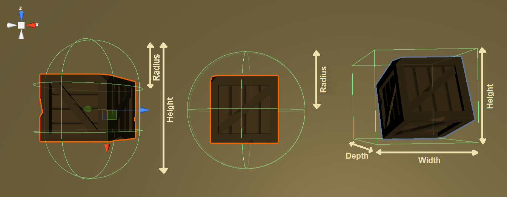
*Figura 2.53: Ejemplos de primitivas de colisiones con los parámetros que*

suelen definirlas. De izquierda a derecha: Una cápsula, una esfera y un
AABB.
Otra optimización que se aplica a esta etapa (detección de colisiones) es de separarla
en otras aun más atómicas. Generalmente se separa en 2-3 etapas llamadas Broad Phase,
Mid Phase y Narrow Phase, las primeras dos tienen como objetivo reducir la cantidad de
candidatos que podrían colisionar, mientras que en la tercera etapa es donde se realizan las
pruebas necesarias para determinar si efectivamente la lista de candidatos está colisionando
o no. Durante las primeras dos etapas se usan estructuras de datos espaciales para acelerar
el proceso de detección de candidatos, ejemplos típicos son Quad/Octrees29, Binary Space
Partition30, Bounding Volumen Hierarchies31(BVH) y grillas (la imagen 2.54 muestra un
ejemplo de BVH), todo esto para evitar el acercamiento de fuerza bruta O(n2) de chequear
cada par de objetos que podrían colisionar.
29https://en.wikipedia.org/wiki/Octree
30https://en.wikipedia.org/wiki/Binary_space_partitioning
31https://en.wikipedia.org/wiki/Bounding_volume_hierarchy


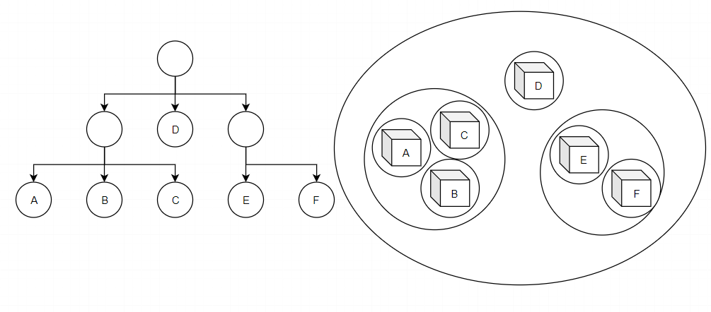
*Figura 2.54: Un ejemplo de BVH.*

Como ya se mencionó, la salida de la etapa de detección de colisiones es una lista de con-
tactos con la información de cada colisión, los contactos deben contener los datos necesarios
para la siguiente etapa, dentro de estos deben estar: posición de la colisión, normal de
la colisión, profundidad de intersección y otras características físicas como fricción y
restitución de los materiales de los objetos colisionantes.
Un problema típico de esta etapa aparece cuando existen objetos muy delgados y/o que
se mueven a altas velocidades. En el caso general basta iterar la simulación física en tiempos
discretos, pero en caso de existir objetos como los mencionados, puede pasar que colisiones
no sean detectadas, la imagen 2.55 muestra un ejemplo. Para estos casos se suele utilizar una
técnica llamada Continuous Collision Detection (CCD), que como su nombre lo indica trata
de encontrar el tiempo de colisiones independiente si este calza con la discretización del paso
del tiempo escogida.

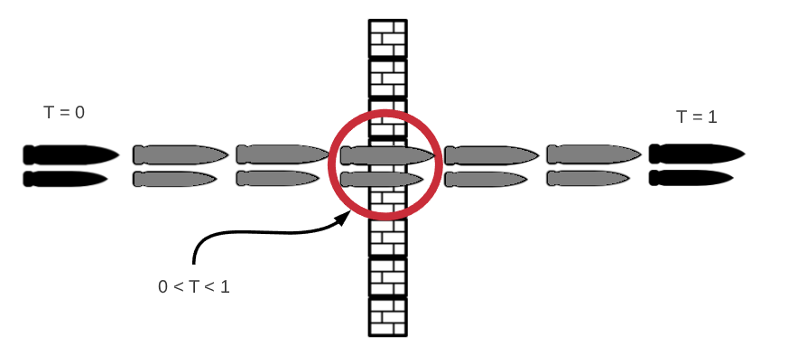
*Figura 2.55: La imagen ilustra el problema de detectar objetos que se mue-*

venrápidamente,inicialmentelabalaseencuentraalaizquierdayalavanzar
la simulación ahora esta se encuentra a la derecha sin que se haya detectado
una colisión. CCD permite detectar esta colisión que ocurre entre los dos
pasos de la simulación.


#### 2.5.2. Resolución de colisiones
Una vez terminada la etapa de detección el conjunto de contactos obtenidos es la entrada
para la etapa de resolución la cual consta de dos procesos perpendiculares, resolución de ve-
locidades y resolución de las intersecciones. El primero actualizando las velocidades, mientras
queelsegundolasposiciones.Laimagen2.56muestraunejemplodeintersecciónquemuestra
qué es cada uno de los datos de un contacto y como se podría resolver la intersección.

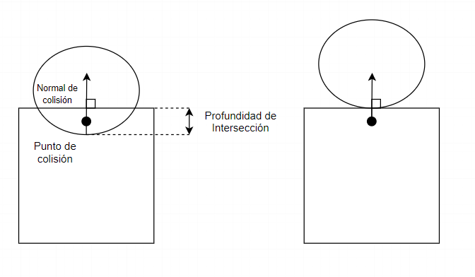
*Figura 2.56: A la izquierda un diagrama de una colisión con los datos que*

debería tener un contacto. A la derecha una posible resolución de esta coli-
sión.

#### 2.5.3. Eventos de colisiones
Un último factor importante es cómo se le informa al usuario del motor de la ocurrencia de
estas colisiones, esto es importante porque es común que durante una colisión se reproduzca
algún sonido o instancie algún tipo de objeto, o requiera hacer algún cambio de estado, del
cual el sistema de colisiones no tiene ni debería ser consciente. Para resolver este problema se
sueleutilizarunsistemadeeventos,elusuarioregistracallbacks32 aloseventosdecolisionesal
momentodeinstanciarunaprimitivaquepuedecolisionar.Cadavezqueelobjetoinstanciado
participe en una colisión, el sistema se encargará de llamar la función registrada.

#### 2.5.4. Colisiones en Unreal y Unity
TantoUnrealcomoUnitytienenacercamientossimilaresacomoexponenalosusuariossus
sistema de colisiones, ambos permiten agregar componentes con un conjunto de primitivas de
colisión de distinta complejidad desde cajas, esferas hasta mallas arbitrarias. Unity al definir
dentro de un Script unido a un GameObject funciones como OnCollisionEnter permite a
cada instancia de objetos con ese Script unido registrar esta función como callback, por otro
lado, Unreal tienen el evento OnHit que puede ser definido tanto nivel de blueprint como a
nivel de código fuente en C++.
32Usualmente punteros a funciones en C++


#### 2.5.5. Bibliotecas de física/colisiones
La biblioteca de física más usada por estudios de videojuegos es Havok33 la cual es multi-
plataformaeimplementatodaslascaracterísticasmencionadasenestecapítuloentiemporeal
y más, como simulación de cuerpos blandos34, simulación de vehículos y física de ragdoll35. El
mayorimpedimento de usar Havok es que essoftware privativo y bastante costoso. Por el lado
de bibliotecas multiplataforma, gratis y de código abierto están Physx36, Bullet37 y ODE38,
todas están escritas en C/C++ probablemente por temas de rendimiento e implementan una
API bastante similar a Havok.
La biblioteca escogida para realizar este trabajo de título fue Bullet por las características
recién mencionadas. La imagen 2.57 muestra las principales estructuras de datos en la parte
superior y las etapas de computación en la parte inferior. Donde se ven reflejado lo men-
cionado en esta sección: Una Broadphase que tiene como entrada el conjunto de primitivas
de colisiones, Collision Shapes en Bullet, y como resultado un conjunto de pares solapados
(OverlappingPairs) que pasan a la etapa Narrowphase donde a partir de estos se obtienen un
conjunto contactos que finalmente son resueltos.

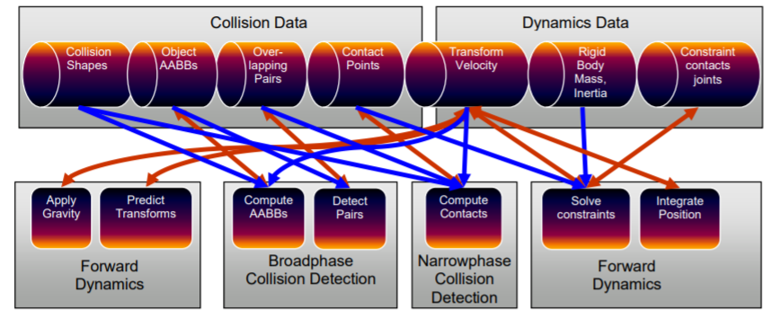
*Figura 2.57: Principales estructuras de datos (parte superior) y etapas de*

computación (parte inferior) de la biblioteca de física Bullet [18]. El orden
de ejecución es de izquierda a derecha. Las flechas azules corresponden a
entradas, mientras que las rojas a salidas.
33https://www.havok.com/havok-physics/
34Cuerpos deformables como distintas telas y ropa.
35https://en.wikipedia.org/wiki/Ragdoll_physics
36https://developer.nvidia.com/physx-sdk
37https://github.com/bulletphysics/bullet3
38https://www.ode.org/

Capítulo 3

## Solución

### 3.1. Arquitectura de la Solución
La imagen 3.1 muestra la arquitectura del motor desarrollado en este trabajo de título,
este diseño se basó en gran parte en el presente en Gregory 2019 [5]. Las primeras dos capas
representan el hardware del sistema operativo y los drivers. Si bien esta capa existe, para el
desarrollo del motor no fueron de gran importancia dado que las bibliotecas (siguiente capa)
que se escogieron permiten abstraer las particularidades de ambas.
La primera capa efectivamente desarrollada en este trabajo de título es la capa de sistemas
core, esta consiste principalmente en interfaces intermedias entre las bibliotecas externas que
la implementan y el resto del motor que las usan. En la siguiente capa se encuentra la cla-
se TransformComponent, la que implementa las transformaciones descritas en la sección
2.3.2. Luego viene la capa con los sistemas principales del motor, estos son independientes
entre sí salvo el de renderizado que necesita las paletas de matrices generadas por el sis-
tema de animación para renderizar las mallas animadas, todos estos sistemas dependen de
la clase TransformComponent para posicionar, escalar y orientar las distintas entidades.
Finalmente la capa más externa Gameplay Foundations, nombrada así en Gregory 2019 [8],
es por la cual el usuario del motor interactúa con el resto de los sistemas mediante el modelo
de game object, el sistema de eventos y una clase llamada World que representa el mundo
donde existen todas las entidades simuladas.


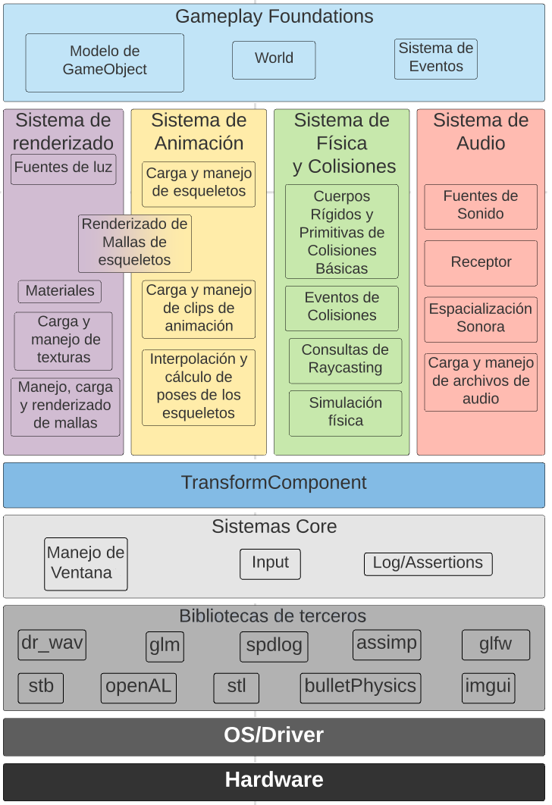
*Figura 3.1: Diagrama de la arquitectura del motor.*


### 3.2. Sistemas Core del motor
Como muestra la imagen 3.1, los sistemas que constituyen esta parte del motor son: los
sistemas de logging, de manejo de input y de manejo de ventana.
Para el sistema de logging, el cual imprime mensajes en consola, lo más importante era
tener una instancia central y global a la cual poder llamar cuando se quisiera, para esto
se implementó la clase Log usando el patrón Singleton1. Además, durante el proceso de
construcción de la única instancia, esta se configura para que los mensajes mostrados tengan
un formato fácil de leer y con colores representativos.
Por otro lado, para el caso de manejo de ventana e input las clases responsables son
Window e Input respectivamente, ambas fueron implementadas usando la biblioteca glfw.
La decisión de crear estas clases, en vez de trabajar directamente con glfw, radica en que en
primer lugar glfw tiene un sistema de eventos minimalista y estos eventos deben en algún
momento ser enviados por el sistema propio del motor, esta tarea es responsabilidad de estas
clases. La segunda razón es que las interfaces de Window e Input esconden las partes
innecesarias de la API de glfw, ya que esta biblioteca cubre muchos más casos de uso que los
que el motor desarrollado presenta.
ElmotortrabajaconunaúnicainstanciadelasclasesWindoweInput,estassoncreadas
durante el proceso de inicialización del motor, descrito en la sección 3.3.5.2. El sistema de
input solo soporta preguntar si el botón está siendo apretado o no, consultas más complejas
como si un botón se ha mantenido apretado durante un tiempo no parecieron necesarias de
implementar. Finalmente, la imagen 3.2 muestra las interfaces que se implementaron, donde
cada operación hace lo que se espera.

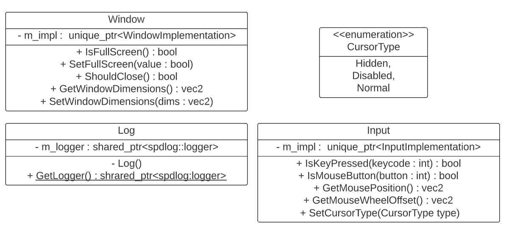
*Figura 3.2: Diagrama de las clases Input, Window y Log.*

1 https://en.wikipedia.org/wiki/Singleton_pattern


### 3.3. Modelo de Game Objects

#### 3.3.1. Descripción general
El modelo de game objects implementado es uno basado en objetos compuestos por com-
ponentes, este diseño se siguió tanto por los motivos expuestos en la sección 2.1.1, como por
su popularidad en motores exitosos como Unity y Unreal.
La imagen 3.3 muestra un diagrama simplificado de las clases que componen este modelo.
La clase World representa el mundo donde existen los objetos simulados, esta posee una
interfaz que permite al usuario del motor tanto crear y destruir Game Objects, que co-
rresponden a las entidades que existen dentro del mundo simulado, como agregar y remover
componentes a estos. Para implementar esta interfaz, la clase World posee una instancia
de la clase GameObjectManager a la que le derivará las responsabilidades asociadas a
Game Objects y una instancia por cada tipo de componente de la clase ComponentMana-
ger<ComponentType> responsable de crear, destruir y mantener su respectivo tipo de
componente.

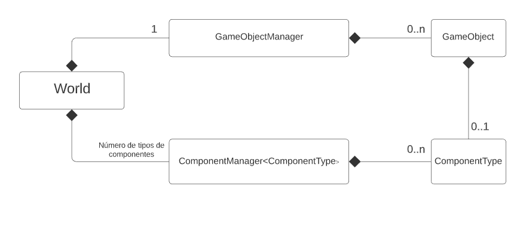
*Figura 3.3: Diagrama simplificado de las clases que participan del modelo*

de game object.

#### 3.3.2. Componentes
En el diseño de este modelo de game object no existe una clase o interfaz base, típicamente
llamada Component, desde la cual las componentes concretas deben derivar, sin embargo,
existe un conjunto de tipos y constantes estáticas que las clases usadas como componentes
deben declarar y/o definir. Este conjunto está compuesto por los siguientes elementos:
1. Un tipo llamado LifetimePolicyType, el cual debe implementar los métodos OnAdd-
Component y OnRemoveComponent que serán descritos en la sección 3.3.3, estos son
llamados al crear y remover una componente respectivamente.

2. Un tipo llamado dependencies que define las otras componentes de las que esta clase
depende. El código 3.1 muestra un ejemplo de esto, donde la componente del sistema
de física declara su dependencia en la componente TransformComponent.
3. Un string constante con el nombre de la componente, este en conjunto con la lista de
dependencias es usado principalmente para depuración.
4. Un entero con el índice de la componentes, el principal uso de este índice es el acceso
al ComponentManager correcto dentro del arreglo de estos mantenido por la clase
World.
Finalmente, el extracto de código 3.1 muestra la parte de la declaración de la clase Ri-
gidBodyComponent que corresponde a lo recién descrito.
Código 3.1: Extracto de código de la declaración de la component Rigid-
BodyComponent.
class RigidBodyComponent{
....
....
public:
using LifetimePolicyType = RigidBodyLifetimePolicy;
using dependencies = DependencyList<TransformComponent>;
static constexpr std::string componentName = "RigidBodyComponent";
static constexpr uint8_t componentIndex =
GetComponentIndex(EComponentType::RigidBodyComponent);
....
....
}

#### 3.3.3. ComponentManager
Como ya se mencionó, la clase ComponentManager es la encargada de crear, destruir
y mantener las componentes que son unidas a instancias de GameObject. La clase World
posee un puntero a ComponentManager por cada tipo de componente que el motor so-
porta, para que esta clase pueda mantener las instancias de ComponentManager en un
arreglo, estas heredan desde una misma clase llamada BaseComponentManager. Esta
clase posee un único método el cual es encargado de eliminar las distintas componentes, la
existencia de este método facilita la eliminación instantánea de las componentes unidas a un
GameObject siendo destruido.
La implementación de la clase ComponentManager permite eliminar y agregar compo-
nentes en O(1), y esta se asemeja a la estructura de datos llamada Freelist2. Los principales
miembros de esta clase son: Un arreglo dinámico con las instancias de componentes, otro
arreglo dinámico de HandleEntry, y dos enteros sin signo. El arreglo de instancias de
HandleEntry sirve tanto para mantener una lista doblemente enlazada de entradas libres,
las cuales serán ocupadas cuando se pida añadir una componente, como un nivel de indirec-
ción entre las instancias de componentes para permitir que estas se puedan mover dentro del
2 https://en.wikipedia.org/wiki/Free_list

arreglo, proceso que ocurre cuando una componente es eliminada y posteriormente reempla-
zada por la componente al final del arreglo. Por último, los dos enteros sirven para indicar
el inicio y final de la doble lista enlaza dentro del arreglo de HandleEntry. La imagen 3.4
muestra los miembros de la clase ComponentManager recién descritos.

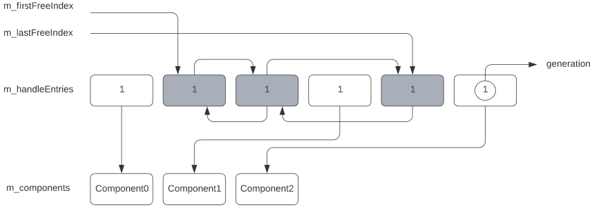
*Figura 3.4: Una posible configuración de los principales miembros de la*

clase ComponentManager. Un entero sin signo de cada HandleEntry, lla-
mado generation, es aumentado cada vez que la componente que indexa es
eliminada.
Para acceder a las componentes se usan instancias de la clase InnerComponentHandle,
la cual consiste en un índice al arreglo de HandleEntry del manager respectivo y un entero,
este se compara con otro entero sin signo de la instancia de HandleEntry indexado antes de
efectivamente permitir acceso a la componente. Este entero sin signo de cada HandleEntry
es aumentado cada vez que se destruye una componente indexada por este, para evitar que
instancias de InnerComponentHandle referenciado la componente ya destruida obtengan
otra instancia de componente creada posteriormente. La razón del prefijo Inner del nombre
de esta clase es que el usuario no trabaja directamente con este tipo sino con otros descritos
en la sección 3.3.5.1.
Adicionalmente, cada ComponentManager mantiene un arreglo dinámico de punteros
a GameObject, paralelo3 al de componentes, el cual es usado para obtener rápidamente la
instancia de GameObject a la cual la componente está unida. Otro miembro importante
de esta clase es m_lifetimePolicy, el tipo de este miembro, como se describió en la sección
anterior, debe ser declarado por la componente bajo el nombre LifetimePolicyType. La
clase de este tipo debe implementar las siguientes funciones:
OnAddComponent(go: GameObject*,component: ComponentType&,hand-
le : InnerComponentHandle&): Esta función es llamada cada vez que se agregue
una componente a una instancia deGameObject. Por ejemplo, el sistema de física hace
uso de esta para notificar a las clases de Bullet que se agregó un cuerpo rígido y para
configurar la información para mantener sincronizadas las transformaciones del motor
con las de Bullet.
3 https://en.wikipedia.org/wiki/Parallel_array

OnRemoveComponent(go : GameObject*, component : ComponentType&,
handle : InnerComponentHandle&): Similar a la función anterior, pero esta es
ejecutada cada vez que una componente es removida.
Finalmente, la imagen 3.5 muestra un diagrama de la clase ComponentManager y otras
relevantes para esta.

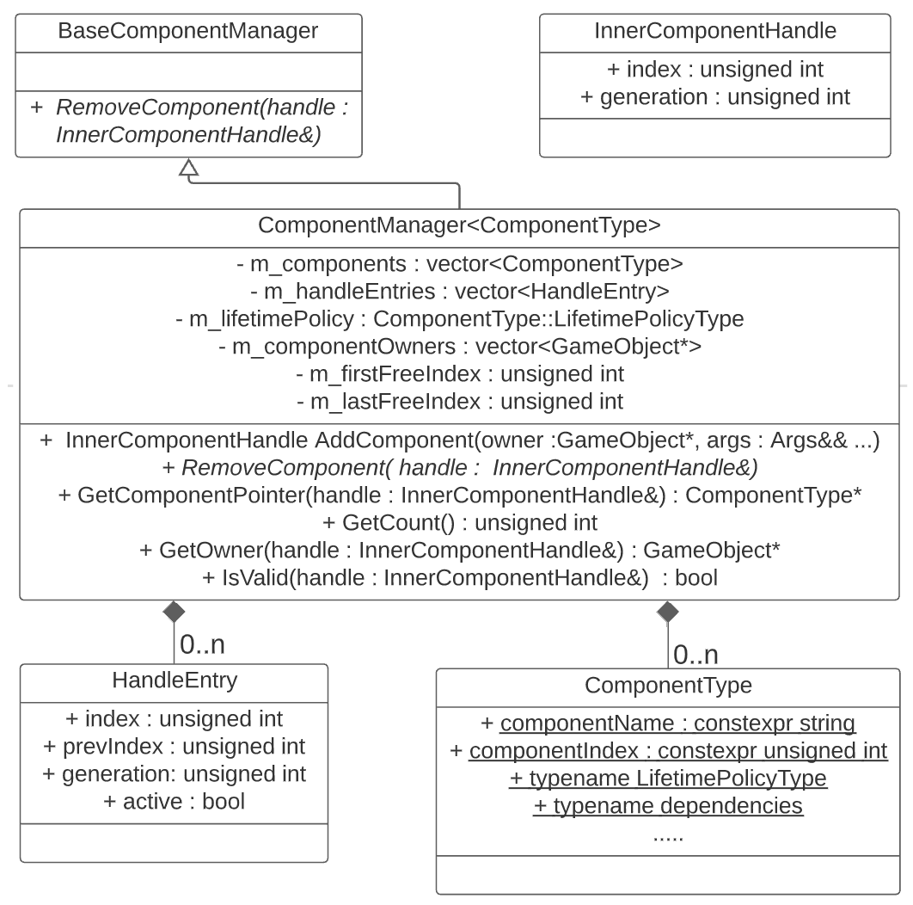
*Figura 3.5: Diagrama de la clase ComponentManager.*


#### 3.3.4. GameObjects
La clase GameObject representa a las entidades que viven en el mundo simulado por
el motor, y como ya se mencionó, la destrucción y creación de instancias de estos es res-
ponsabilidad de la clase GameObjectManager. El diseño e implementación de esta clase
es muy parecido al de la clase ComponentManager manteniendo punteros a GameOb-
ject en vez de instancias de componentes. Una diferencia importante con respecto a la clase

ComponentManager, es que cuando un usuario pide a través de la interfaz de World la
destrucción de un GameObject, si bien las componentes unidas a este son inmediatamente
destruidas, la instancia de GameObject en memoria no lo es. La imagen 3.6 muestra una
diagrama de las clases GameObject y GameObjectManager.

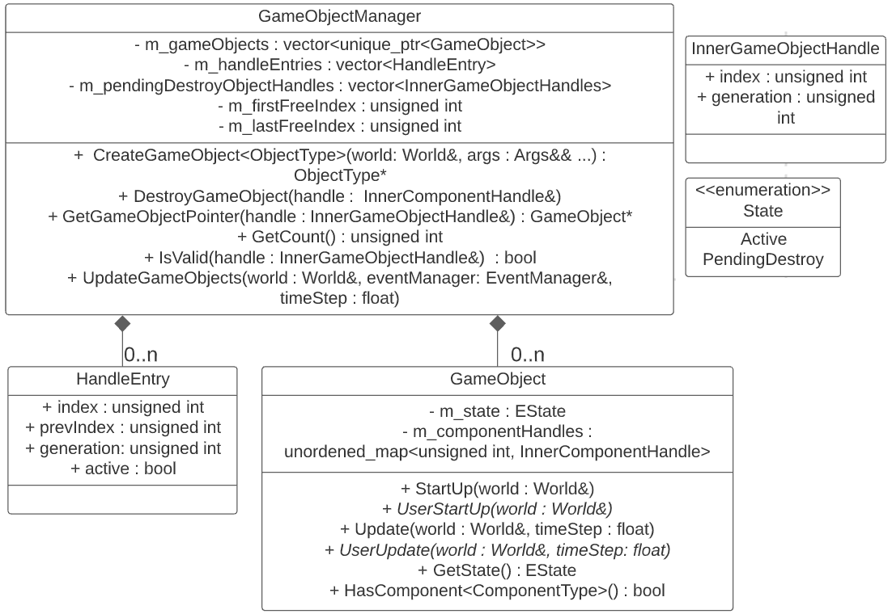
*Figura 3.6: Diagrama de las clases GameObjectManager y GameObject.*

La destrucción no inmediata de las instancias de GameObjects se debe a que la petición
de destrucción puede ocurrir durante una iteración sobre punteros a estas mismas, lo que po-
dría invalidar este proceso. Esta iteración ocurre dentro del método UpdateGameObjects
el cual es llamado cada iteración del motor, y consiste en llamar el método Update, el cual
a su vez llama el método UserUpdate, de cada GameObject. Para solucionar esto, cada
vez que un usuario solicita la destrucción de un GameObject, esta petición es guardada
en un arreglo de InnerGameObjectHandle para una posterior eliminación real. Dentro
del mismo método UpdateGameObjects una vez terminada la iteración sobre los punteros
a GameObject, se itera sobre el arreglo de destrucciones pendientes para efectivamente
eliminar de memoria las instancias de GameObjects.
Para permitir a los usuarios personalizar el comportamiento de las clases que deriven de
GameObject, esta tiene dos métodos virtuales que pueden ser redefinidos. Estos métodos
sonUserStartUpllamadodespuésdelconstructordelaclaseyUserUpdatequeesllamado
en cada iteración del motor. En principio podría parecer que la funcionalidad de UserStar-
tUp es redundante y que basta con el constructor, pero dentro de los parametros de este
método hay una referencia a una instancia de World y la clase GameObjectManager
necesita configurar ciertos miembros de GameObject para que la interfaz de la instancia de

Worldfuncionecorrectamente.Siestaconfiguraciónsehacedesdeelconstructoresnecesario
que los usuarios estén conscientes de esto y deberán incluir en la firma de los constructores de
sus clases parámetros innecesarios para su clase y llamar con estos al constructor de la clase
base, se prefirió evitar este trabajo por parte del usuario. El extracto de código 3.2 muestra
un ejemplo de clase derivada de GameObject que redefine estos métodos virtuales.
Código 3.2: Ejemplo de una clase derivada de GameObject.
class Pacman : public Mona::GameObject{
...
void UserStartUp(Mona::world &world){
...
m_transform = world.AddComponent<Mona::TransformComponent>(*this);
world.AddComponent<Mona::StaticMesh>(*this, pacmanMesh, pacmanMaterial);
....
}
void UserUpdate(Mona::World & world, float timeStep){
m_transform->Translate(m_velocity * timeStep);
...
...
}
..
public:
Mona::TransformHandle m_transform;
glm::vec3 m_velocity = glm::vec3(10.0f);
}

#### 3.3.5. World
La clase World posee una interfaz que es responsable de crear, mantener y destruir
componentesy GameObjects.Además,esresponsabledeinicializaryejecutarlasimulación
del motor y, por último, actúa como intermediaria entre el usuario y los distintos sistemas
del motor. Todas estas responsabilidades transforman a la clase World probablemente en la
más compleja del motor. A continuación se entrará en detalle como esta clase cumple con las
responsabilidades recién mencionadas.

##### 3.3.5.1. World y el modelo de game objects
Como ya se mencionó, la parte de creación y destrucción de instancias de GameObject,
la clase World delega la responsabilidad a su miembro de tipo GameObjectManager.
mientras que los métodos relacionados con las componentes son derivados al Component-
Manager respectivo. Con respecto a la destrucción de GameObjects, como se señaló en la
sección 3.3.4, al momento de que el usuario solicita destruir una instancia, la clase World
inmediatamente elimina las componentes unidas al GameObject, a pesar de que este mismo
no lo es.
En la sección 3.3.3 se describió como cada ComponentManager mantiene las instancias
de su componente respectiva en un arreglo contiguo, dado esto el usuario no puede trabajar

directamente con dichas instancias. La segunda opción podrían ser punteros, pero estos se
pueden invalidar dado que después de la eliminación de alguna componente se puede producir
algún movimiento de las instancias dentro del arreglo. Lo único que puede realmente puede
identificar una componente es una instancia de InnerComponentHandle más el Compo-
nentManager respectivo, la clase ComponentHandle une estos dos elementos. Todos los
métodos de la interfaz de World relacionados a componentes trabaja con instancias de la
clase ComponentHandle, la cual para facilitar al usuario el trabajo con las componentes
implementa semántica de punteros definiendo los métodos operator-> y operator*, y el
método IsValid que permite chequear si la componente es aún válida, es decir, si no ha sido
removida del GameObject al que fue inicialmente unida.
Similarmente, en la sección 3.3.4 se describió como la clase GameObjectManager debe
ser responsable de crear y destruir, a través de llamados a la interfaz de World, las ins-
tancias de GameObject para poder asegurar que el arreglo que mantiene de punteros a
estos está actualizado y no tiene punteros colgantes, por esta razón nuevamente el usuario no
puede trabajar directamente con instancias de GameObject. A diferencia que en el caso de
componentes, el arreglo que mantiene GameObjectManager es de punteros, es decir, las
instancias mismas no cambiarán de dirección de memoria durante su existencia, por lo que la
opción de que los usuarios utilicen punteros no es inviable. La razón por la que se decidió no
usar punteros es principalmente evitar llamados a delete, invalidando el puntero contenido en
el GameObjectManager. LasclasesBaseGameObjectHandley GameObjectHandle,
son con las cuales el usuario trabaja, y al igual que para el caso de componentes implementan
semántica de punteros para facilitar su uso. A su vez, las clases BaseGameObjectHandle
y GameObjectHandle están compuestas por un puntero al GameObject y una instancia
de InnerGameObjectHandle, esta última es usada para chequear si el puntero es aún
válido. La imagen 3.7 ilustra el diagrama de ambos tipos de handles y la parte de la interfaz
de World relacionado a estos.


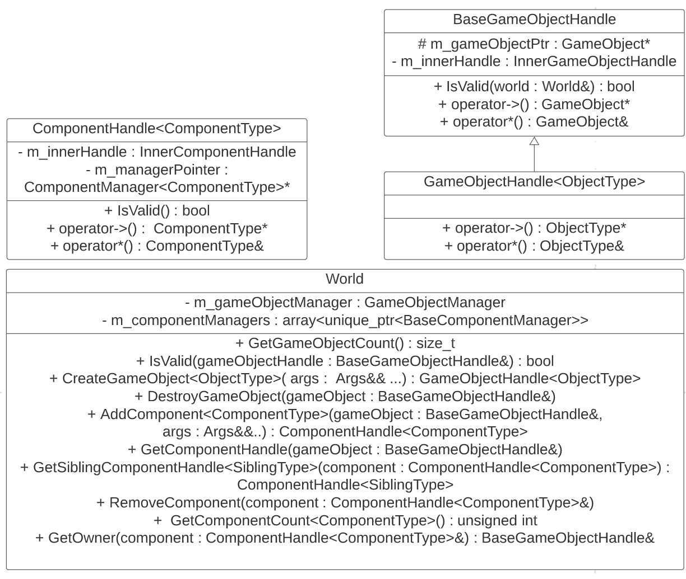
*Figura 3.7: Diagramas de las clases relacionadas con la parte de la interfaz*

de World asociada con el modelo de game objects.
Es importante mencionar que para soportar llamados usando el puntero this desde dentro
de métodos de las clases que heredarán de GameObject, parte de la interfaz de World
también recibe referencias a GameObject como parámetros.

##### 3.3.5.2. Inicialización y Main Loop
Para comenzar a usar el motor desarrollado, el usuario debe crear una instancia de la clase
Engine, esta posee un único método llamado StartMainLoop el cual comienza a ejecutar
la lógica de todos los elementos que componen el motor. El nombre main loop, o game loop,
es el nombre que usualmente tienen el conjunto de instrucciones que se ejecuta cada iteración
del motor para avanzar las simulaciones que este mantiene.
El constructor de la clase Engine recibe como parámetro una referencia a Applica-
tion, esta clase consiste en 3 métodos virtuales, llamados UserStartUp, UserUpdate y
UserShutDown, que el usuario debe implementar. El método UserStartUp será llamado
al final del proceso de inicialización del motor, en este método es donde el usuario debería
crear, por ejemplo, los elementos que componen el nivel inicial de un videojuego. A su vez,
el método UserUpdate es llamado en cada iteración del motor, es aquí donde el usuario
debería ejecutar la lógica central de su aplicación. Por último, el método UserShutdown
es llamado antes de comenzar el proceso de cerrado del motor, esto podría ocuparse para

guardar información útil entre ejecuciones de la aplicación.

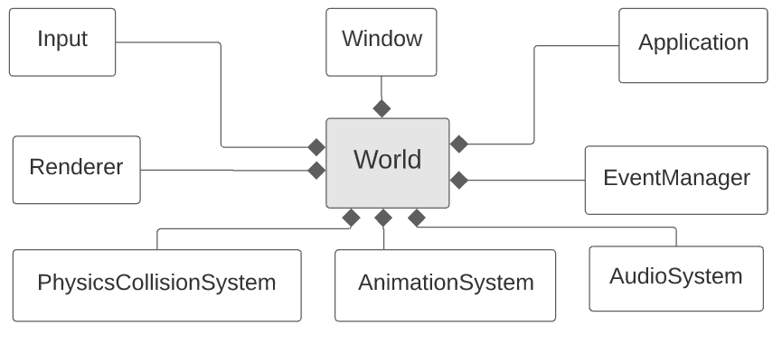
*Figura 3.8: Clases de las que World está compuesta para ejecutar la lógica*

de todos los elementos que componen el motor.
La clase Engine es una interfaz muy delgada, esta mantiene una instancia de la clase
World la que efectivamente realiza las tarea de inicialización y ejecución del main loop. Para
esto,laclaseWorldconstruyeymantieneinstanciasdelosdistintossistemasimplementados,
laimagen3.8muestracadaunodeestos,duranteelmain loop cadaunodelossistemassimula
la parte de la que son responsables. Finalmente, el extracto de código 3.3 muestra la forma
que tiene el main loop de este motor.
Código 3.3: Extracto de la implementación del main loop del motor.
void World::StartMainLoop() noexcept {
...
while (!m_window.ShouldClose() && !m_shouldClose)
{
....
Update(timeStep);
}
m_eventManager.Publish(ApplicationEndEvent());
}
void World::Update(float timeStep) noexcept
{
...
m_input.Update();
m_physicsCollisionSystem.StepSimulation(timeStep);
m_physicsCollisionSystem.SubmitCollisionEvents(...);
m_animationSystem.UpdateAllPoses(...);
m_objectManager.UpdateGameObjects(..);
m_application.UserUpdate(...);
m_audioSystem.Update(...);
m_renderer.Render(...);
m_window.Update();
}


##### 3.3.5.3. World como interfaz intermedia
Parte de la funcionalidad y/o estado del mundo simulado por el motor no queda descrito
con las componentes, por ejemplo, para el sistema de renderizado es necesario configurar una
cámara principal desde la cual se renderizará la escena, o para el sistema de audio puede
ser necesario configurar el volumen maestro del motor. Esta funcionalidad podría haber sido
implementada exponiendo las APIs de los sistemas internos pero se prefirió usar la interfaz
de World como intermediaria para evitar exponerlas, ya que parte de las interfaces de los
sistemas se prefirió que no fueran accedidas por los usuarios. La imagen 3.9 muestra parte
de la interfaz de World que es responsable de lo recién descrito.
Figura3.9:PartedelainterfazdeWorldqueactúacomointermediariaentre
el usuario y los sistemas que realmente implementan estos métodos.
Finalmente,esimportantemencionarquedentrodelaseccióndecadasistemasedescribirá
en detalle la parte de la interfaz de World relacionada con el.

### 3.4. TransformComponent
La clase TransformComponent es la responsable de mantener las posiciones, rotaciones
y escalamientos de las instancias de GameObject con esta componente. Los sistemas de
renderizado, física y audio necesitan directamente esta información para poder realizar sus
funciones.

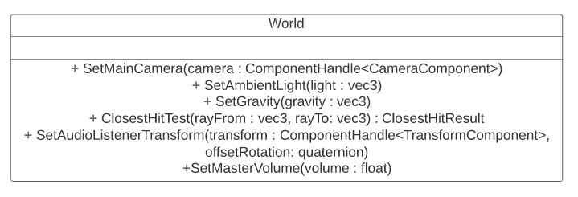
*Figura 3.10: Diagrama de la clase TransformComponent.*


La imagen 3.10 muestra el diagrama de TransformComponent, en donde se omitieron
losgetters ysetters delosmiembrosdeesta.Sedecidiórepresentarlacomponenteusandotres
miembros separados en vez de la representación matricial descrita en 2.3.2 principalmente
porquelaimplementaciónquedamassimplealtenerlastraslaciones,rotacionesyescalamien-
tos separados. Sin embargo, internamente el proceso de renderizado necesita enviar a GPU
una matriz con esta información, para esto la interfaz tiene el método GetModelMatrix el
cual entrega la transformación en representación matricial.
Otro método importante es GetViewMatrixFromTransform el cual entrega la matriz
de vista descrita en 2.3.3 para una cámara cuya posición y rotación están dados por los
de esta instancia de TransformComponent. Finalmente, los métodos Scale, Translate y
Rotate acumulan el valor entregado con el valor actual de la instancia y mientras que los
métodos GetUpVector, GetRightVector y GetFrontVector entregan los ejes z, x e y
respectivamente rotados según el quaternion de esta transformada.

### 3.5. Sistema de Eventos
El sistema de eventos es responsable de comunicar eventos a todo objeto que necesite ser
notificado de la ocurrencia de algunos de los eventos soportados por el motor. Estos objetos
pueden ser internos al motor o externos implementados por el usuario de este. La interfaz
implementadaseasemejaalpatrónPublish-Subscribe4,dondeexisteunaclasealaqueelresto
de los objetos pueden suscribirse para ser notificados en caso de que un evento de cierto tipo
ocurra. Por otro lado, esta misma clase permite a otras publicar cuando un evento ocurre.
4 https://en.wikipedia.org/wiki/Publish%E2%80%93subscribe_pattern


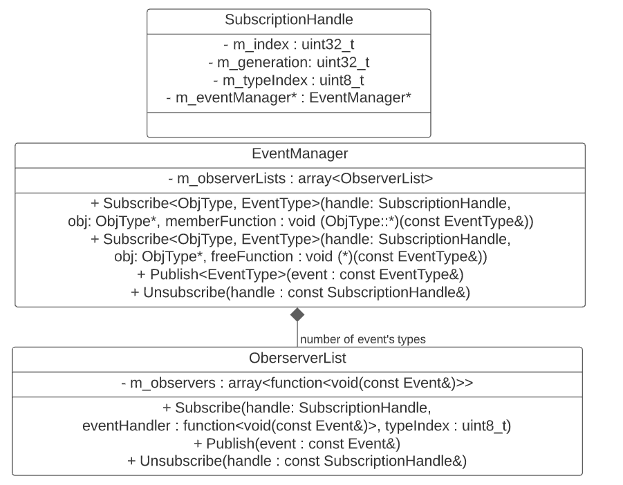
*Figura 3.11: Diagrama de la clase EventManager.*

Laimagen3.11muestralainterfazqueseimplementó,dondesevequeexistendosmaneras
de suscribirse dependiendo si la función o callback que se desea registrar es interna a una
clase (primer caso en la imagen) o una función libre. Ambas funciones de subscripción reciben
como parámetro una instancia de SubcriptionHandle, la cual es configurada con toda la
información para poder llamar Unsubscribe, en caso de ser necesario, para dejar de ser
notificado por el evento, o llamar este mismo método automáticamente en el destructor de
esta clase. Por otro lado, el método Publish debe ser llamado cada vez que un evento ocurra,
enesemomentotodoslasfuncionessuscritasaeseeventoseránllamadas.Esimportantenotar
que cada vez que se llame el método Publish las funciones suscritas serán inmediatamente
ejecutadas, si bien es típico de una implementación de un sistema de eventos mantener
una cola de estos los cuales son publicados en un momento específico de la ejecución de la
aplicación, esta característica quedó fuera del alcance de este trabajo.
Con respecto a la implementación interna de la clase EventManager, esta mantiene
un arreglo de listas de observadores, el tamaño de este arreglo es igual al número de tipos
de eventos existentes, de esta manera cada vez que alguien se suscribe o deja de hacerlo
esta clase agrega o elimina de la lista correspondiente un elemento, a su vez, cuando un
evento es publicado, la lista correspondiente es recorrida llamando a cada una de las funcio-
nes registradas. Las listas de observadores están implementadas de forma similar a la clase
ComponentManager descrita en la sección 3.3.3 de manera que permite rápida inserción
y eliminación.
Los tipos de eventos están implementados usando una jerarquía de clases de un solo nivel

deprofundidaddondecadaeventoconcretoheredadelaclaseEvent.Loseventosquesoporta
el motor son los siguientes:
1. WindowResizeEvent es emitido cada vez que el tamaño de la ventana es cambiado y
contiene la información de las nuevas dimensiones de esta.
2. MouseScrollEvent es emitido cada vez que la rueda del mouse es movida, el evento
contiene la información de cuanto fue movida la rueda.
3. ApplicationEndEvent, este evento es emitido cuando la aplicación y el motor están
en proceso de cerrado.
4. DebugGUIEvent este evento es solo emitido en builds de tipo DEBUG, dentro de las
funciones suscritas a este evento se puede utilizar la API de imgui5, una biblioteca que
permite renderizar interfaces gráficas, para ayudar al proceso de depuración o testeo de
la aplicación ocupando el motor.
5. GameObjectDestroyedEvent, como su nombre lo indica es emitido cada vez que una
instancia de GameObject es destruida.
6. EndCollisionEvent y StartCollisionEvent son emitidos por el sistema de física del
motor cada vez que termina o comienza una colisión respectivamente. Estos tienen las
instancias de RigidBodyComponent participando y la información de la colisión en
el caso del evento StartCollisionEvent.
7. CustomUserEvent es un evento que puede ser emitido y observado únicamente por los
usuarios del motor. Eventos de este tipo tienen dos miembros, un entero para identificar
entre diferentes eventos creados por el usuario y un arreglo de cuatro variants6 que
representan información que describe el evento.
La imagen 3.12 muestra la jerarquía con los eventos recién descritos.
5 https://github.com/ocornut/imgui
6 https://en.cppreference.com/w/cpp/utility/variant


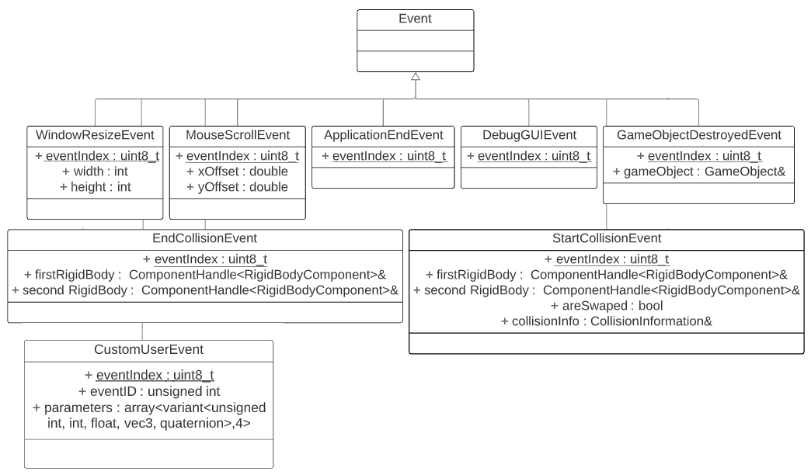
*Figura 3.12: Diagrama de clase de los tipos de eventos donde todos heredan*

de la clase Event.
Finalmente, el siguiente extracto de código muestra un ejemplo de uso de este sistema de
eventos:
Código 3.4: Ejemplo de uso del sistema de eventos.
unsigned int EXPLOSIONEVENT = 1;
class Character : public Mona::GameObject {
...
void UserStartUp(Mona::World &world){
auto& em = world.GetEventManager();
em.subscribe(m_subscriptionHandle, this, Character::Response);
...
}
void UserUpdate(Mona::World & world, float timeStep){
CustomUserEvent e;
e.eventID = EXPLOSIONEVENT;
//explosion radius
e.parameters[0] = 100.0f;
//explosion position
e.parameters[1] = glm::vec3(1.5,3.0f,55.0f);
auto& em = world.GetEventManager();
em.Publish(e);
...
}
...
void Response(const CustomUserEvent& event)
{
if(event.eventID == EXPLOSIONEVENT)

{
float explosionRadius = std::get<float>(e.parameters[0]);
glm::vec3 explosionPosition = std::get<glm::vec3>(e.parameters[1]);
//Hacer algo con estos valores.
...
}
}
};
...
...

### 3.6. Audio

#### 3.6.1. Descripción General
Como ya se mencionó la solución desarrollada para el sistema de audio fue implementada
usando OpenAL, esta sigue las ideas descritas en la sección 2.2, en donde existen buffers que
contienen los datos de audio que serán reproducidos, fuentes de sonido que reproducen estos
buffers y un receptor que los escucha. Las clases de esta solución que se relacionan con estos
conceptosson:AudioClipquecorrespondealosdatosdeaudio,AudioSourceComponent
y FreeAudioSource a las fuentes de sonido, y finalmente para el caso del receptor no existe
unaclasesinoquedesdeunainstanciadeTransformComponentconfiguradaporelusuario
del motor se obtiene la posición y orientación de este. El sistema es capaz de reproducir
múltiples sonidos, tanto 3D que pasan por un proceso de espacialización y 2D reproducidos
de la misma manera independiente de su ubicación.
Otra clase importante es AudioSystem, que es responsable de que cada frame se ejecute
la lógica necesaria para la simulación del sonido y de recibir desde la interfaz de World
los llamados a funciones asociados al audio, como la configuración del volumen global de
la aplicación. La imagen 3.13 muestra un diagrama de las clases recién mencionadas y las
clases ComponentManager y AudioClipManager que son encargadas de la destrucción
y creación de componentes de audio y clips de audio respectivamente.


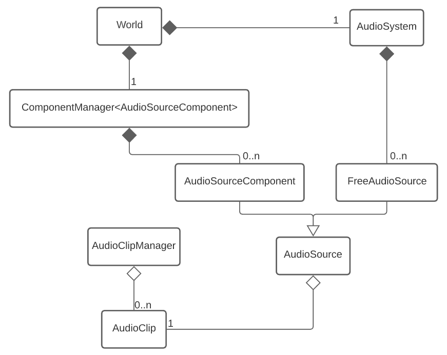
*Figura 3.13: Diagrama general de las clases que participan en el sistema de*

audio.
Las dos principales características que suelen estar en un sistema de audio que se dejaron
fuera fueron la simulación del ambiente acústico, descrita en la sección 2.2.1, y la de poder
aplicar efectos más allá del cambio de volumen y tono de los sonidos reproducidos.

#### 3.6.2. AudioClip y AudioClipManager
Como ya se dijo, la clase AudioClip representa los datos de música o efectos de sonidos
que pueden ser reproducidos. La imagen 3.14 muestra los principales métodos y la relación
con objetos de OpenAL que tiene esta clase. La implementación solo soporta archivos en
formato wav, los cuales al momento de construcción de un AudioClip son cargados en
memoria usando la librería dr_wav7 para después enviar estos datos al buffer de OpenAL.
7 https://mackron.github.io/dr_wav.html


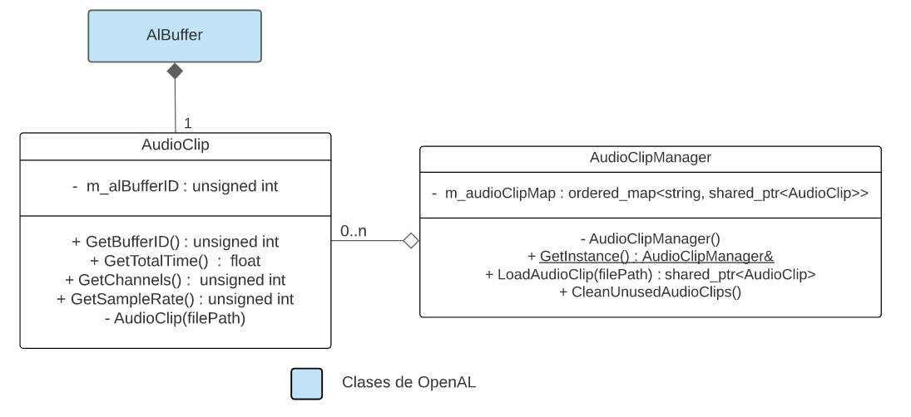
*Figura 3.14: Diagrama de las clases AudioClip y AudioClipManager.*

El constructor de la clase AudioClip es privado, dado que es a través de la interfaz de
AudioClipManager que las instancias de estos deben ser creados. Esta clase esta imple-
mentada usando el singleton pattern8 y es encargada de mantener un mapa de strings (
unordered_map9) con la ruta del archivo de audio a punteros compartidos a instancias de
AudioClip ( shared_ptr10), de esta manera si el usuario intenta cargar mas de una vez el
mismo archivo, solo la primera vez se hará el proceso completo, intentos de cargas futuras
retornaran un puntero a la instancia previamente cargada. La razón de porqué se usaron
punteros compartidos en este caso es que no es poco común que un mismo archivo de audio
sea reproducido por distintas fuentes, un ejemplo podría ser un mismo efecto de sonido de
disparo siendo reproducido por múltiples enemigos disparando. La imagen 3.14 muestra un
diagrama con los principales miembros y métodos de esta clase, dentro de los cuales está
CleanUnusedClips, el cual elimina todas las entradas del mapa cuyo conteo de referencias
de su puntero compartido sea igual a uno, es decir, solo el mapa está apuntando a la instancia
de AudioClip.

#### 3.6.3. AudioSourceComponent y FreeAudioSource
Tanto AudioSourceComponent como FreeAudioSource representan fuentes de so-
nido ubicadas en el mundo simulado y por esto ambas heredan de la clase AudioSource,
la diferencia radica en que instancias de AudioSourceComponent deben estar unidas
a instancias de GameObjects usando la interfaz de World, mientras que instancias de
FreeAudioSource no necesitan estar unida a un GameObject, la interfaz de World tiene
los métodos PlaySound2D y PlaySound3D para internamente crean instancias de esta
clase. La existencia de la clase FreeAudioSource responde a la recurrente necesidad de
emitir sonidos sin necesidad de tener un objeto asociado a esta, por ejemplo sonidos emitidos
posteriormente a la destrucción de un objeto.
La principal información que estas clases mantienen corresponden al volumen, tono, radio
8 https://en.wikipedia.org/wiki/Singleton_pattern
9 http://www.cplusplus.com/reference/unordered_map/unordered_map/
10http://www.cplusplus.com/reference/memory/shared_ptr/

de alcance, prioridad y tipo. El radio de alcance corresponde al radio de la esfera en donde
el sonido emitido por esta fuente se puede escuchar, fuera de este no se escucha, y dentro
de esta el volumen final decae linealmente con el radio. La prioridad es una característica
configurada por el usuario que señala que tan importante es este sonido, de haber más fuentes
de sonido que recursos disponibles el sistema le otorgará primero dichos recursos a las fuentes
con prioridad más alta. Finalmente, el tipo corresponde a si la fuente es 3D o 2D, es decir,
si pasa por el proceso de espacialización del sonido o no respectivamente.
Otra diferencia importante es que el usuario no tiene acceso directo a las instancias de
FreeAudioSource,estassoncreadasvíallamadasalasinterfazdeWorld,yunavezcreadas
no se puede modificar nada de ellas, por esto la interfaz de esta clase es muy minimalista.
En cambio, para el caso de las componentes, estas el usuario puede cambiar el volumen,
tono, prioridad y tipo de estas, además de cambiar, reproducir, detener, resumir y parar
el AudioClip que están reproduciendo. Finalmente la imagen 3.15 muestra un diagrama
de estas clases y su relación con objetos de OpenAL, donde es importante notar que una
fuente puede tener ninguna fuente de OpenAL asociada a ella, la clase AudioSystem es la
responsable de asignar o quitar dichas fuentes de OpenAL, en la siguiente sección se entrará
más en detalle como funciona este proceso.

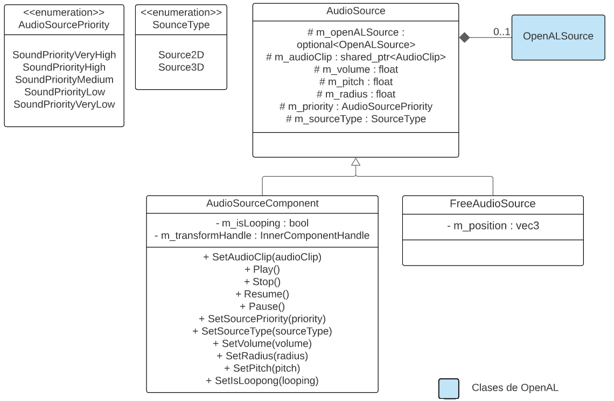
*Figura 3.15: Diagrama de las clases AudioSource, AudioSourceComponent*

y FreeAudioSource.

#### 3.6.4. AudioSystem
La clase AudioSystem tiene 3 principales responsabilidades, la primera corresponde al
proceso de inicialización y cerrado de los recursos del sistema de audio, como segunda respon-

sabilidad tiene responder a mensajes desde la interfaz de World asociados a este sistema (la
interfaz de World es la visible al usuario del motor), y la última y más importante responsabi-
lidad corresponde a actualizar cada iteración del motor el estado de las distintas componentes
del sistema de audio.
Las responsabilidades de inicialización y cerrado consisten en la creación y destrucción
de instancias de clases de OpenAL necesarias para el correcto funcionamiento del sistema,
estas clases corresponden a ALCContext y ALCDevice mencionadas en 2.2.4. Durante la
inicialización también se genera un número constante configurable de fuentes de OpenAL,
que son quienes efectivamente reproducirán sonido, y es este sistema quien las reparte a
instancias de las clases que heredan de AudioSource.
La imagen 3.16 muestra los métodos de la clase World relacionados al sistema de audio.
Estos corresponden a configurar la transformada la cual el sistema de audio usará como
posición y orientación del receptor, configurar el volumen global y reproducir AudioClip sin
ser unidos a GameObjects, lo que internamente crea una instancia de FreeAudioSource.

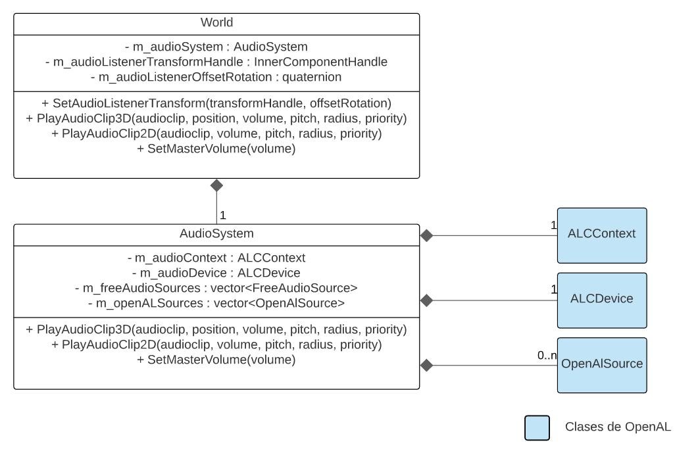
*Figura 3.16: Diagrama de la clase AudioSystem y parte de la interfaz de*

World relacionada a este sistema.
Finalmente, la lógica que se ejecuta cada iteración del motor tiene dos principales tareas,
la primera consiste en sincronización de posiciones y orientaciones de objetos del motor (
FreeAudioSource y AudioSourceCOmponent), con la de objetos de OpenAL, tanto las
fuentes de sonido como el receptor, esto para que el proceso de espacializacón que OpenAL
hace internamente sea correcto. La segunda parte corresponde a asignar el número fijo de
fuentes de OpenAL a las instancias activas de FreeAudioSource y AudioSourceCompo-
nent, los criterios de selección son que la fuente se encuentre efectivamente reproduciendo
sonido, que el receptor se encuentre dentro del rango de alcance de la fuente y la prioridad

de la fuente. El siguiente pseudocódigo explica a grandes rasgos lo recién mencionado.
Código 3.5: Pseudocódigo que el sistema de audio ejecuta cada iteración del
motor.
Método Update de la clase AudioSystem:
Actualizar posición y orientación del receptor.
Remover las instancias de FreeAudioSource que terminaron su reproducción.
Actualizar relojes internos de todas las fuentes (AudioSourceComponent y
FreeAudioSource).
Si la cantidad de instancias de fuentes del motor es menor
o igual que las fuentes de OpenAL:
Asignar inmediatamente los recursos de OpenAL a las fuentes del motor,
aprovechando de sincronizar las posiciones entre ambas.
En caso contrario:
Filtrar las fuentes que están fuera de alcance de la posición del receptor
Si ahora la cantidad de instancias de fuentes del motor es menor o igual que las
fuentes de OpenAL:
Asignar los recursos de OpenAL a estas fuentes del motor,
aprovechando de sincronizar las posiciones entre ambas.
En caso contrario:
Ordenar las fuentes de prioridad mas alta a mas baja, y otorgar los recursos
de OpenAL a las primeras fuentes, aprovechando de sincronizar las posiciones
entre ambas.

### 3.7. Renderizado

#### 3.7.1. Descripción General
El sistema de renderizado implementado permite renderizar tanto mallas de triángulos
animadas como estáticas importadas usando la librería Assimp11, a su vez, estas pueden tener
6 tipos de materiales que representan 6 diferentes modelos de iluminación implementados. La
información de iluminación es representada por 3 componentes, una para luces direccionales,
otra para luces puntuales y otra para luces de tipo spotlight. Por otro lado, la cámara desde
la cual se capturará la escena también queda descrita por una componente.
La etapa de aplicación del pipeline de renderizado, descrita en la sección 2.3.8 es ejecutada
por la clase Renderer, la implementación carece de una determinación del conjunto de
elementos visibles, por lo que todas las mallas son enviadas a GPU. Los datos de las luces
presentes en la escena son enviados a GPU también por la clase Renderer, esta información
tiene un número máximo de fuentes lumínicas dado por una constante conocida en tiempo de
11https://www.assimp.org/

compilación. La imagen 3.17 muestra las clases que representan los términos recién descritos
y sus relaciones entre ellas, en esta no se consideró la componente de mallas animadas ya que
queda descrita en la sección del sistema de animación.

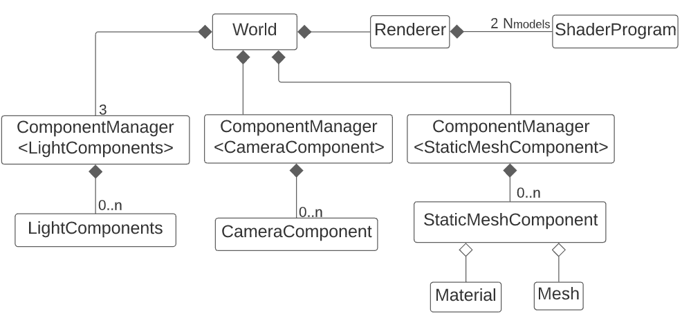
*Figura 3.17: Diagrama de la principales clases participando del sistema de*

renderizado.
A continuación se describe en detalle cada una de las clases participantes del sistema de
renderizado.

#### 3.7.2. CameraComponent
La clase CameraComponent representa la cámara virtual descrita en 2.3.4 para proyec-
ciones de tipo perspectiva. Los miembros de la clase son el ángulo de visión, la profundidad
del plano cercano, la del lejano y la relación de aspecto, a partir de estos, el método Get-
ProjectionMatrix de esta clase puede computar la matriz de proyección de perspectiva.
La interfaz de la clase World mantiene una instancia de InnerComponentHandle que
referencia a la instancia de CameraComponent desde la cual se renderizará la escena, esta
instancia puede ser configurada y/o obtenida con los métodos GetMainCameraCompo-
nent y SetMainCamera respectivamente. Además, la interfaz de World también posee un
método que permite transformar un vector en dos dimensiones que representa una posición
en espacio de pantalla a otra posición en espacio de mundo sobre el plano cercano de la
cámara principal. La imagen 3.18 muestra la interfaz de la clase CameraComponent y la
parte de la interfaz de World recién descrita.


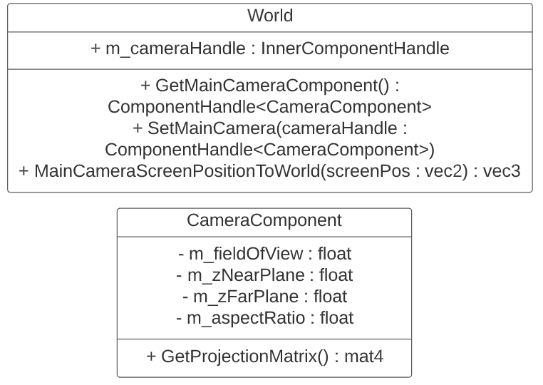
*Figura 3.18: Diagrama de la clase CameraComponent y parte de la interfaz*

de la clase World asociada a esta.
Para calcular la matriz de vista, durante el proceso de renderizado la clase Renderer ob-
tiene la instancia de TransformComponent unida al mismo GameObjectque la instancia
de CameraComponent siendo ocupada como cámara principal, el método GetViewMa-
trixFromTransform de la interfaz de TransformComponent calcula la matriz de vista
a partir de su estado interno.

#### 3.7.3. Fuentes de luz
Por cada tipo de fuente de luz descrito en 2.3.6 existe una componente que la representa,
los nombres de las clases en cuestión son DirectionalLightComponent, PointLightCom-
ponent y SpotLightComponent. Los miembros de cada una de estas clases sumados a la
instancia de TransformComponent unida al mismo GameObject que estas componen-
tes permiten calcular dentro de los shaders el brillo y color que cada aporta al proceso de
sombreado.
La imagen 3.19 muestra la interfaz de cada una de las componentes que representan
una fuente de luz. DirectionalLightComponent tiene un miembro con información del
color e intensidad de la luz y una dirección con respecto a el sistema de coordenadas de
objeto del GameObject al que esta componente está unida. PointLightComponent tiene
adicionalmente un miembro que indica la distancia a la cual el brillo de la luz será 0. Por
último, SpotLightComponent agrega dos miembros con los ángulos de penumbra y umbra.


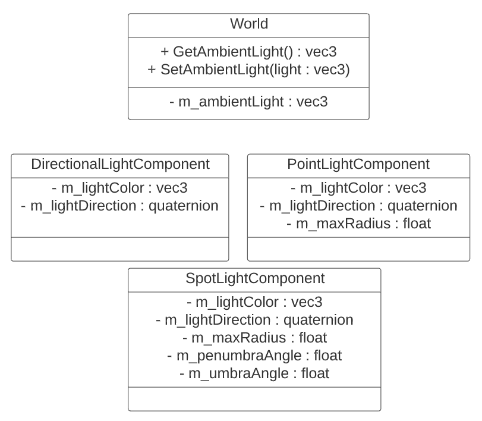
*Figura 3.19: Diagramas de las componentes que representan fuentes de luz*

y parte de la interfaz de World relacionada a estas.
Para el cálculo de atenuación por distancia la fórmula usada se basa en la ecuación 2.5
con (cid:15) y r igual a 1, quedando de la siguiente manera:
r 4 1
f (r) = (1.0 − ( ))+2 (3.1)
distance r 1 + r2
max
Dondenuevamente+2significaqueelvalordelaexpresióndentrodeparéntesisesrestringida
a valores positivos antes de elevarlo al cuadrado. Por otro lado, para el caso de atenuación
angular la función usada sigue la ecuación 2.6. Con esto, el brillo y color de las fuentes
direccionalesesigualaexactamentesumiembrodecolor,eldelasfuentespuntualesmultiplica
este miembro por la función de atenuación por distancia, y el de las fuentes de tipo spotlight
multiplica este por ambas funciones de atenuación.
Así mismo, la fórmula 2.7 tiene una componente ambiental, esta componente se modeló
usando la implementación más sencilla de tener un color e intensidad constante en toda
la escena llamado AmbientLight, la imagen 3.19 muestra parte de la interfaz de World
responsable de mantener y permitir configurar este valor.
Finalmente, el pseudocódigo 3.6 muestra a grandes rasgos donde y como las funciones
recién descritas son evaluadas, mientras que el anexo A muestra explícitamente el código que
las implementa.

#### 3.7.4. Mesh
La clase Mesh representa las mallas de triángulos descritas en la sección 2.3.1. Esta clase
mantiene índices identificadores de los recursos de OpenGL necesarios para su renderizado,

estos corresponden a un buffer con los datos de los vértices de la malla, un index buffer con
los índices que describen la topología de los vértices y un VertexArray (La sección 2.3.9 habla
sobre estos recursos).
Cada vértice de las instancias de Mesh se compone de los siguientes atributos:
Un vector de 3 dimensiones con la posición del vértice.
Un vector de 3 dimensiones que corresponde a la normal de la superficie de la malla en
ese vértice.
Un vector de 2 dimensiones con las coordenadas de texturas.
Dosvectoresde3dimensiones,unoparaelvectortangenteyotroparaelvectorbinormal.
Cada uno de estos atributos es al menos usado por uno de los modelos de iluminación
implementados. Por otro lado, es importante mencionar que esta información solo vive en
GPU, es únicamente durante el proceso de importación o construcción de la malla que los
vértices e índices existen temporalmente en CPU.
Las instancias de Mesh son creadas a través de la interfaz de la clase MeshManager
usando el método LoadMesh que tiene como principal parámetro la ruta del archivo con
los datos de la malla. La clase MeshManager mantiene otro mapa de strings a punteros
a instancias de Mesh para evitar cargas innecesarias. Finalmente, la imagen 3.20 mues-
tra un diagrama de la clase Mesh y la parte relacionada a esta de la interfaz de la clase
MeshManager.

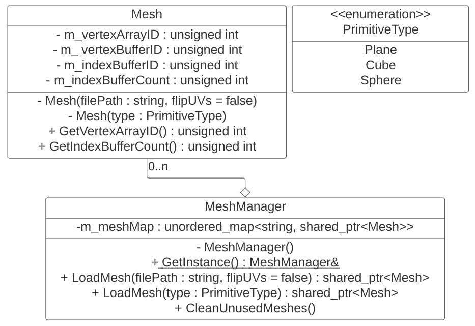
*Figura 3.20: Diagrama de la clase Mesh y parte de la interfaz de la clase*

MeshManager asociada a esta.


#### 3.7.5. Texture
Las texturas mencionadas en 2.3.5 son representadas por la clase Texture, al igual que en
el caso de las mallas de triángulos los datos de las texturas solo viven en GPU identificados en
CPU por un entero miembro de la clase. Para cargar temporalmente los datos de la textura
en CPU antes de ser enviados a GPU se usó la biblioteca stb12.
La interfaz de la clase permite obtener la dimensiones de la textura y configurar tanto
el wrap mode como los filtros de muestreo descritos en 2.3.5. A su vez, al igual que con
las mallas o clips de audio existe otra clase llamada TextureManager responsable de la
creación y mantención de las instancias de Texture con una interfaz equivalente al resto de
los managers. Finalmente, la imagen 3.21 muestra un diagrama de las clases recién descritas,
en donde el método LoadTexture recibe como último parámetro un booleano que indica si
se generarán o no mipmaps para la textura creada.

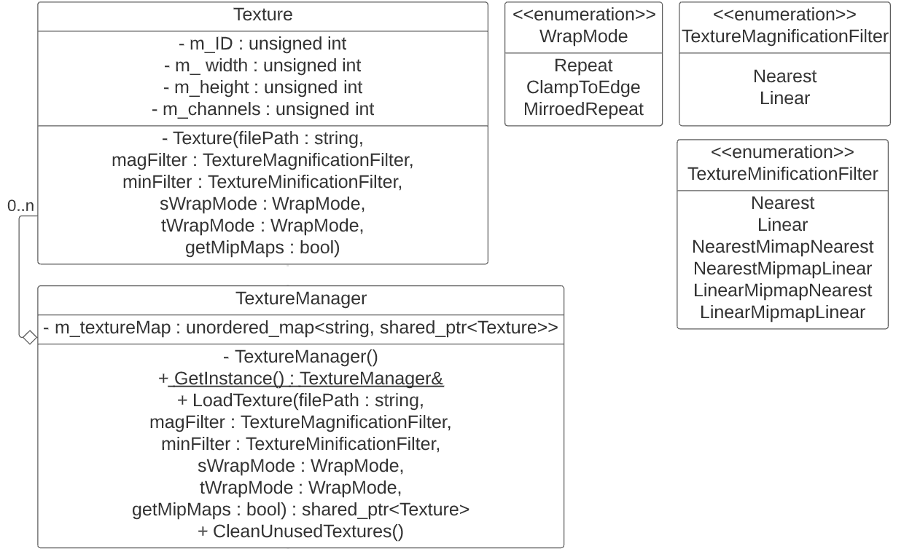
*Figura 3.21: Diagrama de las clases Texture y TextureManager.*


#### 3.7.6. ShaderProgram
LaclaseShaderProgramrepresentaelcódigoqueimplementalasetapasdevertex shader
yfragment shader delpipelinedeGPUdescritoenlasección2.3.8.Unainstanciadeestaclase
se construye a partir de dos strings que representan rutas de archivos con el código fuente del
vertex y frament shader. Antes de compilar y unir ambos shaders, el string que representa
el código fuente se le cambian expresiones regulares de la forma ${NOMBREVARIABLE}
por constantes conocidas en tiempo de compilación del motor, estas corresponden al número
12https://github.com/nothings/stb

máximo de luces que la escena puede enviar a GPU y el número máximo de articulaciones que
un esqueleto de animación soportado por este motor puede tener. Por otro lado, al igual que
otras clases una vez construida cada instancia de ShaderProgram solo tiene un miembro
de tipo entero que identifica del recurso en GPU. Finalmente, esta clase también posee un
conjunto de miembros estáticos constantes que representan la ubicación dentro de los shader
de las variables uniformes usadas en el proceso de sombreado.
Se implementaron 6 modelos de iluminación distintos y estos, a su vez, requirieron desa-
rrollar 12 vertex shader y 6 frament shader, la doble cantidad de vertex shaders se debe a
que la implementación es distinta dependiendo si el objeto renderizado es una malla estática
o animada. Todos estos shaders se traducen en 12 instancias de ShaderProgram las cuales
son creadas durante el periodo de inicialización del motor y posteriormente mantenidas por
la clase Renderer, la imagen 3.22 ilustra esta relación.

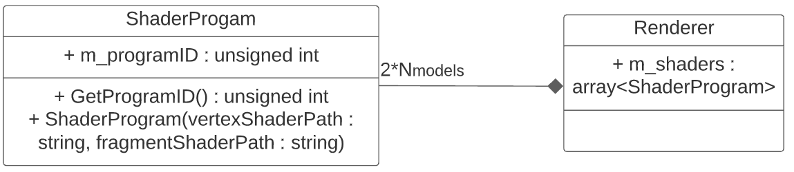
*Figura 3.22: Diagrama de la clase ShaderProgram, la clase Renderer man-*

tiene 2 instancias de esta clase por modelo de iluminación implementado,
uno para mallas estáticas y otro para mallas animadas.
Los modelos de iluminación implementados fueron los siguiente:
UnlitFlat y UnlitTextured: en estos modelos la ecuación 2.7 se reduce a una constan-
te, es decir, no depende de la información de iluminación de la escena. Esta constante
puede ser caracterizada con muestras tomadas de una textura de color o de un color
plano para toda la malla siendo renderizada.
DiffuseFlat y DiffuseTextured: estos modelos siguen la ecuación 2.12 solo conside-
rando la parte difusa. A su vez, C puede ser constante para toda la malla o
diffuse
representado por una textura.
PBRFlat y PBRTextured: estos modelos siguen la ecuación 2.17. Los parámetros de
los que esta ecuación depende pueden nuevamente ser constantes para toda la malla o
caracterizados por texturas.
La imagen 3.23 muestra el resultado de cada uno de estos modelos usando texturas.


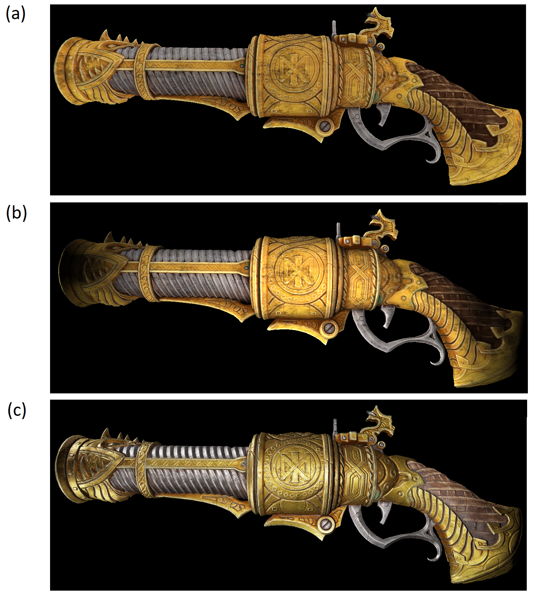
*Figura 3.23: Resultados de los diferentes modelos de iluminación. (a) Co-*

rresponde a UnlitTextures, (b) a DiffuseTextured y (c) a PBRTextured.
Los 12 vertex shaders implementados siguen lógicas similares, su mínimo trabajo es el de
transformar a clip space la posición del vértice de entrada. Para el caso de mallas estáticas
esto corresponde a multiplicar por las matrices de modelo, vista y proyección descritas en
2.3.3, mientras que para las mallas animadas los vértices son primero transformados por las
matrices de skinning siguiendo la ecuación 2.20. Además, cada implementación transformará
datos extras que el modelo de iluminación que representa necesite. Por ejemplo, la parte
difusa de la ecuación 2.12 trabaja en world space y depende de la normal y posición, por lo
que es necesario transformar estos vectores a dicho espacio.
A su vez, el código de los fragment shader que depende de la iluminación de la escena
también siguen un formato estándar descrito por el siguiente pseudo código:
Código 3.6: Pseudocódigo que representa la forma general de los fragment
shaders implementados.
Forma general de los fragment shader implementados:
Calcular los parámetros que no depende de características de las fuentes de luz:

Ejemplos podrían ser el vector que apunta desde la superficie actualmente siendo
sombreada a la cámara, o la normal de la superficie.
Inicializar el color final de la superficie a un negro.
Iterar sobre todas las fuentes de luz direccionales:
Acumular el aporte de esta fuente de luz dentro del modelo de iluminación
de este shader.
Iterar sobre todas las fuentes de luz puntuales:
Acumular el aporte de esta fuente de luz dentro del modelo de iluminación
de este shader considerando atenuación por distancia.
Iterar sobre todas las fuentes de luz de tipo spotlight:
Acumular el aporte de esta fuente de luz dentro del modelo de iluminación
de este shader considerando atenuación por distancia y ángulo.
Acumular el aporte de la luz ambiental
Finalmente,elanexoAmuestraydescribelaimplementacióndelmodeloquesiguelaecuación
2.17.

#### 3.7.7. Material
Siguiendo la idea de materiales descrita en la sección 2.3.7.4 por cada modelo de ilumina-
ción descrito en la sección anterior existe una clase cuyos miembros contienen la información
de los parámetros de los que depende el modelo en cuestión. El principal trabajo de estas
clases es el de enviar desde CPU a GPU todos sus miembros para llevar a cabo el proceso
de sombreado. Estas clases heredan de una llamada Material la cual envía a GPU todas
las variables comunes a todos los materiales, como las matrices de transformación, usando
el método SetUniforms el que a su vez llama SetMaterialUniforms, un método virtual
que todas las subclases deben implementar para enviar a GPU las uniformes particulares del
modelo de iluminación que representan. El extracto de código 3.7 muestra ambos métodos.
Código 3.7: Extracto de código del método SetUniforms responsable de
enviar a GPU las variables comunes para todos los modelos de iluminación,
y del método SetMaterialsUniforms de la clase PBRTexturedMaterial, el
cual envía a GPU las uniformes particulares de este modelo.
class Material {
...
void SetUniforms(const glm::mat4& perspectiveMatrix,
const glm::mat4& viewMatrix,
const glm::mat4& modelMatrix,
const glm::vec3& cameraPosition) {
//Se Configura la información compartida por todos los materiales (Matrices y
,→ posicion camara).
glUseProgram(m_shaderID);
const glm::mat4 mvpMatrix = perspectiveMatrix * viewMatrix * modelMatrix;
const glm::mat4 modelInverseTransposeMatrix =

glm::transpose(glm::inverse(modelMatrix));
glUniformMatrix4fv(ShaderProgram::MvpMatrixShaderLocation, 1, GL_FALSE,
glm::value_ptr(mvpMatrix));
glUniformMatrix4fv(ShaderProgram::ModelMatrixShaderLocation, 1, GL_FALSE,
glm::value_ptr(modelMatrix));
glUniformMatrix4fv(ShaderProgram::ModelInverseTransposeMatrixShaderLocation, 1,
GL_FALSE, glm::value_ptr(modelInverseTransposeMatrix));
//Llamado a función virtual que implementan los materiales.
SetMaterialUniforms(cameraPosition);
}
...
};
class PBRTexturedMaterial : public Material {
...
virtual void SetMaterialUniforms(const glm::vec3& cameraPosition) {
...
glBindTextureUnit(ShaderProgram::AlbedoTextureUnit,
m_albedoTexture->GetID());
glBindTextureUnit(ShaderProgram::NormalMapTextureUnit,
m_normalMapTexture->GetID());
glBindTextureUnit(ShaderProgram::MetallicTextureUnit,
m_metallicTexture->GetID());
glBindTextureUnit(ShaderProgram::RoughnessTextureUnit,
m_roughnessTexture->GetID());
glBindTextureUnit(ShaderProgram::AmbientOcclusionTextureUnit,
m_ambientOcclusionTexture->GetID());
glUniform3fv(ShaderProgram::MaterialTintShaderLocation, 1,
glm::value_ptr(m_materialTint));
glUniform3fv(ShaderProgram::CameraPositionShaderLocation, 1,
glm::value_ptr(cameraPosition));
}
...
};
La construcción de estos materiales se hace a través del método CreateMaterial de la
interfaz de World, el cual tiene como parámetros un enumerador de los modelos de ilumi-
nación y un booleano que debe indicar si el material será usado en una malla animada o
estática. Internamente World hace un llamado a un método con la misma firma de la clase
Renderer la cual finalmente a partir del shader correcto construye la instancia solicitada.
Por último, la imagen 3.24 muestra la jerarquía de clases de los materiales y la interfaz de
creación de estos.


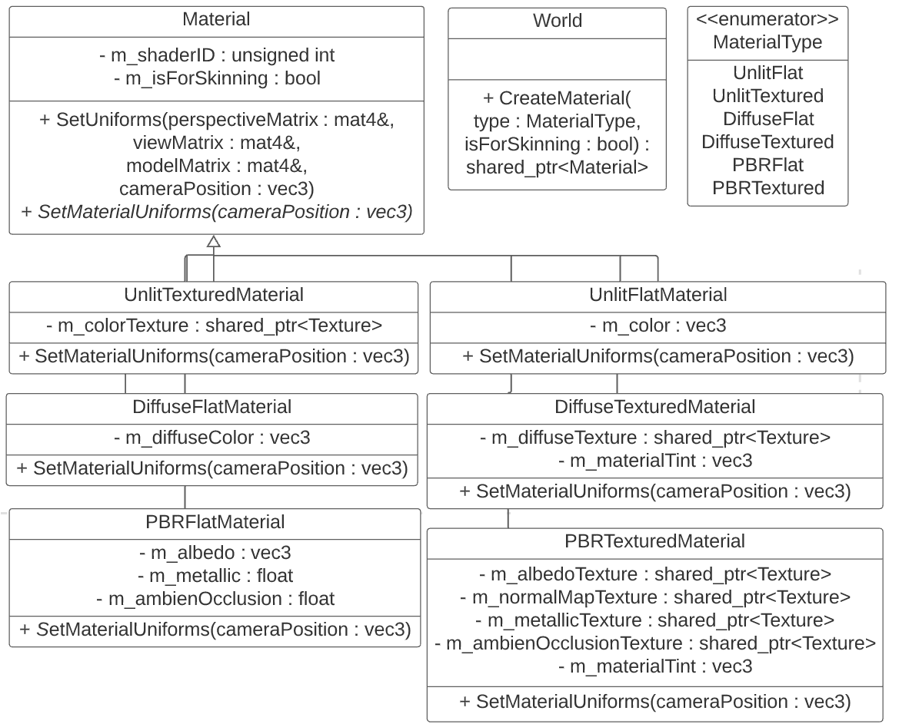
*Figura 3.24: Diagrama de las clases que representan los materiales del sis-*

tema de renderizado, donde todos heredan de la clase Material.

#### 3.7.8. StaticMeshComponent
La clase StaticMeshComponent es la componente que se une a instancias de Ga-
meObject, es esta unión la que finalmente señala a la clase Renderer que existe una malla
geométrica que debe ser renderizada. Esta clase no tiene mayores funcionalidades, todas son
cumplidas por sus miembros, los cuales consisten de un puntero a una instancia de Mesh y
otro puntero a una instancia de Material.

#### 3.7.9. Renderer
Además de la responsabilidad ya mencionada de cargar al momento de inicialización del
motor todas las instancias de ShaderProgram para cada modelo de iluminación, la clase
Renderer tiene como principal responsabilidad renderizar la escena en cada iteración del
motor,elmétodoRenderdeestaeselresponsabledeejecutartodalalógicapararealizaresta
tarea. La imagen muestra la firma de este método, en donde se ve que recibe las información
de todas las transformaciones, cámaras, fuentes de luz y mallas a renderizar.


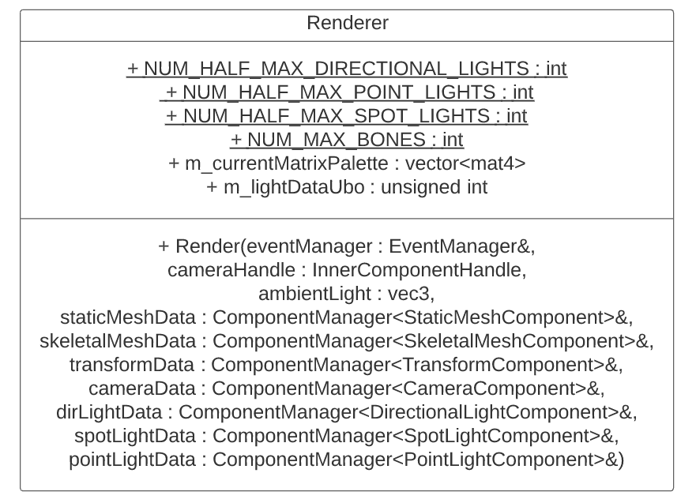
*Figura 3.25: Diagrama de parte de la interfaz de la clase Renderer.*

Para poder llevar a cabo el renderizado es necesario enviar a GPU los datos de iluminación
de la escena mantenidos por las componentes asociadas a fuentes de luz y el color ambiental
global, estos datos son los mismos para todas las primitivas renderizadas, por lo que se usó
un tipo de uniforme de OpenGL llamado Uniform Buffer Object13 el cual permite enviar
uniformes de tipos más complejos a la GPU y configurarlas para todos los shaders usados con
un solo llamado a la API de la librería. La clase Lights está compuesta por todos los datos
que componen la información lumínica de la escena, la imagen 3.26 muestra un diagrama
de esta clase en donde hay arreglos de luces de tamaño conocido a tiempo de compilación
declarados dentro de la clase Renderer (ver imagen 3.25) y una luz ambiental. Esta clase
tiene una declaración equivalente en los fragment shaders, donde los datos serán usados para
el proceso de sombreado. En la imagen 3.26 se omitieron algunos miembros de algunas clases
ya que no representan nada real y solo actual como padding para calzar con las restricciones
de alineamiento de memoria que OpenGL impone.
13https://www.khronos.org/opengl/wiki/Uniform_Buffer_Object


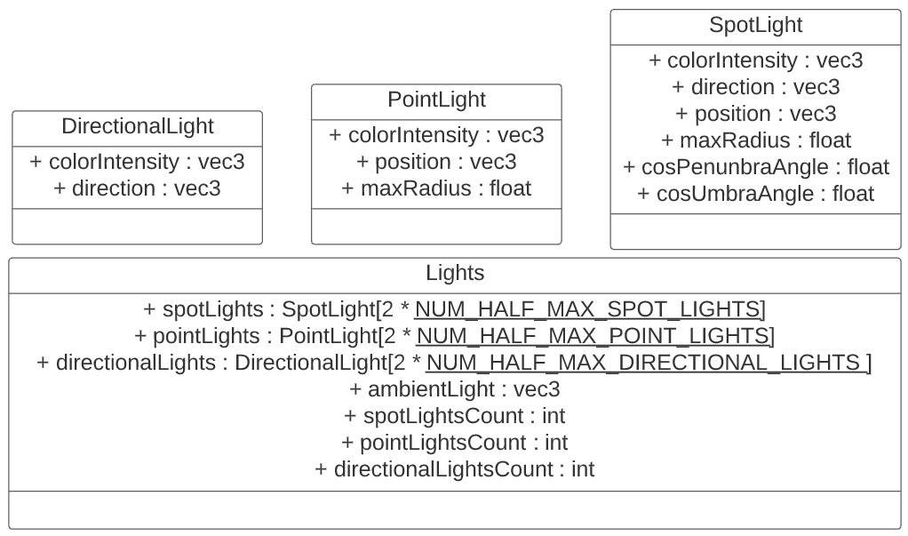
*Figura 3.26: Diagrama de la clase Lights que representa toda la información*

lumínica de la escena a renderizar.
Finalmente, el siguiente pseudocódigo describe la lógica que se ejecuta cada iteración del
motordentrodelmétodoRender,dondesevenlaiteraciónsobrelasmallasestáticasymallas
animadas y el envió a GPU, fuera de estas iteraciones, de la información de iluminación.
Código 3.8: Pseudocódigo del método Render responsable de renderizar la
escena cada iteración del motor.
Método Render de la clase Renderer:
Limpiar la imagen con el resultado de renderizado de la iteración anterior
Si el usuario configuro una CameraComponent como cámara principal:
Calcular la matriz de proyección a partir de la camara principal.
Obtener la instancia de TransformComponent unida al mismo GameObject
que la componente de cámara.
Calcular la matriz de vista y la posición de la cámara a partir de
esta transformación.
En caso contrario:
Las matrices de vista y proyección, y la posición de la cámara tienen valores
por defecto.
Crear una instancia de la clase Lights.
Configurar el valor de luz ambiental a partir de el valor global de esta.
Configurar los valores de las luces direccionales a partir de las componentes
existentes en la escena.
Configurar los valores de las luces puntuales a partir de las componentes
existentes en la escena.

Configurar los valores de las luces tipo spotlight a partir de las componentes
existentes en la escena.
Enviar toda la información de iluminación contenida en la instancia de Lights
recién poblada a GPU usando la API de OpenGL.
Iterar sobre todas las instancias de StaticMeshComponent:
A partir de la component de StaticMeshComponent actual:
Obtener la instancia de TransformComponent unida al mismo GameObject.
Obtener la matriz de modelo a partir de esta transformación.
Llamar el método SetUniform de la instancia de Material de esta
StaticMeshComponent con todas las matrices de transformación,
esto enviara a GPU tanto las matrices como el resto de parámetros
de la instancia de Material.
Llamar glDrawElement para dibujar la malla estática.
Iterar sobre todas las instancias de SkeletalMeshComponent:
A partir de la component de SkeletalMeshComponent actual:
Obtener la instancia de TransformComponent unida al mismo GameObject.
Obtener la matriz de modelo a partir de esta transformación.
Llamar el método GetMatrixPalette de la instancia de AnimationController
de esta SkeletalMeshComponent para obtener la paleta de matrices para
animar la malla.
Enviar esta paleta de matrices a GPU.
Llamar el método SetUniform de la instancia de Material de esta
SkeletalMeshComponent con todas las matrices de transformación,
esto enviara a GPU tanto las matrices como el resto de parámetros
de la instancia de Material.
Llamar glDrawElement para dibujar la malla animada.

### 3.8. Animación

#### 3.8.1. Descripción General
El sistema de animación desarrollado permite reproducir animaciones basadas en esque-
letos, para esto el diseño de la solución sigue las ideas descritas en el estado del arte en la
sección 2.4, en donde existen esqueletos de articulaciones, mallas para animación (skinned
meshes), poses y clips de animación, las clases del sistema que representan estos conceptos
son Skeleton, SkinnedMesh, JointPose y AnimationClip respectivamente y la compo-
nente que une estas clases es SkeletalMeshComponent. Para el proceso de construcción de

estos objetos se usó nuevamente la biblioteca Assimp14. La imagen 3.27 muestra la relación
entre las clases recién mencionadas y otras de importancia.

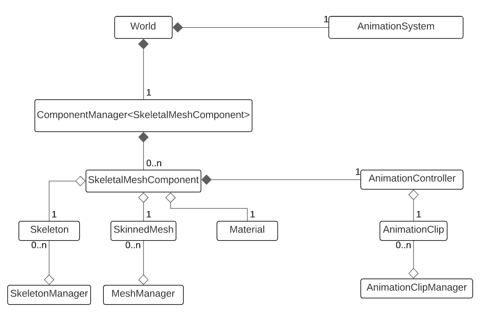
*Figura 3.27: Diagrama general de las clases que participan en el sistema de*

animación.
En la sección 2.4.8 se describió el pipeline de un sistema de animación, de estas 6 etapas,
el sistema desarrollado implementa 4 de ellas dejando de lado la etapa 5 de postproceso y
la etapa 6 de recálculo de poses globales. La implementación de la primera etapa de des-
compresión y extracción de poses, carece de descompresión dado que los clips importados
no están comprimidos. Por otro lado, la segunda etapa de blending solo implementa el caso
cuando se intenta transicionar suavemente de un clip de animación a otro. Cada instancia de
SkeletalMeshComponent posee un miembro de tipo AnimationController, esta clase
es finalmente quién ejecuta la lógica de este pipeline.

#### 3.8.2. Skeleton
La clase Skeleton representa, valga la redundancia, los esqueletos descritos en 2.4.1.
Esta clase está compuesta por tres arreglos paralelos, un arreglo de strings con el nombre
de las articulaciones, otro con los índices de las articulaciones padre y otro con las matrices
llamadas inverse bind matrix también mencionada en 2.4.1, estos tres arreglos contienen toda
la información de las articulaciones. Otro miembro importante de esta clase es un mapa de
strings a índices que permite rápidamente transformar el nombre de una articulación en un
índice a los arreglos.
Una propiedad que estos arreglos son obligados a cumplir para el proceso de animación,
14https://www.assimp.org/

es que dada una articulación de índice i, el índice del padre de esta articulación P cumplirá
que P < i, con esto la información de la articulación raíz del esqueleto queda obligada a
estar al principio de cada arreglo. La sección 3.8.7 entra en detalle de porqué esta propiedad
es importante.
Por otro lado, la clase SkeletonManager es responsable de mantener y crear las instan-
cias de Skeleton. El diseño de esta clase es muy similar al de la clase AudioClipManager
(3.6.2), es decir, la clase carga instancias de Skeleton a partir de un string que representa la
ruta del archivo con los datos del esqueleto y mantiene un mapa de strings a punteros a Ske-
leton para evitar cargas innecesarias. A su vez, el proceso de importación soporta esqueletos
con un número máximo de articulaciones conocido en tiempo de compilación de 70 huesos, si
bien este número puede ser incrementado, eventualmente este implicará un costo demasiado
alto en tiempo y memoria para trabajar en tiempo real. Finalmente la imagen 3.28 muestra
un diagrama de las clases Skeleton y SkeletonManager.

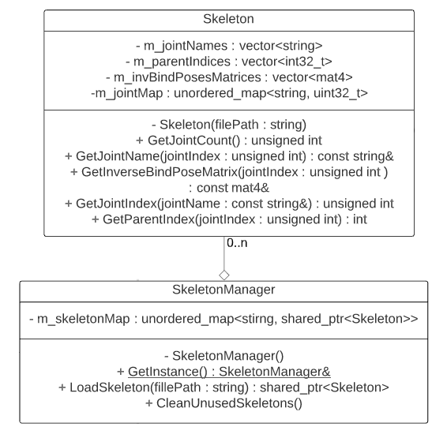
*Figura 3.28: Diagrama de las clases Skeleton y SkeletonManager.*


#### 3.8.3. SkinnedMesh
La clase SkinnedMesh representa las mallas geométricas que se usan en el proceso de
animación descritas en 2.4.2. Al igual que la clase Mesh descrita en 3.7.4 esta mantiene
índices identificadores de los recursos de OpenGL necesarios para su renderizado. Una de las
diferencias de este tipo de malla, es que dentro de los datos de los vértices que se mandan

a GPU están los pesos e índices de las articulaciones, ambos se limitan a 4 por vértice
al momento de construcción. Otra importante diferencia es que cada instancia de la clase
SkinnedMesh mantiene un puntero a la instancia de Skeleton al que está asociada.
La imagen 3.29 muestra un diagrama de la clase SkinnedMesh y la parte relacionada
a esta de la interfaz de la clase MeshManager, en donde queda clara la casi equivalencia
con las interfaces relacionadas con la clase Mesh. La diferencia más notoria del método
LoadSkinnedMesh es el puntero a un esqueleto que recibe como parámetro, el cual se
usará durante el proceso de importación.

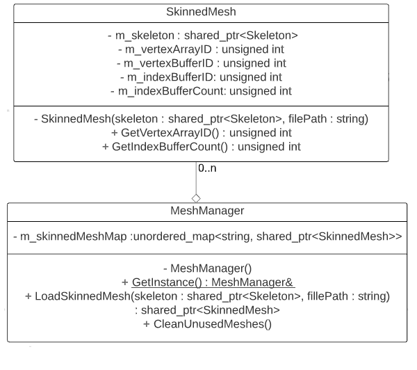
*Figura 3.29: Diagrama de la clase SkinnedMesh y la parte relacionada a*

esta de la interfaz de la clase MeshManager.

#### 3.8.4. JointPose
Las clase que representa las poses de cada articulación es JointPose, se siguió la repre-
sentación SQT mencionada en 2.4.3, es decir, la clase consiste de los siguientes miembros:
1. Un vector de 3 dimensiones para la traslación
2. Un vector de 3 dimensiones para la escalamiento
3. Un quaternion para la rotación.
Conesto,laposedeunesqueletoquedadescritaconunarreglodeinstanciasdeJointPose
de tamaño igual al número de articulaciones de dicho esqueleto.


#### 3.8.5. AnimationClip
Como ya se mencionó, la clase que representa los clips de animación descritos en 2.4.4 es
AnimationClip. Los principales miembros de esta clase son tres arreglos paralelos, uno que
contiene instancias de la clase AnimationTrack, otro de strings, y por último un arreglo de
enteros sin signo. La clase AnimationTrack contiene toda la información de las muestras
de una animación para una articulación, el arreglo de string representa los nombres de cada
articulaciónyelarreglodeenterossinsignorepresentalosíndicesquecadaarticulaciónocupa
dentro del esqueleto al que esta instancia de AnimationClip está asociado.
El método más importante de la clase AnimationClip es Sample, el cual tiene como
parámetros el tiempo de la muestra que se quiere tomar, otro que indica si se considera el clip
de animación como un loop o no y finalmente un vector de instancias de JointPose. Este
vector de instancias de Jointpose representa la pose del esqueleto, el cual se llenará con las
muestras de las poses de las articulaciones en el tiempo pedido. El proceso de muestra sigue
lospasosdescritosen2.4.7.1,endondeenprimerlugarseencuentranlostiemposconsecutivos
de muestras t y t que cumplen que t < t < t donde t es el tiempo de muestra pedido y
1 2 1 2
se usa la ecuación 2.25 para interpolar entre las traslaciones, rotaciones y escalamientos en
los tiempos t y t . Por otro lado, existe el caso borde en donde el tiempo de muestra pedido
1 2
queda fuera del rango del clip de animación, la imagen 3.30 muestra como se modifica el
tiempo de muestra para que quede dentro de los tiempos del clip de animación. Finalmente,
la función Sample retorna el tiempo dentro del clip donde efectivamente se tomó la muestra.
Figura3.30:(a)Procesodemuestreodelclipdeanimacióncuandoeltiempo
pedido de muestra es menor que el tiempo mínimo de la animación. (b)
Proceso de muestreo para el caso donde el tiempo pedido de muestra es
mayor al tiempo máximo de la animación.
Las instancias de AnimationClip son creadas y mantenidas por la clase Animation-

ClipManager con un diseño equivalente a las clases SkeletonManager y AudioClipMa-
nager. La imagen 3.31 muestra el diagrama de estas dos clases. La única diferencia es que al
cargar el usuario puede especificar si se debe eliminar la translación de la articulación raíz,
esta translación suele llamarse root motion. La eliminación del root motion de una animación
porlogeneralseusaenanimacionesdelocomocióncomocorrer,caminar,saltar.Porejemplo,
una animación de correr con root motion hará que el personaje corra por el mundo simulado,
mientras que una sin root motion parecerá correr en el lugar, esto es necesario dado que es
usual que el movimiento de los personajes sea controlado por lógica de la aplicación y no
necesariamente por animación, la imagen 3.32 muestra un ejemplo de ambos casos.

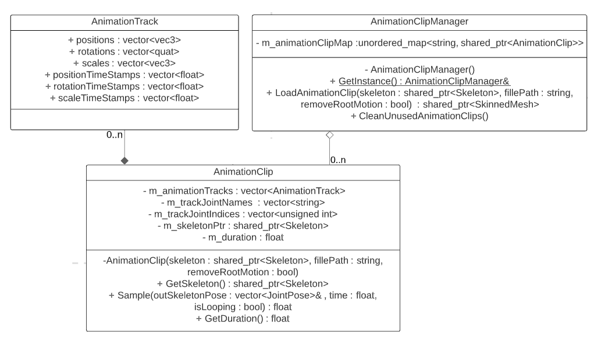
*Figura 3.31: Diagrama de las clases AnimationClip y AnimationClip-*

Manager.


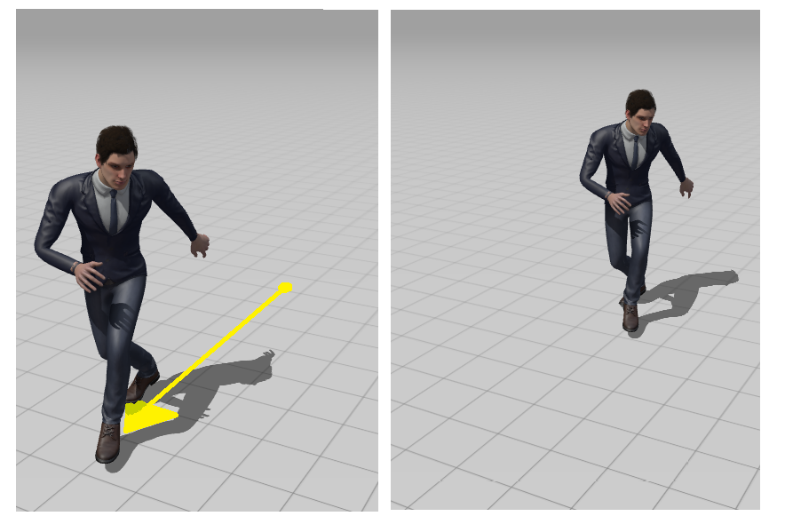
*Figura 3.32: Imagen con dos animaciones obtenidas desde https://www.*

mixamo.com/, la imagen de la izquierda corresponde a una animación con
root motion mientras que la segunda no lo posee.

#### 3.8.6. SkeletalMeshComponent y AnimationSystem
La clase SkeletalMeshComponent es la componente que se une a instancias de Ga-
meObject,esestauniónlaquefinalmenteseñalaalsistemadeanimaciónyalderenderizado
queexisteunamallageométricaquedebeseranimadayrenderizadarespectivamente.Aligual
que la clase Mesh, esta clase no tiene mayores funcionalidades, todas son cumplidas por sus
miembros, los cuales consisten de punteros a una instancia de Skeleton, SkinnedMesh y
Material, esta última clase quedó descrita en la sección 3.7.7.
Otro miembro importante de esta clase es la instancia de AnimationController, esta
clase mantiene y actualiza los datos de las poses globales y la paleta de matrices de cada
SkeletalMeshComponent. Con esto, la clase AnimationSystem en cada iteración del
motor solo itera sobre cada SkeletalMeshComponent, obtiene su AnimationController
y llama el método UpdateCurrentPose con el tiempo que pasó entre iteraciones.

#### 3.8.7. AnimationController
Como ya se mencionó, es la clase AnimationController quien ejecuta 4 de las 6 etapas
del pipeline de animación descrito en 2.4.8. Para esto mantiene los siguientes miembros:
1. Un arreglo de JointPose que representa la pose global actual del esqueleto animado.
2. Un puntero a AnimationClip con la animación principal siendo reproducida.
3. Un float que representa la velocidad de reproducción o playrate de la animación.
4. Un boolean indicando si la animación reproducida debe hacerlo en un loop.
5. Un float que funciona como reloj interno de la animación, es este valor el que se usa
para ir tomando muestra de las animaciones.

6. Una instancia de CrossFadeTarget, esta clase es una de ayuda que mantiene toda la
información necesaria para poder transicionar suavemente entre dos animaciones.
La imagen 3.33 muestra la interfaz de esta clase. El método PlayAnimation permite
comenzar a reproducir una animación, en el caso que se tenga otra animación siendo repro-
ducida el cambio será brusco. Para comenzar un cambio de animación pero con una transi-
ción suave es necesario usar el método FadeTo esto modificará internamente la instancia de
CrossFadeTarget con la información entregada.

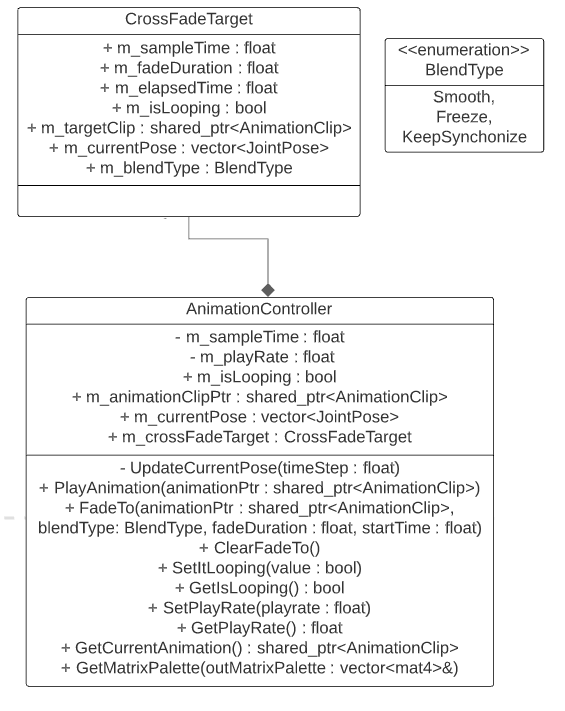
*Figura 3.33: Diagrama de la clase AnimationController.*


##### 3.8.7.1. Parámetros del método FadeTo
Los parámetros del método FadeTo son los siguientes:
1. Un puntero al clip de animación al que se quiere transicionar.
2. Un enumerador que indica que tipo de blending se usará. Se implementaron 3 tipos:
a) Freeze en donde el tiempo del clip principal deja de avanzar.
b) Smooth en donde ambos clips siguen avanzando al mismo paso del tiempo.

c) KeepSynchronize el cual toma muestras de ambos clips de tal manera que cum-
plen la siguiente razón:
TA TB
sample = sample
TA TB
duration duration
EndondeAyBsonelclipprincipalyalqueseestátransicionandorespectivamente,
y T la duración de estas animaciones. Este tipo de blending es usado general-
duration
menteparaanimacionesdondeexisteneventosdentrodeestasquedebenmantenerse
sincronizados para obtener una animación estéticamente agradable, ejemplo de esto
son las animaciones de correr y caminar, en donde los eventos que deben mantenerse
sincronizados son las pisadas de los pies.
La imagen 3.34 muestra la relación de las muestras en ambos clips para los 3 tipos de
blending.
3. Un float con la duración que tendrá la transición. Este valor se usará para obtener el
factor de blending descrito en 2.4.7 siguiendo la siguiente ecuación:
t
β = elapsed
t
fadeDuration
En donde t es el tiempo que ha pasado desde el comienzo de la transición.
elapsed
4. Otro float con el tiempo de muestra inicial del clip de animación al que se está haciendo
la transición.
Figura3.34:Relaciónentrelasmuestrasparalosdistintostiposdeblending.
El clip A representa la animación principal mientras que el clip B a la que
se está haciendo la transición.

##### 3.8.7.2. Ejecutando el pipeline de animación
Como ya se mencionó en la sección anterior el método que ejecuta el pipeline de animación
es UpdateCurrentPose, el pseudocodigo de este método es el siguiente:

Código3.9:PseudocódigoqueAnimationControllerimplementaparaac-
tualizar las poses globales.
Método UpdateCurrentPose de la clase AnimationController:
Si está ocurriendo una transición:
Actualizar el tiempo transcurrido de la transición
Si el tiempo transcurrido transicionando es mayor al tiempo de
duración de la transición:
Configurar como animación principal la animación a la que se estaba
haciendo la trasición.
Limpiar la información de la instancia de CrossFadeTarget.
Si está ocurriendo una transición:
Dependiendo del tipo de blending actualizar el tiempo de
muestra de ambos clips de animación
//Paso 1 del pipeline de animación
Tomar muestra de ambos clips de animación
con los tiempos de muestra actualizados
//Paso 2 del pipeline de animación
Interpolar entre ambas poses recién muestreadas, usando como factor de blending
la razón entre el tiempo transcurrido de la transición y la duración de esta.
En caso contrario:
Avanzar el tiempo de muestra de la animación principal
//Paso 1 del pipeline de animación
Tomar una muestra del clip de animación principal usando el tiempo de
muestra actualizado. En este caso no hay paso 2 ya que solo existe
una única animación
//Paso 3 del pipeline de animación
Hasta este momento la pose actual es una pose local por lo que es necesario
transformarlas a una pose global.
for(i = 0; i < numJoints; i++)
{
int parentIndex = skeleton->GetParentIndex(i);
m_currentPose[i] = m_currentPose[parentIndex] * m_currentPose[i];
}
Poder transformar la pose actual desde una pose local a una global con un simple for
se puede hacer gracias a la propiedad impuesta al orden de las articulaciones dentro del
esqueleto y poses descrita en 3.8.2 . La imagen 3.35 muestra este proceso para un esqueleto
sencillo.


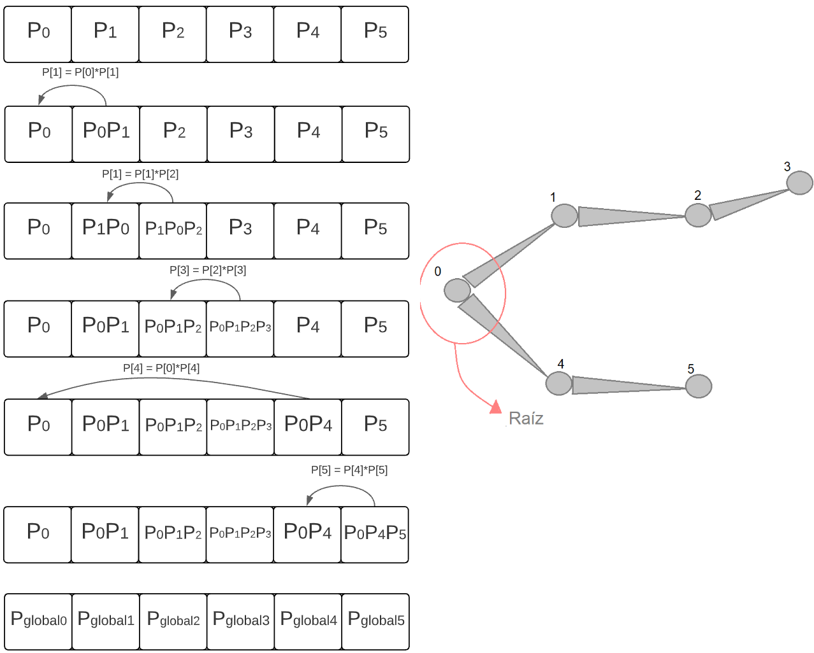
*Figura 3.35: Ejemplo de transformación de una pose local a una global*

siguiendo la implementación de este trabajo.

##### 3.8.7.3. Generación de la paleta de matrices
Finalmente, el método GetMatrixPalette representa el último paso del pipeline de ani-
mación, este es ocupado por la clase Renderer para obtener la paleta de matrices que será
enviada a GPU para poder renderizar la malla geométrica. Para esto internamente se llena
el arreglo entregado como parámetro con matrices que cumplen la ecuación 2.19, donde es
necesario transformar las poses globales desde una representación SQT a una matricial pa-
ra poder llevar a cabo la multiplicación. La sección 3.7.9 entra más en detalle de la parte
relacionada al sistema de renderizado de este proceso.

### 3.9. Colisiones y Física

#### 3.9.1. Descripción General
El sistema es capaz de simular múltiples cuerpos rígidos, generar eventos de colisión que el
usuariopuedeatenderyderesponderconsultasdeinterseccióndeunrayoconelmundosimu-
lado (raycasting). Las principales clases del sistema corresponden a PhysicsCollisionSys-

tem y RigidBodyComponent, la primera tiene como tarea más importante la simulación
física de los cuerpos rígidos del motor, mientras que la segunda es la componente que deben
tener instancias de GameObject para participar de esta simulación. Ambas clases hacen
uso extensivo de la biblioteca Bullet para su implementación siendo principalmente interfaces
delgadas entre esta y el motor. La imagen 3.36 muestra un diagrama general de las clases
asociadas a este sistema. A continuación se entrará en detalle sobre estas dos clases.

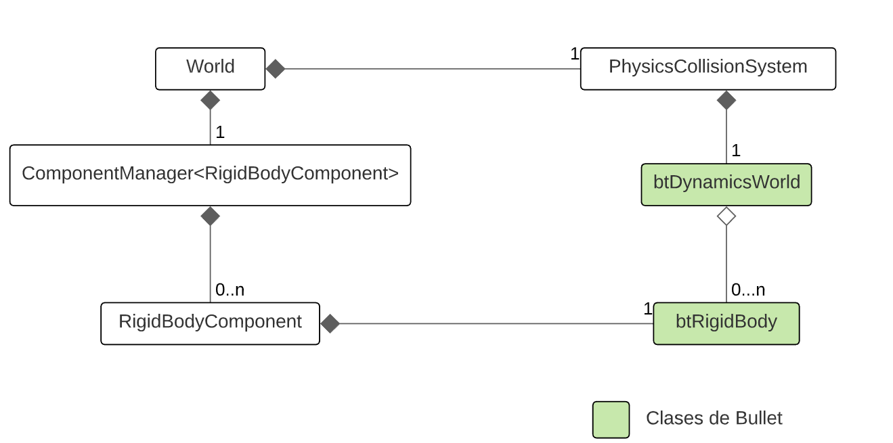
*Figura 3.36: Diagrama de las principales clases del sistema de física y coli-*

siones.

#### 3.9.2. RigidBodyComponent
Como ya se mencionó, esta clase es la componente que se debe unir a instancias de
GameObject para participar de la simulación física del motor. La imagen 3.37 muestra
los principales métodos de esta clase y su asociación con clases de Bullet. Métodos como
ApplyForce, SetLinearVelocity, ApplyTorque son los que finalmente permiten contro-
lar el comportamiento del objeto al que esta componente está unido. Un miembro importante
de las componente es la instancia de CustomMotionState, que es una clase que hereda
de una interfaz de btMotionState, esta permite mantener sincronizadas las posiciones y
orientaciones de la simulación física, con las internas del motor. La imagen 3.37 muestra
un solo constructor que pide una instancia de CapsuleShapeInformation, pero existe un
constructor para cada una de las primitivas básicas de la imagen 2.53. Finalmente, parte de
la responsabilidad del motor es de generar eventos de colisión a los cuales el usuario puede
responder, los miembros m_onStartCollisionCallback y m_onEndCollisionCallback
vienenacubrirpartedeestaresponsabilidad,estosdesernonulosseránllamadosalmomento
de comenzar o terminar una colisión respectivamente.


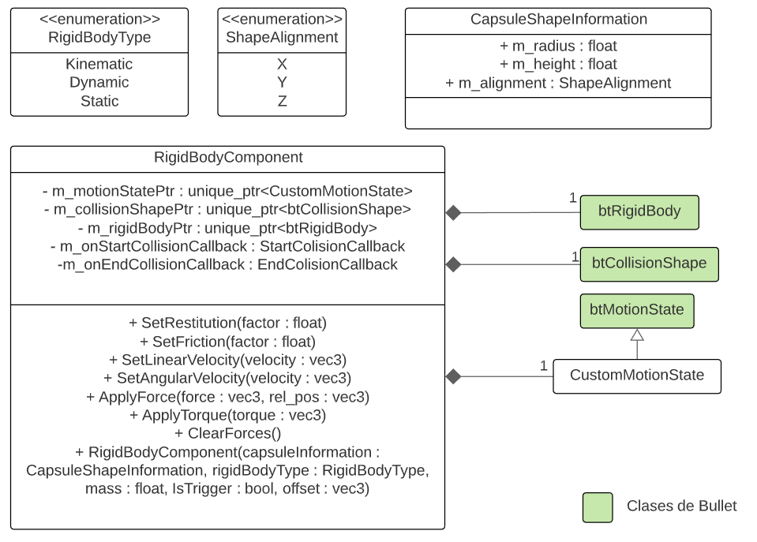
*Figura 3.37: Diagrama de la clase RigidBodyComponent.*

Dentro del motor pueden existir tres tipos de cuerpos rígidos: dinámicos, estáticos y cine-
máticos, esto se especifica al momento de construcción de una instancia usando una enume-
ración (ver imagen 3.37). El movimiento de los cuerpos dinámicos está totalmente controlado
por la simulación física, los estáticos no pueden moverse, lo que internamente a Bullet le per-
mite optimizar la simulación, y finalmente los cuerpos cinemáticos son aquellos que si bien
participan de la simulación física su movimiento es controlado externamente por el usuario
del motor. Además de la distinción entre tipos de cuerpos rígidos, las componentes también
pueden ser triggers o no, componentes con comportamiento de triggers sus colisiones no afec-
tan la simulación física, es decir, los otros cuerpos rígidos pasan a través, pero si generan
eventos de colisión.

#### 3.9.3. PhysicsCollisionSystem
El trabajo que realiza la clase PhysicsCollisionSystem se divide en tres partes: La
primera corresponde a la inicialización y cerrado de las instancias de clases de Bullet para
el correcto simulado de los cuerpos rígidos, la segunda corresponde a responder a consultas
desdelainterfazdeWorldaconsultasderaycasting ylaúltimaenejecutarlalógicanecesaria
cada iteración del motor para simular la física de los cuerpos rígidos y generar los eventos de
colisión.
Las responsabilidades de inicialización y cerrado consisten en la creación y destrucción
de instancias de clases de Bullet necesarias para el correcto funcionamiento del sistema.
Las principales de estas clases son btDbvtBroadphase que implementa la interfaz de bt-
BroadphaseInterfaceque es la que usa Bullet para simular la etapa Broad Phase de de-
tección de colisiones descrita en 2.5.1, la implementación hace uso de dos BVH , otra clase

importante es btCollisionDispatcher que corresponde a la clase que representa la etapa
Narrow Phase y btDynamicsWorld que corresponde al mundo físico simulado que es quien
finalmente mantiene las distintas instancias de btRigidBody. La imagen 3.38 muestra los
principales métodos y miembros de la de la clase PhysicsCollisionSystem y su asociación
con clases de Bullet.

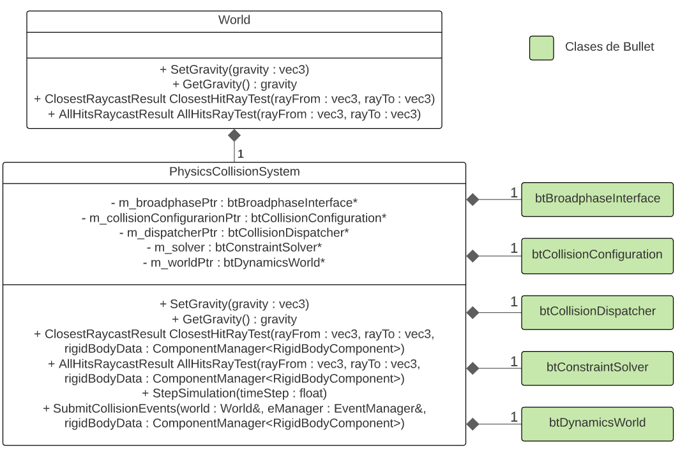
*Figura 3.38: Diagrama de la clase PhysicsCollisionSystem.*

Por otro lado, la imagen 3.38 también muestra los métodos de la clase World relacionados
al sistema de física, en esta los métodos AllHitsRayTest y ClosestHitRayTest, son los
que responden a las consultas de intersección de rayos con el conjunto de cuerpos rígidos, el
primero entrega el conjunto de handles de RigidBodyComponent que se intersecan con
el rayo dado como entrada, mientras que el segundo entrega solo el handle a la componente
más cercana intersectada.
Finalmente,lalógicaqueestesistemadebecorrercadaiteracióndelmotortienedospartes,
la primera corresponde en avanzar la simulación física, esta parte en términos de implementa-
ción es trivial y basta con llamar el método stepSimulation de la clase btDynamicsWorld
lo cual avanzará la simulación siguiendo los pasos de la imagen 2.57. La segunda parte co-
rresponde a la generación de eventos de colisión a los cuales el usuario puede responder, para
esto la clase PhysicsCollisionSystem mantiene un conjunto (set15) de cuerpos rígidos que
están colisionando. A partir de este conjunto, cada iteración del motor antes de actualizar-
lo se calcula el nuevo conjunto de cuerpos rígidos colisionando, se comparan y se obtienen
dos conjuntos, uno que representa colisiones que están recién empezando y otro de colisio-
15https://en.cppreference.com/w/cpp/container/set

nes que están terminando. Luego se itera sobre estos conjuntos y se emiten eventos de tipo
EndCollisionEvent y StartCollisionEvent usando el sistema de eventos. Por último, por
cada instancia de RigidBodyComponent asociada a la instancia de btRigidBody den-
tro de estos conjuntos se revisa si tienen sus miembros m_onStartCollisionCallback y
m_onEndCollisionCallback no nulos y de ser así estos son llamados para que el usuario
pueda ejecutar su lógica.

### 3.10. Repositorio
El código fuente del motor desarrollado en este trabajo de título fue subido a un reposi-
torio en Github16 bajo la licencia MIT17. Dentro del repositorio creado, la estructura de las
principales carpetas es la siguiente:
Assets: esta carpeta contiene todos los assets usados para implementar los ejemplos, es
decir, todos las mallas, animaciones, sonidos y texturas usadas.
Examples: esta carpeta contiene el código fuentes de todos los ejemplos que fueron
desarrollados con el motor para el proceso de validación.
Source: esta es la carpeta más importante, ya que es la que contiene el código fuente
del motor. Dentro de esta carpeta existen otras, una por cada sistema del motor.
ThirdParty: esta carpeta contiene las bibliotecas externas creadas por terceros usadas
para la implementación del motor. El principal criterio para escoger estas bibliotecas
fue que estas fuesen de código abierto y multiplataforma.
Tests: como su nombre lo dice esta carpeta contiene los tests del motor.
Memoria: esta carpeta contiene tanto el presente documento como un archivo compri-
mido con el proyecto de Latex a partir del cual se generó el presente documento.

#### 3.10.1. Proceso de compilación
Para controlar el proceso de compilación se usó la herramienta CMake18, la cual mediante
el uso de archivos de configuración multiplataforma permite por ejemplo generar makefiles
en Linux o proyectos de Visual Studio en Windows. En particular, para hacer uso de los
archivos de configuración de este repositorio es necesario tener instalada la versión 3.15 o
superior.
Ya teniendo instalado CMake es necesario ejecutar algunos de los siguientes comandos u
otro similar:
cmake -G “Visual Studio 16 2019” -A x64.
cmake . -DCMAKE_BUILD_TYPE=BUILDTYPE
16https://github.com/Aaron-Berland/MonaEngine
17https://en.wikipedia.org/wiki/MIT_License
18https://cmake.org/

El primer comando genera en Windows un proyecto de Visual Studio 2019, es importante
mencionar, que la versión indicada de Visual Studio puede cambiar. El segundo comando
sirve para generar makefiles en Linux, este se tiene que ejecutar desde el directorio con los
archivos del repositorio, en este comando es necesario cambiar BUILDTYPE por DEBUG o
RELEASE dependiendo del tipo de compilación que se quiere. Una vez generado el proyecto
de Visual Studio o makefiles, basta seguir el flujo típico de compilación del ambiente en
cuestión, por ejemplo, llamar al comando make en Linux.
Una descripción detallada de CMake está fuera del alcance de este trabajo de título, pero
tanto la pagina oficial 19 y Scott 2018 [19] contienen información de nivel introductorio.

#### 3.10.2. Como crear aplicaciones usando el motor
La manera más sencilla de usar el motor dentro de un nuevo proyecto es usando CMa-
ke. Para esto un ejemplo de estructura de archivos y carpetas consistiría de los siguientes
elementos:
Una carpeta que contenga los archivos del repositorio del motor. En el caso del ejemplo
ilustrado por el extracto 3.10 el nombre de esta carpeta es MonaEngine.
Un archivo llamado CMakeLists.txt con contenido similar al extracto 3.10.
El resto de los archivos fuentes y encabezados necesarios. En el caso del ejemplo ilus-
trado por el extracto 3.10 estos corresponden a main.cpp, clase0.h, clase0.cpp, clase1.h
y clase.cpp .
El extracto de código 3.10 muestra un ejemplo de CMakeLists.txt para un proyecto de
nombre SomeGame, que consiste de dos clases, clase0 y clase1, y otro archivo de fuente con
la definición del punto de entrada de ejecución.
Código 3.10: Código de un archivo de configuración de CMake para crear
un proyecto usando el motor.
set(CMAKE_LEGACY_CYGWIN_WIN32 OFF)
cmake_minimum_required(VERSION 3.15)
project(SomeGame C CXX)
add_subdirectory(MonaEngine)
add_executable(SomeGame main.cpp clase0.h clase0.cpp clase1.h clase1.cpp)
set_property(TARGET SomeGame PROPERTY CXX_STANDARD 20)
target_link_libraries(SomeGame PRIVATE MonaEngine)
target_include_directories(SomeGame PRIVATE ${MONA_INCLUDE_DIRECTORY} ${
,→ THIRD_PARTY_INCLUDE_DIRECTORIES})
19https://cmake.org/cmake/help/latest/index.html#guides

Capítulo 4

## Validación
Para validar que el motor desarrollado cumplió con los objetivos de este trabajo de título
se desarrollaron dos aplicaciones básicas que demuestran las funcionalidades requeridas del
motor. La primera aplicación es un clon del juego clasico Breakout1, mientras que la segunda
aplicaciónesmáscomplejayconsisteenunpersonajeanimadocuyomovimientoescontrolado
por los clicks del usuario dentro de la escena. A continuación se entra en detalle sobre cada
una de estas aplicaciones.

### 4.1. Clon de Breakout
EljuegoBreakoutconsisteenunapelotaquerebotaporlaescenadestruyendounconjunto
de bloques mientras el jugador controla una barra para evitar que la bola caiga al vacío, la
imagen4.1(a)muestralaconfiguracióninicialdeestoselementosenlaaplicacióndesarrollada.
Esta aplicación ilustra y/o valida las siguientes características del motor:
El renderizado primitivas básicas de renderizado como esferas y cajas.
El uso de cámaras y luces para configurar una escena.
Como usar el sistema de física para simular el movimiento de múltiples objetos y como
responder a los eventos de colisiones con lógica personalizada.
La reproducción de música y efectos de sonido.
El flujo general del motor a través del modelo de game object.
El código que implementa esta aplicación es principalmente de configuración, es decir, de
crear los objetos y unirlos con sus componentes respectivas. Los tipos de objetos de la escena
son los siguiente:
Una cámara desde la cual la escena es renderizada. Este objeto esta compuesto princi-
palmenteporlascomponentesTransformComponentyCameraComponent.Luego
de construir la cámara se llaman a los métodos SetMainCamera y SetAudioListe-
nerTransform para usar esta como punto de vista del proceso de renderizado y como
1 https://en.wikipedia.org/wiki/Breakout_(video_game)

receptor del audio en la escena respectivamente. Adicionalmente, este objeto tiene una
componente de tipo AudioSourceComponent que reproduce la música de la aplica-
ción y otra de tipo DirectionalLightComponent para iluminar la escena.
Una barra manejada por el usuario para evitar que se escape por la parte inferior de
la escena. Las componentes que la barra necesita para cumplir con su funcionamiento
son las siguientes : TransformComponent, RigidBodyComponent y StaticMesh-
Component. La barra es representada por la clase Paddle que hereda de GameOb-
ject, y es el único objeto que lo necesita, el resto usa directamente la clase base. La
clase Paddle sobrescribe el método UserUpdate para obtener el input de las flechas
direccionales, izquierda y derecha, y actualizar la posición de la barra en base a esto.
Dado que el movimiento está completamente controlado por código de la aplicación el
tipo de cuerpo rígido de la instancia de RigidBodyComponent es Kinematic.
Una pelota, la cual inicialmente está estática sobre la barra como la imagen 4.1(a) lo
ilustra. Esta tiene las mismas componentes que la barra, pero dado que el objeto es
movido por la simulación física el tipo de cuerpo rígido que esta necesita es Dynamic.
Adicionalmente, dentro del método UserUpdate de la clase Paddle cuando el usuario
ocupa el botón izquierdo del mouse al cuerpo rígido de la pelota se le aplica una fuerza
para comenzar su movimiento.
Bloques que pueden ser destruidos por la pelota. Estos objetos tienen las mismas com-
ponentes que la pelota y la barra, pero a diferencia esta ocupa un cuerpo rígido tipo
Static, y la respuesta a eventos de colisión además de emitir sonido destruye al bloque
colisionado. La imagen 4.1(b) ilustra el proceso de destrucción de un bloque.
Paredes indestructibles, estas son equivalentes a los bloques pero no poseen respuesta a
los eventos de colisión.


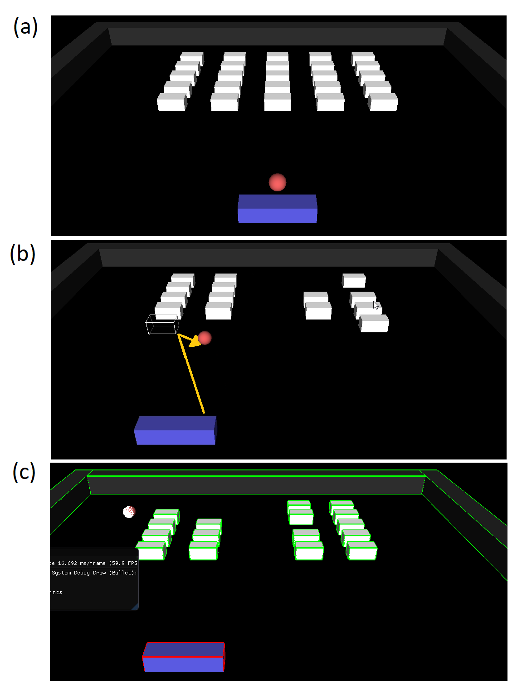
*Figura 4.1: (a) Configuración inicial del clon de Breakout desarrollado. (b)*

Cadavezquelapelotacolisionaconunbloqueseemiteunsonidoydestruye
dicho bloque. (c) Primitivas de colisiones de los elementos en la escena.


### 4.2. Personaje animado controlado por el mouse
Como ya se mencionó, la segunda aplicación consiste en un personaje controlado por el
usuario mediante clicks dentro de la escena renderizada. La imagen 4.2 muestra al personaje
y la escena donde este se mueve.
Esta aplicación ilustra y/o valida las siguientes características del motor:
La carga y renderizado de mallas estáticas y animadas.
Como usar el sistema de animación para cargar y aplicar animaciones.
Como aplicar una transición entre animaciones.
Los distintos materiales que el motor implementa.
El uso de cámaras y luces para configurar una escena.
El uso del sistema de física para simular el movimiento de múltiples objetos y el uso de
consultas de raycasting.
La reproducción de efectos de sonido que son espacializados por el sistema de audio.
El flujo general del motor a través del modelo de game object.

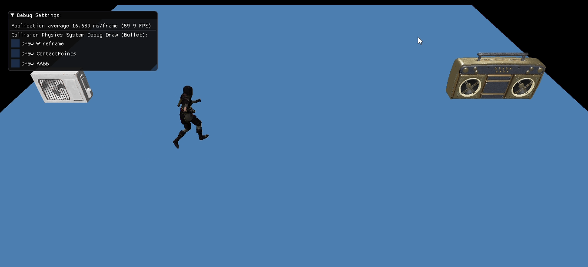
*Figura 4.2: Imagen del personaje y escena de la segunda aplicación desarro-*

llada.
Similaralejemploanterior,elcódigoqueimplementaestaaplicaciónconsisteengranparte
de configuración, pero en este caso la clase que representa al personaje animado tiene una
mayor complejidad, y por ende, la extensión del código que la implementa es considerable.
Los tipos de objetos de este ejemplo son los siguientes:
Una cámara, esta es equivalente a la cámara del ejemplo anterior, la única diferencia es
que esta no posee las componentes adicionales de luz y sonido.

Un plano cuyo principal trabajo es evitar que el personaje caiga al vacío. Este objeto
consta de las siguientes componentes: TransformComponent, RigidBodyCompo-
nent y StaticMeshComponent. La instancia RigidBodyComponent simula un
cuerpo rígido de tipo Static, mientras que la de StaticMeshComponent usa el ma-
terial de tipo UnlitFlatMaterial.
Dos luces direccionales que iluminan la escena, estas están compuestas por una instancia
de TransformComponent y DirectionalLightComponent.
Dos objetos, un aire acondicionado y una radio, que reproducen sonidos constantes.
Estos objetos, además de tener las mismas componentes que el plano, poseen una ins-
tancia de AudioSourceComponent la cual reproduce constantemente sonido 3D. El
receptor de audio de esta aplicación está unido al personaje animado, por lo que tanto
la música de la radio como el ruido del aire acondicionado disminuirán o aumentarán
en intensidad dependiendo de la distancia al personaje. Ambos objetos hacen uso del
material PBRTexturedMaterial, el más complejo desarrollado para este motor.
Un personaje Animado, el cual necesita las siguientes componentes para funcionar:
TransformComponent, RigidBodyComponent y SkeletalMeshComponent. Al
igual que la barra en el ejemplo anterior, es el único objeto que necesita personalizar
el comportamiento de la instancia de GameObject. La clase Character hereda de
GameObject y sobrescribe la función UserUpdate, el cual implementa la lógica de
movimiento del personaje. Dada la complejidad del método UserUpdate la siguiente
sección está dedicada a explicarlo.

Figura4.3:(a)PersonajeenanimaciónIdle esperandoinputdelusuario.(b)
Personajecorriendoalaposiciónreciéncliqueadaporelusuario,lavelocidad
depende de la distancia a dicha posición. (c) Primitivas de colisiones de los
elementos en la escena.

#### 4.2.1. El método UserUpdate de la clase Character
Para poder realizar la tarea de mover el personaje por la escena en base a los clicks del
mouse del usuario, el método UserUpdate de la clase Character lleva a cabo las siguientes

tareas:
Chequear si el usuario está apretando el botón izquierdo del mouse.
De ser así, obtener la posición en pantalla de este y transformarla a una posición dentro
del mundo simulado usando la método MainCameraScreenPositionToWorld de la
interfaz de World, esta posición está ilustrada por el punto rojo de la imagen 4.4. Luego
a partir de esta posición y otra lejana en la dirección que la cámara está observando,
ilustrada por el vector verde de la imagen 4.4, hacer una consulta de raycasting usando
el método ClosestHitRayTest para obtener una posición dentro de los objetos de la
escena, la posición obtenida será el nuevo objetivo del personaje.
Configurar la velocidad lineal a la componente RigidBodyComponent. La dirección
y magnitud de la nueva velocidad será proporcional a un vector que va desde la posición
actual del personaje a la posición objetivo, la imagen 4.3(b) muestra este vector.
ConfigurarlavelocidadangularalacomponenteRigidBodyComponent.Ladirección
de la velocidad angular es normal al plano donde se mueve el personaje mientras que
su magnitud es proporcional al ángulo entre la dirección que el personaje está mirando
y la dirección que apunta hacia el objeto. Este cambio de velocidad angular tiene como
objetivo hacer que el personaje mire hacia el punto donde el usuario cliqueó.
Finalmente, dependiendo si el personaje tiene una rapidez casi nula, mediana o alta se
transicionará a una animación con el personaje inactivo, a una animación de caminata,
o a otra de corrida respectivamente. Estos criterios son configurados con números reales.

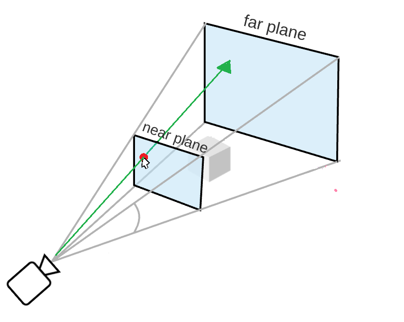
*Figura 4.4: La imagen ilustra como a partir de la posición del mouse, repre-*

sentado por un punto rojo, se calcula un rayo, representado por el vector
verde, para hacer consultas de colisión.

Capítulo 5

## Conclusiones

### 5.1. Resultados y Reflexiones
El motor desarrollado tiene todos los sistemas que formaban parte de los objetivos de este
trabajo de título: Un sistema de renderizado, uno de animación, uno de física, uno de eventos,
uno de audio y un modelo de game objects. Además, durante el desarrollo de cada uno de
estos, constantemente se consultó la bibliografía relacionada a motores de videojuegos y de
los distintos sistemas para asegurar que los conceptos dentro del estado del arte mapearan
al diseño del motor y de esta manera servir como ilustración simple de la arquitectura y
funcionamiento de motores más complejos. Por último, tanto el motor desarrollado, como los
ejemplos que hacen uso de este, quedaron publicados en el repositorio de Github descrito en
3.10.
El sistema de renderizado permite renderizar tanto primitivas básicas, como mallas de
triángulos complejas, las cuales pueden ser estáticas o animadas por el sistema de animación.
La superficie de cada uno de los objetos renderizables puede seguir 6 modelos de iluminación
directa. La escena renderizada puede contener fuentes de iluminación de 3 tipos distintos y
es observada desde el punto de vista de una cámara con proyección de tipo perspectiva. La
decisión de diseño más difícil de este sistema fue la de determinar el grado de flexibilidad del
sistema de materiales o modelos de iluminación, en este caso se prefirió uno relativamente
rígido para no agregar una mayor complejidad a la implementación de este, en retrospectiva
esta decisión fue la correcta.
El sistema de animación permite animar mallas de triángulos usando esqueletos con un
númeromáximofijodearticulacionesyclipsdeanimaciónsincompresión.Además,elsistema
permite transicionar suavemente entre dos animaciones diferentes usando tres estrategias
diferentesdeblending.Ladecisióncorrectadesoportarsolamentelatransiciónoreproducción
de dos clips de animación se tomó nuevamente para evitar agregar complejidad al motor.
El sistema de física puede simular múltiples cuerpos rígidos representados por primitivas
básicasdecolisión,estoscuerpospuedenserdetrestiposdiferentes:estáticosnuncaafectados
por la simulación física, dinámicos afectados y movidos por la simulación física y cinemáticos
que afectan al resto de los cuerpos rígidos simulados pero su movimiento es completamen-
te controlado por el usuario del motor. Adicionalmente, cada colisión emite un evento que
puede ser recibido por usuarios del motor. Para implementar este sistema las opciones de

bibliotecas a usar eran principalmente dos, Bullet y PhysX, se optó por la primera princi-
palmente porque se encontró que era una biblioteca más sencilla y porque existían recursos
como [18] que contiene toda la información necesaria para integrarla junto a otros sistemas.
Sin embargo, durante el desarrollo de uno de los ejemplos surgieron problemas de precisión
que complicaron la implementación de este, adicionalmente, PhysX es la biblioteca de física
usada tanto por Unreal como Unity, y que cuando es posible hace uso de la GPU para el
cálculo de sus simulaciones, lo que me hace concluir que quizá hubiese sido una mejor idea
usar esta biblioteca.
Elsistemadeaudiopermitereproducirmúsicayefectosdesonido,yconfigurarsuvolumen
y tono. Además, cualquier tipo de fuente sonora puede ser 2D o 3D, estas últimas pasan por
un proceso de especialización sonora. Usar OpenAl para implementar este sistema fue la
correcta decisión, tanto por su semejanza con la API de OpenGL, biblioteca con la que tengo
bastantefamiliaridad,comoconelniveldeabstracciónycomplejidaddeacordeconelsistema
que se implementó sobre esta biblioteca.
El modelo de game objects permite crear objetos dentro del mundo simulado por el motor,
a los cuales se les pueden unir componentes para añadir distintas funcionalidades implemen-
tadas por cada sistema. Finalmente, el sistema de eventos permite al usuario recibir distintos
eventos que requiera atender, estos eventos pueden ser emitidos tanto por el motor, o emi-
tidos por el usuario. Estos dos últimos sistemas, el modelo de game objects y el sistema de
eventos, fueron implementados sin el uso de bibliotecas externas, esta decisión se tomó por-
que los requisitos que se necesitaban cumplir eran mucho menores que los que las bibliotecas
existentes cubrían, de esta manera estos sistemas tienen una complejidad de acorde a los
requisitos de estos.
Para validar el motor de videojuegos desarrollado, se implementaron exitosamente dos
aplicaciones básicas: un clon del juego clásico Breakout, y una aplicación en donde un perso-
naje animado es controlado mediante clicks del usuario. El clon de Breakout permitió validar
características básicas del motor, dentro de estas destacan el renderizado de primitivas bá-
sicas con un modelo de sombreado simple, el sistema de eventos y el sistema de física. Por
otro lado, la aplicación con el personaje animado permitió validar el resto de los modelos
de iluminación, las consultas de tipo raycasting, la especialización del sonido, el sistema de
animación con esqueletos y el manejo del movimiento de un cuerpo rígido mediante la con-
figuración de su velocidad. El desarrollo de estas aplicaciones no tuvo mayores problemas y
demostró el cumplimiento de los objetivos, sin embargo, durante el desarrollo del segundo
ejemplo quedaron en evidencia problemas típicos de robustez que pueden sufrir los sistemas
de física. Por último, los ejemplos desarrollados servirán de ejemplos para entender el uso del
motor durante la realización del curso donde el motor se usará de ejemplo de implementación
simple.
En un principio iba a existir un segundo proceso de validación, el cual consistía en reali-
zar una cátedra/taller sobre motores de videojuegos, apoyada con ejemplos que mostrarían
extractos de código del motor desarrollado, y una posterior encuesta orientada a preguntar
si es que la presencia de estos extractos ayudó a la comprensión de los temas expuesto. La-
mentablemente esta actividad se descartó por temas de tiempo, pero era claro el aporte que
esta hubiese tenido para validar el aporte pedagógico del software.

La lección más importante aprendida durante el desarrollo del motor fue aprender la im-
portancia de implementar lo antes posible las interfaces expuestas a los usuarios, en este
caso programadores, lo que permite probar el desarrollo de los sistemas más internos dentro
de casos de usos. En el caso de este trabajo de título, estas interfaces correspondieron a las
presentes en el modelo de game object y componentes, con esta capa hecha, cada vez que se
agrega una característica a algún sistemas más interno, esta podía ser inmediatamente pro-
bada con código parecido al de un caso de uso real. Como reflexión final creo que el resultado
de este trabajo de título, es decir, el presente documento junto con el software desarrolla-
do, representan recursos que hubiese querido tener disponible durante mi aprendizaje sobre
el desarrollo tanto de videojuegos como acerca de los motores sobre los cuales estos están
implementados.

### 5.2. Trabajo Futuro
La forma más evidente de trabajo futuro corresponde a agregar nuevas características al
motor desarrollado. A continuación se listan algunas separadas por el sistema o capa a la que
pertenecerían:
Dentrodelascaracterísticasqueselepodríanagregaralsistemaderenderizadodestacan
las siguientes:
• Un modelo o técnica de iluminación ambiental más complejo que la implementación
actual, como la técnica Cube Mapping descrita en la sección 2.3.7.
• La posibilidad de que las luces y mallas renderizadas generen sombras, mediante
alguna técnica como Shadow Mapping1
• Agregar a la etapa de Aplicación, descrita en 2.3.8, la parte de determinación de ele-
mentosvisiblesparadescartarobjetosquenodebenllegaralasetapasdeGeometría
y Rasterización.
Un sistema de jerarquía de transformaciones, similar a las de un esqueleto de animación,
pero a nivel de la escena, este sistema recibe generalmente el nombre de Scene Graph.
Unodelosprincipalesbeneficiosdeestesistemaesunirunobjetoaotro,oestableceruna
relaciónpadreehijoentreestos,ydeestamanerasielpadresemueve,automáticamente
su hijo también lo hará.
Dentro de la capa de Gameplay Foundations existen otros elementos además del sistema
de eventos y modelo de game objects, el más importante de agregar sería un sistema de
scripting,estetipodesistemaproveeaccesoalasfuncionalidadescomúnmenteutilizadas
del motor mediante el uso de otro lenguaje de programación, el cual es de más alto nivel
en comparación con el cual está desarrollado el motor. La idea de este sistema es facilitar
el uso del motor para usuarios que no necesitan acceder a las características de bajo nivel
del lenguaje de programación usado en el desarrollo del el motor.
Al igual que el sistema de renderizado las posibles características que se podrían agregar
al sistema de animación son múltiples:
1 https://en.wikipedia.org/wiki/Shadow_mapping

• Agregar las dos etapas que quedaron fuera del pipeline de animación descrito en
2.4.8. Para esto sería necesario agregar un sistema de Inverse Kinatics y/o simu-
lación de ragdolls, este último probablemente también dependería del sistema de
física.
• Agregar a la primera etapa del pipeline de animación la capacidad de trabajar con
clips de animación comprimidos.
• Actualmente un esqueleto es solo capaz de reproducir dos animaciones simultánea-
mente, un sistema más completo debería ser capaz de manejar un número mayor.
• Técnicas de blending más complejas como máquinas de estado, los BlendTrees de
Unity o los BlendSpaces de Unreal, ambos mencionados en la sección 2.4.7.
Como ya se mencionó, al sistema de física se le podría agregar la posibilidad de simular
ragdolls.Otracaracterísticaimportantepodríaserusarformasdecolisiónmáscomplejas
que las actualmente soportadas por el motor, por ejemplo, agregar mallas geométricas
arbitrarias o la posibilidad de componer las ya existentes.
La principal característica que se podría agregar al sistema de audio es un modelo del
ambiente acústico, como las Reverb Zones de Unity, ilustrados por la imagen 2.8, o los
Audio Volumes de Unreal.
Finalmente, una vez que el profesor Daniel Calderon realice por primera vez el ramo en
el cual se usará el motor desarrollado en este trabajo de título, es extremadamente probable
que exista realimentación por parte de los alumnos del curso, este feedback mostrará posibles
mejoras al motor las cuales en este momento no son claras. En comparación a la actividad
ya mencionada de realizar un taller/catedra, cuya duración hubiese sido de un par de horas,
esta instancia representará un proceso de validación más importante para el motor dado que
es en el contexto de un curso completo en donde se podrá evaluar realmente el aporte final
de este trabajo de título.


## Bibliografía
[1] A. Alaluf, “La industria de videojuegos lidera las ventas de todo el sector de entreteni-
miento mundial,” 2018.
[2] B. Q. Contreras, “La ascendente industria chilena de videojuegos,” 2018.
[3] “Unity documentation.” https://docs.unity3d.com/Manual/index.html.
[4] “Unreal engine 4 documentation.” https://docs.unrealengine.com/en-US/index.html.
[5] J. Gregory, Game Engine Architecture. CRC Press, tercera ed., 2019.
[6] “A small state-of-the-art study on custom engines,” 2020. https://gist.github.com/
raysan5/909dc6cf33ed40223eb0dfe625c0de74.
[7] G. Hiebert, “Openal programmer’s guide,” 2007. https://www.openal.org/
documentation/OpenAL_Programmers_Guide.pdf.
[8] “Game audio via openal.” New Castle University. https://research.ncl.ac.uk/game/
mastersdegree/workshops/audio/Sound%20Workshop.pdf.
[9] E. H. et al, Real-Time rendering. CRC Press, cuarta ed., 2018.
[10] E. Lengyel, Foundations of Game Engine Development. Volume Two: Rendering. Te-
rathon Software LLC, primera ed., 2019.
[11] E. Lengyel, Foundations of Game Engine Development. Volume One: Mathematics. Te-
rathon Software LLC, primera ed., 2016.
[12] R. L. Cook and K. E. Torrance, “A reflectance model for computer graphics,” ACM
Transactions on Graphics, vol. 1, no. 1, pp. 7—-24, January 1982.
[13] B. Karis, “Real shading in unreal engine 4,” 2013.
[14] G. Sellers, OpenGL Superbible: Comprehensive Tutorial and Reference. Addison Wesley,
séptima ed., 2015.
[15] J. de Vries, “Learnopengl.” https://learnopengl.com/.
[16] “Opengl wiki.” https://www.khronos.org/opengl/wiki.
[17] I. Millington, Game Physics Engine Development. Morgan Kaufmann, segunda ed.,
2010.
[18] E. Coumans, “Bullet 2.80 physics sdk manual,” 2012. Disponible en http://www.cs.kent.
edu/~ruttan/GameEngines/lectures/Bullet_User_Manual.
[19] C. Scott, Professional CMake: A Practical Guide. 2018.

Anexo A
Código fuente PBR Shader
Enesteanexosepresentaráelcódigodelvertex yfragment shader máscomplejodelmotor,
el cual sigue un modelo de iluminación descrito por la ecuación 2.17, la implementación esta
basada en un articulo publicado en la pagina learnopengl1. Adicionalmente, se señalará como
las distintas partes de la implementación cambia para los distintos modelos de iluminación
desarrollados.
A.1. Vertex Shader
ElcódigoA.1correspondealvertex shader delmaterialPBRTexturedMaterialparamallas
animadas. Este parte con una declaración de todos los atributos de los que este modelo
depende: posiciones, normales, coordenadas de texturas, tangentes, bitangentes, índices de
articulaciones y los pesos de estas. En el caso del shader usado para mallas estáticas, los
últimos dos atributos son omitidos, al igual que las lineas 24 a 30, trabajando directamente
con la matriz de modelo. De la misma manera, para modelos de iluminación mas sencillos,
las tangente y bitangentes, y los cálculos asociados, también son eliminados.
Código A.1: Vertex Shader del modelo de iluminación representado por el
material PBRTexturedMaterial.
#version 450 core
layout (location = 0) in vec3 aPos;
layout (location = 1) in vec3 aNormal;
layout (location = 2) in vec2 aTexCoord;
layout (location = 3) in vec3 aTangent;
layout (location = 4) in vec3 aBitangent;
layout (location = 5) in vec4 aBoneIndices;
layout (location = 6) in vec4 aBoneWeights;
layout(location = 0) uniform mat4 mvpMatrix;
layout(location = 1) uniform mat4 modelMatrix;
layout(location = 2) uniform mat4 modelInverseTransposeMatrix;
layout(location = 10) uniform mat4 boneTransforms[${MAX_BONES}];
out vec3 worldPos;
1 https://learnopengl.com/PBR/Lighting

out vec2 texCoord;
out vec3 normal;
out vec3 tangent;
out vec3 bitangent;
void main()
{
//boneTransform representa la matriz al aplicar la piel a este vertice
mat4 boneTransform = mat4(0.0);
boneTransform += boneTransforms[int(aBoneIndices.x)] * aBoneWeights.x;
boneTransform += boneTransforms[int(aBoneIndices.y)] * aBoneWeights.y;
boneTransform += boneTransforms[int(aBoneIndices.z)] * aBoneWeights.z;
boneTransform += boneTransforms[int(aBoneIndices.w)] * aBoneWeights.w;
mat4 finalModelTransform = modelMatrix * boneTransform;
normal = normalize(mat3(transpose(inverse(finalModelTransform))) * aNormal);
tangent = normalize(mat3(finalModelTransform)* aTangent);
bitangent = normalize(mat3(finalModelTransform)* aBitangent);
texCoord = aTexCoord;
worldPos = vec3(finalModelTransform * vec4(aPos,1.0f));
gl_Position = mvpMatrix * boneTransform * vec4(aPos,1.0f);
}
A.2. Fragment Shader
El fragment shader es de mayor complejidad por lo que su descripción de dividirá en las
declaraciones y el cuerpo principal.
A.2.1. Declaraciones
El código A.2 consiste en declaraciones de atributos y uniformes de los que depende el
modelo de iluminación. A diferencia del vertex shader, estas declaraciones cambian depen-
diendo exclusivamente del modelo de iluminación que representa, en este punto la diferencia
entre mallas animadas y estáticas no existe. Por ejemplo, para los modelos que no dependen
de la iluminación de la escena, toda las declaraciones relacionadas a las fuentes de luz de la
escena no son necesarias.
Código A.2: .
#version 450 core
//Es importante notar que todas expresiones de la forma ${SOME_NAME} son ←-
,→ reemplazadas antes de compilar
layout (location = 3) uniform sampler2D albedoTexture;
layout (location = 4) uniform vec3 materialTint;
layout (location = 5) uniform sampler2D normalMapTexture;
layout (location = 6) uniform sampler2D metallicTexture;
layout (location = 7) uniform sampler2D roughnessTexture;
layout (location = 8) uniform sampler2D ambientOcclusionTexture;

layout (location = 9) uniform vec3 cameraPosition;
out vec4 color;
in vec3 worldPos;
in vec2 texCoord;
in vec3 normal;
in vec3 tangent;
in vec3 bitangent;
struct DirectionalLight {
vec3 colorIntensity;
vec3 direction;
};
struct PointLight {
vec3 colorIntensity;
vec3 position;
float maxRadius;
};
struct SpotLight {
vec3 colorIntensity;
float maxRadius;
vec3 position;
float cosPenumbraAngle;
vec3 direction;
float cosUmbraAngle;
};
//Uniforme que contiene toda la información lumínica de la escena
layout(std140, binding = 0) uniform Lights {
SpotLight[${MAX_SPOT_LIGHTS}] spotLights;
PointLight[${MAX_POINT_LIGHTS}] pointLights;
DirectionalLight[${MAX_DIRECTIONAL_LIGHTS}] directionalLights;
vec3 ambientLight;
int spotLightsCount;
int pointLightsCount;
int directionalLightsCount;
};
const float PI = 3.14159265359;
Después, el código A.3 declara las distintas funciones que se usarán en el cuerpo del shader.
Las funciones que evalúan atenuación están presentes en los modelos que dependen de la
iluminación de la escena, mientras que las últimas 5 funciones, las cuales están relacionadas
con la evaluación de la ecuación 2.17, solo están presentes en los modelos que siguen dicha
ecuación.
Código A.3: Declaración de los atributos y uniformes de los que el fragment
shader .

//Calcula el decaimiento de la intensidad lumínica dada la distancia a ella
float GetDistanceAttenuation(vec3 lightVector, float lightRadius)
{
float squareDistance = dot(lightVector, lightVector);
float squareRadius = lightRadius * lightRadius;
float windowing = pow(max(1.0 - pow(squareDistance/squareRadius,2.0f),0.0f),2.0f);
float distanceAttenuation = windowing * (1 / (squareDistance + 1));
return distanceAttenuation;
}
//Calcula el decaimiento de la intensidad lumínica dada una diferencia angular a ella
float GetAngularAttenuation(vec3 normalizedLightVector, vec3 lightDirection,
float lightCosUmbraAngle, float lightCosPenumbraAngle)
{
float cosSurfaceAngle = dot(lightDirection, normalizedLightVector);
float t = clamp((cosSurfaceAngle - lightCosUmbraAngle)
/ (lightCosPenumbraAngle - lightCosUmbraAngle), 0.0f, 1.0f);
float angularAttenuation = t*t;
return angularAttenuation;
}
float DistributionGGX(vec3 N, vec3 H, float roughness)
{
float a = roughness*roughness;
float a2 = a*a;
float NdotH = max(dot(N, H), 0.0);
float NdotH2 = NdotH*NdotH;
float nom = a2;
float denom = (NdotH2 * (a2 - 1.0) + 1.0);
denom = PI * denom * denom;
return nom / denom;
}
float GeometrySchlickGGX(float NdotV, float roughness)
{
float r = (roughness + 1.0);
float k = (r*r) / 8.0;
float nom = NdotV;
float denom = NdotV * (1.0 - k) + k;
return nom / denom;
}
float GeometrySmith(vec3 N, vec3 V, vec3 L, float roughness)
{
float NdotV = max(dot(N, V), 0.0);
float NdotL = max(dot(N, L), 0.0);
float ggx2 = GeometrySchlickGGX(NdotV, roughness);

float ggx1 = GeometrySchlickGGX(NdotL, roughness);
return ggx1 * ggx2;
}
vec3 fresnelSchlick(float cosTheta, vec3 F0)
{
return F0 + (1.0 - F0) * pow(1.0 - min(cosTheta,1.0), 5.0);
}
// Cook-Torrance BRDF
vec3 GetBrdf(vec3 N, vec3 H, vec3 V, vec3 L, float roughness, vec3 albedo,
float metallic, vec3 F0)
{
float NDF = DistributionGGX(N, H, roughness);
float G = GeometrySmith(N, V, L, roughness);
vec3 F = fresnelSchlick(max(dot(H, V), 0.0), F0);
vec3 nominator = NDF * G * F;
float denominator = 4 * max(dot(N, V), 0.0) * max(dot(N, L), 0.0) + 0.001;
vec3 specular = nominator / denominator;
vec3 kS = F;
vec3 kD = vec3(1.0) - kS;
kD *= 1.0 - metallic;
return (kD * albedo / PI + specular);
}
A.2.2. Cuerpo principal
Finalmente, el cuerpo principal de todos los modelos de iluminación que dependen de la
iluminación de la escena consiste en evaluar la ecuación 2.7, para esto se itera sobre cada una
de las fuentes de luz evaluando la ecuación 2.8 y acumulando su resultado.
CódigoA.4:Cuerpoprincipaldelfragmentshaderdelmodelodeiluminación
representado por el material PBRTexturedMaterial.
void main()
{
vec3 newNormal = normalize(normal);
vec3 newTangent = normalize(tangent);
vec3 newBitangent = normalize(bitangent);
mat3 TBN = mat3(newTangent, newBitangent, newNormal);
vec3 N = texture(normalMapTexture, texCoord).rgb;
N = N * 2.0 - 1.0;
//Transformación de la normal en espacio tangente a mundo
N = normalize(TBN*N);
vec3 V = normalize(cameraPosition - worldPos);
//el valor de la textura se le debe aplicar una potencia para trabajar en espacio lineal
//ya que estas suelen guardarse en espacio gamma.
vec3 albedo = pow(texture(albedoTexture, texCoord).rgb, vec3(2.2));
float metallic = texture(metallicTexture, texCoord).r;

float roughness = texture(roughnessTexture, texCoord).r;
float ao = texture(ambientOcclusionTexture, texCoord).r;
vec3 ambient = ambientLight * albedo * ao;
//Se usa un valor promedio de FO, el factor de fresnel, igual a 0.04 para dialéctricos
vec3 F0 = vec3(0.04);
//Usamos las textura de metalicidad para interpolar entre F0 de dialéctricos y el albedo
//Como los metales no tienen color difuso o albedo, se usa este termino para ←-
,→ caracterizar
// mejor F0 para los metales.
F0 = mix(F0, albedo, metallic);
//Valor que acumulara el aporte de cada luz
vec3 Lo = vec3(0.0f,0.0f,0.0f);
for(int i = 0; i < directionalLightsCount; i++){
vec3 L = -directionalLights[i].direction;
vec3 H = normalize(V + L);
vec3 radiance = directionalLights[i].colorIntensity;
vec3 brdf = GetBrdf(N, H, V, L, roughness, albedo, metallic, F0);
float NdotL = max(dot(N, L), 0.0);
Lo += brdf * radiance * NdotL;
}
for(int i = 0; i < pointLightsCount; i++){
vec3 lightVector = worldPos - pointLights[i].position;
vec3 L = normalize(pointLights[i].position - worldPos);
vec3 H = normalize(V + L);
float distanceAttenuation = GetDistanceAttenuation(lightVector,
pointLights[i].maxRadius);
vec3 radiance = distanceAttenuation * pointLights[i].colorIntensity;
vec3 brdf = GetBrdf(N, H, V, L, roughness, albedo, metallic, F0);
float NdotL = max(dot(N, L), 0.0);
Lo += brdf * radiance * NdotL;
}
for(int i = 0; i < spotLightsCount; i++){
vec3 lightVector = worldPos - spotLights[i].position;
vec3 L = normalize(spotLights[i].position - worldPos);
vec3 H = normalize(V + L);
float distanceAttenuation = GetDistanceAttenuation(lightVector,
spotLights[i].maxRadius);
float angularAttenuation = GetAngularAttenuation(-L, spotLights[i].direction,

spotLights[i].cosUmbraAngle, spotLights[i].cosPenumbraAngle);
vec3 radiance = distanceAttenuation*angularAttenuation*spotLights[i].colorIntensity;
vec3 brdf = GetBrdf(N, H, V, L, roughness, albedo, metallic, F0);
float NdotL = max(dot(N, L), 0.0);
Lo += brdf * radiance * NdotL;
}
vec3 finalColor = ambient + Lo;
finalColor = finalColor/ (finalColor + vec3(1.0));
finalColor = pow(finalColor, vec3(1.0/2.2));
color = vec4(materialTint * finalColor, 1.0);
}